# Delivery Phases: Discovery → Requirements → HLD → LLD

This document maps classic software-delivery phases to the **sdlc-automation-agent** orchestrator, agents, artifacts, gates, and handoffs. Use it when onboarding teams, writing SOWs, or explaining what each agent produces.

---

## Phase overview

```mermaid
flowchart LR
  subgraph D["1. Discovery"]
    RA[Research Advisor / Explore]
    DIS[Discover mode]
    SG[Socratic Gate]
    PM1[PM Steps 1–2]
    SA1[SA Phase 1]
  end

  subgraph R["2. Requirements (T1)"]
    BRD[BRD + Open Decisions]
    DEC[Epics → Features → Stories]
    TRK[Tracker + Roadmap]
  end

  subgraph H["3. HLD (T2 — design)"]
    SAD[SAD + ADRs + Diagrams]
    TS[Tech Stack]
  end

  subgraph L["4. LLD (T2 — contracts + build)"]
    API[API Contracts]
    ERD[ERD + Migrations]
    SCF[Scaffold]
    SE[Software Engineer]
  end

  D --> R --> H --> L
  H -->|Inception Gate| IG[Human approval]
  L -->|Sprint execution| SP[Sprints + SA triggers]
```



| Phase | Primary question | Owner (agent) | Tier / receipt |
|-------|------------------|---------------|----------------|
| **Discovery** | What exists? What are constraints? What don't we know? | Research Advisor, Discover mode, PM (interview), SA (scale) | Pre-T1 context |
| **Requirements** | What must we build, for whom, and how do we verify it? | Product Manager | **T1** |
| **HLD** | How is the system shaped at a component/service level? | Solution Architect (phases 1–3) | **T2** (partial) |
| **LLD** | What are exact interfaces, schemas, and implementation boundaries? | Solution Architect (phases 4–6) + Software Engineer | **T2** + story receipts |

**Boundary rule (from conflict-resolution):** PM owns **WHAT**; Solution Architect owns **HOW**. SA does not change requirements—flags gaps back to PM.

---

## 1. Discovery

Discovery is **not a single step** in sdlc-automation-agent. It is layered context gathering that feeds Requirements and HLD. Skip layers that do not apply (greenfield vs brownfield).

### 1.1 When each discovery path runs

| Path | Mode / trigger | Agent / skill | Purpose |
|------|----------------|---------------|---------|
| **Ideation & domain research** | Explore, "help me think", pre-build | `research-advisor` | Options, trade-offs, domain facts before committing |
| **Codebase reverse engineering** | Discover, brownfield Scrum/Kanban | `sdlc-automation-agent` → `modes/reverse.md` | Map existing system without changing production code |
| **Context enrichment** | Build / Custom (Build + Controlled) | Socratic Gate (`socratic-gate.md`) | Cross-cutting constraints PM/SA interviews may miss |
| **Business & domain input** | Inception / full PM pipeline | `product-manager` Steps 1–2 | Read SoW/PRD, CEO interview, technical enabler discovery |
| **Technical constraints** | After BRD exists (or in parallel at Inception) | `solution-architect` Phase 1 | Scale, compliance, team, budget fitness |

### 1.2 Discover mode (brownfield) — outputs

**Entry:** User asks to understand/map/reverse-engineer an existing codebase.

**Location:** `skills/sdlc-automation-agent/modes/reverse.md`

**Primary artifacts:**

| Artifact | Path |
|----------|------|
| Context packages | `.sdlc-automation-agent/.orchestrator/context-packages/` |
| `dependency-map.md` | Module boundaries, coupling |
| `interface-contracts.md` | Existing APIs and contracts |
| `business-rules-inventory.md` | Rules extracted from code |
| `risk-register.md` | Technical and delivery risks |
| `health-assessment.md` | Test density, debt, hotspots |
| `ui-contracts.md` | Optional — live UI exploration |
| `data-schema.md` | Optional — live DB analysis |
| Reverse-engineering PRD | `.sdlc-automation-agent/reverse-engineering/PRD.md` (full analysis) |
| Codebase summary | `.sdlc-automation-agent/.orchestrator/codebase-context.md` |

**Downstream consumers:** PM (brownfield BRD), SA (read existing patterns first), SE (dependency map before edits).

**Brownfield Scrum path:** Discover → **Adaptive Inception** (only missing foundation) → Sprint 1.  
**Brownfield Kanban path:** Discover → skip Inception → READY.

### 1.3 Product Manager discovery (Steps 1–2)

**Files:** `agents/product-manager/phases/01-understand-input.md`, `02-technical-enabler-discovery.md`

| Step | Activities | Outputs |
|------|------------|---------|
| **1 — Understand input** | Read all source docs (SoW, PRD, mockups); extract planning parameters; CEO interview (2–16 questions by engagement mode); source attribution (`[SOURCED]`, `[GAP]`, `[ASSUMED]`) | `research-notes.md`, `constraints.md`, **open decision registry** |
| **2 — Technical enabler discovery** | Identify foundations (auth, tenancy, ingest, CI, etc.) before functional requirements | Enabler list (used in epics, not full requirements yet) |

**Stop gate (Step 1):** Do not proceed until core workflow acceptance criteria can be written.

**Open Decision Registry (required before Step 1 completes):**

- Path: `.sdlc-automation-agent/.orchestrator/open-decisions.md`
- Protocol: `skills/_shared/protocols/open-decision-registry.md`
- PM must **not** close client decisions; SA must **not** finalize ADRs blocked by OPEN items.

### 1.4 Solution Architect discovery (Phase 1)

**File:** `agents/solution-architect/phases/01-discovery.md`

| Engagement | Behavior |
|------------|----------|
| **Autonomous** | Auto-derive scale/stack from BRD; at most one clarifying question |
| **Controlled** | Structured rounds: scale/users, data patterns, team/budget, compliance/deployment |

**Inputs read first (reduce duplicate questions):**

1. Research Advisor handoff (if any)
2. `docs/requirements/BRD.md`
3. Epic headers (`Technical Context`, `Data Model`, `API Contracts`)
4. `codebase-context.md` + context packages (brownfield)

**Output:** Documented constraints and fitness-function inputs (workspace: `.sdlc-automation-agent/solution-architect/working-notes.md`).

### 1.5 Discovery completeness checklist

- [ ] Source documents read and attributed
- [ ] Brownfield: context packages exist OR gap noted in BRD
- [ ] Open decisions registered (no silent invention of SLAs/workflows)
- [ ] Scale, compliance, and team constraints captured for SA
- [ ] Core workflow can be expressed as testable acceptance criteria

---

## 2. Requirements (T1)

**Owner:** `product-manager`  
**Receipt tier:** **T1** (includes `open-decisions.md` in artifacts)

### 2.1 Purpose

Turn discovery into **binding business artifacts**: what to build, priority, verification criteria, and delivery plan—without prescribing implementation.

### 2.2 Full pipeline (8 steps)

| Step | Name | Modes | Key outputs |
|------|------|-------|---------------|
| 1 | Understand input | `full` | `research-notes.md`, `constraints.md`, open decisions |
| 2 | Technical enabler discovery | `full` | Enabler inventory |
| 3 | Generate BRD (Level 1) | `full` | `docs/requirements/brd.md` — 5 Lenses + NFR grid |
| 4 | Decompose epics (Level 2) | `full`, `feature` | Tracker epics (`EPIC-*`) |
| 5 | Decompose features (Level 3) | `full`, `feature` | 11 mandatory fields per feature (in epic files) |
| 6 | Decompose stories (Level 4) | `full`, `feature` | Tracker stories (`US-*`) with Given/When/Then AC |
| 7 | Backlog, roadmap, sprints | `full`, `feature`, `refinement` | `ROADMAP.md`, sprint records |
| 8 | Cross-reference validation | all active | Zero phantom IDs, health-check clean |

**Alternate modes:**

- `feature` — add to existing BRD/backlog
- `refinement` — tighten existing stories
- `story-analysis` — Story Buddy requirements role

### 2.3 BRD structure (Level 1)

Authoritative structure: **5 Lenses** + **NFR classification grid** (`phases/03-generate-brd.md`).

| Lens | BRD section |
|------|-------------|
| Value | Business problem |
| Users | Target users / personas |
| Boundaries | In / out / deferred scope |
| Constraints | Regulatory, technical, timeline |
| Measurement | Success metrics (linked to epics after Step 4) |

**Documentation-only files (always on disk):**

```
docs/requirements/
  brd.md
  constraints.md
  research-notes.md
  ROADMAP.md
```

**Tracker-managed:** epics, features (nested in epic), stories, sprints, backlog — via `tracker_cli.py` (not monolithic `BACKLOG.md`).

### 2.4 Four-level hierarchy

```
BRD (L1)
 └── Epic (L2) — 12 fields, DRIVE validation
      └── Feature (L3) — 11 fields, STEEP validation
           └── User Story (L4) — INVEST, AC, business rules, testing notes
```

**Rules:**

- Features own workflow, business rules, edge cases, error handling; stories **decompose**, not replace.
- Every story traces Feature → Epic → BRD.
- Human bottleneck: sprint sizing uses **review hours**, not agent dev speed (default 2 reviewers × 15h/week, 80% cap).

### 2.5 Inception modes vs full PM pipeline

| Inception mode (`sprint.inception`) | Requirements depth at Sprint 0 |
|-------------------------------------|--------------------------------|
| **foundation** (default) | Mini-BRD, 3–5 epics, Sprint 1 stories with AC |
| **blueprint** | Full BRD + NFRs, all epics to feature level, Sprint 1–2 stories |

Full 8-step PM pipeline is used for **blueprint** or when orchestrator runs PM outside abbreviated Inception.

### 2.6 T1 gate criteria (receipt)

- `brd.md` with Level 1 content only (no epic/story blocks inside BRD file)
- Open decisions file present with counts in receipt metrics
- Tracker health-check passes before Step 7
- Source attribution on all material claims

---

## 3. HLD — High-Level Design (T2, design strand)

**Owner:** `solution-architect`  
**Maps to SA phases 1–3** (+ user approval after Phase 2)

HLD answers: **components, boundaries, patterns, and technology choices**—not every endpoint field.

### 3.1 Phase mapping

| SA phase | HLD focus | Primary artifacts |
|----------|-----------|-------------------|
| **1 — Discovery & scale** | Constraints, fitness function inputs | Working notes, scale/compliance decisions |
| **2 — Architecture design** | Structure and decisions | `docs/architecture/SAD.md`, `adrs/*.md`, `system-diagrams/` (C4, sequences, infra) |
| **3 — Tech stack** | Rationale for languages, clouds, data stores | `docs/architecture/tech-stack.md`, `design-principles.md` |

**Phase 2 required ADR topics:**

- Architecture pattern (monolith / modular monolith / microservices / event-driven)
- Communication (sync REST/gRPC, async messaging, CQRS)
- Data strategy (shared DB, per-service DB, event sourcing)
- Auth architecture
- Multi-tenancy strategy

**Controlled mode:** Present architecture via `AskUserQuestion` before Phase 3.

### 3.2 Inception vs full HLD

| Inception mode | HLD at Sprint 0 |
|----------------|-----------------|
| **foundation** | 3–5 foundation ADRs, **lightweight SAD** (1–2 pages), API skeleton, core ERD |
| **blueprint** | Complete SAD, all ADRs, full OpenAPI, comprehensive ERD, sequence diagrams |

v2 principle: **architecture is not locked at Inception**—full HLD evolves per sprint via SA triggers (`sa-triggers.md`).

### 3.3 HLD inputs (pre-flight)

1. `.sdlc-automation-agent.yaml`
2. `settings.md` (engagement mode)
3. `codebase-context.md` + context packages (brownfield)
4. **`open-decisions.md`** — mark dependent ADRs `DRAFT`, add `<!-- BLOCKED: OD-NNN -->`
5. `docs/requirements/BRD.md`
6. Existing `docs/architecture/` (brownfield)

### 3.4 HLD completeness checklist

- [ ] SAD describes layers, auth enforcement, tenancy, key flows
- [ ] At least one ADR per major decision with testability section
- [ ] C4 context + container diagrams exist
- [ ] Tech stack choices justified against BRD/NFRs (not preference)
- [ ] Open decisions acknowledged; blocked sections marked DRAFT
- [ ] Brownfield: backward-compatible extension, existing patterns documented

---

## 4. LLD — Low-Level Design (T2 contracts + implementation)

LLD in sdlc-automation-agent spans **contract-level architecture** (SA) and **executable structure** (scaffold + SE). It is the implementable truth for builders and QA.

### 4.1 SA phases 4–6 (contract & scaffold LLD)

| SA phase | LLD focus | Primary artifacts |
|----------|-----------|-------------------|
| **4 — API contracts** | Endpoints, schemas, errors, versioning | `api/openapi/*.yaml`, `api/grpc/*.proto`, `api/asyncapi/*.yaml` |
| **5 — Data model** | Entities, relationships, migrations | `docs/architecture/ERD.md`, `schemas/migrations/*.sql`, `schemas/data-flow.md` |
| **6 — Scaffolding** | Repo layout, service stubs, local dev | `services/*/`, `docker-compose.yml`, `Makefile`, shared libs |

**Parallelism:** Phases 4–6 may run in parallel **after** Phase 3 (`tech-stack.md`) is complete.

**Cross-validation (before T2 receipt):** ` .sdlc-automation-agent/solution-architect/cross-validation.md` — auth model, sync/async UX vs BRD, state model, operational fields, open decisions.

### 4.2 Software Engineer — implementation LLD

**Owner:** `software-engineer`  
**Reads (pre-flight):** tech-stack → API specs → ERD/migrations → ADRs → story ACs from tracker.

| SE phase | Implementation focus |
|----------|----------------------|
| 1 — Context & architecture | Validate contracts, plan per service |
| 2 — Shared foundations | Types, errors, middleware, auth, config |
| 3 — Service implementation | Handlers, domain logic, repositories |
| 4 — Cross-cutting | Health, shutdown, circuit breakers, rate limits |
| 5 — Integration & local dev | docker-compose, seed data, smoke tests |

SE **does not** redefine architecture; extends scaffold and fulfills OpenAPI/ERD.

### 4.3 Incremental LLD during sprints (SA triggers)

When sprint stories introduce new entities, services, integrations, security, or performance constraints, orchestrator invokes SA per `sa-triggers.md`:

| Signal | SA action |
|--------|-----------|
| New DB entity | Update ERD + migration ADR |
| New service / bounded context | System diagram + boundary ADR |
| New external integration | Client contract + integration ADR |
| New security requirement | Security ADR + threat scope |
| Performance-critical story | NFR alignment + performance ADR |

Most sprints **do not** need full SA re-run—only triggered deltas.

### 4.4 LLD completeness checklist

- [ ] Every BRD workflow state appears in ERD and API contracts
- [ ] OpenAPI (or gRPC/AsyncAPI) covers all endpoints with error schemas
- [ ] Rate limits, payload sizes, DB timeouts documented
- [ ] Migrations align with ERD; PM data model entities reconciled
- [ ] Scaffold matches service boundaries in SAD
- [ ] Stories blocked by OPEN decisions are not implemented as settled design

---

## Lifecycle integration

### Greenfield Scrum (typical)

```
Socratic Gate (optional)
  → Inception (Sprint 0)
       PM: vision + Sprint 1 stories
       SA: foundation/blueprint HLD + partial LLD
       PE: CI/CD
       QE: test framework
  → Inception Gate (human)
  → Sprint Planning → Execution (SE per story, SA on trigger)
  → Release
```

### Brownfield Scrum

```
Discover → context packages
  → Adaptive Inception (fill gaps only)
  → Inception Gate → Sprints
```

### Artifact flow summary

| Phase | Canonical paths |
|-------|-----------------|
| Discovery | `.sdlc-automation-agent/.orchestrator/context-packages/`, `open-decisions.md`, `research-notes.md` |
| Requirements | `docs/requirements/brd.md`, tracker epics/stories, `ROADMAP.md` |
| HLD | `docs/architecture/SAD.md`, `adrs/`, `system-diagrams/`, `tech-stack.md` |
| LLD | `api/`, `schemas/`, `services/` (scaffold), then SE implementation + tests |

### Human gates touching these phases

| Gate | When | What is approved |
|------|------|------------------|
| **Inception Gate** | After Sprint 0 | Vision, Sprint 1 stories, foundation architecture, CI/CD, tests, optional design prototype |
| **Open decisions** | Visible at Inception; must resolve before BUILD on dependent stories | Client-owned OD-* items |
| **Per-story DoD** | Each story | AC, tests, review |
| **Release readiness** | Pre-production | Full regression, security, infra |

---

## Engagement mode effects

| Mode | Discovery | Requirements | HLD |
|------|-----------|--------------|-----|
| **Autonomous** | Minimal questions; auto-derive; log assumptions | 2–5 PM questions; fill gaps | SA auto-derive from BRD; 5–7 questions max |
| **Controlled** | Socratic Gate P0 questions; full SA rounds | 10–16 PM questions; challenge vagueness | 12–15 SA questions; ADR/stack walkthrough; chunk review for large systems |

---

## Related references

| Topic | Location |
|-------|----------|
| Orchestrator & modes | `skills/sdlc-automation-agent/SKILL.md` |
| Inception ceremony | `skills/sdlc-automation-agent/ceremonies/inception.md` |
| Discover / reverse | `skills/sdlc-automation-agent/modes/reverse.md` |
| PM skill | `agents/product-manager/SKILL.md` |
| SA skill | `agents/solution-architect/SKILL.md` |
| SE skill | `agents/software-engineer/SKILL.md` |
| Open decisions | `skills/_shared/protocols/open-decision-registry.md` |
| Source attribution | `skills/_shared/protocols/source-attribution.md` |
| SA sprint triggers | `skills/_shared/protocols/sa-triggers.md` |
| Common mistakes | `skills/sdlc-automation-agent/reference/common-mistakes.md` |
