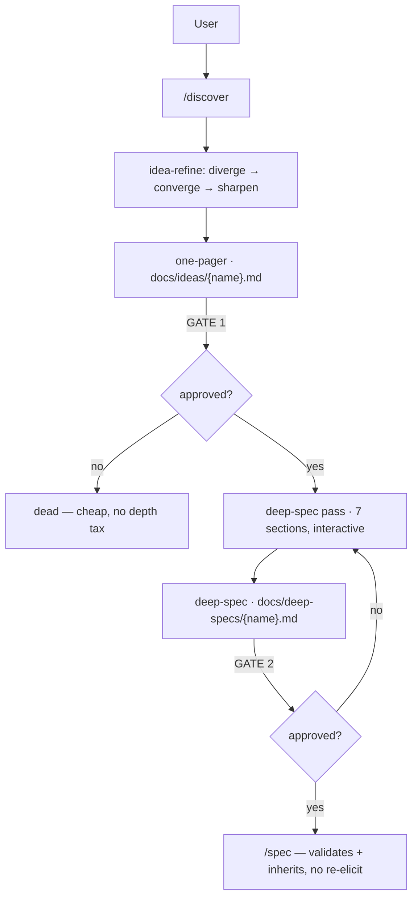

# Nexus Agent Kernel

Single-kernel agent system: **execution harness** (memory, swarms, MCP, daemon) + **methodology layer** (8 personas, 9 protocols, 22 stacks, 500+ skills) + **slash command pipeline** for requirement discovery → spec → architecture → plan → QA test cases → build → review.

```
Agent = Model + Harness
  Harness executes (memory, parallel swarms, MCP tools, daemon)
  Methodology decides (personas, protocols, SDLC pipeline)
```

---

## Origin & Attribution

This repository is a **customized distribution derived from the kernel kernel** — *Breakthrough Method of Agile AI-driven Development* by Brian () Madison ([MIT license](https://opensource.org/licenses/MIT), v6.10.0, `agent-v01/kernel/`).

It is published as **proprietary IP**: the third-party skill libraries (`agent-v01/core-skills/`, ~308 MB of vendored open-source skills) and internal design documents (`documents/`) are intentionally **not included** in this repository. To install into a new project, copy `core-skills/` in from the original working copy first — `install-to-project.sh` installs it when present and skips it gracefully when absent.

---

## Table of Contents

1. [Architecture](#architecture)
2. [Technology Stack](#technology-stack)
3. [Setup & Installation](#setup--installation)
4. [Commands](#commands)
5. [Deep-Spec Methodology](#5-deep-spec-methodology)
6. [Skill Detection](#6-skill-detection--yes-the-agent-detects-needed-skills-per-task)
7. [test Harness](#7-test-harness--start--use)
8. [Cost Management](#8-cost-management)
9. [Project Structure](#9-project-structure)
10. [Protocol Sync](#10-protocol-sync)
11. [Validation](#11-validation)
12. [Further Reading](#12-further-reading)

---

## Architecture

### Layer Model

```
┌──────────────────────────────────────────────────────────────────┐
│  EXECUTION HARNESS (how agents run — runtime)                   │
│  test daemon (7 workers) · AgentDB memory · swarm (mesh, max 5)│
│  MCP server (memory_store, swarm_init, flow-nexus) · hooks       │
│  .claude-flow/ · .swarm/memory.db · .mcp.json · .claude/settings│
├──────────────────────────────────────────────────────────────────┤
│  SLASH COMMANDS (entry points)                                   │
│  /discover  /spec  /arch-design  /plan  /qa  /build  /review     │
├──────────────────────────────────────────────────────────────────┤
│  AGENT PERSONAS (who does the work)                              │
│  ┌──────────┬───────────┬───────────┬───────────┬──────────┐     │
│  │ Mary     │ John      │ Winston   │ Amelia    │ Sally    │     │
│  │ Analyst  │ PM        │ Architect │ Engineer  │ UX       │     │
│  └──────────┴───────────┴───────────┴───────────┴──────────┘     │
├──────────────────────────────────────────────────────────────────┤
│  SKILL DETECTION (which skills a task needs)                     │
│  ROUTING-TABLE.yaml (16 patterns → persona + skill + cost tier)  │
├──────────────────────────────────────────────────────────────────┤
│  SKILL ECOSYSTEM (what they know)                                │
│  ┌─────────────────┬─────────────────────┬──────────────────┐    │
│  │ claude-skills   │ SDLC skills         │ awesome-copilot  │    │
│  │ (66 domain      │ (28 process         │ (377+ tech       │    │
│  │  experts)       │  workflows)         │  skills)         │    │
│  ├─────────────────┼─────────────────────┼──────────────────┤    │
│  │ software-skills │ test-skills        │ STACK REPOS      │    │
│  │ (55 reference   │ (21 — SPARC, swarm, │ (22 technology   │    │
│  │  guides)        │  AgentDB memory)    │  stacks)         │    │
│  └─────────────────┴─────────────────────┴──────────────────┘    │
├──────────────────────────────────────────────────────────────────┤
│  METHODOLOGY (canonical kernel)                                  │
│  kernel — 5 phases: analysis → planning → solutioning →     │
│  implementation → review · 32 skills · core skills · v6 shims    │
├──────────────────────────────────────────────────────────────────┤
│  PROTOCOLS (how they behave)                                     │
│  boundary-safety  conflict-resolution  input-validation          │
│  loop-protocol  freshness-protocol  receipt-protocol  ... (9)    │
├──────────────────────────────────────────────────────────────────┤
│  OUTPUT TEMPLATES (what they produce)                            │
│  idea-template  spec-template  deep-spec-template                │
│  adr-template  design-doc-template  trade-off-doc-template       │
│  review-template  architecture.drawio                            │
└──────────────────────────────────────────────────────────────────┘
```

### Data Flow

```
User request
  → Skill Detection (ROUTING-TABLE: 16 patterns → persona + skill + cost)
  → Persona First Action (loads protocols + canonical kernel skill)
  → Mode Dispatch (22-stack → claude-skill map)
  → Supplementary skills by context (SDLC / copilot / test / vendor)
  → Pipeline: /discover → /spec → /arch-design → /plan → /qa → /build → /review
  → Artifacts: ideas → deep-specs → SPEC → ADRs + trade-off docs + diagrams → tasks → test cases → code + tests → review report
  → Receipt written (protocols/receipts/)
  → Review findings loop back into /plan (loop-protocol)
```

### Pipeline Flow — stages, gates, artifacts

Every stage gates on user approval before its artifact flows downstream. No artifact passes a gate unapproved; no stage starts before its gate is met.

```mermaid
graph LR
    A["/discover"] --> B["one-pager · docs/ideas/{name}.md"]
    B -->|"GATE 1: approved"| C["deep-spec pass · 7 sections"]
    C --> D["deep-spec · docs/deep-specs/{name}.md"]
    D -->|"GATE 2: approved"| E["/spec"]
    E --> F["SPEC.md · stories, ACs, roadmap M1…Mn"]
    F --> G["/arch-design"]
    G --> H["ADRs + trade-offs + diagrams"]
    H --> I["/plan"]
    I --> J["tasks/plan.md + tasks/todo.md"]
    J --> K["/qa"]
    K --> L["docs/qa/test-cases.md"]
    L --> M["/build"]
    M --> N["code + tests"]
    N --> O["/review"]
    O -->|"findings loop back"| I
```



| Stage | Command | Persona | Inputs | Key activity | Gate | Outputs → consumed by |
|-------|---------|---------|--------|--------------|------|------------------------|
| Discovery | `/discover` | Mary (-analyst) | raw idea | idea-refine (diverge → converge → sharpen), spec-first framing | **G1:** one-pager approved | `docs/ideas/{name}.md` → deep-spec, `/spec` |
| Deep-spec | inside `/discover` | Mary + `deep-spec` skill | approved one-pager | interactive problem-space elicitation — flows, edges, error matrix, NFRs, AC seeds, boundaries, open questions; `[ASSUMPTION]` tagging | **G2:** deep-spec approved | `docs/deep-specs/{name}.md` → `/spec` (inherits), `/arch-design` (open questions) |
| Specification | `/spec` | John (-product-manager) | idea doc + deep-spec | TDD-style stories (each AC testable, RED test named), boundaries, **Roadmap & Timeline (M1…Mn)** | user approval | `SPEC.md` → `/arch-design`, `/plan`, `/qa` |
| Architecture | `/arch-design` | Winston (-architect) | SPEC (direct entry OK) | ADRs, trade-off ledger (TO-N ↔ ADR), C4 + component + sequence diagrams, API contracts, boundary-safety check | user approval | `docs/adr/`, `docs/trade-offs/`, `docs/architecture/` (+ `.drawio`) → `/plan`, `/qa`, `/build` |
| Planning | `/plan` | PM / analyst | SPEC + architecture + trade-offs | dependency graph, vertical slices, checkpoints, risk ordering | user approval | `tasks/plan.md`, `tasks/todo.md` → `/qa`, `/build` |
| QA test cases | `/qa` | QA engineer | tasks + SPEC | per-AC test cases (Given/When/Then), coverage map, fixtures, risk-based ordering | user approval | `docs/qa/test-cases.md` → `/build` (RED tests) |
| Build | `/build` | Amelia (-engineer) | tasks + test cases | TDD RED → GREEN → REFACTOR per task; per-task commits | tests green per task | code + tests, `tests/test-summary.md` → `/review` |
| Review | `/review` | -review | code + artifacts | 4-lens review — Quality, Security, Architecture, Dependency | 0 Critical findings | `-REVIEW-REPORT.md`; findings loop into `/plan` (loop-protocol) |

---

## Technology Stack

| Layer | Technology | Purpose |
|-------|-----------|---------|
| **Platform** | Claude Code (CLI/plugin) | Host runtime — tools, filesystem, permissions |
| **Harness** | test v3.33 (daemon, AgentDB, swarm, MCP) | Execution: memory, parallelism, orchestration |
| **Methodology** | kernel (bmm-skills + core-skills) | Canonical SDLC workflow kernel |
| **Skills** | claude-skills (66) · SDLC (28) · awesome-copilot (377) · software-skills (55) · test-skills (21) | Domain expertise, process workflows, references |
| **Stacks** | 22 technology stacks (direct copies) | nestjs, spring-boot, golang, dot-net, java, python, react, nextjs, vue, nuxt, ui-ux, flutter, swift-ui, android, kotlin-compose, react-native, aws, azure, langchain, mlflow, ml-agents, context-engineering |
| **State** | test AgentDB (`.swarm/memory.db`) | Cross-session memory |
| **Config** | YAML (ROUTING-TABLE, SKILL-INDEX, AUTHORITY-MAP, MCP-CONFIG) | Routing, catalogs, authority, cost |
| **Scripts** | Bash + Ruby (`agent-v01/scripts/`) | Install, start, validate, sync |
| **Output** | Markdown + Draw.io | SPEC, ADRs, trade-off docs, architecture diagrams, QA test cases, review reports |

### Development Languages Supported (via stacks)

| Category | Stacks |
|----------|--------|
| **Backend** | NestJS, Spring Boot, Java, Golang, .NET, Python |
| **Frontend** | React, Next.js, Vue, Nuxt, UI/UX |
| **Mobile** | Flutter, Swift UI, Android, Kotlin Compose, React Native |
| **Cloud** | AWS, Azure |
| **AI/ML** | LangChain, MLflow, ML Agents, Context Engineering |

---

## Setup & Installation

### Prerequisites

- **Claude Code** v2.1.220+ (or Cursor)
- **Node.js** v20.12+
- **Python** 3.10+
- **Ruby** (macOS built-in — for YAML validation)

### Option A: Install into a new project (everything in `.claude/`)

```bash
# 1. Clone this repo (anywhere)
git clone <this-repo-url> nexus-agent-kernel

# 2. Install — everything lands in your project's .claude/
./nexus-agent-kernel/agent-v01/scripts/install-to-project.sh /path/to/your-project

#    (symlink mode — single source of truth)
./nexus-agent-kernel/agent-v01/scripts/install-to-project.sh --symlink /path/to/your-project

# 3. Start Claude Code
cd /path/to/your-project && claude
```

### Option B: Load without installing (session-only)

```bash
claude --plugin-dir ./nexus-agent-kernel/agent-v01
```

### Option C: Marketplace install (requires your own repo hosting)

```bash
claude plugin marketplace add <your-repo>
claude plugin install nexus-agent-kernel@nexus-agent-kernel-marketplace
```

### Option D: test execution harness (optional but recommended)

```bash
# In the target project, after install
npx test init --minimal
./.claude/plugins/agent-v01/scripts/start-harness.sh

# Intel Mac fix (onnxruntime darwin/x64): see documents/harness-knowledge.md §5.2
```

### What you get

```
your-project/
├── CLAUDE.md                  ← project rules
└── .claude/
    ├── commands/              ← 7 slash commands (auto-discovered)
    ├── agents/                ← 8  personas (auto-discovered)
    ├── skills/                ← 5 libraries, 500+ skills
    ├── hooks/                 ← lifecycle hooks
    ├── plugins/agent-v01/     ← full kernel (self-contained)
    ├── helpers/               ← status line helpers
    └── .mcp.json              ← test harness MCP
```

---

## Commands

| Command | Persona | Purpose | Key SDLC Skills | Produces |
|---------|---------|---------|-----------------|----------|
| `/discover` 🧠 | -analyst (Mary) | **Idea → concept.** Refines raw ideas; surfaces assumptions; spec-frames output; mines problem-space depth for approved ideas. | idea-refine, spec-driven-development, deep-spec | `docs/ideas/{name}.md`, `docs/deep-specs/{name}.md` (approved ideas) |
| `/spec` 📋 | -product-manager (John) | **Concept → contract.** TDD-style user stories — each AC testable, each story names its RED test. | spec-driven-development, test-driven-development | `SPEC.md` (objectives, stories, ACs, roadmap & timeline M1…Mn) |
| `/arch-design` 🏛 | -architect (Winston) | **Contract → design.** ADRs, trade-off document, API contracts, data models, Draw.io. Direct entry supported (no SPEC needed). | api-and-interface-design, sparc-methodology, -architecture | `docs/adr/*.md`, `docs/trade-offs/*.md`, `docs/architecture/*.md`, `*.drawio` |
| `/plan` 📊 | -analyst/PM | **Design → tasks.** Dependency-ordered, vertically-sliced tasks. | planning-and-task-breakdown, -create-epics-and-stories | `tasks/plan.md`, `tasks/todo.md` |
| `/qa` 🧪 | QA engineer (-qa) | **Tasks → test cases.** Per-story unit/API/E2E test cases from acceptance criteria. | -qa-generate-e2e-tests, test-master, test-driven-development, browser-testing-with-devtools | `docs/qa/test-cases.md` (coverage map) |
| `/build` 🛠 | -engineer (Amelia) | **Tasks → code.** TDD (RED→GREEN→REFACTOR) — RED tests derived from QA test cases. `auto` = full plan in one pass. | test-driven-development, -build, -build-auto, -qa-generate-e2e-tests | Code + tests (traceable to test cases), E2E automation summary, per-task commits |
| `/review` 🔍 | -review | **Code → verdict.** 4-lens review (Quality, Security, Architecture, Dependency). | security-and-hardening, -review, -code-review | `-REVIEW-REPORT.md` |

### Quick Start

```bash
/discover "Build a multi-tenant appointment scheduler"   # 1. Idea + deep-spec (risk, assumptions, flows, edges, NFRs)
/spec                                                    # 2. Contract
/arch-design                                             # 3. Design (ADRs + trade-off doc)
/plan                                                    # 4. Tasks
/qa                                                      # 5. Test cases per story/task
/build auto                                              # 6. Build all (RED tests from test cases)
/review                                                  # 7. Verdict
```

---

## 5. Deep-Spec Methodology

**Deep-spec is discovery's depth layer.** After the `/discover` one-pager is approved (gate 1), the -analyst runs an interactive elicitation pass that mines **problem-space depth** from the idea owner — everything `/spec` and `/qa` would otherwise have to re-ask — into `docs/deep-specs/{name}.md` (gate 2). `/spec` then validates and inherits it; it never re-elicts.

*Design:* `docs/architecture/deep-spec-discovery.md` · ADR-0001…0005 · `docs/trade-offs/deep-spec-discovery-trade-offs.md` · `docs/qa/test-cases.md`

### Discovery flow — two gates



### The seven sections

| # | Section | What it captures |
|---|---------|------------------|
| 1 | User flows & journeys | Actors, happy path, variants, entry/exit points |
| 2 | Edge cases | Empty, max, duplicate, concurrent, missing, partial |
| 3 | Error matrix | Failure → expected behavior, severity (tolerable / critical) |
| 4 | Non-functional requirements | Performance, security, scale, availability — what must *hold* |
| 5 | Acceptance-criteria seeds | Testable "done" conditions — confirmed into final ACs by `/spec` |
| 6 | Boundaries | Always / ask-first / never (per spec-driven-development) |
| 7 | Open questions | Unresolved items with owners — incl. solution-space routing to `/arch-design` |

Each section is elicited with 3–5 questions and **validated by the user before the next**; every inference is tagged `[ASSUMPTION]` with a validation gate; a **fast mode** (draft-then-review) is available on explicit opt-in. **Depth boundary (ADR-0003):** the deep-spec covers problem space only — no data contracts, API contracts, tech stack, or project structure; those stay with `/arch-design`.

### Strengths

- **No re-elicit, no drift** — `/spec` reads `docs/deep-specs/{name}.md` (matching slug) and inherits flows, edges, and AC seeds; the `{name}` identity chain (`ideas → deep-specs → SPEC`) keeps every stage on the same source of truth.
- **Edges mined while the owner is in the room** — failure modes and error paths are pulled out conversationally at discovery, not discovered at QA three stages later.
- **Throwaway ideas stay cheap** — the depth pass runs only after gate 1 (one-pager approval), so half-formed ideas never pay the depth tax (ADR-0005).
- **Assumptions are shown, not silently made** — `[ASSUMPTION]` tagging with validation gates carries -architecture's "shown, not silently made" discipline into discovery.
- **No authority conflict** — the deep-spec is a *contributor* to SPEC.md, never a co-owner; ADRs, specs, and test suites keep their sole owners (conflict-resolution protocol).
- **Stronger, cheaper test suites** — `/qa` maps pre-mined edges and errors directly onto test levels instead of hunting for them; 12 kernel test cases (`docs/qa/test-cases.md`) verify the whole journey, including the full E2E: fixture idea → one-pager → deep-spec → SPEC.md inheritance.

---

## 6. Skill Detection — Yes, the agent detects needed skills per task

### Progressive Skill Routing (Tier 0-3) — lazy loading to avoid huge reads

The kernel has ~1,800 skills. Instead of embedding all skill tables in agent files (engineer was 179 lines / 157 refs), routing is **progressive disclosure**:

| Tier | What | When | Size |
|------|------|------|------|
| **0** | `ROUTING-TABLE.yaml` — task → persona + cost | task start | ~1KB |
| **1** | Agent stub — persona + workflow (no skill tables) | persona adopted | ~300 words |
| **2** | `SKILL-ROUTER.yaml` — persona → phase → skills | **only when skill needed** | ~294 words |
| **3** | `skills/profiles/{persona}.yaml` + specific SKILL.md | on-demand | ~10 lines/skill |

**Result:** "fix a typo" loads 300 words instead of 1,005 (**-70%**). "build flutter screen" loads 428 instead of 1,005 (**-57%**). Generate profiles: `ruby agent-v01/scripts/generate-skill-profiles.rb`.

### Level 1: ROUTING-TABLE (16 pattern rules → persona + skill)

| Phase | Example pattern | Dispatches to |
|-------|----------------|---------------|
| Analysis | `explore codebase\|analyze\|research` | -analyst |
| Planning | `requirements\|user story\|spec\|epic` | -product-manager |
| Solutioning | `architecture\|system design\|adr` | -architect |
| Implementation | `implement\|build\|develop\|add feature` | -engineer |
| Review | `review\|code review\|audit\|test` | -review |
| Documentation | `document\|docs\|readme` | -tech-writer |

### Level 2: Tech-specific routing (priority: critical — fires before generic)

| Task keyword | Routes to |
|--------------|-----------|
| `flutter`/`dart` | `stacks/mobile/flutter/` (22 skills) + flutter-expert |
| `graphql`/`apollo` | `supplements/graphql/` (14 Apollo skills) + graphql-architect |
| `terraform`/`iac` | `stacks/cloud/terraform/` (13 HashiCorp skills) |
| `aws` | `stacks/cloud/aws/` + cloud-architect + agentic-awesome/cloud |
| `azure` | `stacks/cloud/azure/` (27 MS skills) + per-language azure-sdk |
| `react` | `stacks/frontend/react/` + react-expert |
| `python` | `stacks/backend/python/` (incl. 39 azure-sdk-python) + python-pro |
| `java` | `stacks/backend/java/` (incl. 26 azure-sdk-java) + java-architect |
| `dotnet`/`.net` | `stacks/backend/dot-net/` (incl. 28 azure-sdk-dotnet) + csharp-developer |
| `typescript` | `stacks/frontend/typescript-azure-sdk/` (24 skills) + typescript-pro |
| `stripe`, `supabase`, `auth0` | vendor skill from `supplements/database-design/` |
| `swarm`, `memory`, `parallel` | test skill (swarm-orchestration, agentdb) |

### Level 3: Categorized skill libraries (unique skills by task)

| Library | Skills | Organization |
|---------|--------|--------------|
| `core-skills/awesome-copilot/_categorized/` | 353 dev skills | 19 categories (backend, frontend, cloud, database, security, testing, ...) |
| `core-skills/agentic-awesome/` | 1,198 skills | 16 categories (backend, frontend, mobile, cloud, database, ai-ml, security, ...) |
| `core-skills/claude-skills/` | 66 experts | 22-stack map |
| `core-skills/test-skills/` | 21 skills | swarm, memory, SPARC |
| `supplements/database-design/` | 2 skills | supabase-postgres-best-practices, supabase |
| `supplements/graphql/` | 14 Apollo skills | client, server, federation, router, schema, operations |
| `stacks/cloud/terraform/` | 13 HashiCorp skills | code-gen, module-gen, policy, provider-dev |
| `stacks/*/azure-sdk/` | 117 MS skills | python (39), java (26), dot-net (28), typescript (24) |

### Example trace

```
"Build a Flutter payment screen with Stripe"
  → ROUTING-TABLE: "implement|build|develop" → -engineer
  → Stack: "flutter" → flutter-expert claude-skill
  → Vendor: "stripe" → stripe skill from CATALOG.md
  → Loads: engineer persona + flutter-expert + stripe vendor skill
```

---

## 7. test Harness — Start & Use

### Start (one command)

```bash
./agent-v01/scripts/start-harness.sh           # daemon + memory + swarm + MCP + validate
./agent-v01/scripts/start-harness.sh --status  # check only
./agent-v01/scripts/start-harness.sh --stop    # stop all
```

### Cross-session memory (the "I can't remember" fix)

```bash
test memory store -k <key> -v "<value>"   # save
test memory get -k <key>                   # recall (any session)
./agent-v01/scripts/test-harness-memory.sh  # verify persistence
```

### Manual steps

```bash
test daemon start    # 7 background workers
test memory init     # memory database
test swarm init      # mesh topology, max 5 agents
test mcp status      # MCP server
```

> **Intel Mac note:** env vars in `~/.zshrc`:
> ```bash
> export CLAUDE_FLOW_MEMORY_BACKEND=better-sqlite3
> export CLAUDE_FLOW_DAEMON=0
> ```
> Details in `documents/harness-knowledge.md` §5.2.

---

## 8. Cost Management

| Layer | Mechanism | Prevents |
|-------|-----------|----------|
| **Skill routing** | Load only persona-relevant skills; stacks per-mode | Wasted context (~80-99% savings) |
| **MCP gating** (`MCP-CONFIG.yaml`) | 4 cost tiers with daily budgets; concurrency cap 3/agent + 10 total; soft budget (warn 80%, block 100%) | Unbounded paid API calls |
| **Model routing** | default sonnet-5, routing haiku-4.5; S1-S2 cheap / S4-S5 expensive | Premium models on trivial tasks |
| **Hooks + receipts** | Pre-tool guard, post-tool audit, receipt protocol | Rework from incomplete work |

---

## 9. Project Structure

```
nexus-agent-kernel/
├── .claude-flow/              # runtime (config, data, logs, sessions)
├── .swarm/memory.db           # memory database
├── .mcp.json                  # MCP server config
├── CLAUDE.md                  # Project rules
├── documents/                 # Architecture docs (harness-knowledge.md, etc.)
├── docs/                      # Pipeline artifacts (per stage, gated)
│   ├── ideas/                 # one-pagers — from /discover (G1)
│   ├── deep-specs/            # problem-space depth — from deep-spec pass (G2)
│   ├── adr/                   # architecture decisions — from /arch-design
│   ├── trade-offs/            # decision ledger (TO-N ↔ ADR)
│   ├── architecture/          # design docs + .drawio diagrams
│   └── qa/                    # test cases + coverage map — from /qa
├── tasks/                     # plan.md + todo.md — from /plan
├── agent-v01/
    ├── agents/                # 8 personas
    ├── protocols/             # 9 protocols (synced)
    ├── scripts/               # ALL scripts (install, start, validate, sync)
    ├── .claude/commands/      # 7 slash commands (source)
    ├── .claude-plugin/        # plugin.json + marketplace.json
    ├── stacks/                # 22 technology stacks
    ├── supplements/           # 10 collections (incl. database-design)
    ├── references/            # templates + skill catalogs
    ├── methodologies/         # kernel, test/SPARC, general-sdlc, -builder
    ├── core-skills/
    │   ├── claude-skills/     # 66 domain experts
    │   ├── awesome-copilot/   # 353 dev skills in 19 categories (_categorized/)
    │   ├── agentic-awesome/   # 1,198 skills in 16 categories
    │   ├── claude-software-skills/  # 55 reference guides
    │   ├── test-skills/      # 21 swarm/memory/SPARC skills
    │   └── ...                # stack repos, vendor skills
    ├── hooks/                 # lifecycle hooks
    ├── mcp/                   # MCP server configs
    ├── kernel/           # canonical kernel (5 phases, 32 skills)
    ├── SKILL-INDEX.yaml       # master catalog
    ├── SKILL-ROUTER.yaml     # Tier 2: lazy skill routing index
    ├── skills/profiles/      # Tier 3: per-agent skill profiles (generated)
    ├── ROUTING-TABLE.yaml     # skill detection
    ├── AUTHORITY-MAP.yaml     # canonical source priorities
    ├── MCP-CONFIG.yaml        # cost gating
    └── MCP-AGENT-MAP.yaml     # persona → MCP mapping
```

---

## 10. Protocol Sync

```bash
./agent-v01/scripts/sync-protocols.sh --check   # verify sync
./agent-v01/scripts/sync-protocols.sh --apply   # sync diverged files
```

---

## 11. Validation

| Validator | Checks | Run |
|-----------|--------|-----|
| `validate-structure.sh` | agents, stacks, supplements, references, methodologies, commands, protocols, plugin | `bash agent-v01/scripts/validate-structure.sh` |
| `validate-harness.sh` | daemon, config, memory.db, MCP, skills, git hygiene | `bash agent-v01/scripts/validate-harness.sh` |
| `validate-hooks.sh` | hooks.json, referenced scripts, syntax | `bash agent-v01/scripts/validate-hooks.sh` |
| `validate-skills-frontmatter.sh` | agents + skills frontmatter, no symlinks | `bash agent-v01/scripts/validate-skills-frontmatter.sh` |
| `validate-yaml.rb` | all YAML syntax | `ruby agent-v01/scripts/validate-yaml.rb` |

---

## 12. Further Reading

| Document | Description |
|----------|-------------|
| `documents/harness-knowledge.md` | Full harness architecture + how to use + memory fix |
