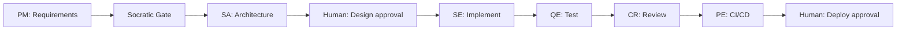

# SDLC Automation Agent — Claude Code Plugin & Skills Library

A **Claude Code plugin** and **skills library** for running a structured software delivery lifecycle (SDLC): requirements → architecture → implementation → testing → review → deployment.

Use it when you want AI-assisted delivery that produces **auditable artifacts** (BRD, ADRs, OpenAPI, tests, CI/CD, receipts)—not just chat and code snippets.

**Runtime:** [Claude Code](https://docs.anthropic.com/en/docs/claude-code) (primary). The same agents and skills can be referenced from Cursor via project rules.

---

## Table of contents

1. [What you get](#1-what-you-get)
2. [Repository structure](#2-repository-structure)
3. [Prerequisites](#3-prerequisites)
4. [Setup — step by step](#4-setup--step-by-step)
5. [Configure your product repo](#5-configure-your-product-repo)
6. [The 13 delivery agents](#6-the-13-delivery-agents)
7. [Skills: three layers](#7-skills-three-layers)
8. [Stack plugins (multi-file best practices)](#8-stack-plugins)
9. [SDLC workflow & modes](#9-sdlc-workflow--modes)
10. [How to prompt — examples](#10-how-to-prompt--examples)
11. [Human gates & receipts](#11-human-gates--receipts)
12. [Project knowledge base (team memory)](#12-project-knowledge-base)
13. [Troubleshooting](#13-troubleshooting)
14. [Further reading](#14-further-reading)

---

## 1. What you get

| Without this repo | With this repo |
|-----------------|----------------|
| One general coding assistant | **13 specialist agents** with boundaries |
| Chat as memory | **Git artifacts** as source of truth |
| Ad-hoc conventions | **Tech packs** + **stack plugins** per language/cloud |
| "Done" in chat | **Verify commands** + **receipts** before handoff |

**Orchestrator skill:** `sdlc-automation-agent` — routes your natural-language request to the right agents and modes.

---

## 2. Repository structure

```
agents/                          # ← this repo (Claude Code plugin root)
├── .claude-plugin/
│   └── plugin.json              # Main plugin manifest
├── agents/                      # Canonical 13 SDLC delivery agents (runtime only)
│   └── {role}/
│       ├── SKILL.md             # Full role instructions + phases
│       ├── agent.md             # Subagent entry (copied to claude-agents/ stub)
│       ├── references/          # Absorbed plugin review/security/test playbooks
│       ├── phases/              # Phase-specific playbooks
│       └── skill-extensions/
│           └── registry.yaml    # Which skills to load per dispatch
├── claude-agents/               # Flat stubs (file copies of agents/{role}/agent.md)
├── skills/
│   ├── sdlc-automation-agent/   # Orchestrator skill + modes (init, sprint, debug, …)
│   └── _shared/
│       ├── protocols/           # Loading rules, receipts, verification
│       ├── specialist-skills/   # Universal deep skills (Java, testing, API design, …)
│       └── templates/           # tech-stack.yaml, .sdlc-automation-agent.yaml
├── packs/                       # Stack-native verify + CI snippets
│   ├── languages/               # java-spring, nodejs-nestjs, …
│   └── clouds/                  # aws, (azure planned)
├── plugins/                     # Installable stack plugin bundles (runtime)
│   ├── system-design/           # 22 HLD building-block skills
│   ├── stack-frontend/          # React, Next.js, AI SDK
│   ├── stack-golang/            # 43 Go skills
│   ├── stack-aws/               # 52 AWS skills
│   ├── stack-azure/             # 191 Azure skills
│   ├── sdlc-workflows/          # TDD, spec-driven, review workflows
│   ├── staff-engineer/          # Optional senior-staff workflow
│   ├── AGENT-SKILL-MAP.yaml     # Agent → plugin skill mapping
│   ├── PLUGIN-AGENT-MAP.yaml    # Quarantined plugin personas → canonical agents
│   └── REFERENCE-MAP.yaml       # new-skills/ → canonical path map (maintainer sync only)
├── scripts/
│   ├── sync-from-new-skills.sh  # Maintainer sync from reference shelf
│   ├── sync-all.sh              # Full Claude Code maintainer pipeline
│   ├── sync-claude-agents-stubs.sh  # Copy agent.md → claude-agents/ (no symlinks)
│   ├── validate-skills-frontmatter.sh  # Frontmatter + symlink checks
│   ├── materialize-symlinks.sh  # Replace runtime symlinks with file copies
│   └── quarantine-plugin-agents.sh  # Move plugins/*/agents → reference/
├── hooks/                           # Lifecycle enforcement (hooks.json + lib/)
│   ├── hooks.json
│   ├── lib/                         # State machines, receipt validator
│   └── data/compacted-rules.md
├── docs/                        # Architecture guides, RAG, plugin how-to
├── new-skills/                  # ⚠ Reference-only upstream repos — NOT loaded at runtime
│   └── README.md                # See skills/_shared/protocols/reference-sources.md
```

**Your product code lives in a separate repo** (e.g. `lastest/` in this workspace). Install this repo as a Claude Code plugin **on top of** your product repo.

---

## 3. Prerequisites

| Requirement | Notes |
|-------------|-------|
| **Claude Code** | CLI or IDE extension ([install guide](https://docs.anthropic.com/en/docs/claude-code)) |
| **Git repo** | Your product project should be a git repository |
| **Node / Java / Go / Python** | Whatever your stack needs — agents detect from project files |
| **Optional: Jira / GitHub** | For tracker integration in PM sprint modes |

---

## 4. Setup — step by step

### Step 1 — Clone this repository

```bash
git clone <your-fork-or-remote>/agents.git
cd agents
```

Keep a stable path — you will reference it in `--plugin-dir`.

### Step 2 — Install the main SDLC plugin (Claude Code)

From any directory, point Claude Code at **this repo root**:

```bash
claude --plugin-dir /absolute/path/to/agents
```

Or inside a Claude Code session:

```
/plugin install /absolute/path/to/agents
```

This loads:

- Orchestrator skill: `/sdlc-automation-agent`
- **13 SDLC agents** (via `claude-agents/` file copies → `agents/`) — no duplicate plugin personas
- Protocols, specialist skills, tech packs

Stack/workflow plugins load **skills only** — see [agent-separation.md](./skills/_shared/protocols/agent-separation.md).

### Step 3 — Install stack plugins for your project

Pick a bundle from [plugins/README.md](./plugins/README.md). Example for **NestJS + React + AWS**:

```bash
claude --plugin-dir /path/to/agents/plugins/system-design
claude --plugin-dir /path/to/agents/plugins/stack-frontend
claude --plugin-dir /path/to/agents/plugins/stack-aws
claude --plugin-dir /path/to/agents/plugins/sdlc-workflows
claude --plugin-dir /path/to/agents/plugins/delivery-toolkit/pr-review-toolkit
```

Example for **Go + AWS**:

```bash
claude --plugin-dir /path/to/agents/plugins/system-design
claude --plugin-dir /path/to/agents/plugins/stack-golang
claude --plugin-dir /path/to/agents/plugins/stack-aws
claude --plugin-dir /path/to/agents/plugins/sdlc-workflows
```

You can add multiple `--plugin-dir` flags or install plugins one at a time in the session.

### Step 4 — Open your product repo in Claude Code

```bash
cd /path/to/your-product-repo
claude
```

Plugins installed in Step 2–3 are available in this session.

### Step 5 — Initialize SDLC workspace in the product repo

In Claude Code, run **init** on your product repo (first time only):

**Prompt example:**

```
Initialize SDLC automation for this project. Detect language, framework, and cloud from the repo and create .sdlc-automation-agent.yaml.
```

Or invoke init mode explicitly:

```
Run sdlc-automation-agent init mode on this codebase.
```

**What init creates:**

| File / folder | Purpose |
|---------------|---------|
| `.sdlc-automation-agent.yaml` | Project config (language, packs, verify commands) |
| `.sdlc-automation-agent/specs/` | Feature specs (requirements, design, tasks) |
| `.sdlc-automation-agent/steering/` | Product/tech/structure steering docs |
| `.sdlc-automation-agent/.orchestrator/receipts/` | Agent handoff receipts |
| `docs/templates/` | Story/epic/task templates for tracker |

### Step 6 — Add project `CLAUDE.md` (recommended)

In your **product repo**, create or extend `CLAUDE.md`:

```markdown
# My Product

## SDLC
- Orchestrator: sdlc-automation-agent (plugin installed)
- Config: `.sdlc-automation-agent.yaml`
- Stack: NestJS + React + AWS — see `docs/architecture/tech-stack.yaml`

## Commands
pnpm install && pnpm build
pnpm test
pnpm lint

## Project knowledge
- Index: `.claude/docs/INDEX.md` (if present)
- Before editing a module: `/understand-module <name>`

## Safety
- Never commit to main without PR approval
- Never run prod migrations without human approval
```

### Step 7 — Verify installation

**Prompt:**

```
List which SDLC agents and stack plugins are available for this project.
Read .sdlc-automation-agent.yaml and docs/architecture/tech-stack.yaml if they exist.
Confirm verify.test and verify.build commands.
```

Expected: Claude reports detected packs, loaded plugins, and runnable verify commands.

---

## 5. Configure your product repo

### Polyglot stack (Next.js + Java + AWS)

Agents do **not** guess a polyglot stack from files alone. You declare it once in **`docs/architecture/tech-stack.yaml`** (Solution Architect phase 3).

**Example:** [docs/examples/tech-stack-nextjs-java-aws.yaml](./docs/examples/tech-stack-nextjs-java-aws.yaml)

```yaml
profile: polyglot
packs:
  language: java-spring    # backend → packs/languages/java-spring
  frontend: nextjs         # frontend → plugins/stack-frontend
  cloud: aws               # infra → packs/clouds/aws + plugins/stack-aws
paths:
  backend: apps/backend-java
  frontend: apps/web-next
  infra: infra/terraform/aws
```

**Install plugins for this profile:**

```bash
claude --plugin-dir /path/to/agents
claude --plugin-dir /path/to/agents/plugins/system-design
claude --plugin-dir /path/to/agents/plugins/stack-frontend
claude --plugin-dir /path/to/agents/plugins/stack-aws
claude --plugin-dir /path/to/agents/plugins/sdlc-workflows
```

**How agents pick skills:**

| Agent | Backend work | Frontend work | AWS / infra |
|-------|--------------|---------------|-------------|
| SE (backend mode) | `java-spring` pack + `java-kotlin` specialist | — | — |
| SE (frontend mode) | — | `next-best-practices`, `react-best-practices` | — |
| SA | `system-design/*` + `api-design` | `next-best-practices` (API boundaries) | `stack-aws` + `data-storage` |
| PE | — | — | `packs/clouds/aws` + `stack-aws` |
| QE | `java-spring/testing.md` | `chrome-devtools`, `react-best-practices` | — |

Routing map: [plugins/AGENT-SKILL-MAP.yaml](./plugins/AGENT-SKILL-MAP.yaml) → `bundles.nextjs-java-aws`

---

### `.sdlc-automation-agent.yaml` (project config)

Generated by init. Key fields:

```yaml
build_mode: scrum          # scrum | kanban
project:
  name: my-app
  type: brownfield         # greenfield | brownfield
  language: typescript
  framework: nestjs
  domain: saas             # triggers multi-tenant specialist skills

packs:
  language: nodejs-nestjs
  cloud: aws
  frontend: react

verify:
  lint: "pnpm lint"
  test: "pnpm test"
  build: "pnpm build"
```

### `docs/architecture/tech-stack.yaml` (SA phase 3)

Solution Architect writes this during architecture. **All agents** read `packs.*` and `verify.*` from it.

Template: [skills/_shared/templates/tech-stack.yaml.tmpl](./skills/_shared/templates/tech-stack.yaml.tmpl)

### Engagement mode

Set in `.sdlc-automation-agent/.orchestrator/settings.md`:

| Mode | Behavior |
|------|----------|
| **Autonomous** | Agents decide with sensible defaults; surface 1–2 irreversible choices |
| **Controlled** | Ask before major decisions; show plans per phase |

---

## 6. The 13 delivery agents

| Agent | Owns | Produces | Does NOT |
|-------|------|----------|----------|
| **Product Manager** | WHAT to build | BRD, epics, stories, acceptance criteria | Architecture, code |
| **Solution Architect** | HOW (design) | SAD, ADRs, tech-stack.yaml, OpenAPI, ERD, scaffold | Business requirements, implementation |
| **Software Engineer** | Backend code | Services, APIs, migrations | Architecture changes, prod deploy |
| **Frontend Engineer** | Frontend code | React/Next.js UI, components, pages | Backend services, infra |
| **Data Scientist** | AI/ML | Pipelines, experiments, model integration | Infra, security policy |
| **Quality Engineer** | Test quality | Test plans, tests, coverage reports | Feature code, infra |
| **DevOps** | CI/CD automation | Pipelines, Docker, deployment scripts | Application business logic |
| **SRE** | Reliability | SLOs, runbooks, incident response | Feature implementation |
| **Platform Engineer** | Infra & cloud | Terraform, ECS/K8s, environment config | Application business logic |
| **Security Engineer** | Security/compliance | OWASP audit, STRIDE, compliance checklist | Feature implementation |
| **Code Reviewer** | Review | Findings, risk assessment | Direct code edits |
| **Technical Writer** | Docs | API docs, runbooks, user guides | Code |
| **Research Advisor** | Discovery | Options analysis, brownfield maps | Commits code |

**Legacy alias:** `compliance-engineer` → `security-engineer` (deprecated stub retained for backward compatibility).

**Handoff chain (full greenfield):**

```
PM → SA → SE → QE → CR → PE
         ↑___________|  (implement ↔ test loop)
```

Agent prompts live in `agents/{role}/SKILL.md`. Skill loading registries: `agents/{role}/skill-extensions/registry.yaml`.

---

## 7. Skills: three layers

Agents load skills in this order (see protocols in `skills/_shared/protocols/`):

| Layer | Location | When loaded |
|-------|----------|-------------|
| **1. Protocols** | `skills/_shared/protocols/` | Always (receipts, verification) |
| **2. Tech packs** | `packs/languages/*`, `packs/clouds/*` | Per stack — verify commands, layout |
| **3. Specialist skills** | `skills/_shared/specialist-skills/` | 2–5 deep skills per agent dispatch |
| **4. Stack plugins** | `plugins/*/skills/` | Stack best practices (Next.js rules, Go layout, AWS CDK, system design) |

**Loading protocols:**

- [tech-pack-loading.md](./skills/_shared/protocols/tech-pack-loading.md)
- [specialist-skill-loading.md](./skills/_shared/protocols/specialist-skill-loading.md)
- [stack-skill-loading.md](./skills/_shared/protocols/stack-skill-loading.md)

**Agent → plugin map:** [plugins/AGENT-SKILL-MAP.yaml](./plugins/AGENT-SKILL-MAP.yaml)

---

## 8. Stack plugins

Installable bundles under `plugins/`. Each skill folder uses **multi-file markdown**:

```
plugins/stack-frontend/skills/next-best-practices/
├── SKILL.md                 # Index — read first
├── rsc-boundaries.md        # Load on demand
├── data-patterns.md
└── ...
```

| Plugin | Use for |
|--------|---------|
| `system-design` | HLD, capacity, storage, caching, messaging, resilience |
| `stack-frontend` | React, Next.js, shadcn, AI SDK, performance rules |
| `stack-golang` | Go project layout, testing, gRPC, concurrency |
| `stack-aws` / `stack-azure` | Cloud service patterns + Terraform context |
| `sdlc-workflows` | TDD, spec-driven dev, code review workflows |
| `delivery-toolkit/*` | PR review, feature-dev, security guidance |

Full catalog: [plugins/README.md](./plugins/README.md)

---

## 9. SDLC workflow & modes

The orchestrator (`skills/sdlc-automation-agent/SKILL.md`) classifies your request and runs the minimal agent set.

### Modes (orchestrator)

| Mode | Trigger (natural language) | What runs |
|------|----------------------------|-----------|
| **Init** | "initialize project", no `.sdlc-automation-agent.yaml` | Config + scaffold |
| **Build / Custom** | "build me a…", "create a SaaS…" | PM → SA → SE → QE → CR → PE (adaptive) |
| **Sprint** | "work on sprint", story ID | SE → QE → CR per story |
| **Reverse / Discover** | "map this codebase", brownfield | Research + context packages |
| **Debug** | "fix this bug", failing tests | Structured root-cause |
| **Lightweight** | "add endpoint", small change | SE (+ QE/CR if needed) |
| **Preview** | "run the app", "start dev server" | Local verification |
| **Release** | "prepare release", changelog | PE + TW |

Phase mapping: [skills/sdlc-automation-agent/reference/delivery-phases.md](./skills/sdlc-automation-agent/reference/delivery-phases.md)

### Full pipeline (greenfield)



---

## 10. How to prompt — examples

You do **not** need slash commands. Describe what you need in natural language. The orchestrator routes to agents.

### Greenfield — full product

```
Build a multi-tenant SaaS for appointment scheduling.
Stack: NestJS backend, Next.js frontend, PostgreSQL, AWS ECS.
Run the full SDLC pipeline: requirements, architecture with ADRs, API contracts,
implementation, tests, security review, and GitHub Actions CI/CD.
Engagement mode: Controlled — ask me before irreversible decisions.
```

### Brownfield — understand then change

```
This is an existing NestJS monorepo. First run discover mode and produce context packages.
Then add a notification module that sends email when an appointment is confirmed.
Follow existing patterns in app-service. Write tests. Run pnpm test before done.
```

### Single feature (lightweight)

```
Add a GET /api/v1/appointments/:id endpoint to app-service.
Follow NestJS module pattern, add DTO validation, unit test, and update OpenAPI if present.
Load next-best-practices if this touches the Next.js admin UI.
```

### Architecture only

```
Design the high-level architecture for a real-time chat system.
Expected scale: 50k concurrent users, multi-region.
Use system-design plugin skills: requirements scoping, back-of-the-envelope estimates,
data storage, messaging, and resilience. Output ADRs and a diagram.
Do not implement code yet.
```

### SA phase — tech stack selection

```
As Solution Architect phase 3: select tech stack for a Java 21 + Spring Boot backend
and Angular frontend on Azure AKS. Write docs/architecture/tech-stack.md and
tech-stack.yaml. Load java-spring pack and stack-azure plugin skills.
```

### Sprint story

```
Implement story HT-142 from the backlog: "Patient can export estimation as PDF."
Read acceptance criteria from the tracker. Software Engineer mode backend.
After implementation, run Quality Engineer tests and Code Reviewer pass.
Write a receipt when done.
```

### Code review before merge

```
Review my current branch diff against uat.
Use code-reviewer agent and pr-review-toolkit skills.
Check spec compliance, tenant isolation, and test coverage.
Do not merge — report findings only.
```

### Platform / infra

```
As Platform Engineer: add Terraform for ECS Fargate + RDS PostgreSQL + ALB in ap-southeast-1.
Follow stack-aws plugin (aws-containers, aws-iam). Add GitHub Actions deploy workflow.
Run terraform validate. Do not apply to prod.
```

### Debug

```
pnpm test fails in apps/app-service — eligibility-rule.service.spec.ts.
Run debug mode: root-cause analysis, minimal fix, re-run verify.test.
```

### Invoke a specific agent

```
Act as Solution Architect only. Read agents/solution-architect/SKILL.md.
Complete phase 4 (API contracts) for the notifications feature.
Input: .sdlc-automation-agent/specs/notifications/requirements.md
```

### Invoke a stack skill directly

```
Load stack-frontend/next-best-practices and review app/dashboard/page.tsx
for RSC boundary violations and data waterfalls.
```

### Init on existing repo

```
Initialize SDLC automation for this brownfield repo.
Detect NestJS + React + AWS from files. Create .sdlc-automation-agent.yaml
and scaffold specs/ and steering/ folders.
```

---

## 11. Human gates & receipts

### Gates (you must approve)

| Gate | When |
|------|------|
| **Socratic gate** | After PM requirements — confirm scope |
| **Design approval** | After SA HLD — before implementation |
| **PR / merge** | After code review |
| **Production deploy** | Before PE applies infra to prod |

### Receipts (every agent handoff)

Each agent writes a JSON receipt:

```
.sdlc-automation-agent/.orchestrator/receipts/{story-id}-{role}.json
```

Example prompt to enforce receipts:

```
Complete this task as Software Engineer. Before finishing, write a receipt per
receipt-protocol.md with artifacts changed, verification commands run, and next step for QE.
```

Protocol: [skills/_shared/protocols/receipt-protocol.md](./skills/_shared/protocols/receipt-protocol.md)

### Verification before "done"

Agents must run commands from `tech-stack.yaml` → `verify.*`:

```yaml
verify:
  lint: "pnpm lint"
  test: "pnpm test"
  build: "pnpm build"
```

Protocol: [skills/_shared/protocols/verification-discipline.md](./skills/_shared/protocols/verification-discipline.md)

---

## 12. Project knowledge base

For fast onboarding and consistent AI context, store **team memory in git** (not chat):

```
your-product-repo/
├── CLAUDE.md                      # L0 — commands, safety, skill index
└── .claude/
    ├── docs/
    │   ├── INDEX.md               # Router: task → which doc to read
    │   ├── 01-system-overview.md
    │   └── domains/               # Multi-tenancy, auth, business rules
    └── skills/                    # Project-specific skills
        └── add-api-endpoint/
```

**Prompt for new team member + Claude:**

```
Read .claude/docs/INDEX.md and 01-system-overview.md, then help me implement HT-200.
Use /understand-module eligibility before editing.
```

See [docs/agentic-contest.md](./docs/agentic-contest.md) §7 (context layers).

---

## 13. Troubleshooting

| Problem | Fix |
|---------|-----|
| Orchestrator not triggered | Say "use sdlc-automation-agent" or `/sdlc-automation-agent` |
| Wrong stack conventions | Run init; ensure `docs/architecture/tech-stack.yaml` exists |
| Agent skips tests | Remind: "Run verify.test from tech-stack.yaml before receipt" |
| Too many questions | Set engagement mode to Autonomous in settings.md |
| Plugin skills not found | Re-install `--plugin-dir` for stack plugins |
| Java project gets Node patterns | Set `packs.language: java-spring` in tech-stack.yaml |

---

## 14. Further reading

| Doc | Topic |
|-----|-------|
| [docs/claude-code-agent.md](./docs/claude-code-agent.md) | SDLC structure, workflow, skill updates — draft for team debate |
| [docs/sdlc-agent-automation.md](./docs/sdlc-agent-automation.md) | Full architecture & LangGraph integration |
| [docs/claude-plugin-guide.md](./docs/claude-plugin-guide.md) | Create your own Claude Code plugins |
| [docs/agentic-contest.md](./docs/agentic-contest.md) | Agent design best practices |
| [plugins/README.md](./plugins/README.md) | Stack plugin catalog & bundles |
| [plugins/AGENT-SKILL-MAP.yaml](./plugins/AGENT-SKILL-MAP.yaml) | Agent → skill mapping |
| [packs/README.md](./packs/README.md) | Tech packs (Java, NestJS, AWS) |
| [docs/sdlc-workflow-proposal.md](./docs/sdlc-workflow-proposal.md) | End-to-end workflow: discovery → release + tech-stack gate |
| [docs/PROJECT-STRUCTURE.md](./docs/PROJECT-STRUCTURE.md) | Recommended repo + product layout |
| [hooks/README.md](./hooks/README.md) | Comprehensive Claude Code hooks |

---

## Quick reference card

```bash
# Install (once per machine/session)
claude --plugin-dir /path/to/agents
claude --plugin-dir /path/to/agents/plugins/system-design
claude --plugin-dir /path/to/agents/plugins/stack-frontend   # if React/Next.js
claude --plugin-dir /path/to/agents/plugins/stack-aws        # if AWS

# In product repo
cd /path/to/product && claude

# First-time init
"Initialize SDLC automation for this project"

# Daily dev
"Implement HT-XXX: <story title>. Run tests before done."

# Architecture
"Design HLD for <feature>. Use system-design skills. ADRs + OpenAPI."

# Review
"Review current branch. Code reviewer + pr-review-toolkit. Findings only."
```

---

*This repository is the SDLC meta-repo. Product application code (e.g. Hano Portal) lives in a separate repository with this plugin installed alongside it.*
