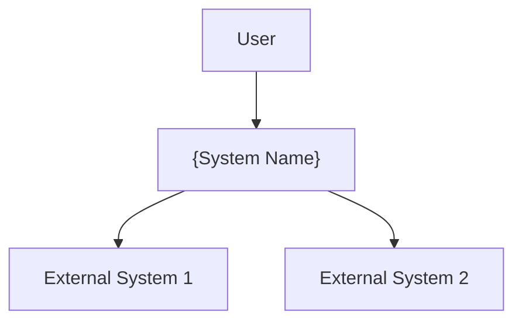
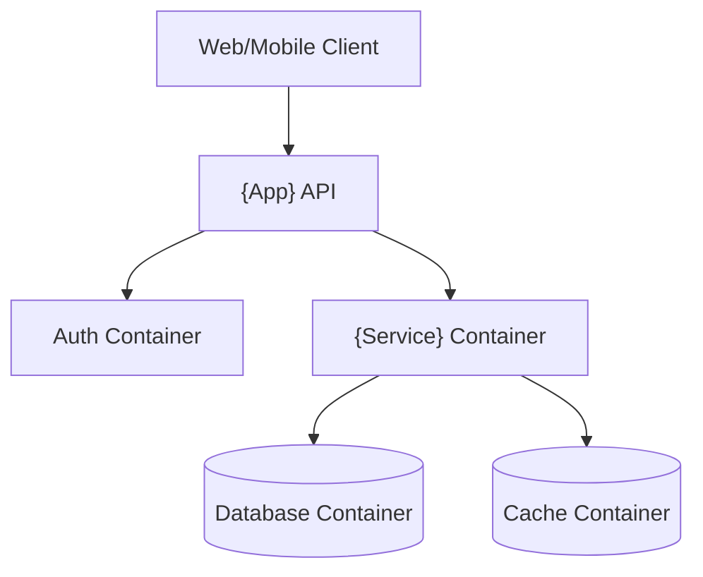
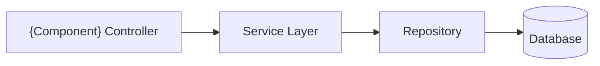
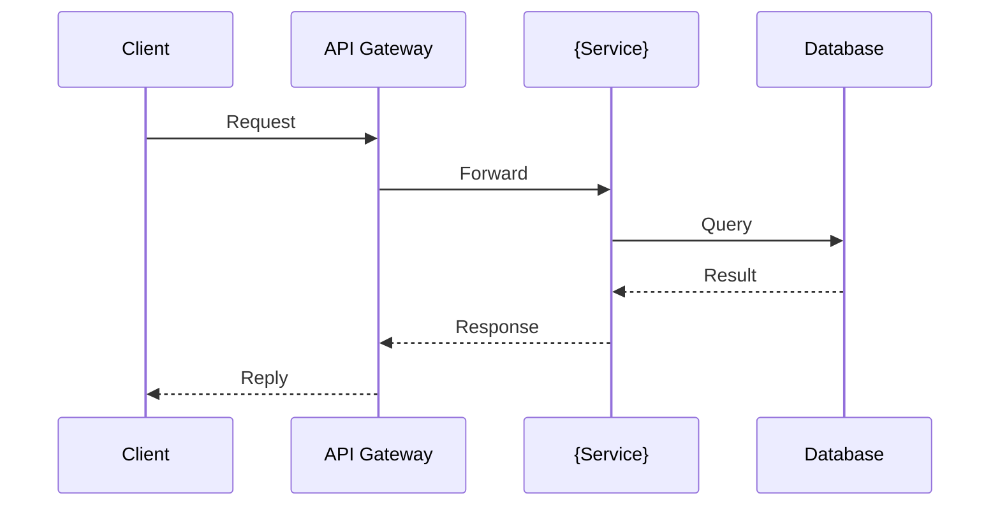
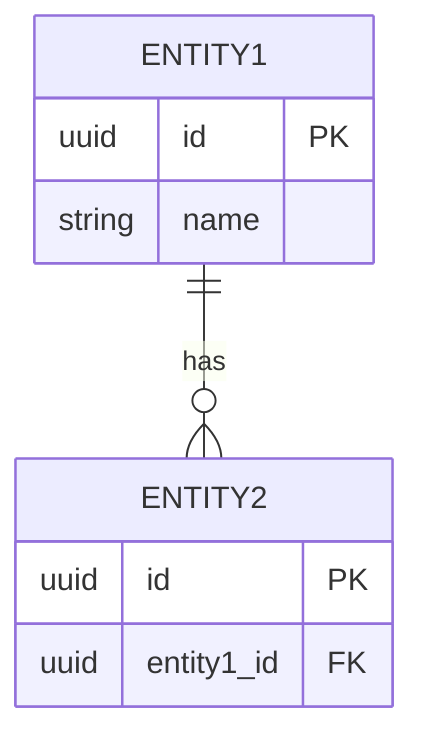
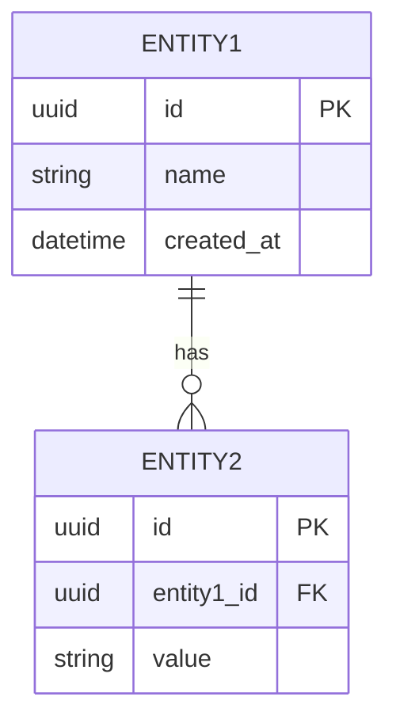

# Architecture Design: {Component/System Name}

**Status:** Draft / Reviewed / Approved
**Version:** 1.0
**Date:** {YYYY-MM-DD}
**Author:** bmad-architect (Winston)

---

## 1. Overview

{One-paragraph description of the component/system, its purpose, and how it fits into the larger architecture.}

## 2. Architecture Diagrams

### 2.1 C4-Model

> Editable Draw.io files in `docs/architecture/`:
> - `{component}-c4-context.drawio` — system boundary (users, external systems)
> - `{component}-c4-container.drawio` — high-level containers (apps, services, databases)
> - `{component}-c4-component.drawio` — internal components per container

**C4 Context (Mermaid):**



**C4 Container (Mermaid):**



### 2.2 Component Diagram

> Editable: `{component}-components.drawio` — static structure: modules, interfaces, dependencies



### 2.3 Sequence Diagram

> Editable: `{component}-sequence.drawio` — required for auth, payment, webhook flows



### 2.4 ER Diagram

> Editable: `{component}-er.drawio` — data model entities and relationships



## 3. Component Breakdown

### {Component 1}
- **Responsibility:** {What does it do?}
- **Tech:** {Language, framework, runtime}
- **Interfaces:** {API contracts, events, or messages}
- **Dependencies:** {What does it depend on?}

### {Component 2}
- **Responsibility:** {What does it do?}
- **Tech:** {Language, framework, runtime}
- **Interfaces:** {API contracts, events, or messages}
- **Dependencies:** {What does it depend on?}

## 4. Data Model



### Key Entities
| Entity | Description | Key Fields |
|--------|-------------|------------|
| {Entity} | {Description} | {Key fields} |

## 5. API Contracts

### {Endpoint Method /path}
- **Request:** `{JSON schema or type reference}`
- **Response:** `{JSON schema or type reference}`
- **Errors:** `{Error codes and meanings}`

## 6. Data Flow

```
{User Action}
  → {Step 1: component, what happens}
  → {Step 2: component, what happens}
  → {Step 3: component, what happens}
  → {Response to user}
```

## 7. Security Considerations

- {Auth mechanism and scope}
- {Data encryption at rest and in transit}
- {Input validation strategy}
- {Rate limiting approach}

## 8. Deployment & Operations

- **Infrastructure:** {Cloud, services, scaling}
- **Monitoring:** {Key metrics and alerts}
- **Disaster Recovery:** {RTO/RPO, backup strategy}

## 9. Trade-offs & Decisions

{One paragraph on the overall decision posture: what the big trade-offs were and the shape they give the system.}

| ID | Decision | Trade-off (gained → accepted) | Status | ADR |
|----|----------|-------------------------------|--------|-----|
| TO-1 | {Decision} | {gained X → accepted Y} | Accepted | ADR-{NNNN} |
| TO-2 | {Decision} | {gained X → accepted Y} | Proposed | ADR-{NNNN} |

> Full analysis (options compared, scoring, accepted costs, revisit triggers, cross-decision effects) lives in the **Trade-off Document**: `docs/trade-offs/{component}-trade-offs.md` (template: `trade-off-doc-template.md`).

**Deferred:** {the decisions deliberately not made now + revisit conditions}

## 10. Open Questions

- {Question that needs resolution}
- {Question that needs resolution}

---

## Related Documents

- ADR-{NNNN}: {Decision title}
- `docs/trade-offs/{component}-trade-offs.md`
- `docs/architecture/{component}.drawio`

*Template: agent-v01/references/templates/design-doc-template.md*
