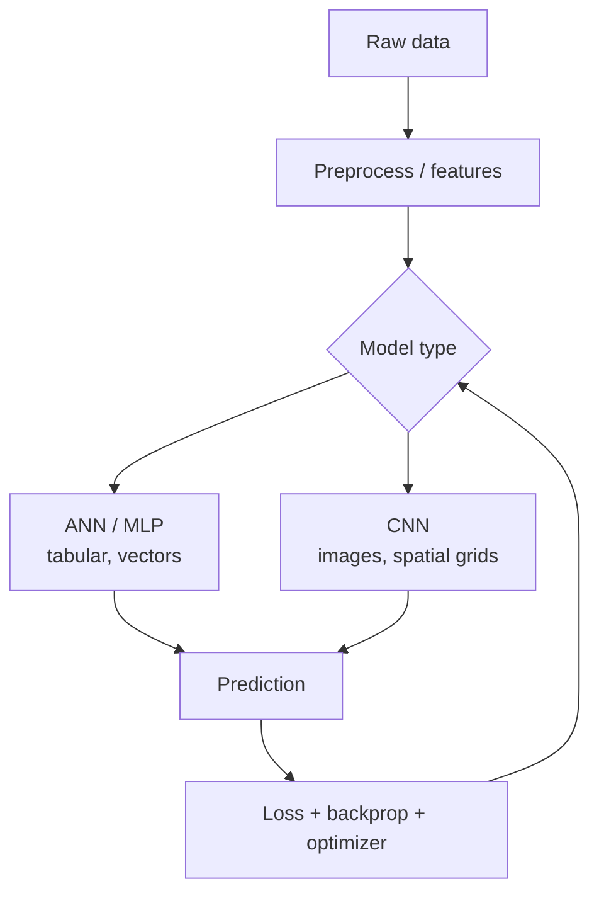
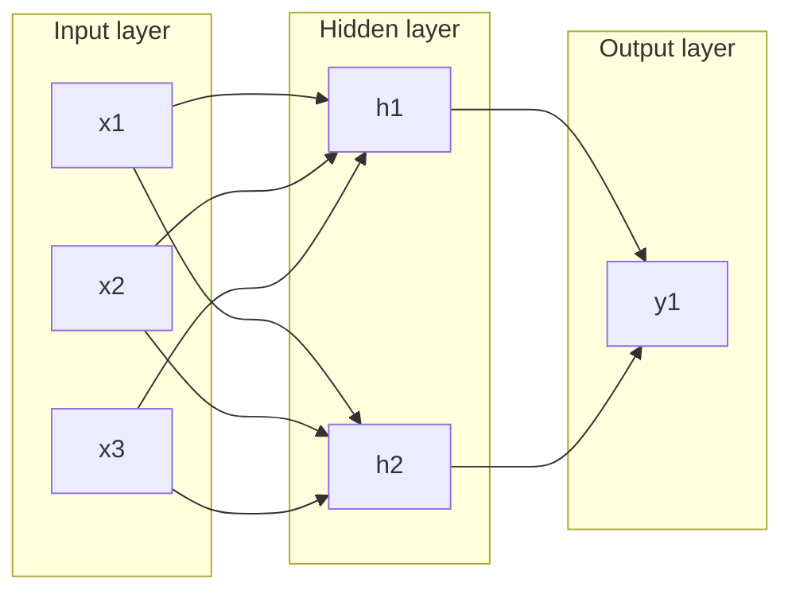
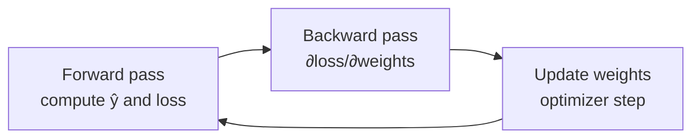
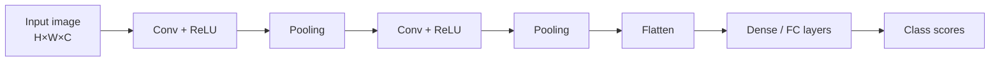
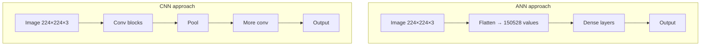
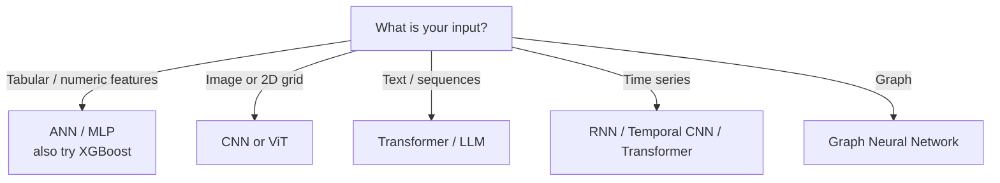

# Deep Learning — ANN & CNN Explained

A practical guide to **Artificial Neural Networks (ANN)** and **Convolutional Neural Networks (CNN)**: what they are, how they work, when to use each, and how they fit in real ML systems.

**Related docs:** [RAG.md](./RAG.md) (LLM retrieval), [cv.md](./cv.md) (ML/DL/LLM profile).

---

## Table of contents

1. [Deep learning in one page](#1-deep-learning-in-one-page)
2. [Artificial Neural Network (ANN)](#2-artificial-neural-network-ann)
3. [How ANNs learn](#3-how-anns-learn)
4. [Convolutional Neural Network (CNN)](#4-convolutional-neural-network-cnn)
5. [ANN vs CNN](#5-ann-vs-cnn)
6. [When to use which](#6-when-to-use-which)
7. [Worked examples](#7-worked-examples)
8. [Production & interview notes](#8-production--interview-notes)
9. [Glossary](#9-glossary)

---

## 1. Deep learning in one page

### What is deep learning?

**Deep learning (DL)** is a branch of **machine learning** that uses **neural networks with many layers** to learn patterns from data—images, text, audio, tabular features—without hand-crafting every rule.

| Term | Meaning |
|------|---------|
| **Machine Learning (ML)** | Learn patterns from data (includes linear models, trees, SVM, neural nets) |
| **Deep Learning (DL)** | ML using **deep neural networks** (many stacked layers) |
| **Neural network** | Composed of **neurons** (units) connected by **weights**; learns by adjusting weights |
| **ANN** | General feedforward network on **flat vectors** (tabular, embeddings) |
| **CNN** | Specialized network for **grid data** (images, spectrograms) using **convolution** |

### High-level picture



### Why ANN and CNN still matter (even in the LLM era)

| Area | Typical model |
|------|----------------|
| Tabular fraud/risk scoring | ANN / gradient boosting |
| Medical image classification | CNN (or ViT) |
| Document OCR layout | CNN + transformers |
| Speech, vision pre-LLM features | CNN / RNN |
| General language | Transformers (LLMs)—**not** classic ANN/CNN for text |

LLMs dominate **language**, but **ANN** and **CNN** remain foundational for **structured data** and **vision**.

---

## 2. Artificial Neural Network (ANN)

### What is an ANN?

An **Artificial Neural Network (ANN)** is a network of connected **artificial neurons** that transforms an **input vector** into an **output** through weighted sums and **activation functions**.

In practice, “ANN” often means a **feedforward multilayer perceptron (MLP)**:

```
Input layer → Hidden layer(s) → Output layer
```

No cycles (unlike RNNs). Information flows **forward** during prediction; errors flow **backward** during training.

### Biological inspiration (simplified)

Real neurons receive signals, fire if strong enough. ANNs mimic this loosely:

| Biology (loose analogy) | ANN |
|-------------------------|-----|
| Dendrites | Inputs $x_1, x_2, \ldots$ |
| Synaptic strength | Weights $w_1, w_2, \ldots$ |
| Cell sums signals | Weighted sum $z = \sum w_i x_i + b$ |
| Fires or not | Activation $a = f(z)$ |

**Important:** Modern ANNs are **engineering models**, not brain simulations.

### Single neuron (perceptron)

For one neuron with inputs $x$, weights $w$, bias $b$, activation $f$:

$$
z = w_1 x_1 + w_2 x_2 + \cdots + w_n x_n + b = \mathbf{w}^T \mathbf{x} + b
$$

$$
a = f(z)
$$

**Example — loan approval (toy):**

| Feature $x$ | Weight $w$ | Meaning |
|---------------|--------------|---------|
| Income | +0.8 | Higher income → higher score |
| Debt ratio | −1.2 | Higher debt → lower score |
| Credit score | +1.5 | Better credit → higher score |

$z = 0.8 \cdot \text{income} - 1.2 \cdot \text{debt} + 1.5 \cdot \text{credit} + b$

Then $f(z)$ might output a probability of approval.

### Multilayer ANN (MLP)

Stack layers so the network learns **non-linear** boundaries:



| Layer | Role |
|-------|------|
| **Input** | Raw features (normalized numbers) |
| **Hidden** | Learn combinations of features (edges of decision space) |
| **Output** | Class logits (classification) or single value (regression) |

**Depth** = more hidden layers → can represent more complex functions (with enough data and regularization).

### Activation functions

Without non-linear activations, stacking linear layers is still linear. Activations introduce **curves** and **thresholds**.

| Activation | Formula (idea) | Typical use |
|------------|------------------|-------------|
| **ReLU** | $\max(0, z)$ | Hidden layers (default choice) |
| **Sigmoid** | $1 / (1 + e^{-z})$ | Binary output probability |
| **Softmax** | Normalized exponentials | Multi-class output (sum to 1) |
| **Tanh** | $(e^z - e^{-z})/(e^z + e^{-z})$ | Hidden layers (older RNNs) |
| **Linear** | $f(z) = z$ | Regression output |

**ReLU example:**

| $z$ | ReLU($z$) |
|-------|-------------|
| −2 | 0 |
| 0 | 0 |
| 3 | 3 |

Dead neurons (always 0) can happen with ReLU; variants like **Leaky ReLU** mitigate this.

### What ANN is good at

| Use case | Input shape | Output |
|----------|-------------|--------|
| Credit risk | Vector of financial features | Approve / reject |
| Churn prediction | Usage + demographics | Probability of churn |
| Recommendation scoring | User + item embeddings | Click score |
| Tabular healthcare features | Lab values, age, codes | Risk bucket |

**Requirement:** Data must be representable as a **fixed-length numeric vector** (after encoding categoricals).

### ANN limitations

| Limitation | Why |
|------------|-----|
| **No spatial structure** | Treats pixel 1 and pixel 2 like unrelated features unless you engineer features |
| **Parameter explosion on images** | 224×224×3 image = 150,528 inputs → first dense layer is huge |
| **Order of features** | Shuffling input columns does not change ANN; bad for sequences unless you use RNN/Transformer |
| **Needs data + tuning** | Can overfit small tabular sets; tree models sometimes win on small data |

---

## 3. How ANNs learn

### Forward pass

1. Input $\mathbf{x}$ enters the network.
2. Each layer computes $\mathbf{z} = \mathbf{W}\mathbf{a}_{prev} + \mathbf{b}$, then $\mathbf{a} = f(\mathbf{z})$.
3. Final layer produces **prediction** $\hat{y}$.

### Loss function

Measures how wrong the prediction is. Training **minimizes loss**.

| Task | Common loss |
|------|-------------|
| Binary classification | **Binary cross-entropy** |
| Multi-class | **Categorical cross-entropy** |
| Regression | **MSE** (mean squared error), **MAE** |

**Binary cross-entropy (intuition):** Penalizes confident wrong answers heavily. Predict 99% “yes” when truth is “no” → large loss.

### Backpropagation

**Backprop** computes how each weight contributed to the loss, using the **chain rule** from calculus.



| Step | What happens |
|------|----------------|
| Forward | Compute activations and loss $L$ |
| Backward | Propagate $\partial L / \partial w$ from output to input |
| Update | $w \leftarrow w - \eta \cdot \partial L / \partial w$ |

$\eta$ = **learning rate** (step size). Too large → unstable; too small → slow training.

### Optimizers

| Optimizer | Notes |
|-----------|-------|
| **SGD** | Basic gradient descent; may need momentum |
| **Adam** | Adaptive learning rate; common default |
| **AdamW** | Adam + better weight decay; used in many modern trainers |

### Training loop (pseudocode)

```text
for epoch in 1..N:
    for batch in dataset:
        y_hat = model(x)           # forward
        loss = loss_fn(y_hat, y)   # compare to labels
        loss.backward()            # backprop
        optimizer.step()           # update weights
        optimizer.zero_grad()
```

### Overfitting and regularization

| Technique | Purpose |
|-----------|---------|
| **Train/validation/test split** | Detect overfitting |
| **Dropout** | Randomly zero neurons during training → robustness |
| **L2 weight decay** | Penalize large weights |
| **Early stopping** | Stop when validation loss rises |
| **Batch normalization** | Stabilize training (also used in CNNs) |
| **More data / augmentation** | Best regularizer for vision |

---

## 4. Convolutional Neural Network (CNN)

### Why CNN exists

An image is a **2D grid** of pixels with **local structure**: nearby pixels form edges, textures, objects.

A plain ANN on flattened pixels:

- Ignores that pixel $(i,j)$ is near $(i+1,j)$
- Needs **enormous** numbers of weights
- Hard to generalize if object shifts slightly

**CNN** exploits **local connectivity**, **parameter sharing**, and **translation equivariance** (same filter detects a pattern anywhere in the image).

### Core idea: convolution

A **filter** (kernel) is a small matrix (e.g. 3×3) that slides over the image and computes dot products.

```
Image patch (3×3)     Kernel (3×3)        Output (1 value)
┌─────────┐          ┌─────────┐
│ 1 0 1   │    *     │ 1  0 -1 │    =    edge response
│ 1 1 0   │          │ 1  0 -1 │
│ 0 1 1   │          │ 1  0 -1 │
└─────────┘          └─────────┘
```

| Concept | Meaning |
|---------|---------|
| **Kernel / filter** | Learnable weights detecting a pattern (edge, corner, texture) |
| **Feature map** | Output after applying one filter across the whole image |
| **Stride** | How many pixels the filter moves each step |
| **Padding** | Add border pixels to control output size |

**Parameter sharing:** The **same** 3×3 kernel is reused at every position → far fewer parameters than a fully connected layer on all pixels.

### CNN layer stack (typical)



| Layer type | Role |
|------------|------|
| **Convolution** | Detect local patterns; depth increases (more filters) |
| **Activation (ReLU)** | Non-linearity |
| **Pooling** | Downsample (reduce size); keeps strongest signals |
| **Flatten** | Turn 3D feature maps into 1D vector |
| **Fully connected (FC)** | Combine high-level features for final class |

### Pooling

**Max pooling** (common): take maximum value in each 2×2 window → keeps strongest activation, reduces spatial size.

| Before 4×4 | After 2×2 max pool (stride 2) |
|------------|-------------------------------|
| Shrinks width/height | Fewer computations later |
| Adds small translation tolerance | “Where” matters less, “what” matters more |

**Global average pooling (GAP):** Average each feature map to one number → replaces large FC layers (used in ResNet-style heads).

### Channels (depth)

Color image: **height × width × 3** (RGB).

Each conv layer has **multiple filters** → output **depth** = number of feature maps.

```
Input:  224 × 224 × 3
Conv1:  224 × 224 × 32   (32 different filters)
Pool:   112 × 112 × 32
Conv2:  112 × 112 × 64
...
```

Early layers → **edges, colors**  
Middle layers → **textures, parts**  
Deep layers → **object-level patterns**

### Famous CNN architectures (overview)

| Architecture | Idea | Era / note |
|--------------|------|------------|
| **LeNet-5** | Conv + pool + FC; digit recognition | Classic teaching example |
| **AlexNet** | Deeper CNN + ReLU + GPU training | ImageNet breakthrough (2012) |
| **VGG** | Small 3×3 stacks, very deep | Simple, heavy |
| **ResNet** | **Residual connections** $y = F(x) + x$ | Train very deep nets; still influential |
| **Inception** | Multi-scale filters in one block | Efficiency |
| **EfficientNet** | Compound scaling | Mobile / production |
| **Vision Transformer (ViT)** | Patches + transformer | Often replaces CNN today on large data |

For interviews: know **CNN building blocks** + that **ViT** is the modern alternative on big vision tasks.

### What CNN is good at

| Use case | Why CNN |
|----------|---------|
| Image classification | Objects, scenes |
| Object detection | Bounding boxes (often CNN backbone + detection head) |
| Medical imaging | X-ray, MRI slice classification |
| OCR / document layout | Text regions, tables |
| Defect detection | Manufacturing QA |
| Satellite / geospatial | Land cover (also used in carbon/GIS platforms) |

### CNN limitations

| Limitation | Mitigation |
|------------|------------|
| Needs labeled images | Transfer learning from pretrained models |
| Sensitive to viewpoint/lighting | Data augmentation |
| Large models / GPU | Quantization, smaller architectures |
| Not ideal for raw text | Use RNN/Transformer instead |
| Adversarial examples | Tiny perturbations fool model; defense is active research |

---

## 5. ANN vs CNN

### Side-by-side

| Aspect | ANN (MLP) | CNN |
|--------|-----------|-----|
| **Input** | Flat feature vector | Image / grid (H×W×C) |
| **Connectivity** | Every input → every neuron (dense) | Local receptive fields |
| **Parameters** | Often huge on images | Shared kernels → efficient |
| **Inductive bias** | None for spatial structure | Locality + translation |
| **Typical data** | Tabular, embeddings | Images, video frames, spectrograms |
| **First layer** | `Dense(150528, 512)` nightmare on 224×224 RGB | `Conv2D(3×3, 32 filters)` |

### Diagram: same image, two approaches



CNN is the standard choice for images unless you have a strong reason otherwise.

### Relationship

A CNN’s **final fully connected layers are ANN layers** on top of learned spatial features.

> **CNN = convolutional feature extractor + ANN classifier head**

---

## 6. When to use which

### Decision guide



| Question | If yes → |
|----------|----------|
| Is each feature a column in a spreadsheet? | **ANN** or tree ensemble |
| Is input a photo or scan? | **CNN** (or ViT) |
| Do nearby pixels matter? | **CNN**, not flat ANN |
| Do you have &lt; 5k labeled images? | **Transfer learning** (pretrained CNN) |
| Need interpretability on tabular? | Trees / SHAP may beat ANN |

---

## 7. Worked examples

### Example A — ANN: customer churn (tabular)

**Input features (vector):**

- Monthly spend, tenure months, support tickets, plan type (one-hot), region (one-hot)

**Network:**

```
Input(20) → Dense(64, ReLU) → Dropout(0.3) → Dense(32, ReLU) → Dense(1, Sigmoid)
```

**Output:** Probability customer churns in next 30 days.

**Training:** Binary cross-entropy, Adam, early stopping on validation AUC.

---

### Example B — ANN: MNIST digits (why CNN wins)

MNIST: 28×28 grayscale digits (0–9).

**ANN approach:** Flatten to 784 inputs → MLP → 10 classes. **Works**, but ignores 2D layout.

**CNN approach:**

```
Conv 32 (3×3) → Pool → Conv 64 (3×3) → Pool → Flatten → Dense 128 → Softmax 10
```

**Result:** CNN typically **higher accuracy**, **fewer parameters** in early layers, better with small translations.

---

### Example C — CNN: chest X-ray binary classification (conceptual)

**Task:** Pneumonia vs normal.

**Pipeline:**

1. Resize images to 224×224, normalize
2. **Augmentation:** rotation, flip, brightness (training only)
3. **Backbone:** ResNet50 pretrained on ImageNet (transfer learning)
4. Replace last layer → 1 neuron sigmoid or 2-class softmax
5. Fine-tune last layers (or full model with low LR)
6. Metrics: AUC, sensitivity, specificity (medical context)

**Why CNN + transfer learning:** Limited labeled medical images; pretrained filters (edges, textures) transfer well.

---

### Example D — Where this meets your AI stack

| Your domain | DL role | LLM role |
|-------------|---------|----------|
| Healthcare eligibility | Tabular rules + ML risk features (ANN/trees) | Contract **RAG** Q&A |
| Carbon / satellite | Land cover **CNN** on imagery | **RAG** over project docs |
| SMB platform | Fraud/tabular scoring (optional) | **Generative** site content |

ANN/CNN handle **structured prediction**; LLMs handle **language and retrieval**—they complement each other.

---

## 8. Production & interview notes

### Training vs inference

| Phase | What happens |
|-------|----------------|
| **Training** | Forward + backprop + weight updates; needs labels, GPU often |
| **Inference** | Forward only; fixed weights; optimize latency (ONNX, TensorRT, batching) |

### Transfer learning (CNN)

1. Load model trained on **ImageNet**
2. Freeze early layers (generic edges/textures)
3. Train new head on **your** labels
4. Optionally unfreeze top blocks with small learning rate

Saves data and time—standard in production vision.

### Evaluation metrics

| Task | Metrics |
|------|---------|
| Binary classification | Accuracy, precision, recall, F1, **AUC-ROC** |
| Multi-class | Confusion matrix, macro/micro F1 |
| Imbalanced data | Prefer precision/recall/AUC over raw accuracy |
| Regression | MAE, RMSE, R² |

### Common interview questions

**Q: What is an ANN?**  
> A feedforward network of layers that maps a numeric input vector to an output via weighted sums and nonlinear activations; trained with backprop and gradient descent.

**Q: Why CNN for images?**  
> Convolution uses local receptive fields and shared weights, capturing spatial patterns efficiently and handling translation better than a flat MLP.

**Q: What is backpropagation?**  
> Algorithm to compute gradients of the loss with respect to each weight by applying the chain rule from output to input.

**Q: ANN vs CNN?**  
> ANN for tabular/vector data; CNN for grid/spatial data like images. CNNs end with dense (ANN) layers for classification.

**Q: How does this relate to hallucination in LLMs?**  
> Different problem: ANN/CNN are **discriminative** (classify/regress from features); hallucination is mainly a **generative LLM** issue when text is not grounded in facts.

### Frameworks (if asked)

| Framework | Notes |
|-----------|-------|
| **PyTorch** | Research + production; dynamic graphs |
| **TensorFlow / Keras** | Production, TF Serving |
| **scikit-learn** | MLPClassifier for small ANNs |
| **ONNX** | Export for cross-platform inference |

---

## 9. Glossary

| Term | Definition |
|------|------------|
| **ANN** | Artificial Neural Network; often means feedforward MLP |
| **MLP** | Multilayer Perceptron; ANN with one or more hidden layers |
| **Neuron / unit** | Computes weighted sum + activation |
| **Weight / bias** | Learnable parameters |
| **Activation** | Nonlinear function (ReLU, sigmoid, softmax) |
| **Epoch** | One full pass over training data |
| **Batch** | Subset of data per gradient step |
| **Loss** | Scalar error signal to minimize |
| **Backpropagation** | Gradient computation through the network |
| **CNN** | Convolutional Neural Network for grid data |
| **Kernel / filter** | Small conv weight matrix |
| **Feature map** | Output of one conv filter over the input |
| **Pooling** | Spatial downsampling (max/avg) |
| **Stride** | Step size of kernel movement |
| **Padding** | Border added to preserve dimensions |
| **FC / Dense** | Fully connected layer (classic ANN layer) |
| **Transfer learning** | Reuse pretrained weights on a new task |
| **Overfitting** | Model memorizes training data; poor generalization |

---

## Quick reference card

```text
ANN  = vector in  → dense layers + activations → prediction
CNN  = image in   → conv → pool → ... → flatten → dense → prediction
Train = forward → loss → backprop → optimizer step
CNN wins on images because of local patterns + weight sharing
LLMs ≠ ANN/CNN; use DL for vision/tabular, LLMs for language/RAG
```

---

*Document version: 1.0 — ANN & CNN deep-learning guide.*
