# RAG — Types, Architecture, Chunking & Reranking

A practical guide to **Retrieval-Augmented Generation (RAG)**: what it is, how variants differ, and when to use each **chunking** and **reranking** strategy.

**Related docs:** [crawler-rag-agent-langgraph.md](./crawler-rag-agent-langgraph.md) (implementation), [cv.md](./cv.md) (contract RAG use case).

---

## Table of contents

1. [What is RAG? (start here)](#1-what-is-rag-start-here)
2. [RAG family overview](#2-rag-family-overview)
3. [RAG types in detail](#3-rag-types-in-detail)
4. [Chunking strategies](#4-chunking-strategies)
5. [BM25 and hybrid search](#5-bm25-and-hybrid-search)
6. [Reranking](#6-reranking)
7. [How to choose (decision guide)](#7-how-to-choose-decision-guide)
8. [Mapping to your projects](#8-mapping-to-your-projects)

---

## 1. What is RAG? (start here)

### The problem RAG solves

A plain LLM **does not know your private data** (contracts, internal docs, crawled websites). It may **guess** (hallucinate) when asked about them.

**RAG** = before the LLM answers, **retrieve** relevant text from **your** knowledge base and **give that text to the LLM** as context.

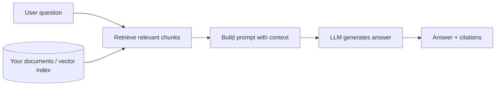

### Mental model

| Step | Plain English | Example |
|------|---------------|---------|
| **Index (offline)** | Cut docs into pieces, embed, store | Contract PDF → 200 chunks in OpenSearch |
| **Retrieve (online)** | Find pieces similar to the question | “MRI copay?” → top 8 contract clauses |
| **Generate** | LLM reads only those pieces + question | “Per section 4.2, copay is $40…” |
| **Validate (optional)** | Check answer matches retrieved text | Citation must exist in chunk set |

### When RAG is enough vs when you need more

| Situation | Typical approach |
|-----------|------------------|
| Simple Q&A over stable docs | **Naive / Advanced RAG** |
| Wrong chunks often retrieved | **Reranking**, **hybrid search**, **better chunking** |
| LLM answers without enough evidence | **Self-RAG**, **Corrective RAG** |
| Multi-step research, tools, actions | **Agentic RAG** |
| Question type varies a lot | **Adaptive RAG** |
| Knowledge is highly connected (entities, relations) | **Graph RAG** |

---

## 2. RAG family overview

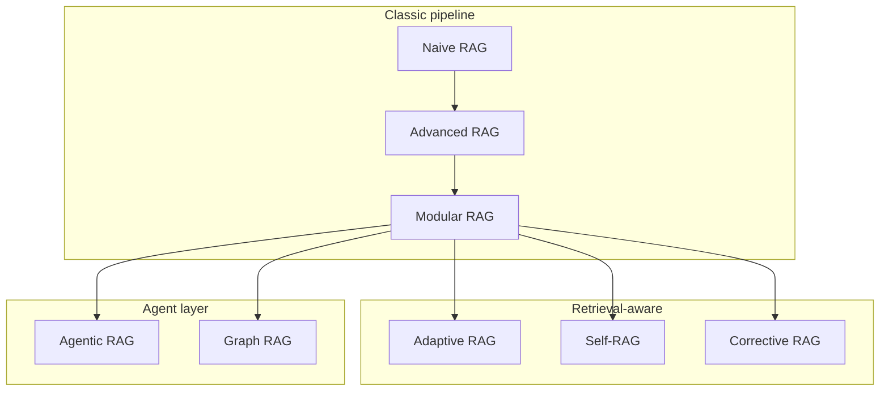

| Type | One-line summary | Complexity |
|------|------------------|------------|
| **Naive RAG** | Retrieve → generate, fixed pipeline | Low |
| **Advanced RAG** | Better pre/post-processing (query rewrite, rerank, filter) | Medium |
| **Modular RAG** | Swap modules (retriever, reranker, generator) per route | Medium |
| **Adaptive RAG** | Route query to different strategies (retrieve or not, which index) | Medium–High |
| **Self-RAG** | Model reflects: need retrieval? are chunks good? is answer grounded? | High |
| **Corrective RAG (CRAG)** | If retrieval is bad, web search or fallback before answering | High |
| **Agentic RAG** | Agent plans: search, tools, multi-hop, memory | High |
| **Graph RAG** | Retrieve from knowledge graph + text | High |

---

## 3. RAG types in detail

### 3.1 Naive RAG (baseline)

**Architecture**

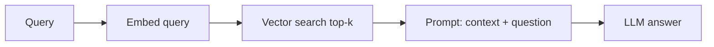

**How it works**

1. User asks a question  
2. Embed the question  
3. Cosine similarity → top **k** chunks (e.g. k=5)  
4. Stuff chunks into prompt → LLM answers  

**Use cases**

- Internal FAQ over clean markdown docs  
- POC / first version  
- Low stakes, small corpus (&lt; 10k chunks)  

**Example**

> **User:** “What is the refund policy?”  
> **System:** Retrieves 5 chunks from `policy.pdf` → LLM summarizes refund window from chunk 3.  

**Limitations**

- Bad chunks → bad answers (garbage in, garbage out)  
- No check if retrieval was useful  
- Single-shot; no query improvement  

---

### 3.2 Advanced RAG

**Architecture**

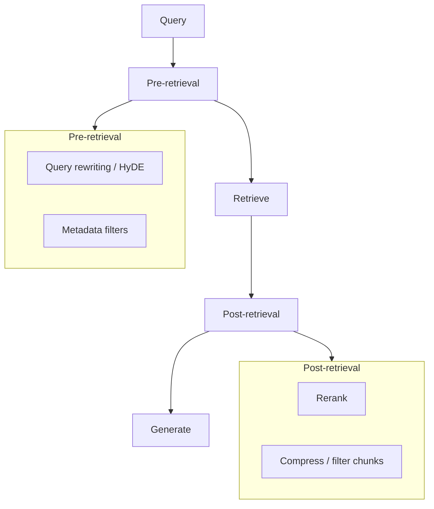

**Improvements over naive**

| Module | Purpose |
|--------|---------|
| **Query rewriting** | Expand or clarify vague questions |
| **HyDE** | LLM writes a hypothetical answer → embed that for search |
| **Metadata filters** | Limit by tenant, date, document type |
| **Hybrid search** | Vector + keyword (BM25) for tables, codes, names |
| **Reranking** | Re-order top 50 → best 5 for the LLM |
| **Context compression** | Remove redundant sentences from chunks |

**Use cases**

- Production Q&A over mixed content (PDFs, HTML, tables)  
- **Healthcare contracts** (procedure codes, dollar amounts need keyword + vector)  
- Multi-tenant SaaS (must filter by `tenant_id`)  

**Example (contract platform)**

> **User:** “Blue Cross specialist copay 2025 addendum”  
> **Pre:** Filter `payer=Blue Cross`, `year=2025`  
> **Retrieve:** Hybrid search → 20 chunks  
> **Post:** Rerank → top 5 → LLM answer with `[chunk_id]` citations  

---

### 3.3 Modular RAG

**Architecture**

Treat RAG as **pluggable components** wired per use case—not one fixed pipeline.

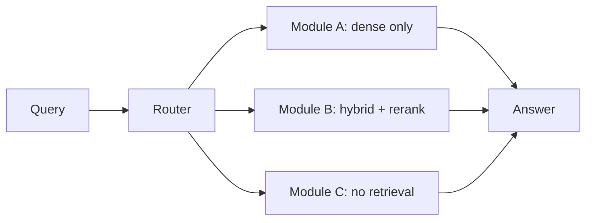

**Modules you might swap**

- Embedder (Hugging Face BGE vs OpenAI)  
- Vector store (OpenSearch vs Pinecone)  
- Splitter (fixed size vs semantic)  
- Generator (fast vs strong model)  

**Use cases**

- One platform serving **FAQ**, **legal contracts**, and **support tickets**—each route uses different modules  
- A/B testing retrieval strategies without rewriting the whole app  

**Example**

> Route `doc_type=contract` → hybrid + rerank + strong LLM  
> Route `doc_type=changelog` → dense only + fast LLM  

---

### 3.4 Adaptive RAG

**Architecture**

A **router** (often a small LLM or classifier) decides **which path** to take per query.

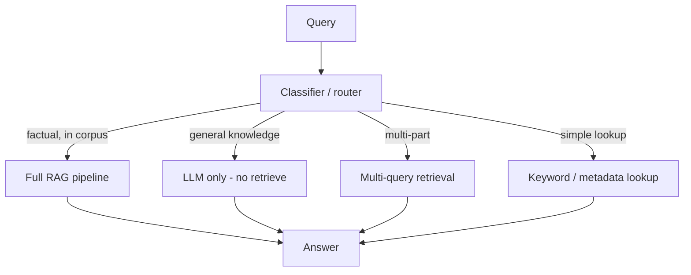

**What adapts**

| Decision | Example |
|----------|---------|
| Retrieve or not? | “Hello” → no RAG; “Clause 4.2 MRI rate?” → RAG |
| Which index/collection? | `contracts` vs `fee_schedules` |
| How many chunks? | Complex question → k=12; simple → k=3 |
| Which retriever? | Table question → hybrid; narrative → dense |

**Use cases**

- Chat product with mixed chit-chat + document Q&A  
- Cost control (skip retrieval when unnecessary)  
- Multiple corpora behind one assistant  

**Example**

> **User:** “Summarize our Q3 roadmap” → router: no index match → “I don’t have Q3 roadmap docs; upload or specify collection.”  
> **User:** “Copay in contract job_42” → router: RAG on `job_42` collection.  

---

### 3.5 Self-RAG

**Architecture**

The system **critiques itself** at multiple points using the LLM (or specialized models).

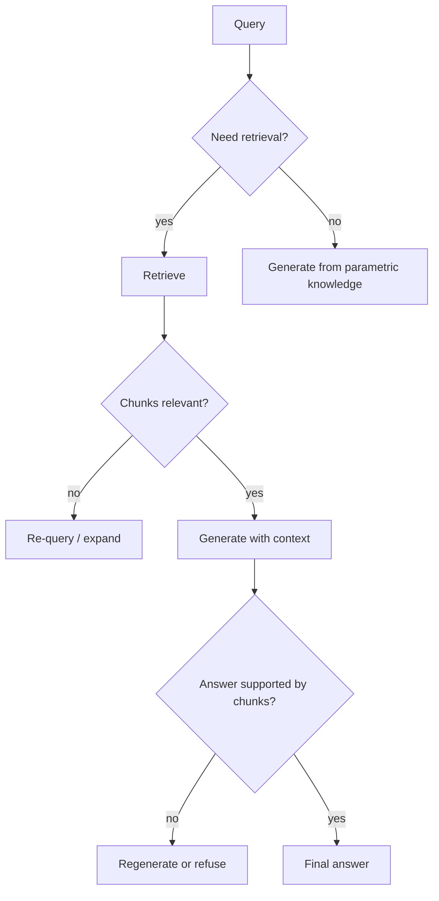

**Reflection tokens / checks (conceptual)**

| Check | Question asked |
|-------|----------------|
| **Retrieve** | Do I need external docs for this? |
| **Relevance** | Is chunk X relevant to the query? |
| **Support** | Is each claim in the answer supported by a chunk? |
| **Utility** | Is the answer useful overall? |

**Use cases**

- High-stakes Q&A (compliance, legal, healthcare)  
- Reduce hallucination when retrieval is weak  
- When you can afford extra LLM calls (latency + cost)  

**Example**

> Retrieves 8 chunks; model marks 3 as irrelevant → uses 5 only → generates answer → **support check fails** on one sentence → removes unsupported claim or responds “insufficient evidence in contract.”  

---

### 3.6 Corrective RAG (CRAG)

**Architecture**

Explicit **quality gate on retrieval**; if bad, **correct** before generating.

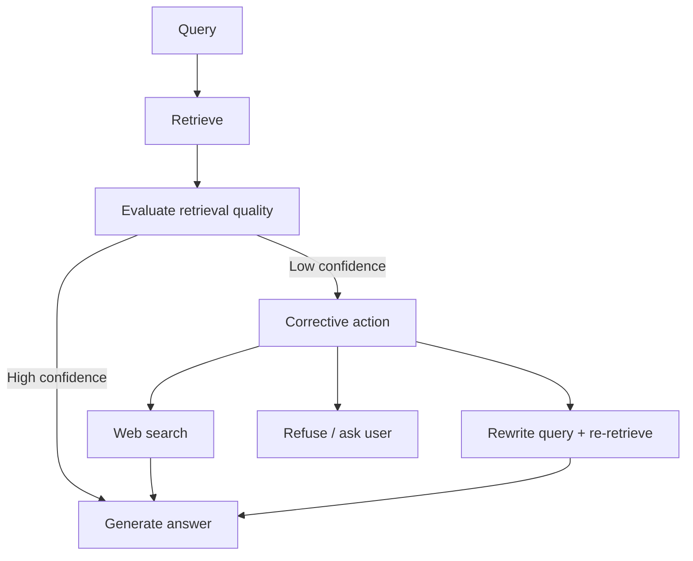

**Corrective actions**

- Re-write query and search again  
- Fall back to **web search** (if allowed)  
- Decompose question into sub-queries  
- Return “cannot answer from knowledge base”  

**Use cases**

- Corpus may be **incomplete** or **stale**  
- Crawled / dynamic knowledge (docs change often)  
- Research assistants  

**Example (web crawler product)**

> User asks about a page not yet crawled → retrieval score low → CRAG triggers **re-crawl suggestion** or **web search** → then answer.  

**Self-RAG vs CRAG (simple distinction)**

| | Self-RAG | CRAG |
|---|----------|------|
| Focus | Model **reflects** on each chunk and claim | **Scores retrieval batch** and **fixes** bad retrieval |
| Fix | Filter chunks, regenerate | External correction (search, re-query) |

---

### 3.7 Agentic RAG

**Architecture**

An **agent** (often LangGraph) **plans** retrieval and can use **tools**—not a single retrieve → generate hop.

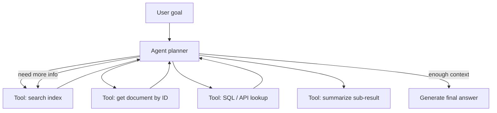

**Capabilities**

- **Multi-hop:** “Compare Plan A vs Plan B deductibles” → retrieve Plan A → retrieve Plan B → synthesize  
- **Tool use:** Vector DB + calculator + CRM API  
- **Memory:** Follow-up questions use prior turns  
- **Human-in-the-loop:** Pause for approval before action (e.g. apply config)  

**Use cases**

- **Contract intelligence:** RAG chat + extract fields + validate + apply to fee schedule  
- Enterprise copilots (Jira + Confluence + code)  
- Complex analytics questions over many documents  

**Example (healthcare contract platform)**

```
User: "Does the 2025 addendum change MRI rates vs base contract?"

Agent plan:
  1. retrieve(collection=base_contract, query="MRI rates")
  2. retrieve(collection=addendum_2025, query="MRI rates")
  3. compare extracted amounts
  4. answer with citations from both docs
  5. (optional) propose config diff for human approval
```

**LangChain vs LangGraph here**

| Layer | Role |
|-------|------|
| **LangChain** | Retriever, embeddings, LCEL chain inside one step |
| **LangGraph** | Stateful graph: plan → retrieve → branch → HITL → apply |

---

### 3.8 Graph RAG

**Architecture**

Build a **knowledge graph** (entities + relationships) alongside text chunks; retrieve **subgraphs** + text.

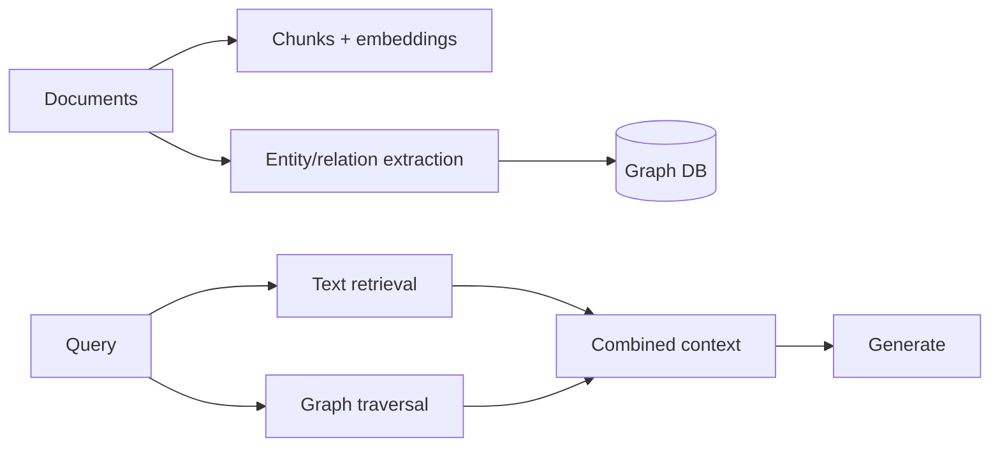

**Use cases**

- “Who reports to whom?” “Which systems depend on X?”  
- Legal: parties, obligations, cross-references between clauses  
- Medical / insurance: payer ↔ plan ↔ procedure relationships  

**Example**

> **User:** “Which addendums reference the same fee schedule ID?”  
> Graph traversal finds nodes linked to `fee_schedule_FS-100` → pull related chunk text → LLM explains.  

**When to skip**

- Mostly flat FAQ docs with little relational structure  
- Team lacks graph maintenance budget  

---

### 3.9 Comparison table

| Type | Best for | Main cost | Main risk |
|------|----------|-----------|-----------|
| Naive | POC, clean docs | Low | Bad retrieval |
| Advanced | Production single-domain Q&A | Medium | Tuning many knobs |
| Modular | Multi-product platform | Medium | Integration complexity |
| Adaptive | Mixed query types | Medium | Router errors |
| Self-RAG | Compliance / grounding | High (LLM calls) | Latency |
| CRAG | Incomplete/stale corpus | High | Uncontrolled web fallback |
| Agentic | Multi-step, tools, actions | High | Agent loops / cost |
| Graph RAG | Relational knowledge | Very high | Graph quality |

---

## 4. Chunking strategies

Chunking = **how you split documents** before embedding. **Bad chunks = bad retrieval**, no matter how good your LLM is.

### 4.1 Why chunking matters

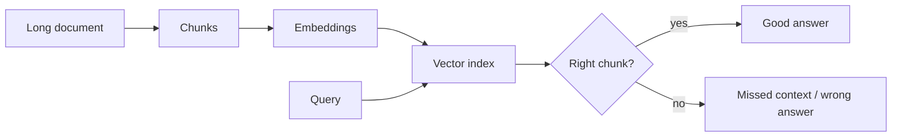

| If chunks are… | What happens |
|----------------|--------------|
| **Too large** | Embedding averages many topics; similarity is vague |
| **Too small** | Sentence lacks context (“It is $40” — $40 for what?) |
| **Split mid-table** | Row/column meaning lost |
| **Split mid-clause** | Legal/contract references break |

---

### 4.2 Fixed-size (character / token) chunking

**How it works**

- Split every **N tokens** (e.g. 512, 1024) with **overlap** (e.g. 10–20%)  
- LangChain: `RecursiveCharacterTextSplitter` (splits on `\n\n`, `\n`, space before hard cut)

**Parameters**

| Parameter | Typical range | Notes |
|-----------|---------------|-------|
| `chunk_size` | 400–1200 tokens | Smaller for precise FAQ; larger for narrative |
| `chunk_overlap` | 50–200 tokens | Preserves sentences at boundaries |

**Use cases**

- General text, web pages, policies  
- **First baseline** for any new corpus  
- Crawled HTML after cleaning (see [crawler-rag-agent-langgraph.md](./crawler-rag-agent-langgraph.md))  

**Example**

```
Contract page 3000 tokens
→ chunk_0: tokens 0–1024
→ chunk_1: tokens 900–1924   (overlap keeps "Section 4" intro in both)
→ chunk_2: tokens 1800–2824
```

**Pros:** Simple, fast, predictable  
**Cons:** Ignores document structure; may break tables/lists  

---

### 4.3 Structure-aware (document-based) chunking

**How it works**

Split on **document structure**, not arbitrary token count:

- Markdown: `#` headers  
- HTML: `<h1>`, `<section>`, `<table>`  
- PDF: pages, detected headings (layout OCR)  
- DOCX: styles (Heading 1, 2)  

**Use cases**

- Technical docs with clear headings  
- **Contracts with sections/clauses** (Section 4 → Imaging Benefits)  
- API documentation  

**Example**

```
# Section 4 — Imaging
## 4.1 MRI
Table: procedure | rate
...

Chunks:
- chunk_A: "Section 4 intro" (full section header + lead paragraph)
- chunk_B: "4.1 MRI" + entire table as one chunk (don't split table)
```

**Pros:** Chunks align with how humans navigate docs  
**Cons:** Needs format-specific parsers; uneven chunk sizes  

---

### 4.4 Semantic chunking

**How it works**

1. Split into sentences or small units  
2. Embed consecutive units  
3. When **similarity drops** between adjacent units → start new chunk  
4. Result: each chunk = one **topic cluster**

**Use cases**

- Long narrative without clear headers (interviews, reports)  
- When fixed-size splits mix unrelated paragraphs  

**Example**

```
Paragraphs about "deductible" stay together;
when text shifts to "prior authorization", new chunk starts.
```

**Pros:** Topic-coherent chunks  
**Cons:** Extra embedding cost at index time; slower ingest  

---

### 4.5 Parent–child (hierarchical) chunking

**How it works**

- **Parent:** large chunk (e.g. full section) — stored, not always retrieved  
- **Child:** small chunks (paragraphs) — used for **precise retrieval**  
- On hit: retrieve **child** for match, pass **parent** (or child + parent) to LLM for context  

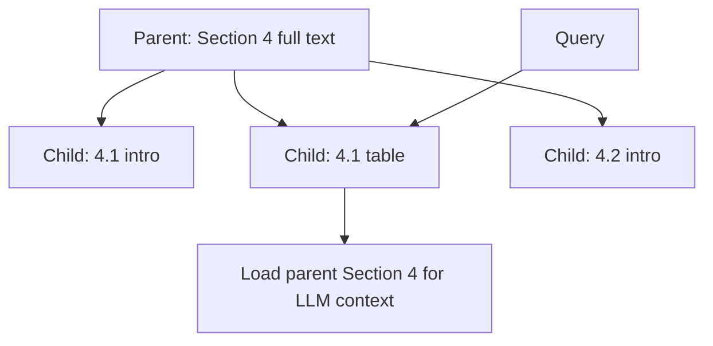

**Use cases**

- Legal/contracts: match small clause, show full section to LLM  
- Long PDFs where child finds needle, parent gives haystack context  

**Example**

> Query matches child “MRI copay $40” → LLM receives **full Section 4** so it sees exceptions in 4.3.  

---

### 4.6 Agentic / LLM-guided chunking

**How it works**

LLM (or layout model) proposes chunk boundaries:

- “This table is one unit”  
- “Split before each numbered clause”  

**Use cases**

- Messy PDFs, scanned contracts (post-OCR)  
- Heterogeneous corpora where rules differ per doc type  

**Cons:** Costly, slower; needs validation  

---

### 4.7 Special cases

| Content type | Strategy | Why |
|--------------|----------|-----|
| **Tables** | Keep table as one chunk (or row-groups) | Row meaning lost if split |
| **Code** | Split by function/class | Syntax must stay intact |
| **FAQ** | One Q+A pair = one chunk | Natural atomic unit |
| **Chat logs** | Split by session or topic turn | Avoid mixing conversations |
| **Slides** | One slide = one chunk | Title + bullets belong together |

---

### 4.8 Chunk metadata (always store)

Rich metadata improves **filtering** and **citations**:

```json
{
  "chunk_id": "chk_8f3a2b",
  "document_id": "contract_2025_bcbs",
  "tenant_id": "clinic_42",
  "page": 12,
  "section": "4.1 MRI",
  "source_url": "s3://.../contract.pdf",
  "document_type": "payer_contract",
  "effective_from": "2025-01-01"
}
```

**Use cases for metadata**

| Filter | Example |
|--------|---------|
| `tenant_id` | Multi-tenant SaaS — **mandatory** |
| `effective_from` | “Which rate applied in March?” |
| `document_type` | Route to contract vs policy index |

---

### 4.9 Chunking decision guide

| Your corpus | Start with | Consider next |
|-------------|------------|---------------|
| Clean markdown / HTML docs | Structure-aware + 512–1024 overlap | Parent–child |
| OCR PDF contracts | Layout-aware + **don’t split tables** | Semantic or LLM-guided |
| FAQ | One Q+A per chunk | — |
| Web crawl | Clean HTML → recursive 512–1024 | Hybrid search + rerank |
| Codebase | AST / function chunks | Graph RAG for deps |

---

## 5. BM25 and hybrid search

### 5.1 What is BM25?

**BM25** (Best Matching 25) is a **keyword search** algorithm—the classic “search engine” approach. It scores documents by **how well the exact words in your query match the words in a document**.

It is **not** an embedding model and **not** semantic. It does not understand that “copay” and “co-payment” mean the same thing unless both words appear in the text.

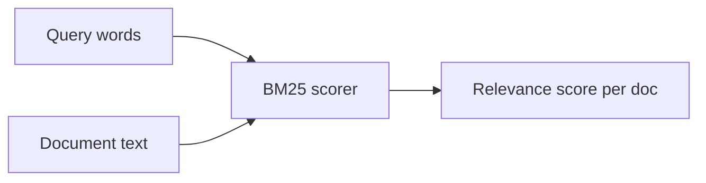

**Plain English:** BM25 asks: *“How many query words appear in this chunk, how rare are those words, and how long is the chunk?”*

---

### 5.2 How BM25 scoring works (intuition)

BM25 increases score when:

| Factor | Meaning | Example |
|--------|---------|---------|
| **Term frequency (TF)** | Query word appears in the chunk | “MRI” appears 3 times → higher score |
| **Inverse document frequency (IDF)** | Rare words matter more | “CPT 70553” is rare → strong signal; “the” is ignored |
| **Document length normalization** | Penalize very long chunks | A tiny mention of “copay” in a 10-page chunk scores lower than a focused paragraph |

So BM25 is good at **exact and rare tokens**: codes, IDs, product names, dollar amounts, payer names.

---

### 5.3 BM25 vs vector search

| | **BM25 (keyword)** | **Vector (semantic)** |
|---|-------------------|----------------------|
| **Matches on** | Exact / stemmed words | Meaning similarity |
| **Strong at** | “CPT 70553”, “UHCGUS”, “$40.00”, “Section 4.2” | “What do I pay for imaging?” |
| **Weak at** | Synonyms, paraphrases | Rare exact codes if not in training |
| **Speed** | Very fast on inverted index | Fast ANN on vector index |
| **Typical engine** | OpenSearch, Elasticsearch | OpenSearch k-NN, Pinecone, etc. |

**Example**

| Query | BM25 | Vector |
|-------|------|--------|
| “CPT 70553 rate” | Finds chunk with exact code | May return generic “imaging rates” chunk |
| “patient cost for brain scan” | May miss if doc only says “MRI” | Likely finds MRI/imaging section |
| “Blue Cross addendum 2025” | Strong if those words appear | Good if semantically similar text exists |

**Takeaway:** Use **both** in production RAG when documents have **tables, codes, and proper nouns** (contracts, healthcare, legal).

---

### 5.4 Hybrid search = BM25 + vectors

**Hybrid search** runs **keyword (BM25)** and **vector** retrieval, then **merges** results.

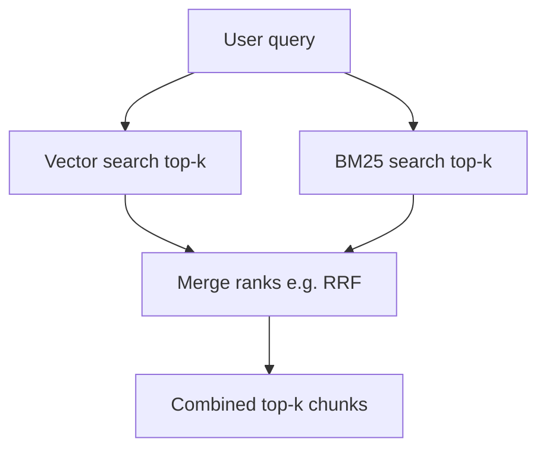

**RRF (Reciprocal Rank Fusion)** — common merge method:

- Does not need scores to be on the same scale  
- Document ranked #1 in BM25 and #3 in vector gets a strong combined rank  
- Simple and works well in practice  

**Typical pipeline**

```
Query → hybrid retrieve top 50 (BM25 + vector)
      → rerank top 50 → 5
      → LLM
```

---

### 5.5 When to use BM25 / hybrid

| Use BM25 or hybrid when… | Vector alone may be enough when… |
|--------------------------|----------------------------------|
| Procedure/billing codes (CPT, ICD) | Pure narrative FAQ |
| Payer IDs, plan names, SKU, ticket IDs | Small, clean markdown docs |
| Dollar amounts and table lookups | Questions closely match doc wording |
| Legal clause numbers (“Section 4.2”) | POC with low precision requirements |
| OpenSearch / Elasticsearch already in stack | — |

**Your contract RAG use case:** hybrid is recommended—contracts mix **semantic questions** (“specialist copay”) with **exact tokens** (“Blue Cross”, “2025”, “$50”, procedure codes).

---

### 5.6 Where BM25 lives in your stack

| Component | Role |
|-----------|------|
| **OpenSearch / Elasticsearch** | Stores text + BM25 inverted index + optional vector field |
| **Ingest** | Same chunks indexed for **both** embedding and full-text |
| **Query** | `multi_match` / BM25 + `knn` in one request (or two queries + RRF in app code) |
| **Tenant filter** | Apply `tenant_id` **before** BM25 and vector (mandatory for SaaS) |

---

## 6. Reranking

### 6.1 What reranking is (plain English)

**Vector search** is fast but **approximate**—it returns “kind of similar” chunks, not always the **best order**.

**Reranking** = second step that **scores query + each chunk more accurately** and re-orders results.

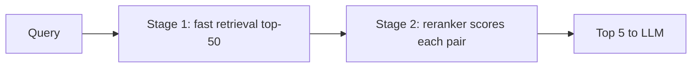

**Analogy**

- **Stage 1 (bi-encoder / vector):** Quick library search by title  
- **Stage 2 (cross-encoder / reranker):** Librarian reads the top 50 abstracts and picks the best 5 for you  

---

### 6.2 Why you need reranking

| Problem | Without rerank | With rerank |
|---------|----------------|-------------|
| Query has rare keyword (“CPT 70553”) | Vector misses; BM25 helps but order still noisy | Reranker boosts exact-match chunk |
| Many chunks mention “copay” | Wrong plan’s copay in top-5 | Reranker prefers chunk matching payer + year |
| Long chunks, weak signal | Similarity score flat | Cross-encoder finds precise paragraph |

**Rule of thumb**

- **Skip rerank:** POC, &lt;5k chunks, latency-critical, simple FAQ  
- **Use rerank:** Production, tables/codes, legal/healthcare, when recall@5 on eval set is low  

---

### 6.3 Reranking approaches

| Approach | How it works | Speed | Quality |
|----------|--------------|-------|---------|
| **Cross-encoder** | One model inputs `[query, chunk]` together → relevance score | Slower | High |
| **Cohere Rerank API** | Managed rerank service | Medium | High |
| **LLM rerank** | “Rate relevance 1–10” per chunk | Slow, costly | Flexible |
| **Score fusion (RRF)** | Merge vector + BM25 ranks (not true rerank, but related) | Fast | Medium |
| **Metadata boost** | Boost recent docs, matching tenant | Fast | Domain-specific |

**Typical pipeline**

```
Retrieve top 50 (hybrid: vector + BM25)
→ Rerank to top 5 (cross-encoder)
→ Build LLM context from top 5
```

---

### 6.4 Reranking use cases

| Use case | Stage 1 | Stage 2 rerank |
|----------|---------|----------------|
| **Contract Q&A** | Hybrid (vector + keyword for codes/amounts) | Cross-encoder on top 30 |
| **Support tickets | Dense k=20 | Cohere rerank → k=5 |
| **Web crawl RAG** | Dense k=8 (fast) | Optional rerank for “quality mode” |
| **Multi-tenant clinic docs** | Filter `tenant_id` → k=50 | Rerank → k=8 |

**Example (contract question)**

> **Query:** “Specialist visit copay under 2025 Blue Cross addendum”  
> **Stage 1:** 50 chunks mention “copay” or “Blue Cross”  
> **Stage 2:** Reranker puts addendum §2.1 specialist table at **rank 1**  
> **LLM:** Answers with correct $50 and cites that chunk  

---

### 6.5 Reranking costs and trade-offs

| Factor | Impact |
|--------|--------|
| **Latency** | +100–500ms for 20–50 chunks (model dependent) |
| **Cost** | API rerank per chunk pair or GPU for self-hosted |
| **Batch size** | Rerank 50 not 500 — cap stage-1 retrieval |
| **Caching** | Cache rerank scores for repeated queries (optional) |

**When reranking hurts**

- Stage-1 already returns perfect top-3 on eval set  
- Sub-100ms response required and quality is “good enough”  

---

### 6.6 Reranking vs other “quality” techniques

| Technique | What it fixes |
|-----------|---------------|
| **Better chunking** | Wrong pieces exist in index |
| **Hybrid search** | Keyword/code not in embedding top-k |
| **Query rewriting** | Query wording doesn’t match doc wording |
| **Reranking** | Right chunks in top-50 but **wrong order** |
| **Self-RAG / citation check** | LLM ignores or misuses good chunks |

Use **multiple layers** in production—not only rerank.

---

## 7. How to choose (decision guide)

### 7.1 Pick your RAG type

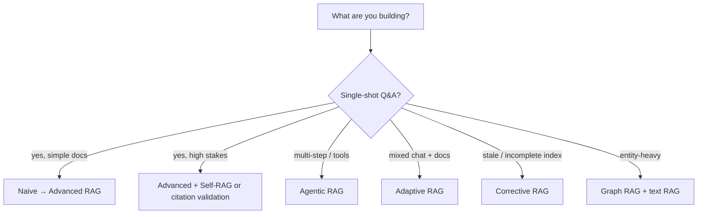

### 7.2 Pick chunking + rerank

| Signal | Action |
|--------|--------|
| Answers miss obvious section | Structure-aware or parent–child |
| Tables/codes wrong | Don’t split tables; hybrid search |
| Right doc, wrong paragraph | Smaller chunks + rerank |
| Answers lack surrounding context | Parent–child or larger overlap |
| Slow ingest OK, quality critical | Semantic chunking |

### 7.3 Minimal production stack (recommended starting point)

For **contract / enterprise doc Q&A** (aligned with your platform):

1. **Advanced RAG** (not naive)  
2. **Structure-aware chunking** + no table splits  
3. **Hybrid search** (OpenSearch vector + keyword)  
4. **Rerank** top 30 → 5  
5. **Citation validation** (deterministic check)  
6. **Agentic RAG (LangGraph)** only for ingest/apply workflows—not for every chat message  

---

## 8. Mapping to your projects

| Concept | Healthcare contract platform | Web crawler product |
|---------|------------------------------|---------------------|
| RAG type | Advanced + Agentic (chat vs ingest) | Advanced + Adaptive + CRAG (stale crawl) |
| Chunking | Layout-aware PDF; section + table rules | HTML clean → recursive 512–1024 |
| Retrieval | OpenSearch hybrid; tenant filter | pgvector/OpenSearch; `job_id` scope |
| Rerank | Production Q&A mode | Optional “quality mode” |
| Orchestration | LangGraph for ingest/HITL | LangGraph `rag_qa_graph` |
| Embeddings | Hugging Face (e.g. BGE) | Same pattern |

**Further reading**

- Implementation: [crawler-rag-agent-langgraph.md](./crawler-rag-agent-langgraph.md)  
- Evaluation metrics: RAGAS (faithfulness, context relevance)  
- LangChain: retrievers, splitters, `ContextualCompressionRetriever`  
- LangGraph: stateful RAG with HITL interrupts  

---

*Document version: 1.0 — RAG types, chunking, reranking; aligned with agents/docs platform.*
