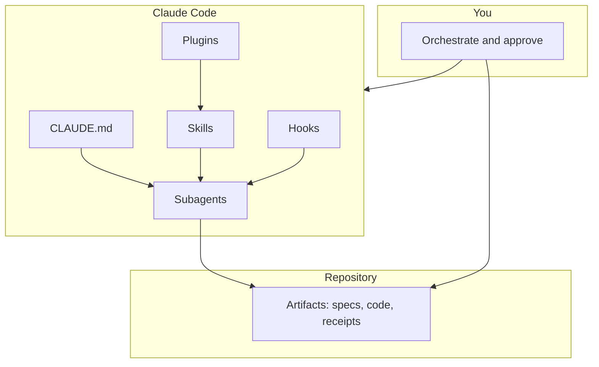
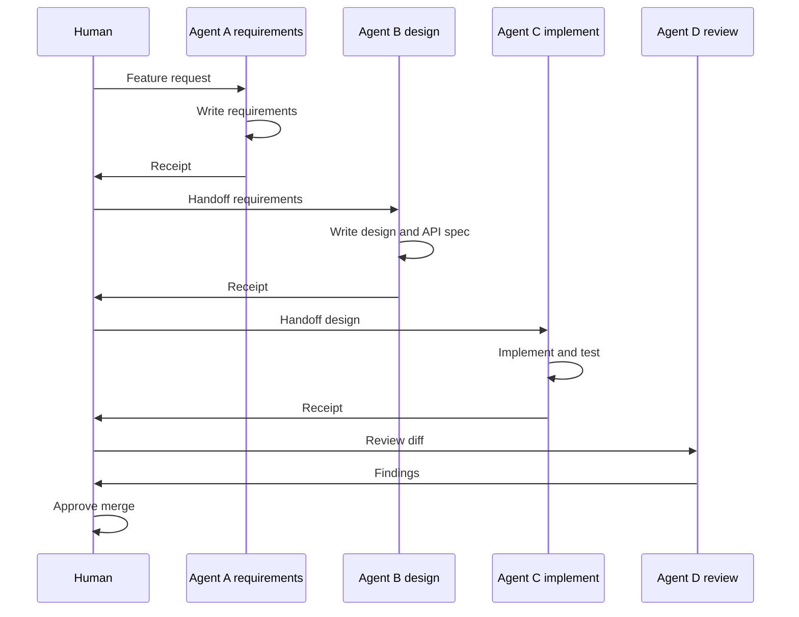

# Claude Code — Agent Design Best Practices

A vendor-neutral guide to designing **subagents**, **skills**, **plugins**, and **workflows** in **Claude Code** so AI-assisted delivery is repeatable, safe, and team-scalable.

**See also:** [How to create a Claude Code plugin](./claude-plugin-guide.md) (step-by-step) · [RAG.md](./RAG.md) — retrieval patterns when your product includes document Q&A agents.

---

## Table of contents

1. [Mindset: orchestration over typing](#1-mindset-orchestration-over-typing)
2. [Claude Code building blocks](#2-claude-code-building-blocks)
3. [Best practices: designing a subagent](#3-best-practices-designing-a-subagent)
4. [Best practices: agents co-working](#4-best-practices-agents-co-working)
5. [Best practices: skills](#5-best-practices-skills)
6. [Best practices: plugins and hooks](#6-best-practices-plugins-and-hooks)
7. [Context engineering](#7-context-engineering)
8. [Workflow design](#8-workflow-design)
9. [End-to-end example](#9-end-to-end-example)
10. [Debugging and observability](#10-debugging-and-observability)
11. [Anti-patterns](#11-anti-patterns)
12. [Quick reference](#12-quick-reference)

---

## 1. Mindset: orchestration over typing

Modern agentic engineering shifts effort from **writing every line** to **designing systems AI can execute**:

| Old focus | New focus |
|-----------|-----------|
| Individual coding speed | **Workflow and context design** |
| One general prompt | **Specialist subagents** with boundaries |
| Chat history as memory | **Repo artifacts** as source of truth |
| Hope the model is right | **Verify + human gates** on critical paths |

**Principle:** Subagents feel like a small engineering team only when **roles, handoffs, and quality gates** are explicit—not when one session does everything.

---

## 2. Claude Code building blocks



| Building block | What it is | When to use |
|----------------|------------|-------------|
| **CLAUDE.md** | Project instructions loaded every session | Stack, commands, conventions, safety rules |
| **Subagent** | Specialist role (architect, implementer, reviewer) | Multi-phase work with clear accountability |
| **Skill** | Reusable playbook invoked as `/skill-name` | Repeatable procedures (scaffold, preflight, review) |
| **Plugin** | Packaged agents + skills + hooks + commands | Share setup across repos and teammates |
| **Hook** | Script on lifecycle events (session start, before tool) | Automatic policy enforcement |
| **Command** | Short slash command mapping to a procedure | Frequent user-triggered workflows |

**Design order (recommended):**

1. `CLAUDE.md` (context)
2. Skills for repetitive tasks
3. Subagents for role boundaries
4. Hooks for non-negotiable rules
5. Plugins when you need portability

---

## 3. Best practices: designing a subagent

### 3.1 One agent, one accountability

Each subagent owns **one primary outcome**. Avoid “super agents” that design, code, deploy, and review—boundaries blur and quality drops.

| Good | Bad |
|------|-----|
| Architect agent → design docs only | One agent “builds the whole feature” |
| Implementer agent → code + tests | Reviewer agent that also rewrites code |
| Reviewer agent → findings only | PM agent that silently changes API contracts |

### 3.2 The seven-block agent spec

Document every subagent with these blocks before writing prompts:

| # | Block | Define |
|---|-------|--------|
| 1 | **Identity** | Role name and one-sentence mission |
| 2 | **Scope IN** | What this agent is responsible for |
| 3 | **Scope OUT** | What it must never do (critical) |
| 4 | **Inputs** | Files/docs it must read before acting |
| 5 | **Outputs** | Concrete artifacts it must produce |
| 6 | **Tools** | Minimum `allowed-tools` for the role |
| 7 | **Phases** | Ordered steps from start to receipt |

**Example — Solution architect (generic)**

| Block | Content |
|-------|---------|
| Identity | Solution architect for system design |
| Scope IN | API contracts, data models, ADRs, non-functional requirements |
| Scope OUT | Production implementation code, merging PRs |
| Inputs | Requirements doc, existing architecture overview |
| Outputs | `docs/design/`, OpenAPI, ADR markdown files |
| Tools | Read, Grep, Glob, Write |
| Phases | Discover → design → API → data model → handoff |

### 3.3 Subagent file pattern

Claude Code subagents typically use two layers:

**Entry file** (short) — name, description, pointer to full instructions:

```markdown
---
name: code-reviewer
description: Reviews diffs for correctness, security, and style. Use before merge.
---

Read the project CLAUDE.md, then follow the full playbook in your agent instructions.
```

**Playbook** (long) — phases, boundaries, verification, examples.

Keep the entry file **discoverable**; keep the playbook **executable** (numbered steps, not philosophy).

### 3.4 Boundary rules (copy into every agent)

Use explicit rule types:

| Rule type | Purpose | Example |
|-----------|---------|---------|
| **SOLE AUTHORITY** | Only this role may change X | Architect owns ADRs |
| **NEVER** | Hard prohibitions | Reviewer never pushes to main |
| **MUST READ** | Required inputs before work | Implementer must read OpenAPI first |
| **MUST VERIFY** | Proof before “done” | Run test suite before receipt |
| **ESCALATE** | When to stop and ask human | Ambiguous requirement → product owner |

### 3.5 Tool access: minimum necessary

Restrict tools per role in skill/agent frontmatter:

```yaml
allowed-tools: Read, Grep, Glob, Write
```

| Role | Typical tools | Avoid |
|------|---------------|-------|
| Architect / PM | Read, Grep, Glob, Write | Bash (unless generating diagrams via script) |
| Implementer | Read, Write, Edit, Grep, Glob, Bash | Unrestricted network |
| Reviewer | Read, Grep, Glob | Write (review-only) |
| Checklist skill | Read, Grep, Glob, Bash | Creative rewriting (`disable-model-invocation: true`) |

**Why:** Least privilege reduces destructive commands, scope creep, and accidental production changes.

### 3.6 Risk tiers

Tag agents by blast radius and add matching controls:

| Tier | Examples | Controls |
|------|----------|----------|
| **Low** | Docs, research spike | Read-mostly |
| **Medium** | Architecture, IaC design | Human review before merge |
| **High** | App code, security, data migration | Preflight skill + reviewer + human approve |

### 3.7 Description field matters

Claude uses the `description` in frontmatter for **routing** (“when should this agent run?”).

**Good descriptions:**

- Say **when** to invoke: “Use when defining API contracts before implementation.”
- Say **outcome**: “Produces OpenAPI and ADR markdown.”

**Weak descriptions:**

- “Helpful coding assistant”
- “General purpose agent”

---

## 4. Best practices: agents co-working

### 4.1 How co-work actually works

Subagents do **not** automatically share one continuous conversation. Co-work happens through:

1. **Artifacts in git** (requirements → design → code → review notes)
2. **Human or scripted orchestration** (you invoke the next role)
3. **Receipts** (structured summary of what was done)
4. **Frozen contracts** (OpenAPI, schema) before parallel work



### 4.2 Standard handoff chain (software delivery)

| Order | Role | Delivers | Next role consumes |
|-------|------|----------|-------------------|
| 1 | Requirements | User stories, acceptance criteria | Architect |
| 2 | Architect | Design, API spec, data model | Implementer |
| 3 | Implementer | Code, tests | QA / Reviewer |
| 4 | QA | Test plan, results | Reviewer |
| 5 | Reviewer | Risk findings | Human |
| 6 | Platform / DevOps | CI/CD, deploy config | Human (prod gate) |

Adapt roles to team size—a solo developer can still use **phases** inside one session, but **artifacts between phases** remain mandatory.

### 4.3 Three ways to orchestrate in Claude Code

| Method | How | Best for |
|--------|-----|----------|
| **A. Manual subagent chain** | Invoke subagent per phase; wait for artifacts | Learning, contests, high-stakes work |
| **B. Skills inside one session** | `/scaffold-endpoint`, `/preflight`, `/review` | Tactical repetition within a role |
| **C. External workflow engine** | LangGraph / CI dispatches Claude with fixed prompts | Long-running, resumable, multi-day flows |

**Rule:** Skills = **procedures**. Subagents = **roles**. Do not confuse the two.

### 4.4 Receipt template (required for every handoff)

End every agent run with a receipt—not “I'm done” in chat:

```markdown
## Agent receipt

**Role:** solution-architect
**Task:** Design notifications API
**Status:** complete | blocked | partial

### Artifacts
- docs/design/notifications.md
- api/notifications.openapi.yaml

### Decisions / open questions
- ADR-003: use queue vs webhook for delivery

### Verification
- [ ] OpenAPI validates
- [ ] Human reviewed design

### Next step
Implementer: build from paths above
```

### 4.5 Parallel work rules

| Safe parallel | Requirement |
|---------------|-------------|
| Security review + API design | Different files; no overlapping edits |
| Frontend + backend | **Frozen** API contract first |
| Docs + implementation | Docs follow merged interface |

| Unsafe parallel |
|-----------------|
| Two implementers on same module without contract |
| Architect and implementer both changing API spec |

### 4.6 Human-in-the-loop gates

Place human approval where mistakes are expensive:

| Gate | Typical trigger |
|------|-----------------|
| Design approved | Before implementation starts |
| PR approved | Before merge to main |
| Production deploy | Before release |
| Regulated data / payments | Before any auto-apply to database |

---

## 5. Best practices: skills

### 5.1 Skill vs subagent

| | **Skill** | **Subagent** |
|---|-----------|--------------|
| Scope | Single procedure | Full role across phases |
| Invoke | `/skill-name` | Subagent picker or @ mention |
| Duration | Minutes | Hours or days |
| Output | Small change or checklist | Major artifacts |

### 5.2 Where skills live

Project skills: `.claude/skills/{skill-name}/SKILL.md`

Plugin skills: bundled inside plugin package.

### 5.3 Skill frontmatter

```yaml
---
name: preflight-pr
description: Run before opening a PR. Checks tests, migrations, and security basics.
allowed-tools: Read, Grep, Glob, Bash
argument-hint: optional branch or module name
disable-model-invocation: true
---
```

| Field | Best practice |
|-------|---------------|
| `name` | kebab-case, verb-first: `create-pr`, `review-module` |
| `description` | When to use + what it checks/produces |
| `allowed-tools` | Minimum needed |
| `disable-model-invocation` | Use for pure checklists/gates |
| `argument-hint` | Document expected args |

### 5.4 Skill body structure

1. **Purpose** — one paragraph  
2. **When to use / when not to**  
3. **Numbered steps** — each step names files or commands  
4. **Checklist** — checkboxes the agent must mark  
5. **Stop conditions** — when to abort and escalate  
6. **Verify** — exact commands to prove success  

**Example step (good):**

```markdown
## Step 3: Verify tests

Run the project test command from CLAUDE.md.
If any test fails, stop and report failures—do not open a PR.
```

**Example step (bad):**

```markdown
## Step 3: Make sure tests pass
```

### 5.5 Skills every team should consider

| Skill | Purpose |
|-------|---------|
| `understand-module` | Map a module before editing |
| `scaffold-feature` | Create boilerplate from team template |
| `preflight-pr` | Gate before PR |
| `create-pr` | Preflight + PR description template |
| `review-pr` | Structured review checklist |
| `run-migrations-safe` | DB change discipline |

Name skills for **outcomes**, not tools.

### 5.6 Skill design rules

| Rule | Why |
|------|-----|
| Steps reference **real paths** in your repo | Removes guesswork |
| Include **verify commands** | “Done” means proven |
| **Idempotent** where possible | Safe to re-run |
| **Narrow scope** | One skill = one job |
| Gates use **disable-model-invocation** | Checklist stays deterministic |

---

## 6. Best practices: plugins and hooks

### 6.1 Plugins

A **plugin** packages:

- Subagent definitions  
- Skills  
- Hooks  
- Commands  

**Use plugins when:** the same setup must work across **multiple repos** or **team members**. See [claude-plugin-guide.md](./claude-plugin-guide.md) for step-by-step creation, install, and testing.

### 6.2 Hooks

**Hooks** run shell commands on Claude lifecycle events.

Common events:

| Event | Use case |
|-------|----------|
| **SessionStart** | Show git branch, remind CLAUDE.md rules |
| **PreToolUse** | Block `rm -rf`, prod deploy commands |
| **PostToolUse** | Format files, log edits |
| **Stop** | Remind to write receipt |

Example `hooks/hooks.json`:

```json
{
  "hooks": {
    "SessionStart": [
      {
        "matcher": "startup",
        "hooks": [
          {
            "type": "command",
            "command": "bash .claude/hooks/session-start.sh",
            "timeout": 10
          }
        ]
      }
    ]
  }
}
```

### 6.3 Hooks vs skills

| Hooks | Skills |
|-------|--------|
| Automatic | User-invoked |
| Policy enforcement | Guided work |
| Silent | Visible steps |
| Every session | On demand |

**Best practice:** Put **must-never-violate** rules in hooks; put **how-to** guidance in skills.

---

## 7. Context engineering

Context quality beats model size. Design **layers** instead of one giant prompt.

### 7.1 Context layers

| Layer | Typical source | Content |
|-------|----------------|---------|
| **L0 — Always on** | `CLAUDE.md` | Commands, layout, conventions, skill index |
| **L1 — Project map** | `docs/architecture/overview.md` | System diagram, module boundaries |
| **L2 — Domain packs** | Focused markdown files | Auth, data model, security rules |
| **L3 — Task inputs** | Spec, ticket, design for this task | Scope of current work |
| **L4 — On demand** | Grep + Read | Only files needed for current step |

**Best practice:** Agents load L0–L2 at start; L3 per task; L4 progressively—never read the entire repo.

### 7.2 CLAUDE.md best practices

Include:

- How to build, test, lint (copy-paste commands)  
- Directory layout in plain language  
- List of project skills and when to use them  
- Security rules (secrets, PII, prod)  
- What **not** to do without human approval  

Keep under ~200 lines; link to deeper docs.

### 7.3 Context anti-patterns

| Anti-pattern | Fix |
|--------------|-----|
| Pasting entire files into every prompt | Point to paths; Read on demand |
| No project map | Add architecture overview |
| Stale CLAUDE.md | Update when commands or layout change |
| One 50-page mega-prompt | Split into L2 domain packs |

---

## 8. Workflow design

### 8.1 Workflow checklist (before building agents)

| Question | Your answer |
|----------|-------------|
| What **triggers** the workflow? | Ticket, chat, cron, PR |
| What are the **phases**? | Req → design → build → test → review |
| What **artifact** unlocks the next phase? | Approved spec, frozen API |
| Where is **human approval**? | After design, before prod |
| What **proves done**? | Tests green, receipt filed |
| What happens on **failure**? | Retry implementer, escalate human |

### 8.2 Spec-driven loop (recommended)

Store truth in the repo, not in chat:

```text
docs/specs/{feature-id}/
  requirements.md
  design.md
  tasks.md
```

Each agent **reads** the previous file and **writes** the next. Chat is coordination; **files are the contract**.

### 8.3 Tool-first agent design

LLM **plans and explains**; **tools execute**:

| Tool type | Examples |
|-----------|----------|
| Read-only | search repo, read spec, run tests |
| Write | edit files, create scaffold |
| External | API call, DB query, vector search |
| Human | approve, clarify requirement |

**Never** let the model invent API responses, test results, or retrieval content—tools return ground truth.

---

## 9. End-to-end example

**Feature:** Add “export report to CSV” to an existing web app.

### Step 1 — Requirements agent

**Prompt:** Define user stories and acceptance criteria for CSV export; write to `docs/specs/export-csv/requirements.md`.

**Output:** requirements file + receipt.

### Step 2 — Architect agent

**Prompt:** Design API and UI flow from requirements; no implementation.

**Output:** `design.md`, OpenAPI snippet + receipt.

### Step 3 — Implementer agent

**Prompt:** Implement per design; run tests; stop if tests fail.

**Output:** code + tests + receipt.

### Step 4 — Skills

```
/preflight-pr
/create-pr
```

### Step 5 — Reviewer agent

**Prompt:** Review diff against requirements and design; findings only.

**Output:** review notes + receipt → human merges.

This demonstrates **orchestration**: you designed the pipeline; agents executed within boundaries.

---

## 10. Debugging and observability

### 10.1 Common failure modes

| Symptom | Likely cause | Fix |
|---------|--------------|-----|
| Wrong files changed | Vague skill steps | Pin paths; add MUST READ |
| Ignored conventions | Missing CLAUDE.md | Document and enforce via preflight |
| “Done” but tests fail | No MUST VERIFY | Add test command to skill |
| Hallucinated APIs | Skipped design artifact | Gate: implementer reads OpenAPI first |
| Agents overlap | Weak Scope OUT | Strengthen NEVER rules |
| Context overflow | Too much loaded at once | Layer context; grep first |

### 10.2 Debug playbook

1. Read the **receipt** — what did the agent claim?  
2. Run **`git diff`** — does it match the receipt?  
3. Run **verify commands** independently  
4. **Replay one phase** with smaller scope  
5. **Edit the skill/playbook** — add the missing step  
6. Add **hook or preflight** to prevent recurrence  

### 10.3 Observability

| Signal | Purpose |
|--------|---------|
| Receipts per run | Audit and handoffs |
| Session transcript | Which tools were called |
| Test / CI results | Objective done criteria |
| PR description | Human-readable summary |

---

## 11. Anti-patterns

| Anti-pattern | Why it fails | Better approach |
|--------------|--------------|-----------------|
| One mega-agent for everything | Boundary drift, unsafe edits | Specialist subagents |
| Chat as source of truth | Context lost next session | Spec files in repo |
| No verification step | False “done” | MUST VERIFY in every implementer skill |
| Unrestricted Bash for all roles | Destructive accidents | Least-privilege tools |
| Skills that are vague essays | Inconsistent execution | Numbered steps + commands |
| Skipping human gates on prod/regulated data | Compliance and outage risk | HITL at design and deploy |
| More model, less context | Expensive hallucination | Invest in CLAUDE.md and skills |

---

## 12. Quick reference

```
YOU
 ├── CLAUDE.md           always-on context
 ├── Subagents           roles + boundaries + phases
 ├── Skills              /repeatable procedures
 ├── Plugins + hooks     team standards + enforcement
 │
 ├── Phase 1 → requirements.md
 ├── Phase 2 → design.md
 ├── Phase 3 → code + tests
 ├── /preflight          quality gate
 ├── Phase 4 → review
 └── receipt             handoff + audit
```

**Core best practices (summary):**

1. **One agent, one accountability**  
2. **Artifacts over chat** for handoffs  
3. **Minimum tools** per role  
4. **Skills for repetition**, subagents for roles  
5. **Receipts + verification** before “done”  
6. **Human gates** on high-impact changes  
7. **Context layers** in CLAUDE.md and focused docs  
8. **Tool-first** — model plans, tools execute  

Clear instructions and reusable skills outperform a larger model with messy prompts.

---

*Document version: 2.0 — Generic Claude Code agent design best practices (no project-specific references).*
