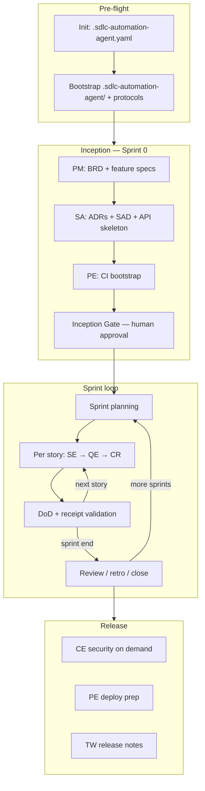
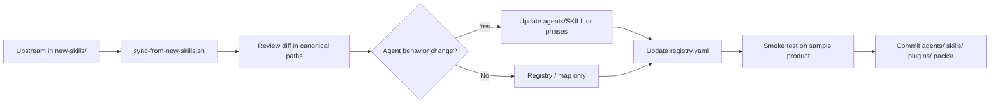

# Claude Code Agent — SDLC Automation Plan

> **Status:** Draft for team debate  
> **Audience:** Engineering leads, agent maintainers, product teams adopting this repo  
> **Scope:** How to structure projects, run workflows, and maintain skills so this repository automates software delivery end-to-end.

**Related docs**

- [README.md](../README.md) — setup and quick start
- [spec-driven-sdlc-flow.md](./spec-driven-sdlc-flow.md) — spec folders and Scrum integration
- [sdlc-agent-automation.md](./sdlc-agent-automation.md) — external control plane (Cursor SDK, LangGraph)
- [plugins/README.md](../plugins/README.md) — stack plugin catalog
- [reference-sources.md](../skills/_shared/protocols/reference-sources.md) — never load `new-skills/` at runtime

---

## Executive summary

This repository is a **Claude Code plugin** plus a **skills library** that turns ad-hoc AI coding into a **structured SDLC**: requirements → architecture → implementation → testing → review → deployment.

Automation works when three things are true:

1. **Two-repo model** — this `agents` repo is the plugin; each product has its own repo with `.sdlc-automation-agent/` workspace and git artifacts.
2. **File-based handoffs** — agents write BRDs, ADRs, specs, tests, findings, and **receipts**; chat is not the source of truth.
3. **Layered skills** — protocols → tech packs → specialist skills → stack plugins → optional catalog depth; routing via `registry.yaml` and `AGENT-SKILL-MAP.yaml`.

---

## 1. Project structure

### 1.1 Two repositories

| Repo | Role | Lives where |
|------|------|-------------|
| **Plugin repo** (this project) | Reusable agents, skills, protocols, stack packs | `agents/` git repo |
| **Product repo** | Application code + SDLC workspace + delivery artifacts | e.g. `lastest/`, your service monorepo |

Install the plugin **on top of** the product repo:

```bash
claude --plugin-dir /absolute/path/to/agents
claude --plugin-dir /absolute/path/to/agents/plugins/system-design
claude --plugin-dir /absolute/path/to/agents/plugins/stack-frontend
# … per bundle — see plugins/AGENT-SKILL-MAP.yaml → bundles
```

### 1.2 Plugin repo layout (`${CLAUDE_PLUGIN_ROOT}`)

```
agents/                              # Claude Code plugin root
├── .claude-plugin/plugin.json       # Main plugin manifest
│
├── agents/                          # 13 SDLC role agents (runtime prompts)
│   └── {role}/
│       ├── SKILL.md                 # Canonical role instructions
│       ├── agent.md                 # Subagent entry point
│       ├── phases/                  # Phase playbooks (or mode-specific folders)
│       ├── modes/                   # e.g. SA modernize, SE frontend/ai-ml
│       ├── references/              # e.g. CR review guides
│       └── skill-extensions/
│           └── registry.yaml        # What to load per dispatch
│
├── skills/
│   ├── sdlc-automation-agent/       # Orchestrator + modes (init, sprint, debug, …)
│   └── _shared/
│       ├── protocols/               # Receipts, verification, skill loading
│       ├── specialist-skills/       # Universal deep skills (Java, testing, API design)
│       └── templates/               # .sdlc-automation-agent.yaml, spec templates
│
├── plugins/                         # Installable stack / workflow bundles
│   ├── system-design/
│   ├── stack-frontend | stack-golang | stack-aws | stack-azure/
│   ├── sdlc-workflows/
│   ├── agent-toolkit/
│   ├── claude-skills-catalog/       # 66 extended role skills (synced)
│   ├── AGENT-SKILL-MAP.yaml
│   ├── PLUGIN-AGENT-MAP.yaml
│   └── REFERENCE-MAP.yaml
│
├── packs/                           # Verify commands + CI snippets per stack
│   ├── languages/                   # java-spring, nodejs-nestjs, go, …
│   └── clouds/                      # aws, azure, …
│
├── scripts/sync-from-new-skills.sh  # Maintainer sync (not runtime)
├── hooks/                           # State machine, receipt validation (when enabled)
├── rules/                           # Crew rules
└── new-skills/                      # Reference shelf only — NEVER load at runtime
```

### 1.3 Product repo layout (per application)

```
your-product/
├── src/ | services/ | frontend/     # Application code
├── tests/
├── api/                             # OpenAPI / AsyncAPI (SA output)
├── docs/
│   ├── requirements/BRD.md          # PM program-level truth
│   └── architecture/                # SAD, ADRs, diagrams, tech-stack.yaml
│
├── .sdlc-automation-agent.yaml      # Project config (DoR, DoD, paths, tracker, packs)
├── CLAUDE.md                        # Session anchor (often generated at inception)
│
└── .sdlc-automation-agent/          # Agent workspace
    ├── .protocols/                  # Behavioral rules (bootstrap copy)
    ├── .orchestrator/
    │   ├── pipeline-state.json      # Scrum/Kanban lifecycle
    │   ├── receipts/                # {story}-{role}.json per agent pass
    │   ├── settings.md              # Engagement mode
    │   └── context-packages/        # Brownfield discovery
    ├── specs/{spec-id}/             # Spec-driven: requirements, design, tasks
    ├── steering/                    # product.md, tech.md, workflow.md
    ├── product-manager/
    ├── solution-architect/
    ├── software-engineer/
    ├── quality-engineer/
    ├── code-reviewer/
    ├── compliance-engineer/
    ├── platform-engineer/
    └── technical-writer/
```

**Debate point:** Should `.sdlc-automation-agent/` be committed to git or gitignored? Committing aids audit trail; gitignoring reduces noise. Team policy decision.

### 1.4 Knowledge layers (skill attachment)

| Layer | Location | When loaded |
|-------|----------|-------------|
| **Protocols** | `skills/_shared/protocols/` | Every agent dispatch |
| **Tech packs** | `packs/languages/*`, `packs/clouds/*` | Stack from `docs/architecture/tech-stack.yaml` |
| **Specialist skills** | `skills/_shared/specialist-skills/` | 2–5 per agent via `registry.yaml` |
| **Stack plugins** | `plugins/*/skills/` | Per role + stack via `AGENT-SKILL-MAP.yaml` |
| **Catalog skills** | `plugins/claude-skills-catalog/` | On demand (e.g. SA phase 2 → `architecture-designer`) |
| **Production-grade** | Merged into `agents/{role}/` | Canonical at `agents/`; plugin is supplemental |

**Precedence (conflict resolution):**

1. `_shared/protocols/*`
2. Agent `SKILL.md` + `phases/`
3. `tech-stack.yaml` verify commands
4. Tech packs
5. Stack plugin skills
6. Specialist skills

### 1.5 The 13 delivery agents

| Agent | Role | Primary outputs |
|-------|------|-----------------|
| **Product Manager** | Requirements, backlog, specs | BRD, epics, stories, `specs/*/requirements.md` |
| **Solution Architect** | Architecture, contracts | ADRs, SAD, OpenAPI, ERD, `tech-stack.yaml` |
| **Software Engineer** | Implementation | Services, APIs, UI (modes: backend, frontend, ai-ml, mobile) |
| **Quality Engineer** | Verification | Test plans, suites, coverage |
| **Code Reviewer** | Read-only quality gate | Findings, `issues.json`, review report |
| **Compliance Engineer** | Security audit | OWASP findings, threat model |
| **Platform Engineer** | CI/CD, infra, reliability | Pipelines, IaC, monitoring, SRE phases |
| **Technical Writer** | Documentation | API docs, guides, release notes |
| **Research Advisor** | Discovery, ideation | Context packages, research (polymath modes) |

**Agent roster:** 14 delivery roles under `agents/` — see [AGENTS-ROSTER.md](../agents/AGENTS-ROSTER.md). `plugins/production-grade` removed; content lives in `agents/`.

### 1.6 Recommended plugin bundles

From `plugins/AGENT-SKILL-MAP.yaml` → `bundles`:

| Project type | Install |
|--------------|---------|
| **Greenfield architecture** | root + `system-design` + `sdlc-workflows` + `agent-toolkit` + `claude-skills-catalog` |
| **Next.js + Java + AWS** | above + `stack-frontend` + `stack-aws` |
| **Go + AWS** | root + `system-design` + `stack-golang` + `stack-aws` + `sdlc-workflows` |
| **Java + Azure** | root + `system-design` + `stack-azure` + `sdlc-workflows` + `packs/languages/java-spring` |

---

## 2. Workflow

### 2.1 Automation model

```
┌─────────────────────────────────────────────────────────────┐
│  Control plane (optional): CI / LangGraph / Cursor SDK      │
│  — dispatches agents, enforces gates, retries on failure    │
└──────────────────────────┬──────────────────────────────────┘
                           │
┌──────────────────────────▼──────────────────────────────────┐
│  Orchestrator: skills/sdlc-automation-agent/SKILL.md        │
│  — classifies intent → mode → minimal agent set             │
└──────────────────────────┬──────────────────────────────────┘
                           │
        ┌──────────────────┼──────────────────┐
        ▼                  ▼                  ▼
   9 role agents      Protocols + packs    Receipts + verify
```

**Principle:** CI and humans verify; agents propose. Receipts bridge agent output to pipeline gates.

### 2.2 Scrum lifecycle (default for greenfield)



Ceremony details: `skills/sdlc-automation-agent/ceremonies/` and `modes/sprint.md`.

### 2.3 Per-story pipeline (core automation unit)

Protocol: [story-pipeline.md](../skills/_shared/protocols/story-pipeline.md)

```
Story state: queued → in_progress → testing → reviewing → done
                              ↘ blocked ↙

Stage 1 — Software Engineer    implement vs AC + tasks.md → receipt
Stage 2 — Quality Engineer     tests + pack verify commands → receipt
Stage 3 — Code Reviewer        read-only findings + issues.json → receipt
Stage 4 — DoD gate             orchestrator validates receipts + metrics
```

**On failure:** retry once → `blocked` with reason → human or fix loop.

**Debate point:** Should CR block merge on any High finding, or only Critical? Configurable in DoD?

### 2.4 Spec-driven overlay (recommended)

Enable in `.sdlc-automation-agent.yaml`:

```yaml
features:
  spec_driven_requirements: true
```

Per feature:

```
.sdlc-automation-agent/specs/{spec-id}/
  metadata.yaml
  requirements.md   # PM — EARS REQ-IDs
  design.md         # SA — REQ trace table
  tasks.md          # Checkbox plan — SE one task at a time
```

Full flow: [spec-driven-sdlc-flow.md](./spec-driven-sdlc-flow.md).

**Debate point:** Spec-driven vs BRD-only for small teams — overhead vs traceability trade-off.

### 2.5 Orchestrator modes

| Mode | Typical trigger | Agent set |
|------|-----------------|-----------|
| **Init** | No `.sdlc-automation-agent.yaml` | Scaffold config + folders |
| **Build** | "Build me a SaaS…" | Inception → sprint loop |
| **Sprint** | Story ID, sprint work | SE → QE → CR per story |
| **Discover** | Brownfield, "map codebase" | Research Advisor + context packages |
| **Lightweight** | Small change | SE (+ QE/CR if needed) |
| **Architect** | Design only | SA + system-design plugins |
| **Review** | PR / branch review | CR + delivery-toolkit |
| **Debug** | Failing tests, bug | Structured RCA |
| **Release** | Ship, changelog | PE + TW |
| **Preview** | Run dev server | Local verification |

Routing source: `skills/sdlc-automation-agent/routing-rules.json` + orchestrator `SKILL.md`.

### 2.6 Human gates (production SDLC)

| Gate | Owner | Artifact / signal |
|------|-------|-------------------|
| Architecture approval | Human | ADRs + SAD approved (SA phase 2 gate) |
| Security sign-off | Human + CE | CE findings remediated or risk-accepted |
| Production deploy | Human | PE pipeline + explicit approval |
| Git safety | Human | No commit/push/merge without approval (`CLAUDE.md`) |

**Debate point:** Which gates can be relaxed in **Autonomous** engagement mode without unacceptable risk?

### 2.7 Receipts and verification

Every agent pass should write:

```
.sdlc-automation-agent/.orchestrator/receipts/{story-id}-{role}.json
```

Required fields include `verification_commands` proving artifacts exist and tests ran.

Protocols:

- [receipt-protocol.md](../skills/_shared/protocols/receipt-protocol.md)
- [verification-discipline.md](../skills/_shared/protocols/verification-discipline.md)

Example (Code Reviewer):

```json
{
  "story_id": "US-001",
  "role": "code-reviewer",
  "artifacts": [".sdlc-automation-agent/code-reviewer/review-report.md", "…/issues.json"],
  "verification_commands": [
    "test -s .sdlc-automation-agent/code-reviewer/review-report.md",
    "test -s .sdlc-automation-agent/code-reviewer/issues.json"
  ]
}
```

### 2.8 Engagement modes

| Mode | Behavior |
|------|----------|
| **Autonomous** | Minimal prompts; sensible defaults; full pipeline |
| **Controlled** | Ask before irreversible decisions; walk through gates |

Stored in `.sdlc-automation-agent/.orchestrator/settings.md`.

### 2.9 Rollout phases (operational)

| Phase | Focus | Outcome |
|-------|--------|---------|
| **1 — Foundation** | Init + Inception on product repo | BRD, ADRs, `tech-stack.yaml`, CI skeleton |
| **2 — Story automation** | SE → QE → CR per story | Receipt-enforced story pipeline |
| **3 — CI integration** | Pack verify in GitHub Actions | Agents propose; CI proves |
| **4 — Control plane** | Cursor SDK / LangGraph (optional) | Scheduled dispatch, HITL interrupts, retry |

Details: [sdlc-agent-automation.md](./sdlc-agent-automation.md).

---

## 3. Updating skills (maintainer playbook)

### 3.1 Golden rules

1. **Never load `new-skills/` at runtime** — sync into canonical paths only.
2. **Edit canonical paths:** `agents/`, `skills/_shared/`, `plugins/`, `packs/`.
3. **One routing source per concern:**
   - Per-agent loads → `agents/{role}/skill-extensions/registry.yaml`
   - Plugin routing → `plugins/AGENT-SKILL-MAP.yaml`
   - Upstream mapping → `plugins/REFERENCE-MAP.yaml`
   - Agent roster → `agents/AGENTS-ROSTER.md`

### 3.2 Update flow



```bash
./scripts/sync-from-new-skills.sh
```

Syncs: specialist-skills, stack plugins, claude-skills-catalog (66 skills), delivery-toolkit. PG upstream merges manually into `agents/`.

**Do not commit** routine changes under `new-skills/` unless intentionally refreshing the reference shelf.

### 3.3 Change-type checklist

| Change | Touch |
|--------|-------|
| New upstream stack skill | Sync → `plugins/stack-*` → `AGENT-SKILL-MAP.yaml` + `registry.yaml` |
| New specialist skill | Sync → `specialist-skills/` → `registry.yaml` |
| New catalog skill for a role | Sync → `claude-skills-catalog` → `catalog_plugins` in `registry.yaml` + agent `SKILL.md` |
| Production-grade upstream change | Sync → merge into `agents/{role}/` if SDLC behavior should change |
| New protocol | `skills/_shared/protocols/*.md` → agent `SKILL.md` Protocols `!cat` lines |
| New language/cloud pack | `packs/languages/{pack}/` + template in `tech-stack.yaml` |
| New agent role (rare) | Full orchestrator + map + marketplace update |

### 3.4 Registry pattern (per agent)

`agents/{role}/skill-extensions/registry.yaml` typically includes:

```yaml
always_load: [...]                 # specialist skills every dispatch
phase_map / wave_map: [...]        # phase-specific skills
wave_reference_map: [...]          # e.g. CR reference guides per wave
stack_plugins: ...                 # → AGENT-SKILL-MAP.yaml
catalog_plugins: ...              # → claude-skills-catalog
delegates: ...                    # → agents/devops, agents/sre, etc.
conditional: [...]                 # when: rules
```

Loading protocols:

- [specialist-skill-loading.md](../skills/_shared/protocols/specialist-skill-loading.md)
- [stack-skill-loading.md](../skills/_shared/protocols/stack-skill-loading.md)
- [agent-separation.md](../skills/_shared/protocols/agent-separation.md)
- [tech-pack-loading.md](../skills/_shared/protocols/tech-pack-loading.md)

### 3.5 Post-update validation

| Check | How |
|-------|-----|
| No runtime `new-skills/` refs | Grep `agents/`, `skills/` for load paths into `new-skills/` |
| Registry paths exist | Every skill in `registry.yaml` resolves under `specialist-skills/` or `plugins/` |
| Maps aligned | `AGENT-SKILL-MAP` matches `registry.yaml` stack_plugins |
| Smoke test | Init → one story → SE/QE/CR receipts validate |
| Stack routing | `tech-stack.yaml` selects correct packs and plugins |

### 3.6 Versioning and rollout

| Strategy | Recommendation |
|----------|----------------|
| Plugin repo tags | Product repos pin `--plugin-dir` to a release tag |
| Breaking agent change | Note in `CLAUDE.md` state block + changelog |
| Gradual rollout | One agent per PR; story-pipeline smoke on sample app |
| Team onboarding | Document bundle in product `CLAUDE.md` + `packs.*` in yaml |

---

## 4. Debate topics (open questions)

Use this section in review meetings. Record decisions in ADR or `.sdlc-automation-agent/steering/workflow.md` on the product repo.

### 4.1 Structure

| # | Question | Options |
|---|----------|---------|
| S1 | Commit `.sdlc-automation-agent/` to product git? | Yes (audit) / Partial (receipts only) / No (gitignore) |
| S2 | Single monorepo vs polyglot multi-repo for one product? | `tech-stack.yaml` `profile: polyglot` + path routing |
| S3 | Required plugin bundle for all Hano projects? | Minimal vs full greenfield bundle |

### 4.2 Workflow

| # | Question | Options |
|---|----------|---------|
| W1 | Default build mode: Scrum vs Kanban? | Scrum for greenfield; Kanban for ops-heavy |
| W2 | Spec-driven required for all features? | Always / Sprint 1+ only / Optional |
| W3 | CR severity gate for merge | Critical only / Critical + High / Configurable per DoD |
| W4 | CE in every sprint vs on-demand? | Every release / security-touched stories only |
| W5 | Autonomous mode allowed for client delivery? | Internal only / With signed risk acceptance |

### 4.3 Skills and maintenance

| # | Question | Options |
|---|----------|---------|
| K1 | Who owns `registry.yaml` updates? | Platform team / Per-squad / CODEOWNERS per agent |
| K2 | Auto-sync `new-skills/` in CI? | Weekly PR vs manual maintainer |
| K3 | Catalog skills: auto-route vs on-demand? | SA `architecture-designer` wired; others on request |
| K4 | Keep production-grade as alternate orchestrator? | Yes (14-role) / Deprecate in favor of 9-agent SDLC |

### 4.4 Automation depth

| # | Question | Options |
|---|----------|---------|
| A1 | Orchestrator runtime | Claude Code interactive only / + Cursor SDK / + LangGraph |
| A2 | Receipt validation | Manual / hook script / CI gate on PR |
| A3 | Tracker of record | Jira / GitHub Issues / Markdown backlog only |

---

## 5. Decision log (fill after debate)

| Date | Topic | Decision | Owner |
|------|-------|----------|-------|
| | | | |

---

## 6. Quick reference

| Item | Path |
|------|------|
| Orchestrator | `skills/sdlc-automation-agent/SKILL.md` |
| Agent prompts | `agents/{role}/SKILL.md` |
| Agent skill registry | `agents/{role}/skill-extensions/registry.yaml` |
| Plugin map | `plugins/AGENT-SKILL-MAP.yaml` |
| Agent roster | `agents/AGENTS-ROSTER.md` |
| Reference → canonical | `plugins/REFERENCE-MAP.yaml` |
| Sync script | `scripts/sync-from-new-skills.sh` |
| Story pipeline | `skills/_shared/protocols/story-pipeline.md` |
| Spec-driven | `skills/_shared/protocols/spec-driven-requirements.md` |

---

*Last updated: draft for team review. Amend §5 Decision log as conclusions are reached.*
