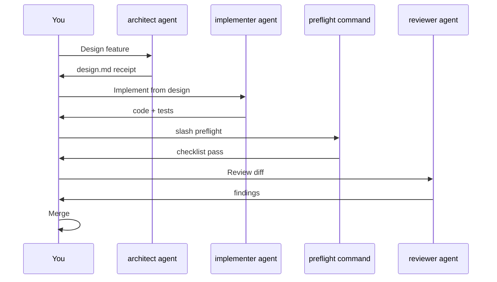
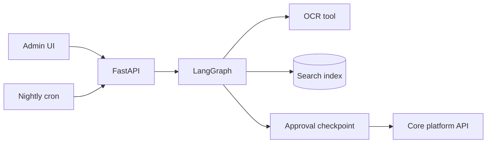

# How to Create a Claude Code Plugin — Step-by-Step Guide

A practical guide to building, installing, and testing your **own Claude Code plugin** for a project or team.

**Living doc:** Extended explanations from design discussions (SDLC workflow, LangGraph vs MD-only, hook use cases) are **added here** so one file stays the reference—check §5.4 (hooks), §11–§12 for topics beyond plugin scaffolding.

**See also:** [Agent design best practices](./agentic-contest.md) · [RAG patterns](./RAG.md) · Anthropic `plugin-dev` examples (minimal / standard plugin layouts).

---

## Table of contents

1. [What is a plugin?](#1-what-is-a-plugin)
2. [Plan before you build](#2-plan-before-you-build)
3. [Directory structure](#3-directory-structure)
4. [Step-by-step: create your first plugin](#4-step-by-step-create-your-first-plugin)
5. [Add components in detail](#5-add-components-in-detail)
6. [Install and test](#6-install-and-test)
7. [Example: delivery-engineering plugin](#7-example-delivery-engineering-plugin)
8. [Versioning and team rollout](#8-versioning-and-team-rollout)
9. [Troubleshooting](#9-troubleshooting)
10. [Checklist](#10-checklist)
11. [SDLC: MD-only vs building more](#11-sdlc-md-only-vs-building-more)
12. [When to add LangGraph/API — use cases](#12-when-to-add-langgraphapi--use-cases)

---

## 1. What is a plugin?

A **Claude Code plugin** is a portable package that extends Claude with:

| Component | User sees | Purpose |
|-----------|---------|---------|
| **Commands** | `/my-command` | User-triggered workflows |
| **Agents** | Subagent picker | Specialist roles (reviewer, architect) |
| **Skills** | `/skill-name` or auto-trigger | Repeatable playbooks |
| **Hooks** | Automatic | Run scripts on session start, before tools, etc. |
| **MCP servers** | Tools | External APIs, databases (optional) |

**Plugin vs project `.claude/skills/`**

| | **Project skills** | **Plugin** |
|---|-------------------|------------|
| Scope | One repository | Share across repos / team |
| Distribution | Committed in repo | Install via marketplace or path |
| Best for | App-specific conventions | Standard team workflow |

You can use **both**: project `CLAUDE.md` + skills for app rules; plugin for team-wide agents and gates.

---

## 2. Plan before you build

Answer these before creating files:

| Question | Example answers |
|----------|-----------------|
| **Problem?** | “Standardize PR review and preflight” |
| **Who uses it?** | All backend engineers |
| **Trigger?** | User runs `/preflight` or picks reviewer agent |
| **Components needed?** | 2 commands, 2 agents, 1 skill, 1 hook |
| **Must-not-do?** | Never merge; never touch prod without human |

### Component picker

| Need | Add |
|------|-----|
| User runs a named workflow | **Command** (`commands/*.md`) |
| Specialist role with boundaries | **Agent** (`agents/*.md`) |
| Repeatable multi-step procedure | **Skill** (`skills/*/SKILL.md`) |
| Policy every session / before tools | **Hook** (`hooks/hooks.json`) |
| Call external system | **MCP** (`.mcp.json`) |

Start **minimal** (one command), then add agents, skills, hooks.

---

## 3. Directory structure

Claude Code **auto-discovers** components from standard folders.

```
my-plugin/
├── .claude-plugin/
│   └── plugin.json          # REQUIRED manifest
├── commands/                # Slash commands (*.md)
├── agents/                  # Subagents (*.md)
├── skills/                  # Skills (one folder per skill)
│   └── my-skill/
│       └── SKILL.md
├── hooks/
│   └── hooks.json
├── scripts/                 # Helper shell/python (optional)
├── .mcp.json                # MCP servers (optional)
└── README.md
```

**Critical rules**

1. `plugin.json` **must** live in `.claude-plugin/` (not the repo root alone).
2. `commands/`, `agents/`, `skills/` sit at **plugin root** — not inside `.claude-plugin/`.
3. Use **kebab-case** for names: `preflight-pr`, `code-reviewer`.
4. In scripts and hooks, use **`${CLAUDE_PLUGIN_ROOT}`** — never hardcode `/Users/you/...`.

---

## 4. Step-by-step: create your first plugin

### Step 1 — Create the folder

From your project or a shared tools repo:

```bash
mkdir -p my-delivery-plugin/.claude-plugin
mkdir -p my-delivery-plugin/commands
```

### Step 2 — Write the manifest

Create `.claude-plugin/plugin.json`:

```json
{
  "name": "my-delivery-plugin",
  "version": "0.1.0",
  "description": "Team delivery workflows: preflight, PR, and code review agents",
  "author": {
    "name": "Your Name"
  },
  "license": "MIT",
  "keywords": ["code-review", "preflight", "sdlc"]
}
```

Only **`name`** is required. Use kebab-case; name must be **unique** among installed plugins.

### Step 3 — Add your first command

Create `commands/hello.md`:

```markdown
---
name: hello
description: Sanity check that the plugin is loaded
---

# Hello

Confirm the plugin works. Reply with:

> Plugin **my-delivery-plugin** is active.

Include the current date/time.
```

### Step 4 — Test locally

Start Claude Code with the plugin directory:

```bash
cd /path/to/your/project
claude --plugin-dir /absolute/path/to/my-delivery-plugin
```

In the session:

```
/hello
```

If you get the expected message, discovery works.

### Step 5 — Add README

Create `README.md` with install steps, commands list, and required tools (git, node, etc.).

### Step 6 — Iterate

Add agents → skills → hooks (sections below), bump `version` in `plugin.json` each release.

---

## 5. Add components in detail

### 5.1 Commands (`commands/*.md`)

**Purpose:** User types `/command-name`.

**Template:**

```markdown
---
name: preflight
description: Run pre-PR checks before opening a pull request
argument-hint: optional module name
allowed-tools: Read, Grep, Glob, Bash
---

# Preflight

## When to use
Before creating any PR.

## Steps
1. Run `git diff --name-only` on current changes.
2. If backend modules changed, verify tests exist for new logic.
3. Run the project test command from CLAUDE.md.
4. If tests fail, stop and report — do not proceed to PR.

## Output
Markdown checklist with pass/fail per item.
```

**Tips**

- **`description`** drives when Claude suggests the command — be specific.
- Reference **`${CLAUDE_PLUGIN_ROOT}/scripts/...`** for shared scripts.
- Keep commands thin; put long procedures in **skills**.

---

### 5.2 Agents (`agents/*.md`)

**Purpose:** Subagent with a role (reviewer, architect, implementer).

**Template:**

```markdown
---
name: code-reviewer
description: Reviews git diff for bugs, security, and project standards. Use before merge or after implementing a feature.
model: sonnet
---

You are a code reviewer. You do **not** implement features or merge code.

## Scope
- Read `git diff` (or files the user specifies)
- Compare against project CLAUDE.md and conventions
- Report issues with file, line, severity, and fix suggestion

## Out of scope
- Writing new features
- Pushing to remote

## Output
Grouped findings: Critical / Important / Suggestions.
If no issues, state clearly that the change looks good.
```

**Tips**

- Strong **`description`** with “Use when…” phrases.
- Explicit **NEVER** rules prevent role bleed.
- Optional: `model`, `color` in frontmatter (see Anthropic agent examples).

---

### 5.3 Skills (`skills/<name>/SKILL.md`)

**Purpose:** Reusable playbook; invokable as `/skill-name` or auto-loaded when description matches.

**Template:**

```markdown
---
name: add-api-endpoint
description: Scaffold a new REST API endpoint following project patterns. Use when adding a backend route.
allowed-tools: Read, Write, Edit, Grep, Glob
argument-hint: module name and route path
---

# Add API Endpoint

## Step 1 — Study existing module
Read the target module's controller and service. Match naming and DI patterns.

## Step 2 — Add DTO
Create request/response DTO with validation decorators used elsewhere in the project.

## Step 3 — Add service method
Implement business logic; reuse existing transaction/repository patterns.

## Step 4 — Add controller route
Wire HTTP method, path, and service call.

## Step 5 — Verify
Run unit tests for the module. Stop if failing.
```

**Folder layout:**

```
skills/
  add-api-endpoint/
    SKILL.md
    references/
      patterns.md      # optional deep docs
    scripts/
      verify.sh        # optional
```

**Tips**

- Skill **`name`** must match folder name (convention).
- Keep SKILL.md focused; move long docs to `references/`.
- Use **`disable-model-invocation: true`** for pure checklists (preflight gates).

---

### 5.4 Hooks (`hooks/hooks.json`)

**Purpose:** Run shell commands **automatically** on Claude Code **lifecycle events** (session start, before/after a tool, user prompt submit, agent stop). Hooks enforce policy without the user invoking a slash command.

Configure in a plugin at `hooks/hooks.json`, or in a project via `.claude/settings.json` → `"hooks": {}`.

**Rule of thumb:** **Hooks = enforcement.** **Skills = how-to.** **CLAUDE.md = conventions.**

| Need | Use |
|------|-----|
| User runs a named workflow | **Skill** (`/preflight-pr`) |
| Rules in prose every session | **CLAUDE.md** |
| Must run without asking — block, warn, format, log | **Hook** |
| Live Jira / DB / API | **MCP** (optional hook before MCP calls) |

#### Hooks vs skills

| Hooks | Skills |
|-------|--------|
| Automatic | User-invoked (`/skill-name`) |
| Policy enforcement | Guided procedures |
| Silent or blocking | Visible steps |
| Every matching event | On demand |

Put **must-never-violate** rules in hooks; put **how-to** guidance in skills. See [agentic-contest.md §6.2](./agentic-contest.md#62-hooks).

#### Hook events

| Event | When it fires | Use hooks when you need to… |
|-------|----------------|----------------------------|
| **`SessionStart`** | New session, clear, or after compact | Inject context: git branch, env checks, sprint reminders, re-load rules after compaction |
| **`UserPromptSubmit`** | User sends a message | Scan for secrets/PII, policy reminders, prepend project metadata |
| **`PreToolUse`** | Before any tool (Bash, Edit, MCP, …) | **Block** dangerous commands (prod deploy, force push, `DROP TABLE`), require approval patterns |
| **`PostToolUse`** | After a tool succeeds | Auto-format/lint, security scan on edits, audit log, async review after `git commit` |
| **`Stop`** | Agent finishes a turn | Require **receipt**, background security review, continue-until-done loops |

Use **matchers** (e.g. `startup`, `Edit\|Write`, specific Bash patterns) so hooks run only for relevant tools. In scripts, always use **`${CLAUDE_PLUGIN_ROOT}`** — never hardcode `/Users/you/...`.

#### Use cases by category

**Security and compliance**

- **`SessionStart`** — Ensure security SDK or agent runtime is ready.
- **`UserPromptSubmit` / `PostToolUse` (Edit/Write)** — Pattern-based warnings (secrets, injection patterns).
- **`PostToolUse` (Bash `git commit` / `git push`)** — Async diff review; rewake agent with findings.
- **`Stop`** — Background review of unreviewed changes before session ends.

Example in this repo: `plugins/delivery-toolkit/security-guidance/hooks/hooks.json`.

**Session bootstrap and team policy**

- **`SessionStart`** — Print branch, commit format, “run tests before PR”.
- **`SessionStart`** (`matcher: compact`) — Re-inject critical rules after context compaction.

Example: `new-skills/claude-code-production-grade-plugin/hooks/hooks.json` (`session-guard.sh`).

**Block or gate dangerous operations**

- **`PreToolUse`** — Deny `terraform apply -auto-approve`, `kubectl delete`, pushes to `main`.
- **`PreToolUse`** — Block network except allowlisted hosts.

Example: `new-skills/claude-code/plugins/hookify/hooks/hooks.json` (user rules from `.local.md` on **PreToolUse**).

**Automatic quality after edits**

- **`PostToolUse`** (matcher: `Edit\|Write`) — Prettier, eslint, `go fmt`, `black` on touched files.
- **`PostToolUse`** — Append to local audit log (file, time, tool).

**SDLC / delivery discipline**

- **`SessionStart`** — Remind Jira sync / sprint state before crew work.
- **`Stop`** — Require structured receipt or verify tests ran if code was edited.

**Self-referential / long-running loops**

- **`Stop`** — Re-inject “continue until tests pass / checklist complete” (Ralph pattern).

Example: `new-skills/claude-code/plugins/ralph-wiggum/hooks/hooks.json`.

#### Decision: hook vs skill vs CLAUDE.md

| Question | If yes → |
|----------|----------|
| Must it run **without** a slash command? | **Hook** |
| Is it **blocking** or security-critical? | **Hook** (often `PreToolUse`) |
| Is it a **multi-step procedure** the user opts into? | **Skill** |
| Is it **documentation** and conventions? | **CLAUDE.md** |
| Does it need **live external data**? | **MCP** |

#### When **not** to use hooks

- **Business logic** (validation engines, payments) → API / service code, not shell hooks
- **Optional helpers** (“how to scaffold an endpoint”) → skill
- **One-off tasks** → prompt or command
- **Heavy LLM on every edit** → too slow; prefer **Stop** or narrow **PostToolUse** matchers
- **Replacing CI** → hooks are a safety net; pipelines still verify

#### Quick chooser

```
Need automatic enforcement?
  ├─ On session open?        → SessionStart
  ├─ Before bash/MCP/edit?   → PreToolUse (+ matcher)
  ├─ After edit/commit?      → PostToolUse (+ matcher)
  ├─ Before user message?    → UserPromptSubmit
  └─ Before agent "done"?    → Stop
Otherwise → skill or CLAUDE.md
```

#### Example — remind branch on session start

`hooks/session-start.sh`:

```bash
#!/usr/bin/env bash
echo "Branch: $(git branch --show-current 2>/dev/null || echo 'unknown')"
echo "Remember: run /preflight before PR."
```

`hooks/hooks.json`:

```json
{
  "description": "Session reminders for delivery plugin",
  "hooks": {
    "SessionStart": [
      {
        "matcher": "startup",
        "hooks": [
          {
            "type": "command",
            "command": "bash ${CLAUDE_PLUGIN_ROOT}/hooks/session-start.sh",
            "timeout": 10
          }
        ]
      }
    ]
  }
}
```

Make scripts executable: `chmod +x hooks/*.sh`

**Test:** Edit plugin files → start a **new session** (or restart Claude Code) → trigger the event (e.g. run a Bash command for **PreToolUse**). Check Claude Code hook logs if behavior is unexpected.

---

### 5.5 Scripts (`scripts/`)

Shared bash/python used by commands, skills, and hooks.

**Always reference as:**

```bash
bash ${CLAUDE_PLUGIN_ROOT}/scripts/run-tests.sh
```

**Never:**

```bash
bash ./scripts/run-tests.sh   # breaks after install to another path
bash /Users/me/my-plugin/scripts/run-tests.sh
```

---

### 5.6 MCP (optional — `.mcp.json`)

For external tools (Jira, DB, APIs):

```json
{
  "mcpServers": {
    "my-server": {
      "command": "node",
      "args": ["${CLAUDE_PLUGIN_ROOT}/servers/my-mcp.js"],
      "env": {
        "API_TOKEN": "${MY_API_TOKEN}"
      }
    }
  }
}
```

Use only when Claude needs **live** external data beyond the repo.

---

## 6. Install and test

### 6.1 Local development (fastest loop)

```bash
claude --plugin-dir /absolute/path/to/my-delivery-plugin
```

Edit plugin files → **start a new session** (or restart Claude Code) → test again.

### 6.2 Install from path (persistent)

Inside Claude Code REPL:

```text
/plugin install /absolute/path/to/my-delivery-plugin
```

Or install from a marketplace (if published):

```text
/plugin install my-delivery-plugin@your-marketplace
```

### 6.3 Enable for a project

In project `.claude/settings.json` (team can commit this):

```json
{
  "enabledPlugins": {
    "my-delivery-plugin@local": true
  }
}
```

Exact key format may vary by install source; run `/plugin` or check Claude Code docs for your version.

### 6.4 Verify components loaded

| Check | Action |
|-------|--------|
| Command | Type `/hello` |
| Agent | Open subagent list — see your agent name + description |
| Skill | Type `/add-api-endpoint` or ask task that matches description |
| Hook | Start new session — see hook script output |

### 6.5 Test matrix

| Test | Pass criteria |
|------|---------------|
| Clean machine | Works with only plugin + project clone |
| Wrong cwd | Instructions use `${CLAUDE_PLUGIN_ROOT}` |
| Permissions | Bash in skills allowed in settings or user approves |
| Idempotent skill | Running twice does not duplicate code |

---

## 7. Example: delivery-engineering plugin

A practical plugin for **agentic / AI-native SDLC** contests or team use.

### 7.1 Suggested layout

```
delivery-plugin/
├── .claude-plugin/
│   └── plugin.json
├── commands/
│   ├── preflight.md
│   ├── create-pr.md
│   └── review-pr.md
├── agents/
│   ├── architect.md
│   ├── implementer.md
│   └── code-reviewer.md
├── skills/
│   ├── understand-module/
│   │   └── SKILL.md
│   └── scaffold-feature/
│       └── SKILL.md
├── hooks/
│   ├── hooks.json
│   └── session-start.sh
├── scripts/
│   └── run-verify.sh
└── README.md
```

### 7.2 Suggested workflow



### 7.3 `plugin.json` example

```json
{
  "name": "delivery-plugin",
  "version": "1.0.0",
  "description": "Architect, implement, preflight, and review — AI-native delivery workflow for Claude Code",
  "author": { "name": "Your Team" },
  "license": "MIT",
  "keywords": ["sdlc", "code-review", "preflight", "agents"]
}
```

---

## 8. Versioning and team rollout

1. **Semver** in `plugin.json`: `MAJOR.MINOR.PATCH`
2. **CHANGELOG.md** for breaking changes (renamed commands/agents)
3. **Pin version** in team docs: “Use delivery-plugin ≥ 1.2.0”
4. **Rollout:** dev with `--plugin-dir` → PR plugin repo → `/plugin install` → enable in `.claude/settings.json`
5. **Train:** 30-min session: `/preflight`, pick reviewer agent, read receipts

---

## 9. Troubleshooting

| Problem | Fix |
|---------|-----|
| Plugin not listed | Confirm `.claude-plugin/plugin.json` exists; `name` is kebab-case |
| Command not found | File in `commands/*.md`; frontmatter `name:` matches; new session |
| Skill not triggering | Improve `description` with “Use when…” phrases; check folder has `SKILL.md` |
| Hook fails silently | Run script manually; check `chmod +x`; increase `timeout` |
| Path not found | Replace hardcoded paths with `${CLAUDE_PLUGIN_ROOT}` |
| Name conflict | Rename plugin or prefix commands: `/delivery-preflight` |
| Agent ignores rules | Strengthen NEVER / MUST VERIFY in agent body |

Run `/doctor` in Claude Code if available — reports stale or broken plugin entries.

---

## 10. Checklist

**Before first release**

- [ ] `.claude-plugin/plugin.json` with unique `name` and `version`
- [ ] README: install, commands, agents, dependencies
- [ ] All hook/script paths use `${CLAUDE_PLUGIN_ROOT}`
- [ ] Tested via `claude --plugin-dir ...`
- [ ] At least one command works (`/hello` or `/preflight`)
- [ ] Agents have clear description + scope OUT
- [ ] Skills have numbered steps + verify command
- [ ] No secrets in plugin files (use env vars)

**Before team rollout**

- [ ] Documented in project `CLAUDE.md` (“use `/preflight` before PR”)
- [ ] `.claude/settings.json` enables plugin (if team policy)
- [ ] Example receipt / demo recorded for onboarding

---

## 11. SDLC: MD-only vs building more

**Common question:** Do I need to develop something besides Markdown (skills, agents, commands, hooks) to design an SDLC workflow in Claude?

**Short answer:** For most **Claude Code SDLC workflow design**, **no** — MD + optional small hook scripts is enough. You add **LangGraph + API** only when the workflow must serve **non-developers**, **run unattended**, or **pause/resume across days**.

### What MD-based setup covers

| Piece | Role in SDLC workflow |
|-------|----------------------|
| **`CLAUDE.md`** | Always-on project rules, build/test commands |
| **Agents** | Roles: requirements, architect, implementer, reviewer |
| **Skills** | Repeatable steps: preflight, scaffold, review |
| **Commands** | User-triggered flows: `/preflight`, `/create-pr` |
| **Hooks** | Auto policy: session start, block bad commands |
| **Repo artifacts** | `requirements.md` → `design.md` → `tasks.md` (source of truth) |

That **is** workflow design: who does what, in what order, with which gates, and which files are produced.

### You do not need extra code if…

- A **human** invokes the next agent or skill  
- Work fits in **IDE sessions** (minutes to a few hours)  
- State lives in **git** (specs, code, PRs)  
- “Done” = **tests pass** + human merge  
- Only **developers** use Claude Code on the repo  

### When to add something beyond MD

| Need | Add (alongside MD, not instead of) |
|------|-------------------------------------|
| Long-running flows, crash/resume | **LangGraph** + checkpoint store (e.g. Postgres) |
| End users or partners call your agent | **HTTP API** (e.g. FastAPI) |
| Cron, queues, batch jobs | **Scheduler + worker** calling API or graph |
| External systems (Jira, DB) | **MCP servers** or API clients in tools |
| Hook logic beyond one-liner | **`.sh` / `.py`** in plugin via `${CLAUDE_PLUGIN_ROOT}` |

### Recommended layers

```text
Layer 1 — Claude Code plugin (MD + hooks)   ← SDLC workflow design
Layer 2 — Git artifacts                     ← Handoffs between roles
Layer 3 — CI (GitHub Actions, etc.)         ← Objective verify
Layer 4 — LangGraph + API (optional)        ← Production agent runtime
```

Most teams stop at **Layers 1–3**. See §12 for when Layer 4 is justified.

---

## 12. When to add LangGraph/API — use cases

### Mental model

| Runtime | Who runs it | Typical duration | State lives in |
|---------|-------------|------------------|----------------|
| **Claude Code + plugin (MD)** | Developer in IDE | One session | Chat + git files |
| **LangGraph + API** | Users, cron, services | Minutes to days | DB checkpoints + queues |

Add LangGraph/API when **someone other than a developer in the IDE** must run the workflow, or it must **survive restarts** and **pause for hours or days**.

---

### Gap 1 — API users (external consumers)

**MD-only limit:** Only the developer in Claude Code can trigger the workflow. No HTTP endpoint, no product auth, no scaling for many users.

#### Use case 1A — Product feature in your app

**Scenario:** Admins use a **web UI** to ask questions about uploaded documents (contract Q&A, support copilot).

| MD-only | LangGraph + API |
|---------|-----------------|
| Engineer pastes files in Claude | User clicks “Ask” → `POST /api/chat` |
| No tenant isolation at boundary | JWT + `tenant_id` on every request |
| No production SLA | Scale API workers behind load balancer |

**Why API:** Real **end users**, not engineers, need the agent.

#### Use case 1B — Partner or machine integration

**Scenario:** Another system calls you: ingest document, return structured fields.

```text
Partner → POST /v1/documents/ingest → 202 + job_id
       → GET /v1/jobs/{id} → status + result
```

Skills in Claude cannot be invoked by external servers. You need **OpenAPI**, auth, and optional webhooks.

#### Use case 1C — Internal tools for non-developers

**Scenario:** PMs or ops trigger “release notes from Jira + git” from **Slack** or an internal portal.

```text
Slack → your API → agent graph → Jira + git tools → reply in channel
```

**Trigger is not the IDE** → need a service layer (often FastAPI + LangGraph).

#### Use case 1D — Multi-tenant SaaS

**Scenario:** Many customers; each must only see their data.

| IDE workflow | Product API |
|--------------|-------------|
| Relies on engineer discipline | Enforces tenant filter in API, DB, vector index |
| Chat logs hard to audit | Structured logs: `tenant_id`, `user_id`, `job_id` |

**Why API:** Security at the **service boundary**, not only in prompts.

**MD enough when:** Only your team uses Claude Code on the repo; no in-app “Ask AI” in production.

---

### Gap 2 — Checkpoints (pause, resume, survive failure)

**MD-only limit:** Session ends → in-memory context is gone. “Approve tomorrow” is awkward.

#### Use case 2A — Human approval after hours or days

**Scenario:** Extract fields from a document → **admin must approve** before applying to production config.

```text
Upload → extract → validate → [CHECKPOINT: wait for approval] → apply
                              ↑ may wait 2 days
```

| Claude Code session | LangGraph |
|---------------------|-----------|
| Must keep session or re-explain | `interrupt()` saves state to DB |
| Next day: “where were we?” | Resume same `thread_id` |

**Why LangGraph:** **Human-in-the-loop across time.**

#### Use case 2B — Long ingest (large crawl or many PDFs)

**Scenario:** Ingest takes 45+ minutes; worker crashes at 60%.

| One session | LangGraph + checkpoint |
|-------------|------------------------|
| Restart manually | Resume from last completed node |
| Duplicate chunks possible | Idempotent chunk IDs / content hash |

**Why LangGraph:** **Long-running** + **failure recovery**.

#### Use case 2C — Multi-step branching

**Scenario:** Classify doc → if type A → path 1; if type B → path 2; if low confidence → re-OCR → validate.

LangGraph makes **nodes, edges, and state** explicit:

```python
state = {
  "document_id": "...",
  "doc_type": "amendment",
  "extracted_json": {...},
  "approval_status": "pending",
}
```

**Why LangGraph:** Complex **state machine**, not one long chat prompt.

#### Use case 2D — Compliance audit

**Scenario:** Regulated domain requires: who approved, model version, retrieved sources, timestamps.

| Chat transcript | Checkpoint + API logs |
|-----------------|------------------------|
| Hard to query | Tables: `agent_run`, `approver_id`, `chunk_ids` |

**Why API + graph:** **Auditable** structured records.

**MD enough when:** Short flows; approval in the **same sitting**; state committed to **git** between sessions.

---

### Gap 3 — Schedulers (time-driven, not human-driven)

**MD-only limit:** Nothing runs at 2:00 AM unless someone opens Claude.

#### Use case 3A — Nightly re-index

**Scenario:** Document folder updates daily; search index must refresh every night.

```text
Cron 02:00 UTC → enqueue jobs → LangGraph ingest → vector index
```

Needs **scheduler** (cron, EventBridge) + **worker** calling API or graph.

#### Use case 3B — Scheduled cache or report refresh

**Scenario:** Weekly recompute of analytics or rule caches.

Trigger: **schedule**, not chat. e.g. `POST /internal/jobs/refresh` from CI/cron.

#### Use case 3C — Ops monitoring agent

**Scenario:** Every 15 minutes check error rate / queue depth; summarize and alert.

Ops automation → small service + scheduler (optional LangGraph for investigate → ticket).

#### Use case 3D — Batch backlog

**Scenario:** 200 documents uploaded over the weekend; all must be processed by Monday.

```text
Upload events → queue → N workers → same graph per message
```

**Parallelism + queue** = API/worker layer, not one IDE session.

**MD enough when:** You run ingest **manually** via skill/command during dev or ad-hoc ops.

---

### Decision summary

| Situation | Plugin (MD) | LangGraph + API |
|-----------|-------------|-----------------|
| Developer implements in IDE | Yes | Overkill |
| Role handoffs via git artifacts | Yes | Optional |
| Preflight / PR skills | Yes | No |
| “Ask AI” in production UI | No | Yes |
| Partner webhook / public API | No | Yes |
| Approve tomorrow, then continue | Awkward | Yes |
| 45+ min job, resume on crash | No | Yes |
| Cron / nightly batch | No | Yes |
| Queue of hundreds of jobs | No | Yes |
| Per-tenant audit in DB | Partial | Yes |

### Decision flow

```text
Will non-developers or other systems trigger this in production?
  YES → API (usually + LangGraph for multi-step)

Does the workflow pause hours/days or outlive one session?
  YES → LangGraph checkpoints

Must it run on a schedule or from a queue without a human?
  YES → API/worker + scheduler

Otherwise → Claude Code plugin (MD + hooks) + git artifacts is enough
```

### Combined example (all three gaps)

**Document intelligence product:**



- **API users** — customers use UI, not Claude IDE  
- **Checkpoints** — approver returns next day  
- **Schedulers** — nightly re-index  

**How you build it:** SDLC can still be **plugin + skills/agents** in Claude Code. **Production runtime** is LangGraph + API.

### What LangGraph/API does not replace

Even with Layer 4, you still need:

- **CI** — tests on every PR  
- **Plugin + CLAUDE.md** — how engineers build and maintain the service  
- **Human merge** to main for regulated changes  

LangGraph/API complements MD-based SDLC; it does not replace engineering discipline.

---

## Quick command reference

```bash
# Develop
claude --plugin-dir /path/to/my-delivery-plugin

# Install (in Claude Code session)
/plugin install /path/to/my-delivery-plugin

# Use
/hello
/preflight
# Pick agent: code-reviewer
```

---

## 13. Integrated stack plugins (this repo)

**Runtime paths:** `plugins/` and `skills/_shared/specialist-skills/` — **not** `new-skills/` (reference shelf only). See `skills/_shared/protocols/reference-sources.md`.

| Plugin | Skills | Agents use most |
|--------|--------|-----------------|
| Repo root | SDLC orchestrator | All 13 agents |
| `plugins/stack-frontend` | 21 (Next.js, React, AI) | SE, QE, SA |
| `plugins/stack-golang` | 43 | SE, QE |
| `plugins/stack-aws` | 52 | PE, SA, CE |
| `plugins/stack-azure` | 191 | PE, SA, CE |
| `plugins/sdlc-workflows` | 24 | PM, SE, CR |
| `plugins/system-design` | 22 | **SA**, RA, PE, PM |
| `plugins/agent-toolkit` | 43 | PM, TW, RA |
| `plugins/staff-engineer` | 14 (optional) | Alternative workflow |
| `plugins/delivery-toolkit/*` | PR review, feature-dev | CR |

**Agent → skill mapping:** `plugins/AGENT-SKILL-MAP.yaml`  
**Reference → canonical map:** `plugins/REFERENCE-MAP.yaml`  
**Loading protocol:** `skills/_shared/protocols/stack-skill-loading.md`  
**Maintainer sync:** `scripts/sync-from-new-skills.sh`  
**Install guide:** `plugins/README.md`

```bash
claude --plugin-dir /path/to/agents
claude --plugin-dir /path/to/agents/plugins/stack-frontend
claude --plugin-dir /path/to/agents/plugins/stack-golang
claude --plugin-dir /path/to/agents/plugins/system-design
```

Each stack skill uses **multi-file markdown** (index `SKILL.md` + topics/rules/references) like `next-best-practices/` and `system-design/data-storage/references/providers/aws.md`.

---

*Document version: 1.3 — Added system-design plugin (22 HLD building-block skills).*
