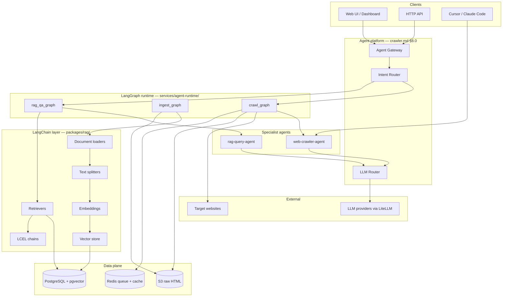
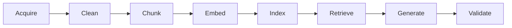
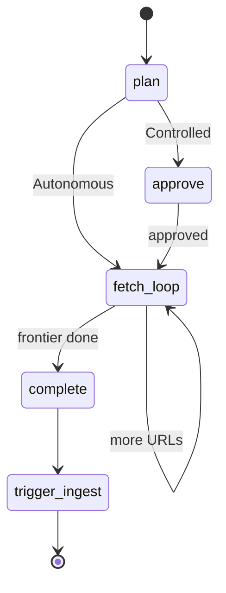
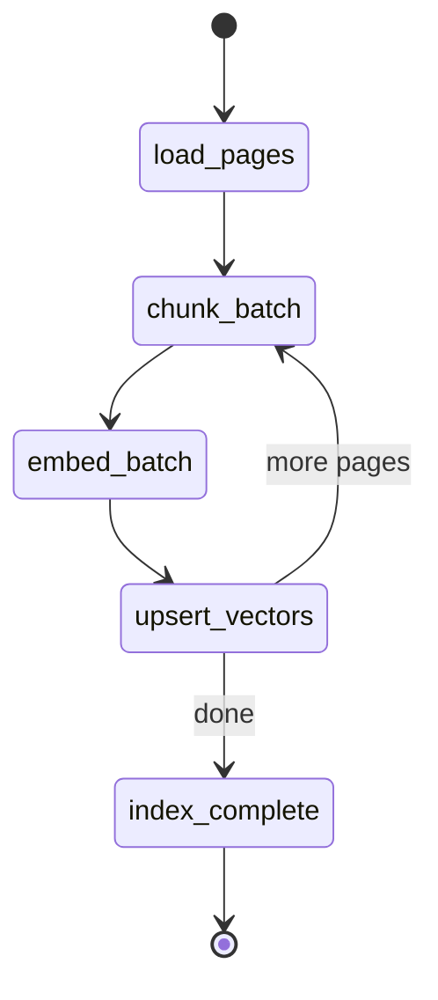
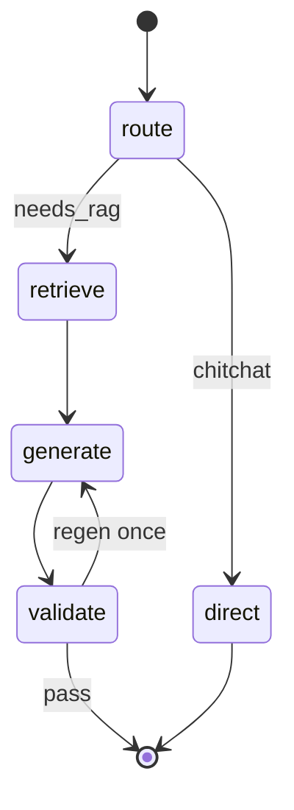

# Comprehensive Application — RAG + Agent + LangChain + LangGraph

End-to-end architecture for a **web intelligence platform** that **crawls** the web, **indexes** content for **RAG**, and answers questions through **agents** orchestrated with **LangChain** (components) and **LangGraph** (workflows).

**Parent doc:** [Web Crawler Agent — AI Agent Product & Solution Design](./crawler.md) (gateway, crawler agent, backing plane, security, deploy).

**Stack summary**

| Pillar | Role | Primary tech |
|--------|------|--------------|
| **RAG** | Ingest → chunk → embed → retrieve → cite | pgvector / OpenSearch + LangChain retrievers |
| **Agent** | Plan, crawl, index, query with tools + receipts | `web-crawler-agent`, `rag-query-agent` |
| **LangChain** | Loaders, splitters, embeddings, vector stores, LCEL chains | `langchain`, `langchain-community`, `langchain-openai` / `langchain-aws` |
| **LangGraph** | Stateful graphs: crawl loop, ingest pipeline, RAG QA | `langgraph`, Postgres checkpointer |

---

## Table of contents

1. [Vision](#1-vision)
2. [End-to-end architecture](#2-end-to-end-architecture)
3. [RAG design](#3-rag-design)
4. [Agent design](#4-agent-design)
5. [LangChain mapping](#5-langchain-mapping)
6. [LangGraph workflows](#6-langgraph-workflows)
7. [Repository layout](#7-repository-layout)
8. [Data model](#8-data-model)
9. [API surface](#9-api-surface)
10. [Epics and delivery](#10-epics-and-delivery)
11. [Security](#11-security)
12. [How to run](#12-how-to-run)

---

## 1. Vision

### Product

**CrawlIndex** (working name) — a comprehensive application where users:

1. **Crawl** — “Index all docs on `https://docs.example.com` depth 2”
2. **Ingest** — automatic chunking, embedding, and vector indexing
3. **Ask** — “How does authentication work?” with **cited answers** from indexed pages only

### Design rules

| Rule | Implementation |
|------|----------------|
| LLM never fetches URLs directly | Crawl tools + workers (see [crawler.md](./crawler.md)) |
| RAG answers cite chunk IDs + source URLs | Citation validator + LangGraph `validate_citations` node |
| Long workflows are resumable | LangGraph checkpointer on Postgres |
| IDE dev without full cloud | Local: docker-compose + pgvector + LiteLLM |
| Production | Agent gateway + LangGraph runtime on ECS (see crawler.md §8.8) |

### Success metrics

| KPI | Target |
|-----|--------|
| Retrieval recall@5 on eval set | ≥ 85% |
| Answer citation accuracy (URL in index) | 100% |
| Crawl → searchable index (100 pages) | < 15 min polite mode |
| Graph resume after worker crash | No duplicate chunks (idempotent ingest) |

---

## 2. End-to-end architecture



### Three pipelines

| Pipeline | Trigger | LangGraph | Output |
|----------|---------|-----------|--------|
| **Crawl** | User: “crawl these URLs” | `crawl_graph` | `page` rows + S3 HTML + `sources.json` |
| **Ingest / RAG index** | After crawl or on schedule | `ingest_graph` | `document_chunk` + embeddings in pgvector |
| **Query / RAG QA** | User: “ask about indexed site” | `rag_qa_graph` | Answer + citations + receipt |

---

## 3. RAG design

### 3.1 RAG stages



| Stage | Input | Output | Owner |
|-------|-------|--------|-------|
| **Acquire** | Crawled HTML in S3 | `langchain_core.documents.Document` | `ingest_graph` + LangChain loader |
| **Clean** | Raw HTML | Main text, strip nav/ads/scripts | `HtmlCleaner` (custom) |
| **Chunk** | Document | Chunks 512–1024 tokens, 10% overlap | `RecursiveCharacterTextSplitter` |
| **Embed** | Chunk text | `float[]` vector | `OpenAIEmbeddings` / `BedrockEmbeddings` |
| **Index** | Vectors + metadata | pgvector rows | `PGVector` / custom store |
| **Retrieve** | User query | Top-k chunks + scores | `similarity_search` + optional rerank |
| **Generate** | Query + context | Draft answer | LLM via router `balanced` |
| **Validate** | Answer + chunks | Pass/fail citations | `validate_rag_citations` |

### 3.2 Chunk metadata (required for citations)

Every chunk stored with:

```json
{
  "chunk_id": "chk_8f3a2b",
  "page_id": "pg_001",
  "job_id": "job_042",
  "source_url": "https://example.com/docs/auth",
  "title": "Authentication",
  "content_hash": "sha256...",
  "chunk_index": 3,
  "crawled_at": "2026-06-03T10:00:00Z"
}
```

### 3.3 Retrieval strategy

| Mode | When | Implementation |
|------|------|----------------|
| **Dense** | Default | pgvector cosine similarity, k=8 |
| **Hybrid** | Noisy HTML / keyword-heavy | BM25 (OpenSearch) + dense RRF fusion |
| **Scoped** | User specifies site/job | Metadata filter `job_id` / `domain` |
| **Rerank** | Quality-critical | `CohereRerank` or cross-encoder (optional) |

### 3.4 RAG collections

| Collection | Scope | Lifecycle |
|------------|-------|-----------|
| `session_{id}` | IDE crawl session | TTL 30 days |
| `job_{job_id}` | Long-run crawl job | Tied to job retention |
| `corpus_{name}` | Curated multi-job corpus | Admin-managed |

---

## 4. Agent design

### 4.1 Agent roster

| Agent | SKILL path | LangGraph | Tools |
|-------|------------|-----------|-------|
| **web-crawler-agent** | `agents/web-crawler/` | `crawl_graph` | `fetch_page`, `check_robots`, `store_artifact`, `trigger_ingest` |
| **rag-query-agent** | `agents/rag-query/` | `rag_qa_graph` | `retrieve`, `list_collections`, `get_chunk` |
| **research-advisor** | `agents/research-advisor/` | — (IDE) | `WebSearch`, light fetch |
| **ingest-worker** | — (graph only) | `ingest_graph` | LangChain pipeline nodes |

### 4.2 `rag-query-agent` cognitive loop

```
User question
  → classify (needs retrieval? which collection?)
  → retrieve (LangChain retriever)
  → generate (context-bound prompt)
  → validate citations ⊆ retrieved chunk_ids
  → receipt + streamed response
```

### 4.3 Intent router extension (crawler.md §2.8)

| Intent | Agent | Graph |
|--------|-------|-------|
| `crawl` | web-crawler-agent | `crawl_graph` |
| `index` | ingest (async) | `ingest_graph` |
| `ask` / `query` | rag-query-agent | `rag_qa_graph` |
| `research` | research-advisor | — |

### 4.4 Receipts (RAG query)

```json
{
  "role": "rag-query",
  "session_id": "sess_xyz",
  "query": "How does OAuth work on this site?",
  "collection": "job_042",
  "retrieved_chunk_ids": ["chk_1", "chk_2", "chk_5"],
  "cited_chunk_ids": ["chk_1", "chk_5"],
  "cited_urls": ["https://example.com/docs/oauth"],
  "metrics": {
    "retrieval_count": 8,
    "chunks_used": 2,
    "hallucinated_citations": 0
  },
  "verification_commands": [
    "python -m rag.validate_citations sess_xyz"
  ]
}
```

---

## 5. LangChain mapping

### 5.1 Package layout

```
packages/rag/
  langchain/
    loaders/
      s3_html_loader.py      # S3 → Document
      session_artifact_loader.py
    splitters/
      crawl_splitter.py      # RecursiveCharacterTextSplitter config
    embeddings/
      factory.py             # Bedrock / OpenAI / local
    vectorstores/
      pgvector_store.py      # PGVector wrapper + metadata filters
    retrievers/
      scoped_retriever.py    # job_id / domain filter
      hybrid_retriever.py    # optional
    chains/
      rag_chain.py           # LCEL: retriever | prompt | llm | parser
      citation_chain.py      # structured output with chunk_ids
```

### 5.2 Component choices

| LangChain component | Selection | Notes |
|---------------------|-----------|-------|
| `DocumentLoader` | Custom `S3HtmlLoader` | Reads from `s3://bucket/raw-html/{hash}.html` |
| `TextSplitter` | `RecursiveCharacterTextSplitter` | `chunk_size=1000`, `overlap=100` |
| `Embeddings` | `BedrockEmbeddings` (AWS) or `OpenAIEmbeddings` | Via LiteLLM embedding route |
| `VectorStore` | `PGVector` | Same RDS as crawl metadata |
| `Retriever` | `vectorstore.as_retriever(search_kwargs={"k": 8})` | Wrapped for metadata filters |
| `ChatModel` | `ChatOpenAI` / `ChatBedrock` via LiteLLM | Not called directly from crawler fetch |
| `LCEL chain` | `rag_chain` | See §5.3 |

### 5.3 RAG chain (LCEL)

```python
# packages/rag/langchain/chains/rag_chain.py (conceptual)
from langchain_core.prompts import ChatPromptTemplate
from langchain_core.output_parsers import StrOutputParser
from langchain_core.runnables import RunnablePassthrough

prompt = ChatPromptTemplate.from_messages([
    ("system", """Answer using ONLY the context below.
Cite sources as [title](url) matching chunk metadata.
If unknown, say you don't know."""),
    ("human", "Context:\n{context}\n\nQuestion: {question}"),
])

def format_docs(docs):
    return "\n\n".join(
        f"[{d.metadata['chunk_id']}] {d.metadata['source_url']}\n{d.page_content}"
        for d in docs
    )

rag_chain = (
    {"context": retriever | format_docs, "question": RunnablePassthrough()}
    | prompt
    | llm
    | StrOutputParser()
)
```

### 5.4 LangChain vs LangGraph boundary

| Use LangChain | Use LangGraph |
|---------------|---------------|
| Loaders, splitters, embeddings, vector store | Multi-step crawl with checkpoints |
| LCEL RAG chain (single pass) | Branching: crawl vs query vs ingest |
| Retriever composition | Human-in-the-loop (approve crawl plan, approve index) |
| Output parsers | Retries, failure recovery, parallel ingest batches |
| — | Tool-calling agent loop with `ToolNode` |

**Rule:** LangChain = **components**; LangGraph = **orchestration**.

---

## 6. LangGraph workflows

Runtime: `services/agent-runtime/` with Postgres checkpointer.

```python
# pip: langgraph langgraph-checkpoint-postgres langchain-core langchain-community
```

### 6.1 `crawl_graph`



| Node | Type | Action |
|------|------|--------|
| `plan` | LLM | Produce `plan.yaml` from user goal |
| `approve` | interrupt | HITL — gateway `approve-plan` |
| `fetch_loop` | ToolNode | `check_robots`, `fetch_page`, `store_artifact`, `enqueue_url` |
| `complete` | code | Write crawl receipt |
| `trigger_ingest` | code | Enqueue `ingest_graph` for `job_id` |

**State schema:**

```python
class CrawlState(TypedDict):
    session_id: str
    job_id: str
    plan: dict
    frontier: list[str]
    sources: list[str]
    messages: Annotated[list, add_messages]
```

### 6.2 `ingest_graph`



| Node | Action |
|------|--------|
| `load_pages` | LangChain `S3HtmlLoader` → Documents |
| `chunk_batch` | Splitter; batch 50 pages |
| `embed_batch` | Embeddings API (rate-limited) |
| `upsert_vectors` | PGVector upsert; idempotent by `content_hash+chunk_index` |
| `index_complete` | Emit `collection_id`; notify user |

**Idempotency:** Re-run ingest for same `page_id` replaces chunks with same `chunk_id` derivation.

### 6.3 `rag_qa_graph`



| Node | Action |
|------|--------|
| `route` | Classify: needs index? pick `collection_id` |
| `retrieve` | LangChain scoped retriever |
| `generate` | LCEL `rag_chain` |
| `validate` | `chunk_id` / URL ⊆ retrieval set |
| `direct` | Short reply without retrieval |

### 6.4 Graph compilation (server)

```python
# services/agent-runtime/graphs/__init__.py (conceptual)
from langgraph.checkpoint.postgres import PostgresSaver
from langgraph.graph import StateGraph

checkpointer = PostgresSaver.from_conn_string(settings.DATABASE_URL)

crawl_graph = build_crawl_graph().compile(checkpointer=checkpointer)
ingest_graph = build_ingest_graph().compile(checkpointer=checkpointer)
rag_qa_graph = build_rag_qa_graph().compile(checkpointer=checkpointer)

GRAPHS = {
    "crawl": crawl_graph,
    "ingest": ingest_graph,
    "rag_qa": rag_qa_graph,
}
```

### 6.5 Streaming

Gateway SSE events from LangGraph `astream_events`:

| Event | Client use |
|-------|------------|
| `on_chat_model_stream` | Token stream |
| `on_tool_start` / `on_tool_end` | Progress UI |
| `on_chain_end` (validate) | Citation badge |

---

## 7. Repository layout

```
agents/
  web-crawler/           # SKILL.md, modes (crawler.md)
  rag-query/             # SKILL.md, modes: ask, summarize_corpus

packages/
  rag/                   # LangChain components (§5.1)
  crawler-tools/         # fetch, robots, SSRF (crawler.md)

services/
  agent-gateway/         # HTTP entry (crawler.md §8.0)
  intent-router/
  llm-router/            # LiteLLM
  agent-runtime/         # LangGraph graphs (§6)
    graphs/
      crawl.py
      ingest.py
      rag_qa.py
    nodes/
    checkpoints/
  api/                   # Crawl job REST
  worker/                # ARQ crawl workers
  mcp/
    crawler-mcp/
    rag-mcp/             # retrieve, list_collections

apps/
  dashboard/             # Jobs + collections + chat UI

infra/opentofu/           # crawler.md §8.8 + OpenSearch optional

docs/
  crawler.md
  crawler-rag-agent-langgraph.md   # this file
```

---

## 8. Data model

Extends [crawler.md §9](./crawler.md#9-data-model).

### RAG tables (PostgreSQL + pgvector)

```sql
-- Extension
CREATE EXTENSION IF NOT EXISTS vector;

CREATE TABLE rag_collection (
  id            UUID PRIMARY KEY,
  name          TEXT NOT NULL,
  job_id        UUID REFERENCES crawl_job(id),
  session_id    TEXT,
  status        TEXT NOT NULL,  -- indexing | ready | failed
  chunk_count   INT DEFAULT 0,
  embedding_model TEXT NOT NULL,
  created_at    TIMESTAMPTZ NOT NULL
);

CREATE TABLE document_chunk (
  id            UUID PRIMARY KEY,
  chunk_id      TEXT UNIQUE NOT NULL,
  collection_id UUID REFERENCES rag_collection(id),
  page_id       UUID REFERENCES page(id),
  source_url    TEXT NOT NULL,
  title         TEXT,
  chunk_index   INT NOT NULL,
  content       TEXT NOT NULL,
  content_hash  CHAR(64) NOT NULL,
  embedding     vector(1536),  -- model-dependent dimension
  metadata      JSONB,
  created_at    TIMESTAMPTZ NOT NULL,
  UNIQUE (page_id, chunk_index)
);

CREATE INDEX ON document_chunk
  USING ivfflat (embedding vector_cosine_ops) WITH (lists = 100);
```

### LangGraph checkpoints

Use `langgraph-checkpoint-postgres` tables in same DB (or dedicated schema `langgraph`).

---

## 9. API surface

### RAG endpoints (add to `api/openapi/rag.yaml`)

| Method | Path | Description |
|--------|------|-------------|
| `POST` | `/v1/collections` | Create collection from `job_id` or `session_id` |
| `GET` | `/v1/collections` | List collections |
| `GET` | `/v1/collections/{id}` | Status, chunk_count |
| `POST` | `/v1/collections/{id}/ingest` | Trigger `ingest_graph` |
| `POST` | `/v1/collections/{id}/query` | RAG QA (sync) |
| `POST` | `/v1/collections/{id}/query/stream` | SSE via gateway |

### Agent gateway (unified chat)

From crawler.md — single entry for crawl + ask:

```text
POST /v1/agent/sessions/{id}/messages
  "Index docs.example.com and then explain OAuth"
  → intent router → crawl_graph → ingest_graph → rag_qa_graph (chained)
```

---

## 10. Epics and delivery

### New epics (extends crawler.md)

| Epic | Title | Delivers |
|------|-------|----------|
| **EPIC-008** | RAG ingest pipeline | LangChain loaders/splitters/embed; `ingest_graph` |
| **EPIC-009** | Vector store + retrieval | pgvector, scoped retriever, collections API |
| **EPIC-010** | RAG query agent | `rag-query-agent`, `rag_qa_graph`, citations |
| **EPIC-011** | Dashboard chat UI | Collection picker + streamed answers |

### Sprint plan (additive)

| Sprint | Focus | Exit |
|--------|-------|------|
| S1 | Crawler agent + tools (crawler.md EPIC-000) | Crawl + session files |
| S2 | `ingest_graph` + pgvector | 100 pages → searchable |
| S3 | `rag_qa_graph` + gateway `ask` intent | Cited Q&A |
| S4 | Hybrid search + dashboard | Production gate |

### Implementation tasks (RAG core)

| Task | Component | Verify |
|------|-----------|--------|
| T1 | `S3HtmlLoader` LangChain loader | unit test |
| T2 | `ingest_graph` + checkpointer | integration test |
| T3 | `document_chunk` migration + PGVector | `alembic upgrade head` |
| T4 | `rag_chain` LCEL | golden answer test |
| T5 | `rag_qa_graph` + validator node | 0 hallucinated citations |
| T6 | `rag-mcp` tools | MCP inspector |
| T7 | E2E crawl → ingest → query | `pytest tests/e2e/test_rag_pipeline.py` |

---

## 11. Security

| Risk | Mitigation |
|------|------------|
| **Poisoned page → bad RAG context** | HTML sanitization; prompt-injection strip in cleaner |
| **Cross-tenant retrieval** | `collection_id` + authZ on every query; metadata filters enforced in retriever |
| **Embedding API exfil** | Rate limits; no arbitrary user HTML to embed without crawl policy |
| **Stale / wrong corpus** | `content_hash` + `crawled_at` in answers; optional freshness warning |
| **Hallucinated citations** | `validate` node; same pattern as crawler ADR-011 |

---

## 12. How to run

### 12.1 Local comprehensive stack

```bash
# From repo root (after scaffold)
docker compose up -d   # postgres+pgvector, redis, minio, litellm
alembic upgrade head
uvicorn services.agent_gateway.main:app --port 8080
python -m services.agent_runtime.worker   # LangGraph job consumer
```

### 12.2 Example flows

**Crawl + index + ask (API):**

```bash
# 1. Create agent session
SESSION=$(curl -s -X POST http://localhost:8080/v1/agent/sessions \
  -H "Authorization: Bearer $API_KEY" -d '{"mode":"crawl"}' | jq -r .id)

# 2. Crawl
curl -N -X POST "http://localhost:8080/v1/agent/sessions/$SESSION/messages" \
  -d '{"content":"Crawl https://example.com/docs depth 2"}'

# 3. Wait for ingest (or trigger)
curl -X POST "http://localhost:8080/v1/collections" \
  -d "{\"session_id\":\"$SESSION\"}"

# 4. Ask
curl -N -X POST "http://localhost:8080/v1/agent/sessions/$SESSION/messages" \
  -d '{"content":"How does authentication work? Cite sources."}'
```

**LangGraph dev (Python):**

```python
from services.agent_runtime.graphs import rag_qa_graph

config = {"configurable": {"thread_id": "thread-1"}}
result = rag_qa_graph.invoke(
    {"question": "How does OAuth work?", "collection_id": "col_abc"},
    config=config,
)
```

### 12.3 Dependencies (`pyproject.toml` excerpt)

```toml
[project]
dependencies = [
  "langgraph>=0.2",
  "langgraph-checkpoint-postgres>=2.0",
  "langchain-core>=0.3",
  "langchain-community>=0.3",
  "langchain-openai>=0.2",
  "langchain-aws>=0.2",
  "pgvector>=0.3",
  "psycopg[binary]>=3.1",
  "litellm>=1.50",
  "httpx>=0.27",
  "beautifulsoup4>=4.12",
  "selectolax>=0.3",
]
```

### 12.4 SDLC agents to build this

Use [sdlc-automation-agent](./sdlc-agent-automation.md):

```text
PM: Read docs/crawler-rag-agent-langgraph.md → BRD, epics EPIC-008–011
SA: agent-topology.md, RAG ERD, LangGraph node contracts
SE: packages/rag + services/agent-runtime graphs
QE: RAG eval set (recall@k, citation accuracy)
PE: pgvector on RDS, LiteLLM sidecar, graph worker autoscale
```

---

## Appendix — LangGraph vs sdlc-automation-agent IDE path

| Concern | IDE (Cursor / Claude Code) | Server (LangGraph) |
|---------|---------------------------|---------------------|
| Crawl | `web-crawler-agent` SKILL + tools | `crawl_graph` |
| Index | Manual `trigger_ingest` or script | `ingest_graph` async |
| Ask | `rag-query-agent` SKILL + local retriever | `rag_qa_graph` + gateway SSE |
| Checkpoints | Session files | Postgres checkpointer |
| Best for | Development, small corpora | API clients, schedules, scale |

Both paths share **`packages/rag`** LangChain code — no duplication.

---

*Document version: 1.0 — Comprehensive RAG + Agent + LangChain + LangGraph application design. Parent: [crawler.md](./crawler.md) v1.3.*
