# Web Crawler Agent — AI Agent Product & Solution Design

A product specification and solution design for an **AI web crawler agent** — an LLM-driven agent with **tools, skills, protocols, and receipts** — built and delivered via the **sdlc-automation-agent** framework. The crawler is **not** a headless script farm alone; it is an **agent that plans, fetches, extracts, and reports** with human gates and auditable artifacts.

**Product shape**

| Layer | What it is |
|-------|------------|
| **Platform** | Agent **Gateway** + **Intent router** + **LLM router** + MCP hub + observability |
| **Cognitive (primary)** | `web-crawler-agent` — SKILL.md, modes, tool catalog, session memory, crawl receipts |
| **Execution (backing)** | Polite fetch workers, queue, storage — **tools the agent invokes**, not the product UX |
| **Delivery (meta)** | PM → SA → SE agents **build** the comprehensive stack using Kiro specs |

Executable specs: `.sdlc-automation-agent/specs/{spec-id}/` (Kiro-aligned).

**Related docs**

- [SDLC Agent Automation](./sdlc-agent-automation.md) — orchestrator, agents, gates
- [Spec-Driven Requirements Protocol](../skills/_shared/protocols/spec-driven-requirements.md) — EARS + `requirements.md` / `design.md` / `tasks.md`
- [How spec-driven requirements run the full SDLC](./spec-driven-sdlc-flow.md) — end-to-end flow (Inception → Sprint → Release)
- [cv.md §8 — Laconic agentic parse on HTML structure change](./cv.md#85-agentic-capture--parse-when-html-structure-changes) — schema-on-read, normalize, validate, profile hints
- [Receipt Protocol](../skills/_shared/protocols/receipt-protocol.md) — verifiable crawl sessions
- [Solution Architect End-to-End](./solution-architect-end-to-end.md) — SA phase playbook
- [RAG + Agent + LangChain + LangGraph](./crawler-rag-agent-langgraph.md) — comprehensive application (crawl → index → query)

---

## Table of contents

1. [Vision and scope](#1-vision-and-scope)
2. [AI agent product model](#2-ai-agent-product-model) — includes [comprehensive platform](#28-comprehensive-agent-platform-llm--router--gateway)
3. [Personas](#3-personas)
4. [Agent routing](#4-agent-routing) — build-time SDLC + run-time crawler agent
5. [Epics](#5-epics)
6. [Features](#6-features)
7. [User stories](#7-user-stories)
8. [Solution design](#8-solution-design) — [LLM platform](#80-comprehensive-agent-platform-architecture), [agent architecture](#81-agent-cognitive-architecture), [backing plane](#82-backing-execution-plane), [security](#87-security-architecture), [infrastructure](#88-infrastructure-topology), [deployment](#89-deployment-architecture), [trade-offs](#810-architecture-trade-offs)
9. [Data model](#9-data-model)
10. [API contracts](#10-api-contracts)
11. [Implementation tasks](#11-implementation-tasks)
12. [Non-functional requirements](#12-non-functional-requirements)
13. [Security and compliance](#13-security-and-compliance)
14. [Delivery plan](#14-delivery-plan)
15. [How to run with sdlc-automation-agent](#15-how-to-run-with-sdlc-automation-agent)

---

## 1. Vision and scope

### Vision

Build an **AI web crawler agent** that accepts natural-language crawl goals (“monitor pricing on these sites”, “index docs for RAG”), **plans** scope, **invokes tools** to fetch and store pages politely, and **returns cited summaries** — with human gates, session receipts, and SDLC traceability when the agent itself is extended.

The LLM **never performs raw HTTP**; it **plans and interprets**. All network I/O runs through **deterministic tools** with SSRF guards, robots checks, and rate limits.

### Problem

Teams need agentic web research and crawling inside Cursor / Claude Code — but ad-hoc `WebFetch` loops lack:

- **Goal decomposition** — turning intent into bounded crawl plans
- **Session memory** — frontier state, artifacts, citations across turns
- **Tool guardrails** — robots, SSRF, rate limits enforced outside the model
- **Receipts** — provable list of URLs fetched and stored
- **Long-run backing** — queue + storage when a session exceeds IDE timeouts

### Success metrics (BRD KPIs)

| KPI | Target |
|-----|--------|
| Crawl task completion (user goal met with citations) | ≥ 90% on eval set |
| **Hallucinated URL rate** (cited URL not in session store) | **0%** |
| Tool-guarded fetch success (excluding robots-denied) | ≥ 95% |
| Median time from user prompt → first cited summary (depth 1, ≤10 pages) | < 2 min |
| Crawl session has valid receipt with `sources[]` | 100% |
| Every production deploy has passing verify + security scan | 100% |

### In scope

| Area | Included |
|------|----------|
| **`web-crawler-agent`** SKILL.md + modes (`discover`, `crawl`, `monitor`, `extract`) | Yes |
| **Tool catalog** — fetch, robots, frontier, parse, store, summarize | Yes |
| **Session workspace** — `.sdlc-automation-agent/crawler/sessions/{id}/` | Yes |
| **Crawl receipts** — sources, metrics, verification | Yes |
| **Orchestrator routing** from sdlc-automation-agent | Yes |
| **Specialist skills** — security-practices, monitoring (Option B) | Yes |
| **MCP / IDE tools** — WebFetch, WebSearch; optional browser MCP (v2) | Yes |
| **Backing plane** — queue, workers, PG, S3 for long crawls | Yes |
| **REST API** — optional; agents and operators invoke jobs | Yes |
| **Agent-driven SDLC** to build/extend the crawler | Yes |

### Out of scope (v1)

| Area | Reason |
|------|--------|
| Fully autonomous unbounded crawl without user-approved plan | Safety + legal |
| JavaScript rendering | v2 — browser MCP / Playwright tool |
| Authenticated / paywalled crawling | Legal + complexity |
| CAPTCHA solving | Policy risk |
| User trains custom crawl model | Use foundation model + skills |

---

## 2. AI agent product model

### 2.1 Agent definition

| Attribute | Value |
|-----------|-------|
| **Name** | `web-crawler-agent` |
| **Type** | Delivery agent (like `research-advisor`) + tool runtime |
| **Runtime** | Cursor, Claude Code, SDK dispatch |
| **Risk tier** | High (arbitrary URL input, SSRF surface) |
| **Planned paths** | `agents/web-crawler/SKILL.md`, `agents/web-crawler/agent.md`, `skills/web-crawler-agent/` |

### 2.2 Cognitive loop (plan → act → verify → report)

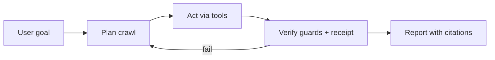

| Phase | Agent behavior | Deterministic? |
|-------|----------------|----------------|
| **Plan** | Parse intent; propose seeds, depth, domains, extraction schema; **Socratic gate** if scope unclear | LLM |
| **Act** | Call tools only — no direct HTTP from model | Tools |
| **Verify** | robots/SSRF passed; sources in store; `verification-discipline` | Code |
| **Report** | Summary with `[title](url)` only from `session/sources.json` | LLM + schema |

### 2.3 Tool catalog (v1)

| Tool | Purpose | Guardrails |
|------|---------|------------|
| `crawl_plan` | Persist approved plan (seeds, depth, filters) | User/orchestrator approval in Controlled mode |
| `check_robots` | Allow/deny URL | Cache in Redis / session |
| `fetch_page` | GET HTML/JSON | SSRF blocklist, size cap, rate limit |
| `extract_links` | Parse anchors from stored HTML | Same-host / depth rules from plan |
| `enqueue_url` | Add to frontier | Dedup by normalized URL hash |
| `store_artifact` | Write raw + metadata to session + backing store | Content-hash dedup |
| `query_session` | List pages, search text in session | Read-only |
| `summarize_crawl` | Structured summary + citations | Output validator: URLs ⊆ sources |
| `web_search` | Discover seeds (delegate) | Research Advisor pattern |
| `submit_crawl_job` | Long-run: hand off to backing worker | Returns `job_id` for polling |

**Rule:** Tools are implemented in `services/crawler-tools/` (Python) and exposed to the agent via MCP or Claude Code tool definitions. The LLM selects tools; **code enforces policy**.

### 2.4 Session workspace

```
.sdlc-automation-agent/crawler/
  sessions/{session-id}/
    plan.yaml              # Approved crawl plan
    frontier.json          # Pending / done URLs
    sources.json           # Canonical citation list
    artifacts/{url-hash}/  # page.html, meta.json
    summary.md             # Final report
  .orchestrator/receipts/{session-id}-web-crawler.json
```

### 2.5 Modes

| Mode | Trigger | Behavior |
|------|---------|----------|
| **discover** | “Find sources on …” | `web_search` + light `fetch_page`; no deep BFS |
| **crawl** | “Crawl these URLs …” | Full plan → frontier → store → summarize |
| **monitor** | “Watch for changes …” | Scheduled job via `submit_crawl_job` |
| **extract** | “Pull prices / tables from …” | Schema-driven extraction skill |

### 2.6 Specialist skills (Option B)

| Skill | When loaded |
|-------|-------------|
| `security-practices` | Every crawl mode (SSRF, secrets, logging) |
| `monitoring-logging` | `monitor` mode, backing plane ops |
| `analyze-repo` | Brownfield: crawl targets repo docs |

Registry: `agents/web-crawler/skill-extensions/registry.yaml` (to be created in EPIC-000).

### 2.7 Relationship to Research Advisor

| Agent | Role |
|-------|------|
| **Research Advisor** | Ad-hoc search + fetch; dialogue; no persistent frontier |
| **Web Crawler Agent** | **Bounded, repeatable crawls** with storage, receipts, and jobs |

Orchestrator routes: single-page question → Research Advisor; multi-page indexed crawl → Web Crawler Agent.

### 2.8 Comprehensive agent platform (LLM + router + gateway)

The crawler agent is one **specialist** in a **comprehensive agent platform**. The platform adds north-south entry, intent/model routing, and unified LLM access — without turning routing into a “meta-orchestrator persona” that paraphrases between agents (see anti-pattern in orchestration patterns).

#### Platform layers

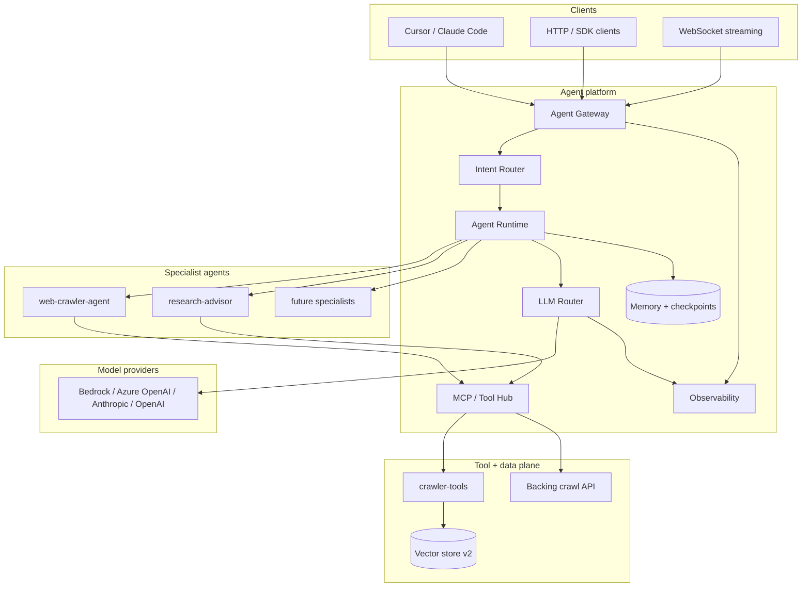

| Layer | Component | Responsibility |
|-------|-----------|----------------|
| **L1 — Gateway** | `services/agent-gateway` | Auth, rate limits, session IDs, SSE/WebSocket streaming, request logging |
| **L2 — Intent router** | `services/intent-router` | Classify user message → `crawl` \| `discover` \| `research` \| `monitor` \| `extract` \| `general` |
| **L3 — Agent runtime** | sdlc-automation-agent (IDE) + LangGraph (server, optional) | Dispatch to specialist agent; checkpoint long workflows |
| **L4 — LLM router** | LiteLLM proxy or cloud model router | Model selection, fallbacks, cost caps, provider abstraction |
| **L5 — Specialist agents** | `agents/web-crawler/`, `agents/research-advisor/`, … | Domain loops: plan → tools → verify → receipt |
| **L6 — Tool hub** | MCP servers + Python tools | Deterministic I/O; SSRF/robots enforced here |
| **L7 — Memory** | Session FS + Redis + PG | Short-term session; job state; RAG index (v2) |
| **L8 — Observability** | OpenTelemetry + Langfuse/Phoenix | Traces, token/cost per session, tool latency |

#### Intent router (not a “router persona”)

| Approach | Use | Avoid |
|----------|-----|-------|
| **Rules + keywords** | High-confidence paths (`crawl`, `monitor`, `sitemap`) | Brittle alone |
| **Small LLM classifier** | Ambiguous intents; structured JSON output | Chaining full agents |
| **User override** | `--agent web-crawler` or orchestrator hint | Silent mis-route |

**Classifier output schema:**

```json
{
  "intent": "crawl",
  "confidence": 0.92,
  "agent": "web-crawler-agent",
  "mode": "crawl",
  "reason": "multi-page index request with seed URLs"
}
```

**Routing table (default):**

| Intent | Agent | Mode | LLM profile |
|--------|-------|------|-------------|
| `discover` | research-advisor or web-crawler | `discover` | `fast` |
| `crawl` | web-crawler-agent | `crawl` | `balanced` |
| `monitor` | web-crawler-agent | `monitor` | `fast` |
| `extract` | web-crawler-agent | `extract` | `balanced` |
| `research` | research-advisor | `research` | `balanced` |
| `general` | sdlc-automation-agent orchestrator | auto | `balanced` |

#### LLM router

| Profile | Models (example) | Used for |
|---------|------------------|----------|
| `fast` | Haiku / GPT-4o-mini / small Azure deployment | Intent classification, tool arg validation |
| `balanced` | Sonnet / GPT-4o | Planning, summarization with citations |
| `strong` | Opus / o1 | Complex extraction schemas, dispute resolution |

**Implementation options (pick one primary — ADR-020):**

| Option | Pros | Cons |
|--------|------|------|
| **LiteLLM** (`services/llm-router`) | Multi-provider, fallbacks, cost tracking | Self-hosted ops |
| **Azure AI Foundry model router** | Enterprise, policy, APIM integration | Azure lock-in |
| **Amazon Bedrock** | AWS-native, AgentCore path | AWS lock-in |
| **Direct per-agent** (IDE only) | Zero infra | No central governance |

**Router policies:**

- Fallback chain: primary → secondary provider on 429/5xx
- Per-session token budget; hard stop → `submit_crawl_job` handoff
- PII scrubbing on prompts logged to observability
- Crawl summarization **must** use `balanced` or `strong` (citation quality)

#### Agent gateway API (HTTP clients)

| Endpoint | Purpose |
|----------|---------|
| `POST /v1/agent/sessions` | Create session; returns `session_id` |
| `POST /v1/agent/sessions/{id}/messages` | User message → stream agent response |
| `GET /v1/agent/sessions/{id}` | Session state, artifacts, receipt |
| `POST /v1/agent/sessions/{id}/approve-plan` | Controlled mode HITL for crawl plan |
| `GET /v1/agent/health` | Liveness |

Gateway forwards to **agent runtime** with headers: `X-Session-Id`, `X-Agent-Name`, `X-Engagement-Mode`.

#### MCP / tool hub

| MCP server | Tools | Consumers |
|------------|-------|-----------|
| `crawler-mcp` | `fetch_page`, `check_robots`, `store_artifact`, … | web-crawler-agent |
| `browser-mcp` (v2) | `snapshot`, `navigate` | web-crawler-agent EPIC-006 |
| `job-mcp` | `submit_crawl_job`, `query_job` | web-crawler-agent, operators |

Config: `.cursor/mcp.json` / `.kiro/settings/mcp.json` / gateway-side MCP registry for server deployments.

#### Dual runtime paths

| Path | When | Stack |
|------|------|-------|
| **IDE-native** | Developer in Cursor/Claude Code | sdlc-automation-agent → specialist SKILL.md → tools; LLM = IDE model |
| **Server-hosted** | API clients, scheduled monitors, multi-tenant | Gateway → Intent router → **LangGraph** graph → LLM router → MCP |

LangGraph graph (optional `services/agent-runtime/`):

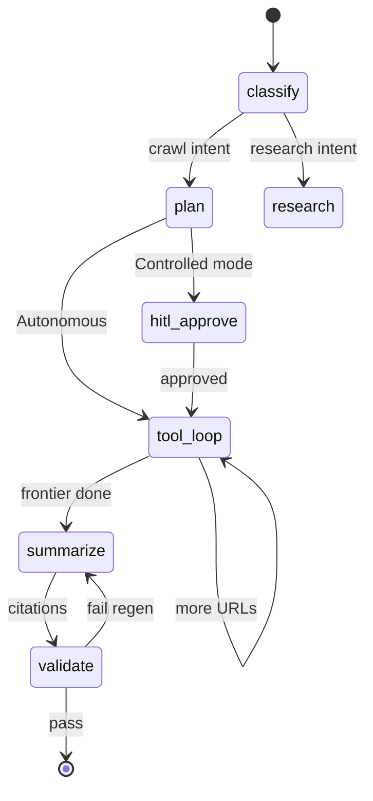

Checkpoints: Postgres or Redis (`langgraph-checkpoint`) for resume after worker crash.

#### Observability (comprehensive agent)

| Signal | Source | Use |
|--------|--------|-----|
| `agent.session.start` | Gateway | Audit |
| `llm.tokens.{in,out}` | LLM router | Cost |
| `tool.{name}.latency` | MCP / crawler-tools | SLO |
| `crawl.pages.{ok,denied,failed}` | crawler-tools | Product KPI |
| `intent.router.confidence` | Intent router | Mis-route alerts |

Integrate with existing `receipt-protocol` — gateway writes enriched receipt including `llm_model`, `token_usage`, `intent`.

---

## 3. Personas

| Persona | Goal | Primary agents |
|---------|------|----------------|
| **Analyst / End user** | Ask agent to crawl and summarize in natural language | **Web Crawler Agent** |
| **Data Engineer** | Schedule long crawls, export datasets | Web Crawler Agent → `submit_crawl_job` |
| **Research Analyst** | Discover then deep-crawl a topic | Research Advisor → Web Crawler Agent |
| **Platform Operator** | Run jobs safely, observe SLOs | PE, QE |
| **Security / Compliance** | Ensure legal, robots, prompt-injection handling | Compliance Engineer |
| **Solution Architect** | Shape agent + backing topology | SA |
| **Builder (meta)** | Extend crawler tools/skills via SDLC | PM → SA → SE |

---

## 4. Agent routing

### 4.1 Run-time — comprehensive agent platform

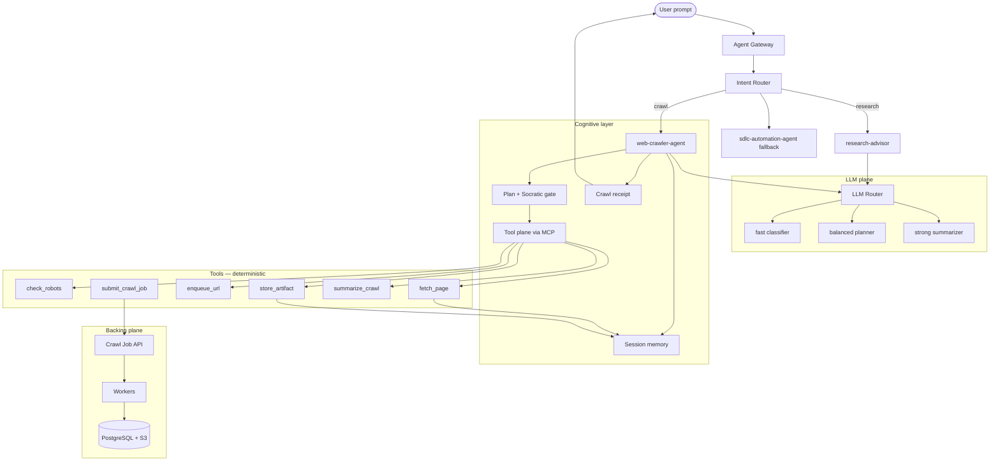

| Step | Component | Output |
|------|-----------|--------|
| 1 | **Agent Gateway** authenticates; assigns `session_id` | Session record |
| 2 | **Intent Router** classifies intent + agent + mode | Routing decision JSON |
| 3 | **LLM Router** selects model profile per step | `fast` / `balanced` / `strong` |
| 4 | **web-crawler-agent** loads protocols + skills | `plan.yaml` draft |
| 5 | Controlled mode: user approves via gateway or IDE | `plan.yaml` locked |
| 6 | Tool loop via **MCP hub** until budget hit | `artifacts/`, `sources.json` |
| 7 | `summarize_crawl` + citation validator + receipt | `summary.md`, receipt JSON |

**IDE shortcut:** Cursor/Claude Code may skip HTTP gateway and use sdlc-automation-agent directly; same agent + tools + receipts apply (§2.8 dual runtime).

### 4.2 Build-time — SDLC agents (delivery)

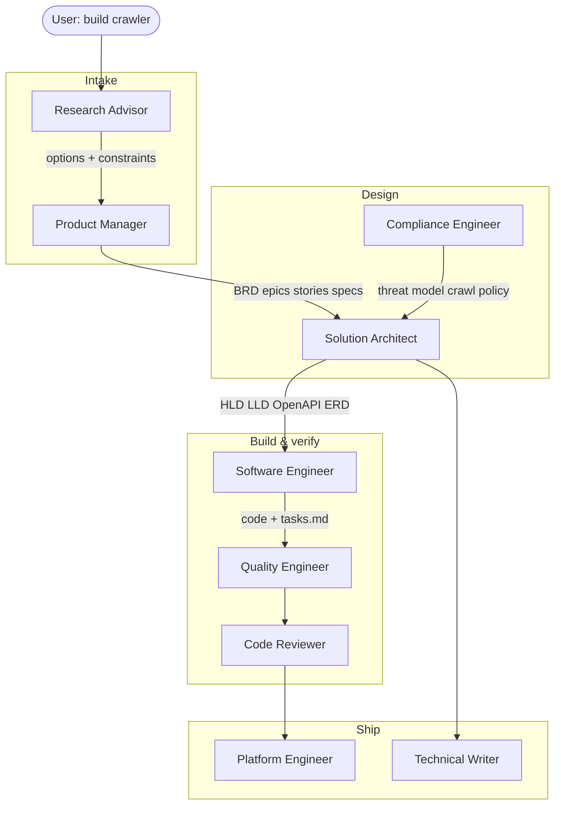

| Phase | Agent | Deliverables |
|-------|-------|--------------|
| Ideation | **Research Advisor** | Crawl use-case brief; agent vs script trade-off |
| Requirements | **Product Manager** | BRD, epics, stories, Kiro specs for **agent + tools** |
| Architecture | **Solution Architect** | Agent tool contracts, SAD, backing plane, ADRs |
| Policy | **Compliance Engineer** | Threat model incl. **prompt injection via page content** |
| Implementation | **Software Engineer** | `agents/web-crawler/`, tools, backing services |
| Testing | **Quality Engineer** | Tool unit tests, agent eval harness (citation accuracy) |
| Review | **Code Reviewer** | PR review; tool boundary audit |
| Infra | **Platform Engineer** | Deploy backing plane; MCP server if used |
| Docs | **Technical Writer** | Agent operator guide, tool reference |

---

## 5. Epics

Seven epics cover v1. **EPIC-000 (agent definition) ships first.**

### EPIC-000 — [ENABLER] Web Crawler Agent definition

| Field | Value |
|-------|-------|
| **Parent BRD** | BRD-CRAWLER-001 |
| **Objective** | Deliver the **AI agent** — SKILL.md, modes, tool interfaces, session layout, receipts. |
| **User Impact** | After this ships, a user can ask the agent to crawl in Cursor/Claude Code with citations. |
| **Technical Context** | `agents/web-crawler/SKILL.md`, `skills/web-crawler-agent/`, crawl protocol in `skills/_shared/protocols/crawl-session.md` |
| **Data Model** | Session files (`plan.yaml`, `sources.json`); no DB required for IDE-only crawls |
| **API Contracts** | Tool JSON schemas; optional MCP tool manifest |
| **NFR** | Agent obeys `iron-laws` + `verification-discipline`; receipt on every session |
| **Features** | FEAT-000, FEAT-011, FEAT-012, FEAT-013 |
| **Sequencing** | **First** — before backing plane |
| **Done Criteria** | Eval: 10-page crawl with 0 hallucinated citations; receipt validates |

---

### EPIC-007 — [ENABLER] Comprehensive agent platform (gateway + routers + LLM)

| Field | Value |
|-------|-------|
| **Parent BRD** | BRD-CRAWLER-001 |
| **Objective** | Unified entry, intent/model routing, and observability for all specialist agents — not only crawler. |
| **User Impact** | After this ships, HTTP/SDK clients and scheduled jobs use one gateway; crawler integrates with LLM router and MCP hub. |
| **Technical Context** | `services/agent-gateway`, `services/intent-router`, `services/llm-router` (LiteLLM), optional `services/agent-runtime` (LangGraph) |
| **Data Model** | `agent_session`, `agent_message`, `routing_decision`, `llm_usage` |
| **API Contracts** | `POST /v1/agent/sessions`, `POST /v1/agent/sessions/{id}/messages` (§2.8) |
| **NFR** | Gateway p95 < 300 ms (excl. LLM); intent classify < 500 ms |
| **Features** | FEAT-020, FEAT-021, FEAT-022, FEAT-023, FEAT-024 |
| **Sequencing** | Parallel with EPIC-000 after tool contracts defined; **required** for server-hosted multi-tenant |
| **Done Criteria** | End-to-end: HTTP message → intent=crawl → web-crawler-agent → streamed summary + receipt |

---

### EPIC-001 — [ENABLER] Crawler platform foundation

| Field | Value |
|-------|-------|
| **Parent BRD** | BRD-CRAWLER-001 |
| **Objective** | Unblock all feature work with repo scaffold, CI, and local dev. Advances KPI: deploy with verify 100%. |
| **User Impact** | After this ships, **tools** run locally and in CI; agent can call `fetch_page` implementation. |
| **Technical Context** | Python 3.12 tool package, `docker compose` for backing services |
| **Data Model** | `crawl_job`, `crawl_seed` (skeleton migrations) |
| **API Contracts** | Health: `GET /health`, `GET /ready` |
| **NFR** | `docker compose up` < 3 min cold start; CI pipeline < 10 min |
| **Features** | FEAT-001, FEAT-002 |
| **Sequencing** | After EPIC-000 |
| **Done Criteria** | (1) `make verify` green locally (2) staging deploy exists (3) ADR-001 recorded (4) `tech-stack.yaml` committed |

---

### EPIC-002 — Crawl job orchestration

| Field | Value |
|-------|-------|
| **Objective** | Operators create and monitor crawl jobs. Advances KPI: job status without logs. |
| **User Impact** | After this ships, the agent can `submit_crawl_job` for runs that exceed IDE session limits. |
| **Technical Context** | Job state machine: `pending → running → completed | failed | cancelled` |
| **Data Model** | `crawl_job`, `crawl_seed`, `job_event` |
| **API Contracts** | `POST /v1/jobs`, `GET /v1/jobs/{id}`, `POST /v1/jobs/{id}/cancel` |
| **NFR** | API p95 < 200 ms; job state durable across worker restart |
| **Features** | FEAT-003, FEAT-004 |
| **Sequencing** | After EPIC-001 |
| **Done Criteria** | Create job → worker picks up → terminal state persisted; integration test covers full cycle |

---

### EPIC-003 — Polite fetching and discovery

| Field | Value |
|-------|-------|
| **Objective** | Fetch pages safely with robots and rate limits. Advances KPI: crawl success ≥ 95%. |
| **User Impact** | After this ships, the agent's `fetch_page` / `enqueue_url` tools honor robots and rate limits automatically. |
| **Technical Context** | `urllib.robotparser` or `reppy`, per-host token bucket, `httpx` async client |
| **Data Model** | `fetched_url`, `robots_cache` |
| **API Contracts** | Internal worker APIs; `GET /v1/jobs/{id}/pages` |
| **NFR** | Default max 1 req/s per host; honor `Crawl-delay` |
| **Features** | FEAT-005, FEAT-006, FEAT-007 |
| **Sequencing** | After EPIC-002 |
| **Done Criteria** | Blocked by robots → skipped with reason; rate limit never exceeded in load test |

---

### EPIC-004 — Parse, extract, and store

| Field | Value |
|-------|-------|
| **Objective** | Turn HTML into structured records. Advances KPI: median first page < 60 s. |
| **User Impact** | After this ships, `store_artifact` and `query_session` return structured page data to the agent. |
| **Technical Context** | BeautifulSoup4 or selectolax, S3 for raw body, PostgreSQL for metadata |
| **Data Model** | `page`, `page_link`, `extraction_run` |
| **API Contracts** | `GET /v1/pages`, `GET /v1/pages/{id}` |
| **NFR** | Parse 1 MB HTML < 500 ms p95 |
| **Features** | FEAT-008, FEAT-009 |
| **Sequencing** | After EPIC-003 |
| **Done Criteria** | Stored page retrievable by URL hash; duplicate fetch updates `last_seen_at` not duplicate row |

---

### EPIC-005 — Operator dashboard and observability

| Field | Value |
|-------|-------|
| **Objective** | Visibility for operators. Advances KPI: status without logs. |
| **User Impact** | After this ships, a Platform Operator can see active jobs, errors, and throughput. |
| **Technical Context** | Next.js or lightweight React SPA; OpenTelemetry → metrics |
| **Data Model** | Read-only views on existing tables |
| **API Contracts** | Reuses EPIC-002/004 APIs |
| **NFR** | Dashboard loads < 2 s; error rate metric with alert hook |
| **Features** | FEAT-010 |
| **Sequencing** | Parallel with EPIC-004 after EPIC-002 API stable |
| **Done Criteria** | Operator sees job list, detail, and last 50 events |

---

### EPIC-006 — [FUTURE] Browser tool (JS rendering)

| Field | Value |
|-------|-------|
| **Objective** | Crawl SPAs via **browser MCP** / Playwright tool — agent invokes, does not drive GUI blindly. |
| **User Impact** | Agent can `fetch_page_rendered` for JS-heavy sites. |
| **Sequencing** | After EPIC-004; CE review for expanded attack surface |
| **Done Criteria** | Tool behind feature flag; SSRF + robots still apply |

---

## 6. Features

| Feature ID | Epic | Title | Description |
|------------|------|-------|-------------|
| FEAT-000 | EPIC-000 | Agent SKILL.md | `web-crawler-agent` entry point, protocols, risk tier |
| FEAT-011 | EPIC-000 | Crawl modes | `discover`, `crawl`, `monitor`, `extract` mode files |
| FEAT-012 | EPIC-000 | Session + receipt protocol | `crawl-session.md`, receipt schema with `sources[]` |
| FEAT-013 | EPIC-000 | Citation validator | Post-condition: summary URLs ⊆ `sources.json` |
| FEAT-020 | EPIC-007 | Agent gateway | Auth, sessions, streaming API |
| FEAT-021 | EPIC-007 | Intent router | Classify → agent + mode |
| FEAT-022 | EPIC-007 | LLM router | LiteLLM / cloud router, profiles, fallbacks |
| FEAT-023 | EPIC-007 | MCP tool hub | `crawler-mcp` registry + governance |
| FEAT-024 | EPIC-007 | Agent observability | Traces, token cost, Langfuse/OTel |
| FEAT-001 | EPIC-001 | Tool + service scaffold | `services/crawler-tools/`, optional API/worker |
| FEAT-002 | EPIC-001 | CI verify pipeline | Lint, test, typecheck, `docker build` |
| FEAT-003 | EPIC-002 | Job API | CRUD for crawl jobs |
| FEAT-004 | EPIC-002 | Worker dispatcher | Queue consumer, state transitions |
| FEAT-005 | EPIC-003 | Robots.txt evaluator | Fetch, cache, allow/deny per path |
| FEAT-006 | EPIC-003 | Rate limiter | Per-host concurrency + RPS |
| FEAT-007 | EPIC-003 | URL frontier | BFS from seeds, depth + domain rules |
| FEAT-008 | EPIC-004 | HTML parser pipeline | Title, meta, links, main text |
| FEAT-009 | EPIC-004 | Object storage writer | Raw HTML + content-hash dedup |
| FEAT-010 | EPIC-005 | Operator UI | Job list, detail, basic charts |

---

## 7. User stories

Stories use **Given / When / Then** and map to spec folders for Kiro execution.

### Sprint 0 — Agent core (EPIC-000)

#### US-A01 — Natural-language crawl with cited summary

| Field | Value |
|-------|-------|
| **Epic** | EPIC-000 |
| **Feature** | FEAT-000, FEAT-013 |
| **Spec ID** | `crawler-agent-core` |
| **Priority** | Must |

**Story:** As an Analyst, I want to describe a crawl goal in natural language so that the agent returns a summary with **only verifiable citations**.

| AC-ID | Given | When | Then |
|-------|-------|------|------|
| AC-A01 | A crawl goal and seed URLs | I invoke web-crawler-agent in `crawl` mode | Agent proposes `plan.yaml` before fetching (Controlled) or logs plan (Autonomous) |
| AC-A02 | Approved plan | Agent completes crawl | `summary.md` lists citations; every URL exists in `sources.json` |
| AC-A03 | Session complete | Agent finishes | Receipt at `.orchestrator/receipts/{session-id}-web-crawler.json` with `sources[]` and `verification_commands` |

---

#### US-A02 — Tool-enforced politeness

| Field | Value |
|-------|-------|
| **Epic** | EPIC-000 / EPIC-003 |
| **Spec ID** | `crawler-tools` |
| **Priority** | Must |

**Story:** As a Compliance Officer, I want fetch policy enforced in **tools**, not prompts, so the model cannot bypass robots or SSRF rules.

| AC-ID | Given | When | Then |
|-------|-------|------|------|
| AC-A04 | Disallowed URL per robots | Agent calls `fetch_page` | Tool returns `robots_denied`; no HTML stored |
| AC-A05 | Private IP URL | Agent calls `fetch_page` | Tool returns `ssrf_blocked` |
| AC-A06 | Agent transcript | Session reviewed | No evidence of model attempting raw HTTP |

---

#### US-A03 — Long-run handoff to backing job

| Field | Value |
|-------|-------|
| **Epic** | EPIC-002 |
| **Spec ID** | `crawl-job-handoff` |
| **Priority** | Should |

**Story:** As a Data Engineer, I want the agent to `submit_crawl_job` when the frontier exceeds IDE limits so crawling continues asynchronously.

| AC-ID | Given | When | Then |
|-------|-------|------|------|
| AC-A07 | Plan with `max_pages` > 50 | Agent detects budget | Calls `submit_crawl_job`; returns `job_id` |
| AC-A08 | Job running | I ask agent for status | Agent uses `query_job` tool; cites job events |

---

#### US-A10 — Unified gateway for crawl requests

| Field | Value |
|-------|-------|
| **Epic** | EPIC-007 |
| **Spec ID** | `agent-gateway` |
| **Priority** | Should (Must for server deploy) |

**Story:** As an API client, I send one message to the agent gateway so that the system routes to the crawler and streams a cited response.

| AC-ID | Given | When | Then |
|-------|-------|------|------|
| AC-A10 | Valid API key | `POST /v1/agent/sessions/{id}/messages` with crawl intent | Intent router selects `web-crawler-agent`; SSE stream opens |
| AC-A11 | Session complete | `GET /v1/agent/sessions/{id}` | Returns `summary`, `sources`, receipt metadata |

---

#### US-A11 — LLM router selects model by task step

| Epic | EPIC-007 | Spec ID | `llm-router` |
| Story | As a Platform Operator, I want intent classification on a fast model and summarization on a stronger model so that cost and quality are balanced. |
| AC-A12 | Given crawl session, when intent classified, then `llm_usage` records `fast` profile. |
| AC-A13 | Given summarize step, then `balanced` or `strong` profile used; receipt includes `token_usage`. |

---

### Sprint 1 — Must (backing plane + first job)

#### US-001 — Submit crawl job with seed URLs

| Field | Value |
|-------|-------|
| **Epic** | EPIC-002 |
| **Feature** | FEAT-003 |
| **Spec ID** | `crawl-job-api` |
| **Priority** | Must |

**Story:** As a Data Engineer, I want to submit a crawl job with one or more seed URLs so that crawling starts without writing code.

| AC-ID | Given | When | Then |
|-------|-------|------|------|
| AC-001 | Valid API token and seed URLs | I `POST /v1/jobs` with `seeds` and `max_depth` | Response `201` with `job_id` and status `pending` |
| AC-002 | Invalid URL in seeds | I submit the job | Response `400` with field-level error |
| AC-003 | Job created | I `GET /v1/jobs/{id}` | I see seeds echoed and `created_at` |

---

#### US-002 — Worker processes job to completion

| Field | Value |
|-------|-------|
| **Epic** | EPIC-002 |
| **Feature** | FEAT-004 |
| **Spec ID** | `crawl-worker` |
| **Priority** | Must |

**Story:** As a Platform Operator, I want workers to process queued jobs reliably so that crawls complete or fail with a clear reason.

| AC-ID | Given | When | Then |
|-------|-------|------|------|
| AC-004 | Job in `pending` | Worker claims job | Status becomes `running` |
| AC-005 | Transient network error | Fetch fails | Retry up to 3 times with backoff |
| AC-006 | Unrecoverable error | Max retries exceeded | Status `failed` with `error_code` in `job_event` |

---

#### US-003 — Respect robots.txt

| Field | Value |
|-------|-------|
| **Epic** | EPIC-003 |
| **Feature** | FEAT-005 |
| **Spec ID** | `robots-compliance` |
| **Priority** | Must |

**Story:** As a Compliance Officer, I want the crawler to honor `robots.txt` so that we do not fetch disallowed paths.

| AC-ID | Given | When | Then |
|-------|-------|------|------|
| AC-007 | Host has `robots.txt` disallowing `/private` | Crawler enqueues `/private/page` | URL skipped; event `robots_denied` logged |
| AC-008 | No `robots.txt` | Crawler fetches allowed path | Fetch proceeds (default allow) |
| AC-009 | `robots.txt` cached | TTL not expired | No refetch within cache window |

---

#### US-004 — Rate limit per host

| Field | Value |
|-------|-------|
| **Epic** | EPIC-003 |
| **Feature** | FEAT-006 |
| **Spec ID** | `rate-limiting` |
| **Priority** | Must |

**Story:** As a Platform Operator, I want per-host rate limits so that we do not overload target sites.

| AC-ID | Given | When | Then |
|-------|-------|------|------|
| AC-010 | Limit 1 req/s for `example.com` | 5 URLs for same host queued | Wall-clock span ≥ 4 s between first and fifth fetch |
| AC-011 | `Crawl-delay: 2` in robots | Fetch scheduled | Delay ≥ 2 s between requests |

---

#### US-005 — Store and query crawled pages

| Field | Value |
|-------|-------|
| **Epic** | EPIC-004 |
| **Feature** | FEAT-008, FEAT-009 |
| **Spec ID** | `page-storage` |
| **Priority** | Must |

**Story:** As a Research Analyst, I want crawled pages stored with metadata so that I can search results by job and URL.

| AC-ID | Given | When | Then |
|-------|-------|------|------|
| AC-012 | Successful HTML fetch | Parser runs | `page` row with `title`, `content_hash`, `job_id` |
| AC-013 | Same URL fetched again | Content unchanged | `last_seen_at` updated; no duplicate `page` row |
| AC-014 | Job completed | I `GET /v1/pages?job_id=` | Paginated list of pages for that job |

---

### Sprint 2 — Should

#### US-006 — Operator dashboard

| Epic | EPIC-005 | Spec ID | `operator-dashboard` |
| Story | As a Platform Operator, I view active and recent jobs in a UI without using curl. |
| AC-015 | Given jobs exist, when I open `/dashboard`, then I see job table with status badges. |
| AC-016 | Given failed job, when I open detail, then I see last 50 `job_event` entries. |

#### US-007 — Sitemap seed discovery

| Epic | EPIC-003 | Spec ID | `sitemap-discovery` |
| Story | As a Data Engineer, I provide a sitemap URL so that discovery does not rely on link BFS alone. |

#### US-008 — Export job results

| Epic | EPIC-004 | Spec ID | `export-results` |
| Story | As a Data Engineer, I export job pages as JSONL for downstream pipelines. |

---

## 8. Solution design

> **SA framing:** §8.0 = **comprehensive platform** (gateway, routers, LLM). §8.1–8.2 = **crawler agent** + backing. §8.4+ = shared security, infra, deploy.

### 8.0 Comprehensive agent platform architecture

> **SA deliverables:** `docs/architecture/agent-platform/SAD.md`, `agent-topology.md`, `mcp-integration.md` (per SE ai-ml Phase 7 patterns).

#### 8.0.1 Platform component map

| Service | Path | Tech | Scales |
|---------|------|------|--------|
| Agent Gateway | `services/agent-gateway/` | FastAPI + SSE/WebSocket | Horizontal |
| Intent Router | `services/intent-router/` | Python; rules + optional classifier LLM | Horizontal |
| LLM Router | `services/llm-router/` | LiteLLM proxy or Azure APIM + model router | Horizontal |
| Agent Runtime | `services/agent-runtime/` | LangGraph (optional) | Workers |
| Crawler MCP | `services/mcp/crawler-mcp/` | MCP stdio/HTTP | Sidecar per runtime |
| Observability | `services/observability/` | OTel collector → Langfuse/CloudWatch | Managed |

#### 8.0.2 Gateway ↔ specialist agent contract

```yaml
# Internal dispatch payload (gateway → runtime)
session_id: sess_abc123
agent: web-crawler-agent
mode: crawl
engagement_mode: Controlled
user_message: "Crawl example.com/docs depth 2 and summarize auth"
context_paths:
  - .sdlc-automation-agent/crawler/sessions/sess_abc123/
llm_profile_hint: balanced
mcp_servers:
  - crawler-mcp
  - job-mcp
```

#### 8.0.3 LLM router configuration (example)

```yaml
# services/llm-router/config.yaml
profiles:
  fast:
    model: anthropic/claude-haiku-4-5
    max_tokens: 1024
  balanced:
    model: anthropic/claude-sonnet-4-6
    max_tokens: 8192
  strong:
    model: anthropic/claude-opus-4-6
    max_tokens: 16384

fallbacks:
  - anthropic/claude-sonnet-4-6
  - azure/gpt-4o

session_budget:
  max_input_tokens: 200000
  max_output_tokens: 50000
```

#### 8.0.4 Platform ADRs (summary)

| ADR | Decision | Status |
|-----|----------|--------|
| ADR-020 | LiteLLM as default LLM router (Azure/Bedrock via adapters) | Accepted |
| ADR-021 | Intent router = rules + classifier; **not** nested agent personas | Accepted |
| ADR-022 | Single Agent Gateway for all HTTP agent traffic | Accepted |
| ADR-023 | LangGraph for server long-run; IDE uses sdlc-automation-agent native | Accepted |
| ADR-024 | MCP hub for reusable tools; direct Python for IDE-local dev | Accepted |

#### ADR-020: LiteLLM as LLM router

**Status:** Accepted  
**Context:** Multiple specialists need different models; providers differ by env (AWS/Azure/on-prem).  
**Decision:** Deploy LiteLLM proxy as `services/llm-router`; profiles `fast`/`balanced`/`strong`; Azure Foundry model router as alternate adapter.  
**Consequences:** (+) One config for fallbacks and cost. (−) Additional service to operate.  
**Testability:** Contract tests mock LiteLLM; integration tests record `llm_usage` rows.

#### ADR-021: Infrastructure intent router (not router persona)

**Status:** Accepted  
**Context:** Must route crawl vs research without “meta-agent” paraphrasing (orchestration anti-pattern A).  
**Decision:** `intent-router` is a **service** with rules + optional small LLM JSON classifier; output selects `agent` + `mode` — no intermediate chat agent.  
**Testability:** Golden-file tests on classifier inputs; no LLM in unit tests for rule paths.

#### ADR-022: Agent Gateway as north-south entry

**Status:** Accepted  
**Decision:** All external HTTP/WebSocket agent traffic enters `agent-gateway`; crawl job REST remains separate path `/v1/jobs` for operators.  
**Consequences:** (+) Central auth, rate limit, audit. (−) Extra hop for IDE users who can bypass via native orchestrator.

#### ADR-023: Dual runtime — IDE vs LangGraph server

**Status:** Accepted  
**Decision:** IDE path: sdlc-automation-agent + SKILL.md (no LangGraph required). Server path: LangGraph graph with checkpoints for API clients and schedulers.  
**Testability:** Same tool implementations; graph tests use mocked LLM router.

### 8.1 Agent cognitive architecture

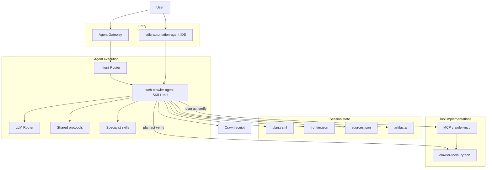

| Component | Responsibility | Artifact |
|-----------|----------------|----------|
| **Agent Gateway** | HTTP/WS entry, sessions (server path) | `services/agent-gateway/` |
| **Intent Router** | Route to specialist agent | `services/intent-router/` |
| **LLM Router** | Model profiles, fallbacks, budgets | `services/llm-router/` |
| **Orchestrator** | IDE routing; engagement mode | `settings.md` |
| **web-crawler-agent** | Modes, tool selection, summarization | `agents/web-crawler/SKILL.md` |
| **crawl-session protocol** | Session layout, receipt schema | `skills/_shared/protocols/crawl-session.md` |
| **crawler-tools** | Deterministic fetch, robots, SSRF, store | `services/crawler-tools/` |
| **Citation validator** | Block hallucinated URLs in output | `services/crawler-tools/validate.py` |

#### Agent allowed-tools (planned frontmatter)

```yaml
name: web-crawler-agent
allowed-tools: Read, Grep, Glob, Write, WebSearch, WebFetch
# Plus registered tools: check_robots, fetch_page, enqueue_url, store_artifact,
# query_session, summarize_crawl, submit_crawl_job
risk_tier: high
```

`WebFetch` / `WebSearch` are used only in **`discover`** mode for seed finding. **`crawl`** mode MUST use `fetch_page` (guarded) for all stored pages.

#### Crawl receipt schema (extends receipt-protocol)

```json
{
  "story_id": "CRAWL-042",
  "role": "web-crawler",
  "session_id": "sess_abc123",
  "artifacts": [
    ".sdlc-automation-agent/crawler/sessions/sess_abc123/summary.md",
    ".sdlc-automation-agent/crawler/sessions/sess_abc123/sources.json"
  ],
  "metrics": {
    "pages_fetched": 24,
    "pages_skipped_robots": 2,
    "pages_failed": 1,
    "citation_count": 18,
    "hallucinated_urls": 0
  },
  "sources": ["https://example.com/docs", "..."],
  "verification_commands": [
    "python -m crawler_tools.validate_citations sess_abc123"
  ],
  "completed_at": "2026-06-03T12:00:00Z"
}
```

### 8.2 Backing execution plane

Used when `submit_crawl_job` runs or operator calls REST API directly. The **agent is a client** of this plane.

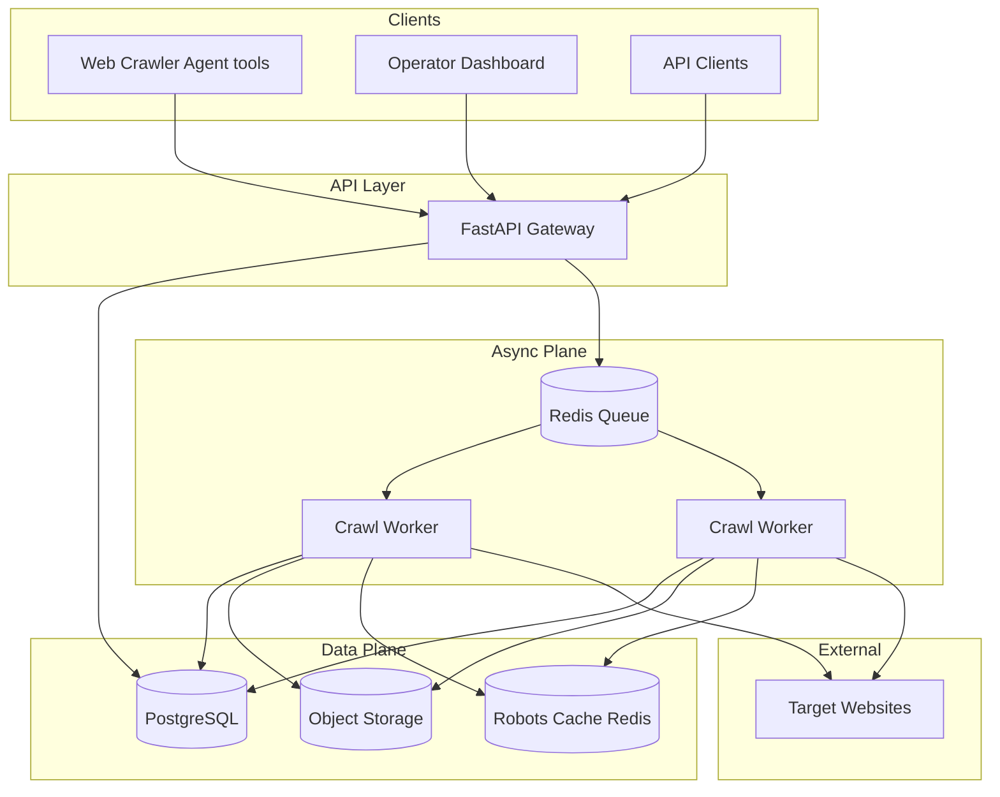

### 8.3 Components

| Component | Layer | Responsibility | Technology |
|-----------|-------|----------------|------------|
| **web-crawler-agent** | Cognitive | Plan, tool loop, summarize | SKILL.md + modes |
| **crawler-tools** | Cognitive | Tool implementations | Python 3.12 |
| **api** | Backing | REST API, auth, job CRUD | FastAPI, Pydantic v2 |
| **worker** | Backing | Frontier, fetch, parse, persist | Python asyncio, httpx |
| **scheduler** | Backing | Delayed retries | ARQ |
| **frontier** | Backing | URL dedup, depth | PostgreSQL + Redis |
| **fetcher** | Backing | HTTP GET (same guards as tool) | httpx |
| **robots** | Both | Shared library used by tool + worker | `reppy` |
| **parser** | Backing | HTML → fields | selectolax |
| **storage** | Backing | Metadata + blob | SQLAlchemy + S3 |
| **dashboard** | Backing | Operator UI | Next.js 15 |

### 8.4 Architecture decisions (ADRs)

> **SA deliverable path:** `docs/architecture/adrs/ADR-NNN-*.md` — summaries below; full ADRs created in SA Phase 2.

#### ADR-000: Agent-first product; backing plane is tool infrastructure

**Status:** Accepted  
**Context:** Users interact via natural language in the IDE; long-run crawls need persistence.  
**Decision:** Ship **web-crawler-agent** (SKILL + tools + session) as the product. API/worker/DB are **backing tools** invoked via `submit_crawl_job` / `fetch_page` implementation.  
**Consequences:** (+) Aligns with sdlc-automation-agent model; (+) IDE sessions work without cloud. (−) Two layers to test (agent eval + service integration).  
**Alternatives considered:** API-only crawler SaaS (rejected: not an AI agent); pure WebFetch loops (rejected: no guardrails/receipts).

#### ADR-010: LLM plans; tools execute all network I/O

**Status:** Accepted  
**Decision:** Model MUST NOT fetch URLs except through `fetch_page` / guarded tools. `WebFetch` allowed only in `discover` mode for non-persisted previews.  
**Testability:** Agent eval asserts tool call trace; static check on SKILL.md instructions.

#### ADR-011: Citation validator blocks hallucinated sources

**Status:** Accepted  
**Decision:** `summarize_crawl` output parsed; any URL not in `sources.json` fails verify and triggers regen or human review.  
**Testability:** `validate_citations` CLI in receipt `verification_commands`.

#### ADR-012: Session-first storage; backing store for scale

**Status:** Accepted  
**Decision:** IDE sessions use `.sdlc-automation-agent/crawler/sessions/`; workers sync to PG+S3 on job handoff.  
**Consequences:** (+) Fast iteration; (+) clear artifact paths for receipts. (−) Session folder growth — lifecycle policy in steering.

#### ADR-001: Modular monolith with async worker plane

**Status:** Accepted  
**Context:** Crawler needs API responsiveness and long-running fetch work without operational overhead of many microservices at v1.  
**Decision:** Single repo with three deployable units: `api`, `worker`, `dashboard`. Shared `packages/shared` for schemas and DB models. Async boundary via Redis queue — not HTTP between api and worker.  
**Consequences:** (+) Simple local dev and CI; clear ownership. (−) Worker scale is independent but shares DB migrations with API.  
**Alternatives considered:** Scrapy-as-a-service (rejected: less control over politeness/SSRF); full microservices (rejected: premature for v1).  
**Testability:** API and worker integration tested via docker-compose + testcontainers; queue mocked with fakeredis in unit tests.

#### ADR-002: PostgreSQL as system of record for crawl metadata

**Status:** Accepted  
**Context:** Job state, frontier, and page index need ACID updates and ad-hoc operator queries.  
**Decision:** PostgreSQL 16 (RDS / Azure Database for PostgreSQL in prod).  
**Consequences:** (+) Strong consistency for job lifecycle. (−) Write-heavy frontier at extreme scale may need sharding (v2).  
**Alternatives considered:** DynamoDB (rejected: complex query patterns for operator UI); MongoDB (rejected: weaker transactional job state).

#### ADR-003: Object storage for raw HTML bodies

**Status:** Accepted  
**Decision:** S3 (AWS) / Azure Blob (Azure) with SSE-KMS / customer-managed keys; MinIO locally.  
**Consequences:** (+) Low cost per GB; lifecycle rules for 90-day retention. (−) List/query by content requires metadata in PG, not S3 alone.

#### ADR-004: Redis for queue, rate limits, and robots cache

**Status:** Accepted  
**Decision:** ElastiCache Redis 7 / Azure Cache for Redis. ARQ for job queue; Redis token buckets for per-host RPS.  
**Consequences:** (+) Sub-ms rate-limit checks. (−) Queue durability depends on Redis AOF/persistence settings — use managed Redis with Multi-AZ in prod.

#### ADR-005: Defer headless browser to v2 (EPIC-006)

**Status:** Accepted  
**Decision:** v1 fetches static HTML via httpx only.  
**Consequences:** (+) 10× lower compute per page. (−) JS-rendered SPAs incomplete until Playwright worker added.

#### ADR-006: URL identity via normalized URL SHA-256

**Status:** Accepted  
**Decision:** Normalize scheme, host, path; strip default ports; optional trailing-slash policy documented in `shared/url.py`.  
**Testability:** Golden-file tests for normalization edge cases.

#### ADR-007: API-key auth v1; OAuth2/OIDC v2

**Status:** Accepted  
**Decision:** `X-API-Key` validated against hashed keys in DB or Secrets Manager; dashboard uses BFF session in v2.  
**Alternatives considered:** mTLS for service-only (deferred); Cognito/Entra from day one (rejected: operator count low at v1).

#### ADR-008: Egress via NAT with SSRF guardrails

**Status:** Accepted  
**Context:** Crawler workers fetch arbitrary user-supplied URLs — highest risk surface.  
**Decision:** Workers run in private subnets; egress only through NAT Gateway. Application-layer SSRF blocklist (RFC1918, link-local, metadata IPs, non-http schemes). No VPC endpoints to internal corp networks without explicit allowlist.  
**Testability:** Integration tests with mock HTTP servers on blocked IPs must fail closed.

#### ADR-009: Blue-green API deploy; rolling worker deploy

**Status:** Accepted  
**Decision:** Stateless API behind ALB/App Gateway uses blue-green. Workers use rolling deploy with graceful drain (finish in-flight URL, stop accepting new jobs).  
**Consequences:** Brief duplicate processing possible during worker roll — idempotent page upsert mitigates.

| ADR | Decision | Status |
|-----|----------|--------|
| ADR-000 | Agent-first product | Accepted |
| ADR-010 | LLM plans; tools fetch | Accepted |
| ADR-011 | Citation validator | Accepted |
| ADR-012 | Session-first storage | Accepted |
| ADR-001 | Modular monolith + queue | Accepted |
| ADR-002 | PostgreSQL metadata | Accepted |
| ADR-003 | S3/Blob raw HTML | Accepted |
| ADR-004 | Redis queue + cache | Accepted |
| ADR-005 | No headless v1 | Accepted |
| ADR-006 | URL SHA-256 identity | Accepted |
| ADR-007 | API-key auth v1 | Accepted |
| ADR-008 | NAT egress + SSRF guards | Accepted |
| ADR-009 | Blue-green API / rolling worker | Accepted |
| ADR-020 | LiteLLM LLM router | Accepted |
| ADR-021 | Service intent router (not persona) | Accepted |
| ADR-022 | Agent Gateway entry | Accepted |
| ADR-023 | Dual runtime IDE + LangGraph | Accepted |
| ADR-024 | MCP tool hub | Accepted |

### 8.5 Crawl job state machine

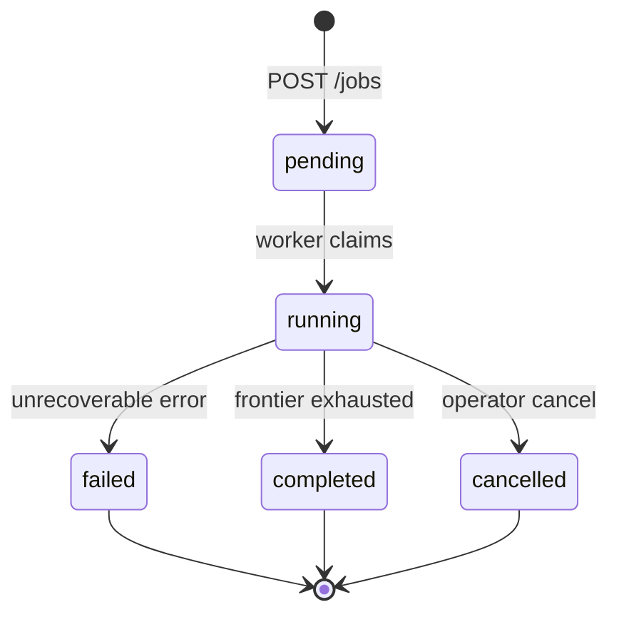

### 8.6 Requirements traceability (sample spec: `crawler-agent-core`)

| REQ-ID | EARS pattern | Requirement summary |
|--------|--------------|---------------------|
| REQ-01 | Ubiquitous | Agent shall produce crawl plan before persisted fetch |
| REQ-02 | Event-driven | When `fetch_page` succeeds, system shall append URL to `sources.json` |
| REQ-03 | Unwanted | If citation URL ∉ sources, validator shall fail verify |
| REQ-04 | Ubiquitous | Agent shall write crawl receipt on session complete |

| REQ-ID | Design element | Location |
|--------|----------------|----------|
| REQ-01 | `modes/crawl.md` plan step | `agents/web-crawler/modes/crawl.md` |
| REQ-02 | `store_artifact` tool | `services/crawler-tools/store.py` |
| REQ-03 | `validate_citations` | `services/crawler-tools/validate.py` |
| REQ-04 | Receipt schema | `skills/_shared/protocols/crawl-session.md` |

### 8.7 Security architecture

> **SA Phase 2 + Compliance Engineer Phase 1.** Canonical threat model: `docs/architecture/threat-model.md`.

#### Defense in depth

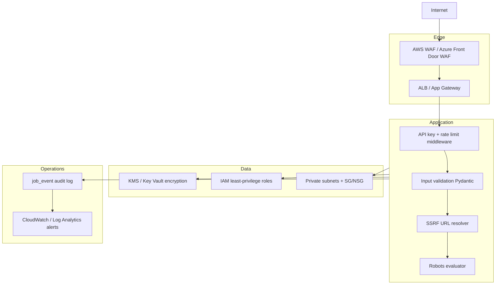

#### Threat model (STRIDE summary)

| Threat | Component | Mitigation | Owner |
|--------|-----------|------------|-------|
| **Spoofing** | API | API keys hashed (bcrypt/argon2); rotate via admin endpoint; keys in Secrets Manager | SE + PE |
| **Tampering** | `job_event`, S3 objects | Append-only events; S3 versioning + SSE-KMS; PG row-level `updated_at` checks | SE |
| **Repudiation** | All mutations | Structured audit log with `actor`, `job_id`, `trace_id`; CloudTrail for infra changes | PE |
| **Information disclosure** | Logs, S3, API | No raw HTML in logs; presigned URLs TTL 15 min; dashboard RBAC v2 | SE + CE |
| **Denial of service** | API, workers, targets | API rate limit per key; worker concurrency caps; mandatory crawl politeness | SE |
| **Elevation of privilege** | Worker SSRF → internal network | SSRF blocklist; private subnet egress only via NAT; no IMDS v1 | SE + PE |

#### SSRF controls (worker fetch path)

| Check | Rule |
|-------|------|
| Scheme allowlist | `http`, `https` only |
| DNS resolution | Resolve before connect; reject if any A/AAAA in blocked CIDRs |
| Blocked CIDRs | `10.0.0.0/8`, `172.16.0.0/12`, `192.168.0.0/16`, `127.0.0.0/8`, `169.254.0.0/16`, `::1`, link-local |
| Redirect policy | Max 5 redirects; re-validate each redirect URL |
| Port allowlist | 80, 443 only (configurable deny override in prod) |
| Response size cap | 10 MB default; abort fetch |

#### Identity and secrets

| Secret | Storage | Rotation |
|--------|---------|----------|
| API keys | AWS Secrets Manager / Azure Key Vault; hash in PG | 90 days or on compromise |
| DB credentials | IAM auth (RDS) or managed identity (Azure) | Automatic |
| Redis auth | ElastiCache AUTH token in Secrets Manager | 90 days |
| S3 access | IAM role per task (ECS) / workload identity (AKS) | N/A (role-based) |

#### Network security (production)

| Zone | Resources | Ingress | Egress |
|------|-----------|---------|--------|
| **Public** | ALB, NAT Gateway | 443 from Internet (WAF filtered) | To Internet via NAT |
| **Private app** | ECS tasks / App Service (api, worker) | From ALB only (api); none (worker) | HTTPS to Internet via NAT; to data tier |
| **Private data** | RDS, ElastiCache, S3 (VPC endpoint) | From app SG only | None to Internet |

**Zero-trust notes:** Security groups / NSGs deny by default. Worker tasks have **no** inbound rules. S3 accessed via VPC gateway endpoint to avoid public internet path for blobs.

#### Data protection

| Data class | At rest | In transit | Retention |
|------------|---------|------------|-----------|
| Raw HTML (S3) | SSE-KMS | TLS 1.2+ | 90 days lifecycle → Glacier/delete |
| Job metadata (PG) | RDS encryption | TLS | While account active + 30 days backup |
| API keys | Hashed in PG | TLS | Until revoked |
| Logs | CloudWatch encrypted | TLS | 30 days hot, 1 year archive |

#### Compliance alignment

| Control | Implementation |
|---------|----------------|
| robots.txt / crawl ethics | Default on; `robots_denied` events auditable |
| GDPR (if EU targets) | Data minimization in parser; export/delete by `job_id` (v2) |
| SOC2-style change mgmt | PR + CI + prod approval gate; ADRs for arch changes |

---

#### Agent-specific threats

| Threat | Surface | Mitigation |
|--------|---------|------------|
| **Prompt injection via page HTML** | `fetch_page` content fed to model | Strip `<script>`, summarize via tool with max tokens; optional HTML-to-text only; CE review |
| **Indirect prompt injection** | Malicious site targets crawler | Tool output sanitization; never execute embedded JS in v1 |
| **Tool misuse** | Model calls wrong tool | JSON schema validation; max tool calls per session |
| **Unbounded crawl** | Runaway frontier | `max_pages`, `max_depth` in plan; hard stop in worker |
| **Secret exfiltration** | Page contains fake instructions | Agent iron-laws: never send env/secrets to external URLs |

### 8.8 Infrastructure topology

> **SA Phase 2 diagram + PE Phase 2 IaC.** Primary reference: **AWS**; Azure mapping in §8.8.3.

#### 8.8.1 C4 context

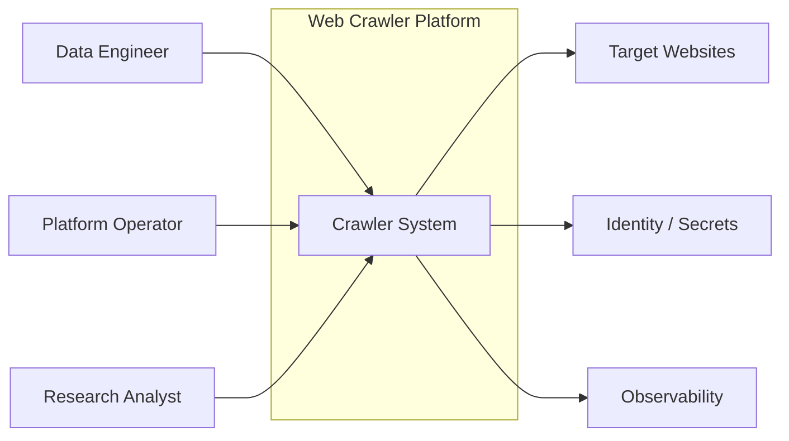

#### 8.8.2 AWS production topology

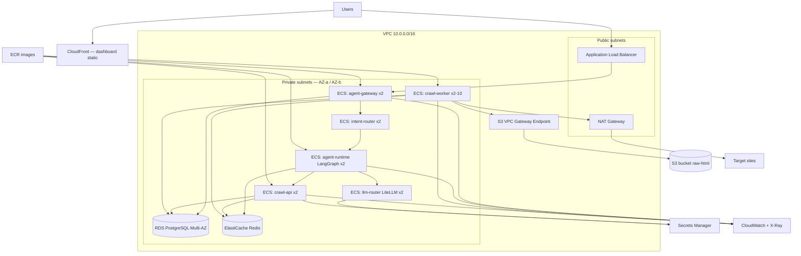

#### 8.8.3 Azure equivalent mapping

| AWS | Azure | Notes |
|-----|-------|-------|
| ECS Fargate | Azure Container Apps | Scale worker 0–N |
| ALB | Application Gateway + WAF | Routes `/v1/agent/*` to agent-gateway |
| LiteLLM on ECS | Azure API Mgmt + Foundry model router | LLM router (ADR-020) |
| RDS PostgreSQL | Azure Database for PostgreSQL Flexible | |
| ElastiCache Redis | Azure Cache for Redis | |
| S3 | Azure Blob Storage | |
| Secrets Manager | Key Vault | |
| CloudWatch | Log Analytics + App Insights | |
| NAT Gateway | NAT Gateway (azurerm) | Worker egress |
| CloudFront | Azure Front Door | Dashboard CDN |

#### 8.8.4 IaC layout (PE standard)

```
infra/opentofu/
├── modules/
│   ├── networking/     # VPC, subnets, NAT, endpoints
│   ├── compute/        # ECS cluster, services, task defs
│   ├── database/       # RDS, ElastiCache
│   ├── storage/        # S3, lifecycle, KMS
│   ├── security/       # IAM roles, WAF, secrets
│   └── monitoring/     # Alarms, dashboards
├── environments/
│   ├── dev/
│   ├── staging/
│   └── prod/
└── README.md
```

#### 8.8.5 Sizing (initial — staging)

| Resource | Dev | Staging | Prod (baseline) |
|----------|-----|---------|-----------------|
| API tasks | 1 × 0.25 vCPU / 512 MB | 2 × 0.5 vCPU / 1 GB | 2 × 1 vCPU / 2 GB |
| Worker tasks | 1 × 0.5 vCPU / 1 GB | 2 × 1 vCPU / 2 GB | 2–10 autoscale on queue depth |
| RDS | db.t4g.micro | db.t4g.small Multi-AZ | db.r6g.large Multi-AZ |
| Redis | cache.t4g.micro | cache.t4g.small | cache.r6g.large |
| S3 | 1 bucket | 1 bucket + lifecycle | 1 bucket + Intelligent-Tiering |

**Autoscale signal (workers):** `ARQ queue depth > 100` for 5 min → +1 task (max 10). Scale in when depth `< 10` for 15 min.

#### 8.8.6 Local / CI parity

`docker-compose.yml` mirrors production topology at reduced scale:

| Service | Image | Ports |
|---------|-------|-------|
| api | `services/api/Dockerfile` | 8000 |
| worker | `services/worker/Dockerfile` | — |
| postgres | postgres:16 | 5432 |
| redis | redis:7 | 6379 |
| minio | minio | 9000 |

QE integration tests run against this stack in CI via GitHub Actions service containers or testcontainers.

---

### 8.9 Deployment architecture

> **PE Phases 2–3.** Pipelines at `.github/workflows/`; runbooks at `docs/runbooks/`.

#### 8.9.1 Environments

| Env | Purpose | Deploy trigger | Data |
|-----|---------|----------------|------|
| **local** | Developer | Manual `docker compose` | Synthetic seeds only |
| **dev** | Integration | Push to `develop` | Anonymized fixtures |
| **staging** | Pre-prod validation | Merge to `main` | Sanitized copy; no prod secrets |
| **prod** | Customer workloads | Release tag + manual approval | Live |

#### 8.9.2 CI pipeline (`ci.yml`)


| Stage | Gate | Fail action |
|-------|------|-------------|
| Lint / typecheck | Zero errors | Block merge |
| Unit + integration | 100% required suites pass | Block merge |
| SAST / deps | No critical/high | Block merge (waivable with CE sign-off) |
| Image build | Dockerfile reproducible | Block merge |

#### 8.9.3 CD pipeline — API (blue-green)

```mermaid
sequenceDiagram
  participant GH as GitHub Actions
  participant ECR as ECR
  participant ECS as ECS Service
  participant ALB as ALB
  participant SM as smoke-test.sh

  GH->>ECR: Push image :sha
  GH->>ECS: Deploy green task set (new task def)
  ECS->>SM: /health /ready
  SM-->>GH: Pass
  GH->>ALB: Switch target group to green
  GH->>ECS: Drain blue tasks
  Note over GH,ECS: On failure: ALB stays on blue; rollback.sh
```

**Steps:**

1. Register new ECS task definition with image digest tag (immutable).
2. Update green service to 100% desired count; wait for `services-stable`.
3. Run `scripts/smoke-test.sh staging` — `POST /v1/jobs` with canary seed URL (allowlisted domain).
4. Shift ALB listener rule to green target group.
5. Scale blue to zero after 5 min soak.

#### 8.9.4 CD pipeline — Worker (rolling + graceful drain)

| Step | Action |
|------|--------|
| 1 | Set worker service `deploymentConfiguration.maximumPercent=100`, `minimumHealthyPercent=50` |
| 2 | New tasks start; old tasks receive SIGTERM |
| 3 | Worker handles SIGTERM: stop dequeuing; finish current URL (max 120 s) |
| 4 | If timeout → requeue in-flight URL via `fetched_url.status=queued` |
| 5 | Verify queue depth stable; no spike in `crawl_errors_total` |

#### 8.9.5 Database migrations

| Rule | Implementation |
|------|----------------|
| Backward compatible | Expand-contract pattern; no destructive DDL in same release as code |
| Order | `alembic upgrade head` in one-off ECS task **before** API green deploy |
| Rollback | `alembic downgrade -1` documented per migration; `rollback.sh` runs downgrade if migration id in release notes |

#### 8.9.6 Production deploy gate

| Gate | Approver | Evidence |
|------|----------|----------|
| Staging smoke green 24 h | PE | Dashboard link |
| CE security scan | Compliance Engineer | No open critical |
| SA arch drift check | Solution Architect | ADR updated if infra changed |
| Human approval | Platform Operator | GitHub Environment `production` |

#### 8.9.7 Observability at deploy

| Signal | Alert threshold | Action |
|--------|-----------------|--------|
| `crawl_errors_total` rate | > 5% of `crawl_pages_total` for 10 min | Pause worker autoscale; page operator |
| API 5xx rate | > 1% for 5 min | Auto rollback API target group |
| RDS CPU | > 80% for 15 min | Scale instance class (runbook) |
| DLQ / failed jobs | > 50 in 1 h | Inspect `job_event`; block new jobs if systemic |

#### 8.9.8 Rollback procedure (mandatory)

`scripts/rollback.sh {env}`:

1. Revert ECS task definition to previous revision (stored in SSM parameter `/crawler/{env}/last-stable-task-def`).
2. ALB → previous target group (API).
3. Run `scripts/rollback-smoke-test.sh` — version header matches previous.
4. If migration shipped: run documented `alembic downgrade` only when CE approved.

CI validates rollback on staging on every `cd-staging.yml` run (deploy → smoke → rollback → smoke).

---

### 8.10 Architecture trade-offs

> **SA Phase 1 fitness functions.** Use these matrices when revisiting OD-01–OD-04.

#### 8.10.1 Agent vs traditional crawler service

| Option | UX | Guardrails | Citations | Verdict |
|--------|-----|------------|-----------|---------|
| **Comprehensive platform** (chosen for prod) | Gateway + routers + specialists | Central auth + LLM governance | Validator | **Server / multi-tenant** |
| **IDE-native agent** (chosen for dev) | Cursor / Claude Code direct | Tools + protocols | Validator | **Default dev path** |
| REST-only microservice | API/curl | App layer only | Client responsibility | Crawl jobs API only |
| Raw WebFetch in chat | Easy | Weak | Hallucination risk | **discover mode only** |

#### 8.10.2 Pattern selection (backing plane)

| Option | Time to v1 | Ops burden | Crawl flexibility | SSRF control | Verdict |
|--------|------------|------------|-------------------|--------------|---------|
| **Modular monolith + workers** (chosen) | Low | Low | High | Strong | **Default** |
| Scrapy cluster | Medium | Medium | High | Medium | Revisit at 1M pages/day |
| Serverless (Lambda per URL) | Medium | Low | Medium | Medium | Cost spike at scale |
| K8s raw deployments | High | High | High | Strong | Defer until multi-tenant |

#### 8.10.3 Queue: ARQ vs Celery

| Criterion | ARQ | Celery |
|-----------|-----|--------|
| Asyncio-native httpx | **Yes** | Requires sync bridge |
| Operational familiarity | Medium | **High** |
| Delayed retries | **Yes** | **Yes** |
| Managed compatibility | Redis only | Redis/RabbitMQ/SQS |
| **Decision** | **ARQ for v1** — aligns with async fetcher | Migrate if team standardizes on Celery |

#### 8.10.4 Parser: selectolax vs BeautifulSoup

| Criterion | selectolax | BeautifulSoup |
|-----------|------------|---------------|
| Speed (1 MB HTML) | **~50–100 ms** | ~300–500 ms |
| Lenient HTML | Good | **Best** |
| Team familiarity | Medium | **High** |
| **Decision** | **selectolax** — NFR-PERF-02 | Fallback adapter if parse failure rate > 2% |

#### 8.10.5 Cloud primary: AWS vs Azure

| Criterion | AWS | Azure |
|-----------|-----|-------|
| ECS Fargate maturity | **High** | Container Apps good |
| S3 + lifecycle | **Mature** | Blob equivalent |
| Team pack in repo | **`packs/clouds/aws`** | Add `packs/clouds/azure` |
| **Decision** | **AWS default** for v1 | First-class alternate via module swap in §8.8.3 |

#### 8.10.6 Politeness vs throughput

| Setting | Polite (default) | Aggressive (opt-in) |
|---------|------------------|---------------------|
| RPS per host | 1.0 | Up to 5.0 with CE approval |
| Concurrent hosts | 10 per worker | 50 per worker |
| Risk | Low block rate | IP ban, legal exposure |
| **Decision** | **Default polite**; aggressive requires `job.politeness.tier=approved` flag + audit |

#### 8.10.7 Consistency vs cost (storage)

| Strategy | Consistency | Cost | Choice |
|----------|-------------|------|--------|
| PG + S3 always | Strong metadata | Medium | **v1** |
| Eventual blob write | Weaker | Lower | Reject |
| Duplicate raw HTML per fetch | Strong audit | **High** | Reject — content-hash dedup (ADR-006) |

#### 8.10.8 Accepted trade-off summary

| We optimize for | We accept |
|-----------------|-----------|
| **Trustworthy agent output (cited sources)** | Extra validator + receipt step |
| Compliance & SSRF safety | Lower max throughput vs aggressive crawlers |
| IDE-first sessions (no cloud required) | Backing plane needed for large crawls |
| Operability (one repo, docker-compose) | Not infinite horizontal scale day one |
| Static HTML v1 | Incomplete SPA coverage until EPIC-006 browser tool |
| API-key simplicity | No SSO until v2 dashboard BFF |

---

## 9. Data model

### Agent session (filesystem — primary for IDE crawls)

| File | Purpose |
|------|---------|
| `plan.yaml` | Approved seeds, depth, `max_pages`, politeness |
| `frontier.json` | Queue state: `pending`, `done`, `skipped` URLs |
| `sources.json` | Canonical citation list (validator source of truth) |
| `artifacts/{hash}/meta.json` | title, url, content_hash, fetched_at |
| `artifacts/{hash}/page.html` | Raw body (optional if only metadata) |

### Backing plane (PostgreSQL — jobs and scale)

### Agent platform (PostgreSQL — server-hosted sessions)

```text
agent_session
  id              UUID PK
  external_id     text unique  -- client-facing session_id
  agent_name      text         -- web-crawler-agent
  mode            text
  status          enum(active,completed,failed)
  engagement_mode text
  created_at      timestamptz

agent_message
  id              UUID PK
  session_id      UUID FK
  role            enum(user,assistant,tool)
  content         text
  created_at      timestamptz

routing_decision
  id              UUID PK
  session_id      UUID FK
  intent          text
  confidence      float
  agent_name      text
  mode            text
  created_at      timestamptz

llm_usage
  id              UUID PK
  session_id      UUID FK
  step            text         -- classify, plan, summarize, ...
  profile         text         -- fast, balanced, strong
  model           text
  input_tokens    int
  output_tokens   int
  cost_usd        decimal
  created_at      timestamptz
```

### Core entities (crawl jobs)

```text
crawl_job
  id              UUID PK
  status          enum(pending,running,completed,failed,cancelled)
  max_depth       int
  max_pages       int nullable
  same_host_only  bool default true
  created_at      timestamptz
  updated_at      timestamptz

crawl_seed
  id              UUID PK
  job_id          UUID FK → crawl_job
  url             text
  normalized_url  text indexed

job_event
  id              UUID PK
  job_id          UUID FK
  event_type      text  -- claimed, fetch_ok, robots_denied, failed, ...
  payload         jsonb
  created_at      timestamptz

fetched_url
  id              UUID PK
  job_id          UUID FK
  url             text
  normalized_url  text unique per job
  depth           int
  status          enum(queued,fetched,skipped,failed)

page
  id              UUID PK
  job_id          UUID FK
  url             text
  content_hash    char(64)
  title           text
  storage_key     text  -- S3 path
  first_seen_at   timestamptz
  last_seen_at    timestamptz

page_link
  id              UUID PK
  page_id         UUID FK → page
  href            text
  link_text       text nullable

robots_cache
  host            text PK
  body            text
  fetched_at      timestamptz
  expires_at      timestamptz
```

### ER diagram (simplified)

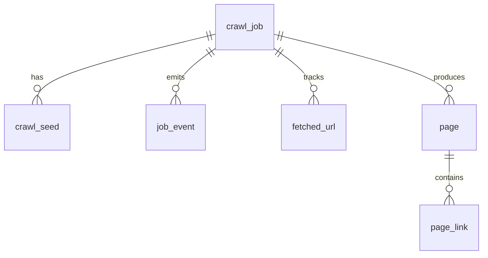

---

## 10. API contracts

> **Backing plane only.** The **Web Crawler Agent** uses **tools** (`fetch_page`, `submit_crawl_job`) as primary interface. REST API supports operators, dashboards, and long-run jobs.

### Agent platform API (`api/openapi/agent-platform.yaml`)

| Method | Path | Description |
|--------|------|-------------|
| `POST` | `/v1/agent/sessions` | Create agent session |
| `POST` | `/v1/agent/sessions/{id}/messages` | Send message; stream response (SSE) |
| `GET` | `/v1/agent/sessions/{id}` | Session state, artifacts, receipt |
| `POST` | `/v1/agent/sessions/{id}/approve-plan` | HITL approve crawl plan (Controlled) |
| `GET` | `/v1/agent/health` | Gateway health |

### Crawl job API (`api/openapi/crawler.yaml`)

### Jobs

| Method | Path | Description |
|--------|------|-------------|
| `POST` | `/v1/jobs` | Create crawl job |
| `GET` | `/v1/jobs` | List jobs (paginated) |
| `GET` | `/v1/jobs/{job_id}` | Job detail + stats |
| `POST` | `/v1/jobs/{job_id}/cancel` | Cancel running job |

**Create job request (excerpt):**

```json
{
  "seeds": ["https://example.com/"],
  "max_depth": 2,
  "max_pages": 500,
  "same_host_only": true,
  "politeness": {
    "requests_per_second": 1.0,
    "respect_robots": true
  }
}
```

### Pages

| Method | Path | Description |
|--------|------|-------------|
| `GET` | `/v1/pages` | Query `?job_id=&q=` |
| `GET` | `/v1/pages/{page_id}` | Page metadata + signed URL for raw HTML |

### Health

| Method | Path | Description |
|--------|------|-------------|
| `GET` | `/health` | Liveness |
| `GET` | `/ready` | DB + Redis + queue reachable |

---

## 11. Implementation tasks

Tasks follow Kiro `tasks.md` rules: one unchecked task at a time, verify before checkbox.

### Spec: `crawler-agent-core` (US-A01, US-A02) — **ship first**

| Task | Title | Refs | Owner | Verify |
|------|-------|------|-------|--------|
| T1 | Create `agents/web-crawler/SKILL.md` + `agent.md` | FEAT-000 | SE | `test -f agents/web-crawler/SKILL.md` |
| T2 | Add `skills/_shared/protocols/crawl-session.md` | FEAT-012 | SE | `test -f skills/_shared/protocols/crawl-session.md` |
| T3 | Implement modes: `discover`, `crawl` | FEAT-011 | SE | `pytest agents/web-crawler/tests/test_modes.py` |
| T4 | Implement `crawler-tools`: `fetch_page`, `check_robots`, `store_artifact` | AC-A04–A06 | SE | `pytest services/crawler-tools/tests/` |
| T5 | Citation validator `validate_citations` | ADR-011 | SE | `pytest services/crawler-tools/tests/test_validate.py` |
| T6 | Agent eval harness (10 URLs, 0 hallucinations) | AC-A02 | QE | `pytest tests/agent_eval/test_crawl_citations.py` |
| T7 | Wire orchestrator dispatch keyword `crawl` | §4.1 | SE | Manual: orchestrator routes to web-crawler-agent |

### Spec: `agent-platform` (US-A10, US-A11) — server path

| Task | Title | Refs | Owner | Verify |
|------|-------|------|-------|--------|
| T1 | Scaffold `services/agent-gateway` + session API | FEAT-020 | SE | `pytest services/agent-gateway/tests/` |
| T2 | Intent router service + routing table | FEAT-021, ADR-021 | SE | `pytest services/intent-router/tests/` |
| T3 | LiteLLM `services/llm-router` + profiles | FEAT-022, ADR-020 | SE | `curl localhost:4000/health` |
| T4 | `crawler-mcp` MCP server | FEAT-023, ADR-024 | SE | MCP inspector tool list |
| T5 | OTel + `llm_usage` persistence | FEAT-024 | PE | Dashboard shows token/cost |
| T6 | LangGraph runtime graph (optional) | ADR-023 | SE | `pytest services/agent-runtime/tests/` |
| T7 | E2E: gateway → crawl → receipt | AC-A10–A13 | QE | `pytest tests/e2e/test_agent_gateway_crawl.py` |

### Spec: `crawl-job-api` (US-001)

| Task | Title | Refs | Owner | Verify |
|------|-------|------|-------|--------|
| T1 | Scaffold FastAPI app + config | REQ-01 | SE | `cd services/api && pytest tests/test_health.py` |
| T2 | Add `crawl_job` / `crawl_seed` migrations | REQ-02 | SE | `alembic upgrade head` |
| T3 | Implement `POST /v1/jobs` | REQ-02, REQ-04 | SE | `pytest tests/test_jobs_create.py` |
| T4 | Implement `GET /v1/jobs/{id}` | REQ-02 | SE | `pytest tests/test_jobs_get.py` |
| T5 | API key middleware | REQ-01 | SE | `pytest tests/test_auth.py` |
| T6 | Contract tests from OpenAPI | AC-001–003 | QE | `pytest tests/contract/` |

### Spec: `crawl-worker` (US-002)

| Task | Title | Refs | Owner | Verify |
|------|-------|------|-------|--------|
| T1 | ARQ worker bootstrap + Redis connection | REQ-03 | SE | `pytest worker/tests/test_worker_boot.py` |
| T2 | Job claim + state `pending→running` | REQ-03 | SE | `pytest worker/tests/test_claim.py` |
| T3 | Retry with exponential backoff | AC-005 | SE | `pytest worker/tests/test_retry.py` |
| T4 | Terminal `failed` + `job_event` | AC-006 | SE | `pytest worker/tests/test_failure.py` |
| T5 | Integration: API create → worker complete | AC-004 | QE | `pytest tests/integration/test_job_lifecycle.py` |

### Spec: `robots-compliance` (US-003)

| Task | Title | Refs | Owner | Verify |
|------|-------|------|-------|--------|
| T1 | `robots_cache` table + fetcher | AC-007, AC-009 | SE | `pytest worker/tests/test_robots_cache.py` |
| T2 | Path allow/deny evaluator | AC-007, AC-008 | SE | `pytest worker/tests/test_robots_eval.py` |
| T3 | Emit `robots_denied` events | AC-007 | SE | `pytest worker/tests/test_robots_events.py` |

### Spec: `rate-limiting` (US-004)

| Task | Title | Refs | Owner | Verify |
|------|-------|------|-------|--------|
| T1 | Per-host token bucket (Redis) | AC-010 | SE | `pytest worker/tests/test_rate_limit.py` |
| T2 | Honor `Crawl-delay` from robots | AC-011 | SE | `pytest worker/tests/test_crawl_delay.py` |

### Spec: `page-storage` (US-005)

| Task | Title | Refs | Owner | Verify |
|------|-------|------|-------|--------|
| T1 | Frontier BFS + depth limits | FEAT-007 | SE | `pytest worker/tests/test_frontier.py` |
| T2 | httpx fetcher (timeout, redirects) | — | SE | `pytest worker/tests/test_fetcher.py` |
| T3 | Parser: title, links, text | AC-012 | SE | `pytest worker/tests/test_parser.py` |
| T4 | S3 writer + content hash dedup | AC-013 | SE | `pytest worker/tests/test_storage.py` |
| T5 | `GET /v1/pages` query API | AC-014 | SE | `pytest tests/test_pages_list.py` |

### Spec: `operator-dashboard` (US-006) — Sprint 2

| Task | Title | Owner | Verify |
|------|-------|-------|--------|
| T1 | Next.js app scaffold | SE | `npm run build` |
| T2 | Job list page | SE | `npm run test -- jobs` |
| T3 | Job detail + events | SE | `npm run test -- job-detail` |
| T4 | E2E smoke | QE | `npx playwright test e2e/dashboard.spec.ts` |

### Platform (EPIC-001)

| Task | Title | Owner | Verify |
|------|-------|-------|--------|
| T1 | `docker-compose.yml` (api, worker, pg, redis, minio) | PE | `docker compose up -d && curl localhost:8000/health` |
| T2 | GitHub Actions: lint + test + build | PE | CI green on PR |
| T3 | Terraform module (optional AWS: ECS + RDS + S3) | PE | `terraform validate` |

---

## 12. Non-functional requirements

| NFR-ID | Requirement | Threshold | Verified by |
|--------|-------------|-----------|-------------|
| NFR-AGENT-01 | Hallucinated citation rate | 0% on eval set | `validate_citations` |
| NFR-AGENT-02 | Max tool calls per session | ≤ 500 (configurable) | session metrics |
| NFR-PLATFORM-01 | Gateway p95 (excl. LLM) | < 300 ms | k6 |
| NFR-PLATFORM-02 | Intent classification p95 | < 500 ms | metrics |
| NFR-PLATFORM-03 | LLM router fallback success | > 99% on primary outage drill | chaos test |
| NFR-PERF-01 | API read p95 latency | < 200 ms @ 50 RPS | k6 / QE perf test |
| NFR-PERF-02 | Parse 1 MB HTML | < 500 ms p95 | unit benchmark |
| NFR-SCALE-01 | Single worker throughput | ≥ 30 pages/min polite mode | load test |
| NFR-REL-01 | Worker crash recovery | Job resumes or fails cleanly within 60 s | chaos test |
| NFR-OBS-01 | Structured logs | JSON with `job_id`, `url`, `trace_id` | PE review |
| NFR-OBS-02 | Metrics | `crawl_pages_total`, `crawl_errors_total` | Prometheus scrape |

---

## 13. Security and compliance

> **Expanded security architecture:** §8.7. **Compliance Engineer** validates before prod gate.

### 13.1 Operator crawl policy

1. Only crawl hosts you are authorized to access.
2. Keep default rate limits unless contract allows higher.
3. Do not bypass robots or authentication.
4. Retain raw HTML per data retention policy (default 90 days).

### 13.2 Control checklist (CE sign-off)

| ID | Control | Design ref | Test |
|----|---------|------------|------|
| SEC-00 | Citation validator (0 hallucinated URLs) | ADR-011, §8.1 | `validate_citations` |
| SEC-01 | robots.txt honored by default | §8.7, US-003 | `test_robots_eval.py` |
| SEC-02 | SSRF blocklist on fetch | ADR-008, §8.7 | `test_ssrf_blocked.py` |
| SEC-03 | API key on mutating endpoints | ADR-007 | `test_auth.py` |
| SEC-04 | Encryption at rest (RDS, S3) | §8.7 | PE IaC review |
| SEC-05 | TLS 1.2+ in transit | §8.7 | SSL Labs / ACM cert |
| SEC-06 | No secrets in logs | §8.7 | Log sampling audit |
| SEC-07 | WAF on public API | §8.8.2 | PE terraform plan |
| SEC-08 | Prod deploy human gate | §8.9.6 | GitHub Environment |
| SEC-09 | HTML prompt-injection sanitization | §8.7 | CE + `test_sanitize_html.py` |

### 13.3 Quick reference

| Concern | Approach |
|---------|----------|
| **robots.txt / ToS** | Default `respect_robots: true`; customer responsibility documented in ToS |
| **Rate limiting** | Mandatory per-host limits; no global disable in prod |
| **SSRF** | Full controls in §8.7 — block private IPs, metadata, non-http schemes |
| **Secrets** | Secrets Manager / Key Vault; hashed API keys in PG |
| **PII** | Optional `strip_pii` on export (v2); no PII in logs |
| **Auth** | `X-API-Key` v1; OAuth2/OIDC v2 for dashboard |
| **Audit** | `job_event` append-only + CloudTrail |

---

## 14. Delivery plan

| Sprint | Goal | Epics | Exit criteria |
|--------|------|-------|---------------|
| **Sprint 0** | Inception + **agent core** | EPIC-000, EPIC-001 | BRD approved; `crawler-agent-core` spec done; agent eval passes |
| **Sprint 1** | Agent core + tools | EPIC-000, EPIC-001 | US-A01–A02; crawler-agent-core eval passes |
| **Sprint 2** | Backing + platform | EPIC-002–004, EPIC-007 | US-001–005; gateway E2E (if server path) |
| **Sprint 3** | Operator UX | EPIC-005 | US-A03, US-006–008 |
| **Sprint 4** | Hardening | All | CE sign-off; prod deploy gate |

### Inception spec gate (Kiro)

For each Sprint 1 **Must** story, before SE starts:

- [ ] `.sdlc-automation-agent/specs/{spec-id}/requirements.md` — `requirements_approved: true`
- [ ] `.sdlc-automation-agent/specs/{spec-id}/design.md` — `design_approved: true`
- [ ] `.sdlc-automation-agent/specs/{spec-id}/tasks.md` — `tasks_approved: true`

---

## 15. How to run with sdlc-automation-agent

### 15.1 Build the crawler agent (SDLC)

```text
User: "Build a web crawler agent using sdlc-automation-agent. Use docs/crawler.md as the product brief."

Orchestrator:
  1. init mode → scaffold .sdlc-automation-agent/ + steering/ + crawler/sessions/
  2. PM full mode → BRD from this doc; epics EPIC-000 first
  3. PM Step 3b → specs: crawler-agent-core, crawl-job-api, ...
  4. SA phases 1–7 → agent tool contracts + backing SAD; §8.1–8.10
  5. CE → threat model incl. prompt injection (§8.7)
  6. SE → EPIC-000 tasks before backing plane
  7. QE → agent eval harness (citation accuracy)
  8. PE → backing plane deploy when jobs needed
```

### 15.2 Run-time — invoke the crawler agent

```text
User: "Crawl https://example.com/docs up to depth 2 and summarize API authentication pages."

Orchestrator → web-crawler-agent (crawl mode):
  1. Draft plan.yaml → user approves (Controlled)
  2. Tool loop: check_robots → fetch_page → store_artifact → enqueue_url
  3. summarize_crawl → summary.md with citations
  4. validate_citations → receipt JSON
```

**Cursor:** Register skill at `.cursor/skills/web-crawler-agent/` or route via `skills/sdlc-automation-agent`.

### 15.4 Spec folder map

| Spec ID | Stories | Primary agent |
|---------|---------|---------------|
| `crawler-agent-core` | US-A01, US-A02 | PM → SA → SE (**first**) |
| `agent-platform` | US-A10, US-A11 | SA → SE (server deploy) |
| `crawler-tools` | US-A02 | SE |
| `crawl-job-api` | US-001 | PM → SA → SE |
| `crawl-worker` | US-002 | SA → SE |
| `robots-compliance` | US-003 | CE input → SA → SE |
| `rate-limiting` | US-004 | SA → SE |
| `page-storage` | US-005 | SA → SE |
| `operator-dashboard` | US-006 | SA → SE |
| `sitemap-discovery` | US-007 | PM feature mode |
| `export-results` | US-008 | PM feature mode |

### 15.5 Steering files (project-specific)

After init, populate:

| File | Content |
|------|---------|
| `.sdlc-automation-agent/steering/product.md` | Personas, crawl policy summary, KPIs from §1 |
| `.sdlc-automation-agent/steering/tech.md` | Pointer to `docs/architecture/tech-stack.yaml` |
| `.sdlc-automation-agent/steering/structure.md` | `agents/web-crawler/`, `services/crawler-tools/`, backing services |
| `.sdlc-automation-agent/steering/workflow.md` | Branch naming, PR rules, verify before receipt |

### 15.6 Suggested tech-stack.yaml (SA Phase 3)

```yaml
project:
  name: web-crawler-agent
  type: greenfield
  agent_entry: agents/web-crawler/SKILL.md

language:
  primary: python
  version: "3.12"

packs:
  language: python-fastapi
  cloud: aws

services:
  agent_gateway:
    path: services/agent-gateway
  intent_router:
    path: services/intent-router
  llm_router:
    path: services/llm-router
    engine: litellm
  agent_runtime:
    path: services/agent-runtime
    engine: langgraph  # optional
  crawler_agent:
    path: agents/web-crawler
  crawler_tools:
    path: services/crawler-tools
  api:
    framework: fastapi
    path: services/api
  worker:
    runtime: python
    queue: arq
    path: services/worker
  dashboard:
    framework: nextjs
    path: apps/dashboard

data:
  postgres: "16"
  redis: "7"
  object_storage: s3_compatible  # MinIO local, S3 prod

verify:
  lint: "ruff check services/ agents/web-crawler/"
  typecheck: "mypy services/"
  test: "pytest services/ tests/agent_eval/ -q"
  integration: "pytest tests/integration/ -q"
  build: "docker compose build"
  agent_eval: "pytest tests/agent_eval/test_crawl_citations.py"

cloud:
  pack: aws  # alternate: azure — see docs/crawler.md §8.8.3

deploy:
  api_strategy: blue-green
  worker_strategy: rolling-drain
  iac_path: infra/opentofu
  environments: [dev, staging, prod]
```

### 15.7 Agent prompts (copy-paste)

**PM — generate BRD from this doc:**

```text
Read docs/crawler.md. Run PM full pipeline: BRD, epics EPIC-000–005, features, stories US-A01–A03 and US-001–008.
Create Kiro specs starting with crawler-agent-core under .sdlc-automation-agent/specs/.
```

**SA — agent + backing design:**

```text
Read docs/crawler.md §8. Agent-first: tool contracts, crawl-session protocol, citation validator.
Then backing plane: OpenAPI, ERD, infra §8.8–8.9. Resolve OD-05/06 if blocking.
```

**SE — implement agent core:**

```text
spec-id: crawler-agent-core
Read .sdlc-automation-agent/specs/crawler-agent-core/tasks.md
Implement agents/web-crawler/SKILL.md and crawler-tools. Run agent_eval verify.
```

**Run-time user prompt (IDE — no gateway):**

```text
Crawl https://example.com up to depth 2 and summarize pages about pricing. Cite only fetched URLs.
```

**Run-time user prompt (HTTP gateway):**

```bash
curl -X POST https://api.example.com/v1/agent/sessions \
  -H "Authorization: Bearer $API_KEY" \
  -d '{"agent_hint":"web-crawler","mode":"crawl"}'

curl -N -X POST https://api.example.com/v1/agent/sessions/$SESSION_ID/messages \
  -H "Authorization: Bearer $API_KEY" \
  -d '{"content":"Crawl https://example.com/docs depth 2; summarize authentication"}'
```

---

## Appendix A — BRD summary (for PM Step 3)

| BRD-ID | Title |
|--------|-------|
| BRD-CRAWLER-001 | Web Crawler Agent Platform |

**Objective:** Deliver an **AI web crawler agent** (SKILL + tools + receipts) with optional backing plane for long-run jobs and SDLC traceability.

**Personas:** Analyst, Data Engineer, Research Analyst, Platform Operator, Compliance Officer.

**In-scope capabilities:** Natural-language crawl, tool-guarded fetch, session memory, cited summaries, **agent gateway + intent/LLM routers**, MCP tool hub, job handoff, operator APIs.

**Out of scope v1:** Unbounded autonomous crawl, multi-tenant billing UI, custom fine-tuned crawl models.

---

## Appendix B — Open decisions

| OD-ID | Question | SA decision | Status |
|-------|----------|-------------|--------|
| OD-01 | ARQ vs Celery | **ARQ** — asyncio-native; see §8.10.3 | **RESOLVED** |
| OD-02 | selectolax vs BeautifulSoup | **selectolax** primary; BS4 fallback adapter; see §8.10.4 | **RESOLVED** |
| OD-03 | Cloud pack default | **AWS** v1; Azure module map §8.8.3 | **RESOLVED** |
| OD-04 | Dashboard framework | **Next.js** on CloudFront / Front Door | **RESOLVED** |
| OD-05 | Worker max autoscale cap | Default 10 tasks prod; raise after load test | OPEN |
| OD-06 | OAuth2 provider (v2) | Cognito vs Entra ID — decide at dashboard BFF epic | OPEN |

Resolve OD-05 in PE capacity planning; OD-06 in SA Phase 1 before EPIC-005 production dashboard auth.

---

*Document version: 1.3 — **Comprehensive agent platform**: gateway, intent router, LLM router (§2.8, §8.0), MCP hub, dual runtime IDE + LangGraph. Crawler agent (§8.1) + backing (§8.2). SA: security §8.7, infra §8.8, deploy §8.9, trade-offs §8.10.*
