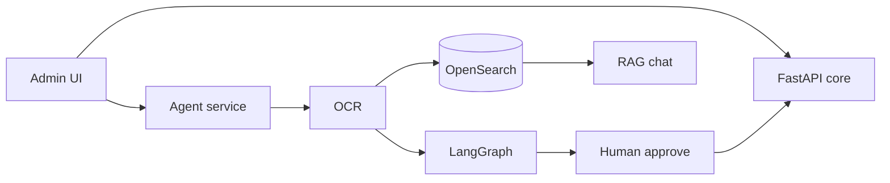
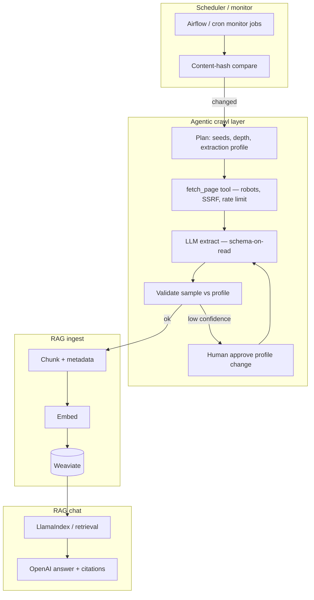
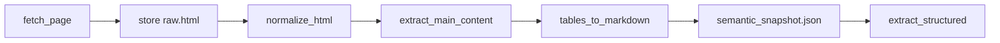
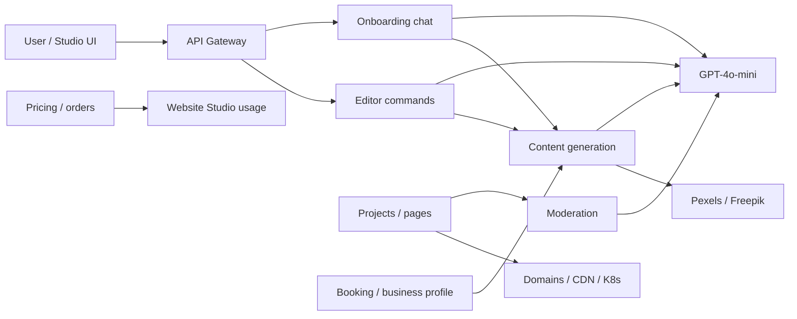

# CV Content — Professional Summary + Project Portfolio

Employer-facing copy. **Summary** = overall profile (incl. **product discovery** + **AI/ML product value**); **§1** = healthcare; **§7–8** = SADAR/Laconic; **§9** = Kasha; **§10** = HSBC Insurance.

---

## 0. Professional Summary (copy-paste)

### AI & engineering profile (recommended — 3 pillars)

Use this block when the role emphasizes **ML/DL/LLM**, **production AI**, or **AI-native delivery**—standalone or merged into your summary.

**Option A — three bullets (clearest structure)**

- **ML / DL / LLM foundation:** Solid grounding in **machine learning, deep learning, and large language models**—from core concepts (embeddings, model patterns, fine-tuning, evaluation, responsible AI) through **production use cases** where outputs must be reliable, traceable, and governable—not experimental demos.
- **Production AI — RAG & agentic systems:** Build **RAG pipelines** and **agentic workflows** in production—**chunking strategy**, **vector store** retrieval, and **memory management** so answers stay tied to **verifiable sources**; coordinate multi-step agents with **tool use**, with **human-in-the-loop** review before business-critical or compliance-sensitive outcomes.
- **AI-native SDLC — spec-driven delivery:** Institutionalize how teams build with AI—**specification-driven development** where version-controlled **requirements, design, and tasks** are the shared contract for humans and coding agents; encode standards in **Claude Code** **skills**, **sub-agents**, **plugins**, and **hooks** so LLMs accelerate **requirements → design → implementation → test → release** with architectural and security gates—not ad-hoc chat-only coding.

**Option B — single paragraph (LinkedIn / cover letter)**

Solid grounding in **machine learning, deep learning, and LLMs**—from model fundamentals to responsible production use. I build **RAG pipelines** and **agentic systems** with **chunking strategy**, **vector store** indexing, and **memory management**—answers tied to **verifiable sources**, multi-step agents with tools, and **human-in-the-loop** review on business-critical paths. Equally, I design **AI-native SDLC** practices: **spec-driven development** with executable specs as the source of truth, plus **Claude Code** **skills**, **plugins**, and **hooks** that embed team architecture, security, and review standards into every AI-assisted delivery path—so speed comes from **aligned intent**, not unconstrained generation.

**Option C — compact (2 sentences for CV header)**

**ML/DL/LLM** background with production **RAG** and **agentic** delivery—**chunking**, **vector store**, **memory management**, tools, and human-in-the-loop. Architect **AI-native SDLC**—**spec-driven** workflows, **Claude Code** skills/plugins/hooks, and governed automation from requirements through release.

**Option D — employer-facing narrative (interview opener)**

> “I combine three strengths: a real **ML/DL/LLM** foundation—not prompt-only tinkering; **production RAG and agentic** systems with **chunking**, **vector store**, and **memory management** for grounded answers and human gates; and **AI-native SDLC** where **specs are the contract** and **Claude Code** skills, plugins, and hooks turn team standards into infrastructure. The goal is predictable delivery: align on intent first, then let agents execute fast within guardrails.”

---

### Recommended (full summary)

- **19+ years** as a software development professional—building **high-performance engineering teams from scratch**, designing **high-availability, fault-tolerant, scalable** systems, and driving products from **requirements through production** on **distributed platforms at 1M+ user scale** (architecture, security, CI/CD, infrastructure).
- **ML / DL / LLM foundation:** Strong grounding in **machine learning, deep learning, and large language models**—core concepts, model patterns, evaluation, and responsible use in **production** contexts (grounding, guardrails, observability)—not ad-hoc experimentation.
- **Production AI — RAG & agentic:** Build **RAG pipelines** and **agentic workflows** in production—**chunking strategy**, **vector store** retrieval, and **memory management** for grounded answers from **verifiable sources**; multi-step agents with **tool use** and **human-in-the-loop** review on business-critical and compliance-sensitive paths.
- **AI-native SDLC — spec-driven delivery:** Design delivery systems where **executable specifications** (requirements, design, tasks) are the shared source of truth; encode team standards in **Claude Code** **skills**, **sub-agents**, **plugins**, and **hooks** to accelerate **requirements → design → implement → test → release** with architectural and security gates.
- **People & delivery:** Led cross-functional teams of **up to 40** (Backend, Frontend, DevOps, QA); **clear communication**, **customer-centric** mindset, and **end-to-end ownership** with global stakeholders across **Europe, USA, and Asia**.
- **Product & client engagement:** Partner with customers from **requirements discovery**—advise on **technical solutions and business value**; turn high-level needs into **solution architecture**, **cost evaluation**, **production roadmap**, and **time-to-market**, bridging **product intent and engineering execution**; coordinate **third-party integrations** and **POC**-led validation before build.
- **AI/ML product value:** Deliver **production AI** (**RAG**, **agentic**, **generative**) embedded in customer products—faster decisions, less manual work, new user-facing capabilities—with **POC-led validation** of **business benefit** and **human-in-the-loop** on regulated or revenue-critical paths.
- **Cloud & DevSecOps:** **AWS, Azure, GCP**; **Docker, Kubernetes**; CI/CD, infrastructure-as-code, and **security embedded in the delivery pipeline**—reliable, compliant releases at scale.
- **Full-stack depth:** Microservices (**Java, Node.js, Python, .NET**); web (**React, Next.js, Angular, Vue**); **mobile (React Native, Flutter)**; **Kafka** and event-driven patterns—applying this foundation to ship **AI-augmented** products responsibly.

### Compact paragraph (LinkedIn / CV header)

Software development leader with **19+ years** building teams and delivering **fault-tolerant, scalable systems** at **1M+ user scale**. **Customer-centric** from **requirements discovery** through **POC** and delivery. Ships **production AI/ML** (**RAG**, **agentic**, **generative**) that improves **customer products**—not side demos. **AI-native SDLC** via **spec-driven development** and **Claude Code**. **Cloud and DevSecOps** across AWS/Azure/GCP; global teams up to 40.

### One-liner (top of CV)

> **Solution Architect / Engineering Leader** — 19+ years; **customer-facing discovery** + **AI/ML that delivers product value**; RAG/agentic production systems; spec-driven SDLC; cloud & DevSecOps.

---

### Product discovery & client engagement (copy-paste)

Use when roles emphasize **solution consulting**, **pre-sales**, **product partnership**, or **customer-facing architecture**—not only delivery after requirements are fixed.

**Option A — one bullet (comprehensive short — recommended)**

- **Product & client engagement:** Partner with customers from **requirements discovery**—advise on **technical solutions and business value**; turn high-level needs into **solution architecture**, **cost evaluation**, **production roadmap**, and **time-to-market**, bridging **product intent and engineering execution**; coordinate **third-party integrations** and **POC**-led validation before build.

**Option B — two bullets (recommended balance)**

- **Customer-centric discovery:** Work directly with clients as a **trusted technical advisor**—translate business goals into clear solution options, expected outcomes, and trade-offs so decisions are informed by **value**, not jargon.
- **Solution shaping & validation:** Convert high-level requirements into **architecture**, **cost estimates**, **production roadmap**, and **time-to-market** plans; orchestrate **third-party/vendor integration**; deliver **POCs** that make abstract needs tangible and accelerate stakeholder buy-in.

**Option C — four bullets (detailed project CV)**

- **Client advisory:** Consult customers on **technical approach and business value**—building long-term **client relationships** grounded in clarity, trust, and shared outcomes.
- **Requirements to roadmap:** Turn high-level needs into **solution architecture**, **cost evaluation**, **production roadmap**, and **time-to-market**—bridging product intent and engineering execution.
- **Ecosystem & integration:** Lead **third-party and vendor collaboration** for integrations—aligning external partners with product scope, timelines, and quality expectations.
- **Proof & alignment:** Run **POCs and prototypes** to demonstrate feasibility and expected user/business impact—helping customers **validate requirements** and commit with confidence.

**Option D — paragraph (LinkedIn / cover letter)**

Customer-facing solution leader who joins engagements from the **requirements phase**, not only implementation. I work directly with clients to connect **technical design to business value**, shape **architecture, cost, roadmap, and time-to-market**, coordinate **third-party integrations**, and use **POCs** to turn ambiguous needs into shared understanding—so product decisions are **customer-centric**, de-risked, and ready for production delivery.

**Option E — interview sound bite**

> “I don’t wait for a finished spec—I help **shape** it. With clients I focus on **business value first**, then architecture, cost, and roadmap. **POCs** are how I make the conversation real, and **third-party integrations** are where I keep the whole product story coherent for the customer.”

**Add to full summary (single line):**

- **Product & client engagement:** Partner from **requirements discovery**—**technical and business-value** advisory; **solution architecture**, **cost evaluation**, **production roadmap**, and **time-to-market**; bridge **product intent → engineering execution**; **third-party integration** and **POC** validation before build.

---

### AI/ML solutions with product & customer value (copy-paste)

Use to show you deliver **AI that improves the customer's product**—not isolated engineering experiments. Best placed **after product discovery bullets** or as a **bridge** between client engagement and technical delivery.

**Option A — one bullet (summary / tight CV)**

- **AI/ML for product impact:** Design and ship **production AI** that creates **measurable customer and product value**—faster decisions, less manual work, new revenue-facing capabilities, and **POC-to-production** paths where stakeholders see **business benefit** before scale-up.

**Option B — two bullets (recommended — most attractive)**

- **Value-led AI consulting:** Advise customers on **where AI/ML helps the product**—frame options in **business outcomes** (speed, accuracy, scale, new features) and **trade-offs** (cost, risk, compliance)—not model hype.
- **Production AI with product payoff:** Deliver **RAG**, **agentic workflows**, and **generative features** embedded in real user journeys—**contract intelligence**, **domain Q&A**, **automated ingestion**, **AI-assisted site creation**—with **human-in-the-loop** guardrails so AI **strengthens the product customers sell**, not a side demo.

**Option C — value framing table (interviews / cover letter talking points)**

| Customer problem | AI/ML solution | Product / business benefit |
|------------------|----------------|----------------------------|
| Staff struggle to interpret long payer contracts | **OCR + RAG + agentic extraction** (healthcare) | Faster contract understanding; fewer billing/config errors; quicker fee-schedule updates |
| Analysts need timely answers across carbon projects & external sources | **RAG assistant + Laconic crawler** (SADAR) | **Cited domain Q&A**; fresher market data **without brittle scrapers**; faster research & decisions |
| SMBs lack time/budget for professional web presence | **AI-assisted Website Studio** (Kasha) | **Chat-to-published-site**; integrated **booking & billing**; faster **go-to-market** for small businesses |
| Uncertain if AI is worth the investment | **POCs with clear success metrics** | Stakeholders **see value early**; de-risk roadmap and **time-to-market** before full build |

**Option D — paragraph (LinkedIn / executive summary)**

I help customers adopt **AI/ML where it moves the product**—advising on **business value and trade-offs**, then shipping **production RAG, agentic workflows, and generative features** inside real workflows (eligibility, carbon analytics, SMB go-to-market). **POCs** prove impact early; **human-in-the-loop** and compliance boundaries keep AI **trustworthy and shippable**—so the customer's product is **faster, smarter, or more competitive**, not just "AI-enabled" on a slide.

**Option E — interview sound bite**

> “I sell **outcomes**, not models. With clients I ask: *what job does AI do for your user?*—cut manual contract work, answer analysts with sources, or let an SMB publish a bookable site in days. Then we **POC the benefit**, productionize with guardrails, and tie it to **product metrics** customers care about.”

**Add to full summary (single line):**

- **AI/ML product value:** Deliver **production AI** (**RAG**, **agentic**, **generative**) that improves **customer products**—faster insight, less manual work, new revenue-facing capabilities—with **POC-led validation** and **human-in-the-loop** on high-stakes paths.

---

## Skills (copy-paste)

### Recommended — clear & comprehensive

**Artificial Intelligence & ML**

- **ML / DL / LLM:** Machine learning, deep learning, and large language models—training/inference concepts, embeddings, fine-tuning patterns, model selection, evaluation, and responsible AI use in production. **Deep learning primer:** [DL.md](./DL.md) (ANN, CNN).
- **Production AI — RAG & agentic:** **RAG pipelines** and **agentic workflows**—**chunking strategy**, **vector store**, **memory management**; verifiable sources; multi-step agents with tool use; **human-in-the-loop** on business-critical and compliance-sensitive paths.
- **AI-native SDLC & spec-driven delivery:** **Specification-driven development**—executable specs (requirements, design, tasks) as the shared contract for humans and coding agents; **Claude Code** **skills**, **sub-agents**, **plugins**, **hooks**, and governed workflows across the full lifecycle.
- **LLMOps:** Evaluation sets, tracing, observability, prompt/version control, cost and quality gates.
- **AI/ML product value:** Advise and build AI that improves **customer-facing products**—frame **business outcomes**, prove value via **POCs**, productionize **RAG/agentic/generative** features with guardrails.

**Leadership & delivery**

- Software estimation, project planning, roadmap definition, risk identification and mitigation, stakeholder management, and cross-functional team leadership (up to 40 members).
- **Product discovery & client partnership:** Partner from **requirements discovery**—**technical solutions and business value** advisory; **solution architecture**, **cost evaluation**, **production roadmap**, and **time-to-market**; bridge **product intent and engineering execution**; **third-party integration** and **POC** validation.
- Strong problem-solving, root-cause analysis, and production troubleshooting.

**Architecture & enterprise solution design**

- **Enterprise solution architecture** for B2B/SaaS—requirements to production, integration design, NFRs (**security, scalability, reliability, compliance**), technical roadmap and ADRs.
- **Distributed systems:** microservices, event-driven, **DDD**, API-first design, **HA/fault tolerance**, **multi-tenant** platforms, **1M+ user** scale.
- **Enterprise backend patterns:** Java/J2EE ecosystems, microservice decomposition, API and integration layers, legacy-to-modern platform modernization.

**Backend development**

- **Java:** Spring Boot, Spring Cloud  
- **.NET:** See **.NET — comprehensive stack** below  
- **Node.js:** NestJS and microservices on Node  
- **Python:** See **Python — comprehensive stack** below  

### Python — comprehensive stack (copy-paste)

**Core language & APIs**

- **Python 3** — async I/O, typing, packaging (**pip**, **Poetry** / **uv**), virtual environments, production profiling
- **FastAPI** — REST APIs, OpenAPI/Swagger, dependency injection, middleware, background tasks
- **Pydantic** — request/response validation, settings management, schema-driven contracts
- **Uvicorn / Gunicorn** — ASGI/WSGI serving; worker tuning for production

**Data access & persistence**

- **SQLAlchemy** (2.x), **Alembic** — ORM, migrations, connection pooling
- **PostgreSQL** — relational modeling, query optimization, multi-tenant patterns
- **Redis** — caching, sessions, rate limiting, job queues
- **MongoDB** — document stores where schema flexibility fits the domain

**Async, jobs & messaging**

- **asyncio**, **httpx**, **aiohttp** — non-blocking HTTP and I/O-bound workloads
- **Celery**, **RQ**, or **ARQ** — background jobs and scheduled tasks
- **Kafka**, **RabbitMQ** — event-driven integration with Java/Node services

**AI / ML / agentic (Python ecosystem)**

- **LangChain**, **LangGraph** — chains, tools, stateful agent graphs, human-in-the-loop
- **Hugging Face** — embeddings, transformers, model hub integration
- **OpenSearch**, **Elasticsearch**, **Weaviate**, **Chroma** — vector / hybrid search for **RAG**
- **LiteLLM** / provider SDKs — model routing, multi-vendor LLM calls
- **PyTorch** / **scikit-learn** — where custom ML or classical models apply
- **OCR & document AI** — contract/PDF ingest pipelines (Tesseract, cloud OCR APIs)

**Data engineering & analytics**

- **pandas**, **NumPy** — transformation and analysis
- **PySpark** — distributed ETL on Spark / EMR
- **Apache Airflow** — workflow orchestration for batch pipelines

**Testing & quality**

- **pytest**, **pytest-asyncio**, **pytest-cov** — unit and integration tests
- **httpx** / **TestClient** — API contract and endpoint testing
- **mypy**, **ruff**, **black** — static typing and lint/format gates in CI

**Observability & ops**

- **structlog** / **logging** — structured logs for cloud aggregation
- **OpenTelemetry**, **Prometheus**, **Grafana** — tracing and metrics
- **Docker**, **Kubernetes** — containerized Python services on AWS/GCP

**Security & compliance (healthcare / FinTech contexts)**

- Secrets via env/IAM; encryption in transit/at rest; PHI-safe logging patterns
- OAuth2/JWT integration; tenant-scoped data access in API and RAG layers

**CV one-liner (Python backend + AI):**

> **Python 3**, **FastAPI**, **Pydantic**, **SQLAlchemy**, PostgreSQL, Redis, **pytest**; **LangChain**, **LangGraph**, **OpenSearch**, **Hugging Face**; AWS, Docker, Terraform.

**CV one-liner (Python data + platform):**

> **Python 3**, **FastAPI**, **pandas**, **PySpark**, **Airflow**, PostgreSQL; Kafka; AWS (EMR, S3); Terraform; pytest.

**Compact table row (LinkedIn / 2-column CV):**

| **Python** | Python 3, FastAPI, Pydantic, SQLAlchemy, asyncio, Celery, pytest; LangChain, LangGraph, Hugging Face, RAG/vector search; pandas, PySpark, Airflow |

### .NET — comprehensive stack (copy-paste)

**Core language & runtime**

- **C#** — modern language features, async/await, generics, records, pattern matching, nullable reference types
- **.NET / .NET Core / .NET 6+** — cross-platform runtime, SDK, deployment models (framework-dependent, self-contained)
- **LINQ** — query syntax and method syntax over collections, **IQueryable**, deferred execution, projection/filtering/grouping

**Web & APIs**

- **ASP.NET Core** — MVC, Web API, middleware pipeline, dependency injection, configuration, filters
- **Minimal APIs** — lightweight HTTP endpoints for microservices
- **RESTful APIs** — controllers, routing, model binding, content negotiation, OpenAPI/Swagger
- **SignalR** — real-time web communication (WebSockets, hubs)
- **gRPC** — high-performance RPC for service-to-service calls

**Data access & persistence**

- **Entity Framework Core (EF Core)** — Code First / Database First, migrations, change tracking, relationships
- **LINQ to Entities** — translated queries, performance tuning, eager vs lazy loading
- **Dapper** — micro-ORM for high-performance raw SQL where EF is too heavy
- **ADO.NET** — direct data access when needed
- **SQL Server**, **PostgreSQL**, **Oracle** — relational backends; connection pooling, transactions
- **Redis** — distributed cache (**StackExchange.Redis**), session state

**Architecture & patterns**

- **Clean Architecture**, **DDD** — domain layer, application services, repositories, unit of work
- **CQRS**, **MediatR** — command/query separation, in-process messaging
- **Microservices** — bounded contexts, API gateways, service discovery
- **Dependency Injection** — built-in **IServiceCollection**, scoped/singleton/transient lifetimes

**Messaging & integration**

- **MassTransit**, **NServiceBus**, **Azure Service Bus**, **RabbitMQ** — async messaging, pub/sub, sagas
- **HttpClient** / **Polly** — resilient HTTP calls (retry, circuit breaker, timeout)
- **WCF** (legacy maintenance contexts), **REST**, **SOAP** integrations where required

**Security & identity**

- **ASP.NET Core Identity** — authentication, roles, claims
- **JWT Bearer**, **OAuth 2.0**, **OpenID Connect** — token-based auth, SSO
- **Azure AD / Entra ID**, **IdentityServer** (Duende) — enterprise identity integration

**Testing & quality**

- **xUnit**, **NUnit**, **MSTest** — unit testing frameworks
- **Moq**, **NSubstitute**, **FakeItEasy** — mocking and test doubles
- **FluentAssertions** — readable test assertions
- **Integration testing** — **WebApplicationFactory**, Testcontainers for DB/API tests

**Observability & ops**

- **Serilog**, **NLog**, **Application Insights** — structured logging and APM
- **OpenTelemetry**, **Health Checks** — metrics, traces, liveness/readiness probes
- **Docker**, **Kubernetes**, **Azure App Service**, **IIS** — deployment targets

**Frontend (full-stack .NET contexts)**

- **Blazor** (Server / WebAssembly), **Razor Pages**, **MVC + Razor** — server-rendered and SPA-style UIs
- **Angular / React / Vue** — often paired with ASP.NET Core API backends

**Build, tooling & legacy**

- **NuGet**, **MSBuild**, **dotnet CLI** — package restore, build, publish
- **Visual Studio**, **Rider**, **VS Code** — IDE/tooling
- **.NET Framework** (legacy maintenance), **ASP.NET MVC 5**, **Web API 2** — modernization contexts

**CV one-liner (.NET backend / enterprise):**

> **C#**, **.NET 6+**, **ASP.NET Core**, **LINQ**, **EF Core**, **Dapper**, SQL Server, Redis, **xUnit**, **Moq**; **DDD**, **CQRS**, **Microservices**; JWT/OAuth; Docker, Azure.

**CV one-liner (.NET microservices / cloud):**

> **.NET Core**, **ASP.NET Core Web API**, **EF Core**, **MassTransit** / **Azure Service Bus**, **Polly**, **gRPC**; **Clean Architecture**, **MediatR**; **Application Insights**, Docker, **Kubernetes**, Azure.

**Compact table row (LinkedIn / 2-column CV):**

| **.NET** | C#, .NET 6+, ASP.NET Core, LINQ, EF Core, Dapper; DDD, CQRS, Microservices; SQL Server, Redis; xUnit, Moq; JWT, OAuth; Docker, Azure |

**Frontend development**

- **Modern web:** React, Next.js, Redux, Angular, Vue, TypeScript, HTML5, CSS3, Sass/Less, Webpack, Bootstrap  
- **Data visualization & legacy:** D3.js, Three.js; jQuery, ExtJS, Backbone (maintenance/legacy contexts)  

**Mobile development**

- **Cross-platform:** **React Native**, **Flutter**—iOS and Android apps with shared codebase  
- **Mobile delivery:** REST/API integration, state management, offline-friendly patterns, performance tuning, build and release (App Store / Google Play)  

**Cloud & DevSecOps**

- **Cloud:** AWS, Microsoft Azure, Google Cloud Platform (GCP)  
- **Containers & orchestration:** Docker, Kubernetes  
- **IaC & CI/CD:** Terraform; Jenkins, GitLab CI, Bamboo; security embedded in pipeline (DevSecOps)  
- **Scripting & OS:** Linux, Windows; shell scripting, PowerShell  

**Databases & search**

- Relational: PostgreSQL, MySQL, SQL Server, Oracle, DB2  
- NoSQL / cache / search: MongoDB, Redis, Cassandra, Elasticsearch, OpenSearch  
- Data modeling (ER design), performance tuning, multi-tenant data design  

**Messaging & integration**

- Kafka, RabbitMQ, NATS; REST/HTTP APIs; event streaming and async processing  

**Quality engineering**

- Unit & integration testing: JUnit, Mockito, **xUnit**, **NUnit**, **Moq**, Jest, Jasmine, Enzyme  
- Test strategy, regression coverage, and quality gates in CI  

**Tools & version control**

- Git, SVN, TFS; Maven, Gradle; application servers (Tomcat, JBoss, WebSphere, IIS, Apache)  

---

### Compact skills block (2-column CV / LinkedIn)

| Area | Skills |
|------|--------|
| **AI / ML** | ML, DL, LLMs, RAG, agentic AI, AI product value (POC→production), spec-driven SDLC, Claude Code, LLMOps |
| **Languages & backend** | Java (Spring Boot/Cloud), **C# (.NET 6+, ASP.NET Core, EF Core, LINQ)**, Node.js (NestJS), Python 3 (FastAPI, Pydantic, SQLAlchemy) |
| **.NET / enterprise** | ASP.NET Core, LINQ, EF Core, Dapper, DDD, CQRS, Microservices; SQL Server, Redis; xUnit, Moq; JWT, Azure |
| **Python / AI** | LangChain, LangGraph, Hugging Face, RAG, OpenSearch/vector search; pandas, PySpark, Airflow |
| **Frontend (web)** | React, Next.js, Angular, Vue, TypeScript, Redux |
| **Mobile** | React Native, Flutter, iOS/Android, API integration, app release |
| **Cloud & DevOps** | AWS, Azure, GCP, Docker, Kubernetes, Terraform, Jenkins, GitLab, DevSecOps |
| **Data stores** | PostgreSQL, MySQL, MongoDB, Redis, Elasticsearch, OpenSearch, Cassandra |
| **Data engineering** | PySpark, pandas, ETL/ELT, batch pipelines, data transformation |
| **Architecture** | Enterprise solution design, microservices, DDD, event-driven, multi-tenant SaaS, HA, 1M+ scale, enterprise Java/backend patterns |
| **Delivery** | Estimation, planning, risk management, stakeholder management, client advisory, POC validation, third-party integration, Agile/Waterfall |

---

## 1. Copy-paste block (recommended)

### Healthcare eligibility & patient estimation platform (B2B SaaS)

**Industry:** Healthcare / Health IT

**Description:**  
Multi-tenant SaaS for clinics to verify insurance coverage, estimate patient financial responsibility, and run auditable estimation workflows. Strong **tenant isolation**, encryption, and HIPAA-oriented controls on a **cloud-native AWS** platform built to scale. Core on **Python / FastAPI** and **Next.js**; **LangGraph** agent service for contract OCR, RAG chat, and agentic validation workflows.

**Responsibilities:**

- **Customer-centric discovery:** Partnered with clinic and payer stakeholders as a **trusted technical advisor**—connecting eligibility/estimation capabilities to **business value**, trade-offs, and compliance expectations.
- **Solution shaping & validation:** Translated high-level needs into **architecture**, **cost and roadmap** options, and **time-to-market** plans; coordinated **third-party integrations** (payers, EHR, payments); used **POCs** to validate contract-AI and workflow designs before production rollout.
- **AI/ML product value:** Shipped **contract intelligence** (OCR, **RAG** chat, agentic validation) so clinics **understand payer agreements faster**, reduce manual fee-schedule work, and improve estimation accuracy—with **human approval** before billing rules change.
- Architected a configurable **rules engine** for eligibility and benefit calculation, with tenant-isolated data and policy.
- **Security & compliance:** Multi-tenant data isolation, encrypted patient PII and EHR credentials, identity and access controls, **PHI access audit**, PCI-aware payments, and automated checks for tenancy and PII risk before release.
- **Scalability & platform ops:** Cloud-native **AWS** architecture with stateless services, async processing, CDN, and **Terraform** infrastructure-as-code; agent workloads separated from the core billing platform for independent scale.
- Built estimation pipelines from payer responses to patient-facing amounts (copay, deductible, coinsurance, self-pay)—consistent across UI and backend.
- **Integrations:** [Office Ally](https://cms.officeally.com/) (payer eligibility), [eClinicalWorks](https://www.eclinicalworks.com/) & [athenahealth](https://www.athenahealth.com/) (EHR), **Adyen** (payments).
- Applied **X12 EDI** and **FHIR R4** to connect payer, clinical, and estimation workflows.
- Led **contract intelligence**—OCR ingest, RAG chat, and agentic validation for payer/clinic agreements and fee schedules.
- **Built AI-native SDLC on Claude Code**—designed and shipped repo-native **skills**, **sub-agents**, **plugins**, **hooks**, and **workflows** so AI-assisted delivery follows team standards; **mandatory human approval** on billing, eligibility, and PHI.

**Key achievements:**

- Stabilized insured vs self-pay estimation with consistent patient-responsibility outputs.
- Hardened **multi-tenant security model** (isolation, encryption, PHI audit) for healthcare compliance expectations.
- Scaled platform on **AWS** with async processing, infrastructure-as-code, and environment parity.
- Rolled out tenant rule changes via **version-controlled configuration** instead of one-off DB migrations.
- Expanded regression coverage on financial and eligibility logic.
- Designed **agent service** for contract RAG Q&A and OCR-to-configuration with HIPAA-aligned guardrails—**measurable product benefit**: less manual contract ops, faster payer-policy turnaround.
- Delivered **Claude Code engineering platform**—skills, agents, plugins, hooks—standardizing multi-tenant and PHI-safe delivery.

**Technologies:** Next.js, TypeScript; **Python 3**, **FastAPI**, **Pydantic**, **SQLAlchemy**, PostgreSQL, Redis, AWS, Terraform; X12 271, FHIR R4; LangChain, LangGraph, OpenSearch, Hugging Face; pytest; Claude Code.

**Technologies — alternative layouts:**

| Use case | Line |
|----------|------|
| **Recommended (balanced)** | Next.js, TypeScript; **Python 3**, **FastAPI**, **Pydantic**, **SQLAlchemy**, PostgreSQL, Redis, AWS, Terraform; X12 271, FHIR R4; LangChain, LangGraph, OpenSearch, Hugging Face; pytest; Claude Code |
| **Compact (space-limited)** | Next.js, **Python**, **FastAPI**, PostgreSQL, AWS, Terraform; X12 271, FHIR R4; LangChain, LangGraph, OpenSearch, Hugging Face; Claude Code |
| **Polyglot (Java core + Python agent)** | **Java 18**, **Spring Boot**, Next.js; **Python**, **FastAPI** (agent service); PostgreSQL, Redis, AWS, Terraform; X12 271, FHIR R4; LangChain, LangGraph, OpenSearch, Hugging Face; Claude Code |
| **AI-heavy emphasis** | Next.js; **Python**, **FastAPI**, **LangChain**, **LangGraph**, **OpenSearch**, **Hugging Face**, PostgreSQL, Redis, AWS; X12 271, FHIR R4; RAG, pytest; Claude Code |

---

## 2. Ultra-short variant (space-constrained CV)

**Healthcare B2B SaaS — Solution Architect / Lead Engineer**

Multi-tenant eligibility & estimation (**Python / FastAPI**, Next.js). **Client partnership:** requirements discovery, **POC**, third-party integrations (payers/EHR/payments). **Security:** tenant isolation, PHI audit. **Agentic AI:** OCR + RAG + LangGraph. **AI-native SDLC:** Claude Code.

---

## 3. Standalone bullets (mix and match)

**Product discovery & client engagement (recommended — copy-paste):**

> **Product & client engagement:** Partner from **requirements discovery**—advise on **technical solutions and business value**; turn high-level needs into **solution architecture**, **cost evaluation**, **production roadmap**, and **time-to-market**, bridging **product intent and engineering execution**; **third-party integration** and **POC** validation before build.

**AI/ML product value (recommended — copy-paste):**

> Advise customers on **where AI improves the product**—frame **business outcomes**, prove value through **POCs**, then productionize **RAG/agentic/generative** features with guardrails.

> **Healthcare:** contract **RAG + OCR** → faster payer understanding, fewer billing errors. **Carbon platform:** **RAG + Laconic** → cited analyst answers, fresher external data. **SMB super-app:** **AI site builder** → faster go-to-market with **booking & payments** built in.

**Integrations (one line):**

> Integrated with **Office Ally** (eligibility), **eClinicalWorks** & **athenahealth** (EHR), and **Adyen** (payments).

**Security & compliance:**

> HIPAA-oriented **multi-tenant security**—tenant isolation, encrypted PII and credentials, access controls, PHI audit logging, PCI-aware payments, and pre-release tenancy/PII checks.

**Scalability & infrastructure:**

> **Cloud-native AWS** platform—stateless services, async workloads, CDN, Terraform IaC; core billing and agent services scale independently.

**Agentic / contract AI:**

> Contract intelligence—OCR, RAG chat with citation validation, LangGraph agents, human-approved updates to fee schedules and rules.

**AI-native SDLC (recommended — copy-paste):**

> Built an **AI-native SDLC platform** on **Claude Code**—custom **skills**, **sub-agents**, **plugins**, **hooks**, and **workflows**—accelerating delivery with **human gates** on billing, eligibility, and PHI.

**AI-native SDLC (compact):**

> Shipped Claude Code **skills + agents + hooks** encoding team standards; governed autonomy on regulated healthcare code paths.

### AI-native SDLC stack (what you built)

| Layer | Purpose | Examples |
|-------|---------|----------|
| **Skills** | Repeatable playbooks in repo | `add-api-endpoint`, `add-entity`, `preflight-pr`, `review-pr`, `check-governance-impact`, `understand-module` |
| **Sub-agents** | Specialist roles for complex tasks | Solution architect, software engineer, code reviewer, compliance-oriented review |
| **Plugins** | Packaged tool bundles | PR review toolkit, security/governance guidance, production-grade session enforcement |
| **Hooks** | Lifecycle automation | Session-start guards, pre-PR checks, policy enforcement before merge |
| **Workflows** | Governed delivery automation | Version-controlled, repeatable AI-assisted paths with human approval on regulated code |

**Employer value:** Institutional knowledge lives in git—not chat history—so every engineer gets the same AI-assisted quality bar.

**Tenant configuration:**

> Repeatable, version-controlled tenant policy deployments for rules-engine changes.

---

## 4. Contract AI — brief reference (interviews)

**Architecture:** **FastAPI** services (eligibility, rules, tenancy) + dedicated **agent service** (OCR, RAG, LangGraph). Agents apply approved configuration via platform APIs—no second source of truth for live estimates.

**Flow:** Upload contract → OCR → embed & index → RAG chat → agent extract/validate → human approve → update fee schedules/rules.

| Area | Approach |
|------|----------|
| **Orchestration** | LangGraph stateful graphs; human-in-the-loop before apply |
| **Embeddings** | Hugging Face models; version pinned per collection |
| **Search** | Tenant-scoped OpenSearch; citation validation |
| **LLMOps** | Model routing, prompt versioning, eval sets, tracing, feedback |
| **Guardrails** | No live estimate math in chat; PHI-safe logging; mandatory admin approval |

### Security & scalability (interviews)

| Theme | Approach |
|-------|----------|
| **Tenant isolation** | Dedicated schema per clinic; request-scoped tenant context |
| **Identity & data** | Per-tenant auth; encrypted PII and vendor credentials; encryption in transit |
| **Audit** | PHI access log; entity audit fields; agent run receipts |
| **Scale-out** | Stateless services; async job processing; agent tier decoupled from core |
| **Ops** | Terraform-managed AWS; observability across environments |



---

## 5. Interview talking points

1. **Integrations:** Office Ally = eligibility; eCW & Athena = EHR patient/coverage; shared security and audit model.
2. **Security:** Strong tenant boundary—isolation, encryption, PHI audit—not just app-level filtering.
3. **Scalability:** Stateless core on AWS; async workloads; agent service scales separately from billing.
4. **Polyglot split:** **FastAPI** for regulated billing/eligibility and agent paths—shared PostgreSQL tenancy model; agent tier scales independently for OCR/RAG workloads.
5. **RAG vs rules engine:** RAG explains contract terms; rules engine computes live patient estimates.
6. **AI-native SDLC:** You **built** the toolchain—skills, agents, plugins, hooks—not just used AI chat.

---

## 6. Repo mapping (internal)

| Theme | Path |
|-------|------|
| Core platform (`lastest/`) | NestJS `apps/app-service/`, Next.js `apps/web/` |
| Multi-tenancy | `docs/technical-docs/data/multi-tenancy.md`, `tenant-transaction-manager.ts` |
| PII / security | `pii-crypto.ts`, `docs/technical-docs/security/` |
| PHI access log | `ehr-integration-brd.md` |
| Infrastructure | `docs/technical-docs/deployment/infrastructure.md` |
| Office Ally | `clients/external-apis/officeally/` |
| eCW / EHR | `modules/healthcare/ecw/`, `docs/ehr-integration-brd.md` |
| Athena-ready | `EhrClient`, `ehr-prefill.service.ts` |
| Rule engine | `modules/rule-engine/` |
| Claude skills (`lastest/`) | `.claude/skills/` |
| SDLC sub-agents (`agents/`) | `agents/solution-architect/`, `software-engineer/`, `code-reviewer/` |
| Agent service (proposed) | `apps/agent-service/` — RAG, LangGraph, OpenSearch |

---

---

## 7. Carbon platform — SADAR (Environmental / FinTech)

### Copy-paste block (recommended — AI-forward)

**Project:** Carbon platform (SADAR)

**Industry:** Environmental / carbon markets (FinTech-aligned compliance)

**Description:**  
End-to-end platform that **transparently aggregates, computes, and derives** geospatial and project data to **identify carbon assets** and **bundle them into tradable financial instruments** for existing global marketplaces. Combines **large-scale data engineering** (batch/stream pipelines, graph and geospatial stores) with **production GenAI**—a **RAG-powered assistant** for forest carbon, deforestation, land cover, and project-level Q&A—and an **agentic web crawler** (**Laconic**) that ingests and refreshes content from **external websites** without brittle, site-specific scraper code.

**Responsibilities:**

- **Customer-centric discovery:** Worked with **US and Singapore Product Owners** and business stakeholders—advising on **technical options, business value**, and carbon-market outcomes as a trusted solution partner.
- **Solution shaping & validation:** Converted product vision into **architecture**, **delivery roadmap**, **cost/scale** considerations, and **time-to-market**; ran **POCs** (RAG assistant, **Laconic** crawler) to align stakeholders before full build; orchestrated **third-party data sources** and external web content into the platform knowledge base.
- **AI/ML product value:** Embedded **GenAI in the core product**—**RAG assistant** gives analysts **cited answers** on carbon, forest, and project data; **Laconic** keeps external market content **fresh without scraper rewrites**—accelerating research, decisions, and **time-to-insight** for carbon-market workflows.
- **Solution & data architecture:** Designed and delivered complex, end-to-end technical outcomes aligned with **Zero Trust Architecture**, **MSA**, and **GDPR**—from platform selection through production operation.
- **Data platform:** Owned **end-to-end data architecture**—ingestion from heterogeneous sources, **PySpark/Airflow** pipelines on **AWS (EMR, S3, Athena)**, analytics layers, and geospatial/graph persistence (**PostGIS**, **Neo4j**, **GraphDB**).
- **Agentic dynamic web crawler (Laconic):** Designed and implemented a **config-driven, LLM-assisted crawler** to collect and **re-sync** third-party environmental and market web content into the knowledge base—**content-hash change detection**, **schema-on-read extraction** (not hardcoded XPath per site), and **automated re-index** into **Weaviate** when sources change—minimizing code changes when target sites evolve.
- **Production AI / RAG:** Partnered with PO teams to embed **AI into core workflows**—built an **intelligent domain chatbot** for forest carbon, deforestation, land cover, and per-project detail using **OpenAI**, **LlamaIndex**, **RAG**, and **Weaviate** (grounded retrieval over crawled corpora + internal project data).
- **Agentic patterns:** Structured retrieval, orchestration, and Q&A flows so analysts get **cited, context-bound answers**; crawler → chunk → embed → vector store → chat with **source URLs** traceable to crawl receipts.
- **Platform engineering:** **CI/CD** (GitHub Actions, GitLab, **Argo CD**), **Terraform**-provisioned **AWS** (**EKS**, **ECS**), observability (**Grafana**), and **DevSecOps** practices aligned with FinTech-grade security expectations.
- **Engineering quality:** Code review for security and design standards; technical-debt identification and remediation planning.
- **Team building:** Built the **Vietnam engineering team from scratch** (hiring, mentorship, SDLC coaching)—junior engineers delivered successfully across all SDLC phases.

**Key achievements:**

- **MVP launched** to market on schedule.
- **Re-architected** the platform to **microservices**—improved scalability and team autonomy.
- **Hardened security** with **Zero Trust** and **DevSecOps**, aligned with FinTech industry standards.
- **Shipped production RAG assistant**—domain Q&A over carbon/forest/project data; **product benefit**: analysts answer complex questions **with sources**, reducing research time and improving confidence in trading/due-diligence workflows.
- **Delivered Laconic agentic crawler**—continuous ingestion from external sites with **change-aware refresh**; **product benefit**: **lower maintenance cost** and **fresher knowledge base** when third-party sites change layout.
- **Standardized Agile delivery** and led by example—coached junior/middle engineers through to successful project delivery.

**Technologies:** FastAPI, Python, Apache Airflow, Pandas, PySpark, EMR, **OpenAI**, **LlamaIndex**, **RAG**, **Weaviate**, **agentic crawler** (LangChain/LangGraph-style orchestration, polite fetch, content-hash monitor), Vue.js, Cypress, Redis, Kafka, Backstage (React.js), Tailwind CSS, EKS, ECS, Grafana, Argo CD, S3, Athena, PostGIS, Neo4j, GraphDB, immudb, MongoDB, ForgeRock, Jest, GitHub Actions, GitLab, Terraform.

---

### Ultra-short variant (space-constrained CV)

**Carbon platform (SADAR) — Technical lead / Solution architect**

Environmental **carbon-asset** data platform → **tradable instruments**. **Laconic agentic crawler** + **RAG chatbot** (OpenAI, LlamaIndex, Weaviate). **PySpark/Airflow** on **AWS**; microservices; **Zero Trust** / **GDPR**; built Vietnam team from scratch.

---

### Standalone AI bullets (mix into other roles)

**Agentic dynamic crawler (Laconic):**

> Built **config-driven web crawler** with **change detection** and **LLM schema-on-read extraction**—refreshes external environmental/market content into **Weaviate** for RAG **without per-site scraper rewrites** when layouts change.

**RAG / domain assistant:**

> Production **RAG** assistant for carbon markets—**OpenAI**, **LlamaIndex**, **Weaviate**—grounded Q&A on forest carbon, deforestation, land cover, and project metadata; integrated with stakeholder workflows.

**Data + AI platform:**

> Combined **large-scale data engineering** (PySpark, Airflow, geospatial/graph stores) with **LLM retrieval** so environmental and financial data pipelines feed both analytics and **AI-assisted** decision support.

**Leadership:**

> Led **US/SG PO** alignment, **end-to-end architecture**, and **team build-out** while shipping MVP, microservices migration, and **production GenAI** features.

---

## 8. Laconic — agentic dynamic web crawler (solution + interview)

**Context:** At **Laconic / SADAR**, third-party websites (registries, standards, market data, project documentation) **change over time**. A traditional scraper with fixed CSS/XPath **breaks** and forces code deploys. **Laconic** is the **agentic crawler + refresh pipeline** that feeds the carbon **RAG** assistant.

**Design goal:** When a site’s HTML layout changes, **update extraction config or let the agent re-infer structure**—not rewrite Python scrapers for every source.

### 8.1 Problem vs approach

| Traditional crawler | Agentic dynamic crawler (Laconic) |
|--------------------|-----------------------------------|
| Hardcoded selectors per site | **Extraction profiles** (YAML/JSON) + **LLM structured extract** |
| Redeploy on layout change | **Monitor** job detects **content-hash drift** → re-extract → re-index |
| Brittle one-off scripts | **Tool loop**: plan → fetch → extract → validate → report |
| No audit trail | **Crawl receipts** — URLs fetched, hashes, chunks indexed |

### 8.2 Architecture (high level)



### 8.3 Core components

| Component | Responsibility |
|-----------|----------------|
| **Extraction profile** | Per-source config: seed URLs, allowed domains, depth, **field schema** (e.g. `project_id`, `methodology`, `vintage`), optional hints—not brittle XPath |
| **fetch_page** | Deterministic HTTP GET; size cap; **robots.txt**; SSRF blocklist |
| **extract_structured** | LLM reads stored HTML → JSON matching schema (schema-on-read) |
| **content_hash** | SHA-256 of normalized text; skip re-embed if unchanged |
| **drift_handler** | On hash change: re-extract; if validation fails, agent proposes **profile v2** → human approves |
| **ingest_pipeline** | Delta chunks to Weaviate; tombstone stale chunks by `source_url` + `content_version` |
| **crawl_receipt** | `sources[]`, `pages_fetched`, `chunks_indexed`, `verification_commands` |

### 8.4 Agent loop (LangGraph-style)

```
monitor → [for each seed URL]
  → fetch_page
  → if hash unchanged → skip
  → extract_structured(profile.schema)
  → validate(required_fields, types, sample rules)
  → if fail → adapt_schema (LLM) → HITL approve → retry extract
  → store_artifact + enqueue_ingest
ingest → chunk → embed → upsert Weaviate
report → receipt + summary with cited URLs only
```

**LLM plans and interprets; code enforces policy** (same pattern as [crawler.md](./crawler.md)).

### 8.5 Agentic capture & parse when HTML structure changes

External sites change **DOM structure** (class names, nesting, SPA shells, moved tables) while the **meaning** of the page often stays the same. Laconic does **not** rely on fixed XPath/CSS for business fields.

#### What breaks vs what stays stable

| Breaks on redesign | Usually stable |
|--------------------|----------------|
| `#content > div.card:nth-child(3) > span.price` | Field meanings: `project_id`, `methodology`, `vintage`, `area_ha` |
| CSS class hashes (`css-1a2b3c`) | Seed URL, site domain, page type (listing vs detail) |
| Sidebar / nav markup | Main article text and table **semantics** |
| Widget order in DOM | Business rules in profile schema |

**Design rule:** Store **what** you need (JSON schema) in the **extraction profile**. Let the **agent infer where** in the HTML at **runtime**.

#### Capture pipeline (deterministic tools — before LLM)

The LLM never does raw HTTP. Tools normalize HTML so structure changes matter less:



| Tool | Purpose | Why it helps when HTML changes |
|------|---------|--------------------------------|
| `fetch_page` | GET + store raw HTML | Audit trail; re-parse without re-fetch |
| `normalize_html` | Remove scripts, styles, comments | Smaller, stable input for LLM |
| `extract_main_content` | Readability / boilerplate removal | Nav/footer redesign does not pollute extract |
| `tables_to_markdown` | Serialize `<table>` to MD | Table **columns** survive layout wrapper changes |
| `extract_links` | Anchor list with anchor text | Discovery still works if CSS classes change |
| `content_hash` | Hash **normalized main text** | Detect real content change vs DOM noise |

#### Parse pipeline (agentic — schema-on-read)

**`extract_structured`** sends the agent (or a dedicated extract node):

1. **Extraction profile** — `profile_id`, `schema` (JSON Schema), `field_hints` (natural language, not selectors)  
2. **Normalized page artifact** — `main.md` + optional `tables.md` + `meta.json` (title, canonical URL)  
3. **Instruction** — “Return JSON matching schema; use `null` if field absent; quote evidence snippet per field.”

**Example profile snippet** (`profiles/carbon-registry-v1.yaml`):

```yaml
profile_id: carbon-registry-v1
seeds:
  - https://example-registry.org/projects
schema:
  type: object
  required: [project_id, title, country]
  properties:
    project_id: { type: string }
    title: { type: string }
    country: { type: string }
    methodology: { type: string }
    vintage: { type: string }
field_hints:
  project_id: "Registry identifier, often labeled Project ID or Ref"
  methodology: "Carbon methodology name, e.g. VM0007"
  vintage: "Crediting period or vintage year range"
# Soft anchors only — optional fallback, not primary path
soft_anchors:
  - { label: "Project ID", near: "project" }
```

**Soft anchors** are hints for the agent when the page is ambiguous—they are **not** the sole extraction mechanism and can be updated without code deploy.

#### Multi-strategy fallback (agent decides order)

When structure changes, the agent tries strategies in order until **validate** passes:

| Priority | Strategy | When to use |
|----------|----------|-------------|
| 1 | **LLM + schema** on `main.md` / `tables.md` | Default; layout moved but text/tables remain |
| 2 | **LLM + raw HTML chunk** (token-bounded) | Main-content extractor dropped important blocks |
| 3 | **Table-first** | Listing pages where data is tabular |
| 4 | **Link-follow** | Detail fields live on child URLs; listing schema partial |
| 5 | **Profile patch proposal** | Repeated validation failures → agent drafts `profile v2` + new hints |

```text
extract → validate
  → pass → ingest
  → fail → next strategy OR adapt_profile → HITL approve → extract again
```

#### Validation (code — not LLM self-grade)

Deterministic checks before index:

| Check | Rule |
|-------|------|
| Schema | Required fields present; types match JSON Schema |
| Sanity | `project_id` format regex; dates parseable; numeric ranges |
| Consistency | Listing count ≈ previous run ± threshold (alert on 50% drop) |
| Evidence | Each field has `evidence_text` substring found in normalized page |
| Golden sample | Optional fixture URL: extract must match known `project_id` |

Low confidence → **do not index** → queue for operator or HITL profile update.

#### Detecting HTML structure change vs content change

| Signal | Meaning | Action |
|--------|---------|--------|
| `content_hash` unchanged | No re-index | Skip |
| Hash changed, **validate pass** | Wording/layout update, same schema | Re-chunk + re-embed |
| Hash changed, **validate fail** | Likely **structure drift** | Run fallback strategies → profile patch |
| Fetch OK but `main.md` empty | SPA / JS-rendered | Flag for **browser tool** (Playwright MCP) v2 |
| Many fields `null` suddenly | Broken extract | Roll back to last good profile version |

Hash **normalized text**, not raw HTML bytes—avoids false positives from attribute reordering.

#### Agent tools (crawler agent `extract` / `monitor` mode)

| Tool | Agent uses it to… |
|------|-------------------|
| `crawl_plan` | Approve seeds, depth, profile_id |
| `fetch_page` | Capture latest HTML |
| `normalize_page` | Build `main.md`, `tables.md` |
| `extract_structured` | Map page → JSON per schema |
| `validate_extraction` | Run schema + sanity + evidence checks |
| `propose_profile_patch` | Suggest new `field_hints` / soft_anchors after drift |
| `store_artifact` | Persist raw + parsed + receipt |
| `enqueue_ingest` | Push delta to Weaviate via ingest worker |

**Controlled mode:** operator approves `propose_profile_patch` before it becomes active.

#### JS-heavy sites (structure in runtime DOM)

If `normalize_page` returns empty main text:

1. Agent escalates to **`fetch_rendered_page`** (headless browser tool — v2)  
2. Same **extract_structured** path on rendered HTML  
3. Profile flag: `requires_js: true` so monitor uses correct fetch tool  

#### End-to-end example (registry page redesign)

1. **Monday:** Monitor runs → hash changed on `/projects/HT-442`  
2. **fetch_page** → store `raw.html`  
3. **normalize_page** → `main.md` (sidebar removed in redesign; main text intact)  
4. **extract_structured** with `carbon-registry-v1` → JSON with `project_id`, `methodology`  
5. **validate_extraction** → pass (evidence strings found in `main.md`)  
6. **enqueue_ingest** → update Weaviate chunks; tombstone old version  
7. **No code deploy** — profile unchanged  

If redesign **removed** methodology from summary and moved it behind a tab:

1. Validate fails (`methodology` null)  
2. Agent tries **link-follow** to detail URL from listing  
3. Or **propose_profile_patch**: add hint “methodology on detail page `/project/{id}`”  
4. Human approves → next monitor run succeeds  

### 8.6 Why this avoids constant code changes

| Change on external site | System response |
|-------------------------|-----------------|
| Minor text update | Hash changes → re-chunk/re-embed only |
| Section moved, same fields | LLM extract still maps to schema; profile unchanged |
| New field needed | Update profile YAML + optional HITL; **no new scraper class** |
| New website | Add new profile + seeds; reuse same agent + tools |
| Layout totally broken | Agent proposes schema/profile update; operator approves |

### 8.7 Ops & safety

- **Polite crawling:** rate limits, `robots.txt`, domain allowlist  
- **Legal/compliance:** crawl only licensed/public sources; retain `robots` + `ToS` notes in profile  
- **Observability:** per-job metrics (fetch success, extract confidence, index lag)  
- **Scheduled monitor:** Airflow DAG `laconic_monitor_{profile_id}` daily/weekly  

### 8.8 CV copy-paste (crawler-focused)

**One bullet (responsibilities):**

> Architected **Laconic**, an **agentic dynamic web crawler** feeding the carbon **RAG** stack—**content-hash monitoring**, **LLM schema-on-read extraction**, and **delta re-indexing** to **Weaviate**, avoiding brittle per-site scrapers when external content changes.

**One bullet (HTML / structure drift):**

> When third-party **HTML layout changed**, used **agentic parse** (normalize → main-content extraction → **LLM structured extract** with JSON schema + validation + fallback strategies) instead of redeploying XPath/CSS scrapers—**profile hints** updated with human approval only when drift persisted.

**One bullet (achievements):**

> Reduced maintenance of third-party data ingestion by replacing fixed scrapers with **config-driven extraction profiles** and an **agentic refresh pipeline** (fetch → extract → validate → index) integrated with **LlamaIndex** RAG Q&A.

**Interview sound bite:**

> “We treated crawling as an **agent with tools**, not a pile of scripts. Profiles define *what* to extract; the LLM figures out *where* in the HTML after we **strip boilerplate and normalize tables**. When a site’s structure changes, monitor detects drift—we **re-extract**, try fallback strategies, or bump the **profile hints**—not redeploy scraper code.”

**Related docs:** [crawler.md](./crawler.md) (§8, `extract` / `monitor` modes), [crawler-rag-agent-langgraph.md](./crawler-rag-agent-langgraph.md), [RAG.md](./RAG.md)

---

*Document version: 3.1 — Laconic HTML structure drift + agentic parse.*

---

## 9. Kasha — ecommerce super-app (Financial Services / SMB)

**Company / product:** Kasha — super-tool for **small businesses and freelancers** to run the full business cycle: company registration, **KYC**, client management, **booking**, **payments**, **invoicing**, customer support, and **pricing**—on a **multi-tenant**, **PCI-aware** platform (~**30 NestJS microservices** on **GCP**).

### Copy-paste block (recommended)

**Project:** Kasha — Ecommerce / SMB business platform

**Industry:** Financial Services (FinTech-aligned: KYC, payments, PCI DSS)

**Description:**  
Multi-tenant **super-app** for freelancers and SMBs to run the full business cycle—**company registration**, **KYC**, **client management**, **booking**, **payments**, **invoicing**, **customer support**, and **pricing**. Backend is **~30 microservices** (NestJS, event-driven, **DDD**) on **GCP** with **Zero Trust**, **MSA**, and **DevSecOps**. Among product capabilities, the platform also offers **Website Studio**—an **AI-assisted** site builder (conversational onboarding, generated copy and assets, publish to custom domains)—integrated with booking and commerce flows, not a standalone product.

**Responsibilities:**

- **Customer-centric discovery:** Partnered with **product owners** and distributed stakeholders (US / global)—advising on **technical solutions and business value** across the SMB lifecycle (KYC, payments, booking, pricing).
- **Solution shaping & validation:** Shaped high-level requirements into **platform architecture**, **roadmap**, **cost/scale** trade-offs, and **time-to-market**; coordinated **third-party** payment and integration partners; used **POCs** and iterative demos to align on **Website Studio** and core super-app capabilities before wide release.
- **AI/ML product value:** **Website Studio** lets SMB customers go from **conversation to published, bookable site** without an agency—**generative copy/assets**, template recommendation, and moderation—driving **faster go-to-market** and **integrated revenue** (booking, usage-based billing).
- **Platform architecture:** Designed and implemented **~30 microservices** with **multi-tenant** isolation, **Zero Trust Architecture**, **MSA**, **DDD**, and **PCI DSS** alignment—working with PO and cross-functional engineering teams (US / distributed).
- **Core SMB / FinTech domains:** Registration, **KYC**, clients, **booking**, **payments**, **invoicing**, support, and **pricing**—event-driven integration across services with tenant-scoped APIs and gateway patterns.
- **Generative AI (Website Studio):** Led delivery of **AI-assisted site creation**—conversational onboarding, template recommendation, automated content generation, and natural-language editing—with **content moderation** before publish and integration with **booking** and **usage-based billing**.
- **Platform engineering:** End-to-end **CI/CD**, **infrastructure as code**, and **cloud-native** delivery; architectural standards across backend, web, mobile, and **DevSecOps**.
- **Delivery leadership:** Established **Agile** ceremonies (sprint planning, review, retro); code review for security and design standards; risk and technical-debt remediation planning.
- **People:** Trained and coached junior/middle engineers; conducted interviews; built delivery culture by leading by example.

**Key achievements:**

- Delivered end-to-end **SMB lifecycle** on a **~30-service** platform with **Zero Trust** and **DevSecOps** aligned to **FinTech** expectations (KYC, payments, tenant isolation).
- Shipped **Website Studio** as an integrated capability—**chat → template → published site**—so SMB customers **launch faster** with **booking** and **commerce** wired in (not a standalone demo).
- Standardized **Agile** delivery and **microservice** architecture across backend, web, and mobile.

**Technologies:** **NestJS**, **Next.js**, **Python**, **FastAPI**, **OpenAI** (GPT-4o-mini, Moderation API), **Craft.js**, **MongoDB**, **Postgres**, **Redis**, **RabbitMQ**, **Flutter**, **Cypress**, **Jest**, **GCP**, **Terraform**, **Argo CD**, **Grafana**, **GitHub Actions**, **Tailwind CSS**.

---

### Ultra-short variant

**Kasha — Solution architect / tech lead**

FinTech SMB **super-app** (~30 microservices): registration, KYC, booking, payments, invoicing, support, pricing. **GCP** + **Terraform** + **Argo CD**; **Zero Trust** / **PCI**; NestJS, Next.js, Flutter. **Website Studio** (OpenAI-assisted sites) integrated with booking and commerce.

---

### Standalone AI bullets (Kasha — optional)

**Platform + AI:**

> Led architecture for a **~30-service FinTech SMB platform**; one integrated capability is **OpenAI-assisted Website Studio**—conversational onboarding, template recommendation, generated copy/assets, Craft.js edits via structured patches, and moderation—connected to **booking** and **billing**.

**AI-native engineering:**

> Shipped generative features with **structured JSON** completions, **async jobs** for long-running generation, and the same **DevSecOps** and **multi-tenant** boundaries as KYC and payment paths.

---

### Kasha — where AI is integrated (source reference)

*For your own navigation / interviews—not for copy-paste CV text. All OpenAI usage in `be_origin` sits in the **website builder** microservice under `src/assistant/`; other services call it via RPC/gateway but do not invoke models directly.*

| Purpose | Where in code | What it does |
|--------|----------------|--------------|
| **OpenAI client** | `…/src/assistant/externals/openai.service.ts` | Single integration point: **GPT-4o-mini** chat completions (JSON), **DALL·E 3** image API (available), **omni-moderation** |
| **Conversational onboarding** | `…/src/assistant/conversation.service.ts` + `assistant.controller.ts` (`start_assistant`, `message_assistant`) | Multi-turn chat; extracts business **insights**; on completion generates content and returns **template previews** |
| **Editor / NL commands** | `…/src/assistant/editor.service.ts` + `assistant.controller.ts` (`command_assistant`) | Natural-language **edit design**, **generate content**, **suggest templates**, **tweak design** on Craft.js JSON (LLM → RFC 6902 patch → apply) |
| **Copy + asset search queries** | `…/src/assistant/content-generation.service.ts` | Per-component **unified LLM prompt** → text placeholders + Pexels/Freepik **search queries** → stock images/icons |
| **Trust & safety** | `…/src/assistant/content-moderation.service.ts` | Moderation API on page text; **DOMPurify** on custom scripts |
| **Project create / publish path** | `…/src/projects/projects.service.ts` | On project create with template: optional **AI fill** of template placeholders; **script scan** on custom code |
| **Page save moderation** | `…/src/projects/event-listeners/page-updated.listener.ts` | Async **flag/approve** page content after edits |
| **Batch template previews** | `…/src/templates/event-listeners/template-content-generation.listener.ts` | Event-driven job: business + booking context → **generateTemplateContent** → store on recommended templates |
| **Template catalog intelligence** | `…/src/templates/template-enrichment.service.ts` + `…/src/commands/generate-template-content.command.ts` | AI **component analysis** on import; CLI to regenerate template seed content |
| **HTTP entry (platform)** | `lr-api-gateway/src/project-assistants/` | REST → microservice RPC for assistant **start / message / command** |
| **Not AI** | `lr-workflow-builder-service`, core booking/payment/KYC services | Workflows and FinTech domains; **Website Studio** links via project IDs, domains, and billing SKUs |

**Flow (high level):**



**Interview sound bite:**

> “AI is scoped to **Website Studio** inside a much larger SMB platform. We use structured LLM outputs—insights, JSON patches, generated copy—not free-form HTML. **Moderation** and tenant boundaries match the rest of the FinTech stack; booking and billing treat the site as a first-class business asset.”

---

*Document version: 3.4 — HSBC insurance platform (§10) added.*

---

## 10. HSBC — Insurance digital platform (B2B & B2C)

**Company / product:** HSBC — enterprise **insurance** technology supporting **B2B and B2C** digital services (payments, consultation, claims, and related policy journeys).

**Industry:** Financial Services / Insurance

### Copy-paste block (recommended)

**Project:** HSBC — Insurance microservices platform

**Industry:** Financial Services (Insurance)

**Description:**  
Led architecture and delivery of a **microservices-based insurance platform** reused across multiple **B2B and B2C** applications—covering **payment integration**, **consultation services**, **claims processing**, and adjacent policy workflows. Work spanned **application design**, **cloud migration**, **DevSecOps**, **frontend platform engineering**, and **technical leadership** aligned with **HSBC group technology strategy** and **security standards**.

**Responsibilities:**

- **Customer-centric discovery:** Engaged **business and technology stakeholders** across insurance channels—consulting on **solution options, business value**, and regulatory/security constraints for **B2B and B2C** products.
- **Solution shaping & validation:** Translated enterprise requirements into **architecture**, **cost evaluation**, **production roadmap**, and **time-to-market**; led **feasibility studies** and **POCs**; coordinated **third-party vendors** and integration partners; supported **AXA → HSBC claims migration** due diligence (stack, topology, scale, monitoring, sizing).
- **Platform architecture:** Defined and implemented a **reusable microservices core template** for multi-application insurance delivery—shared patterns for **RESTful APIs**, service boundaries, integration layers, and cross-cutting concerns (auth, logging, resilience) across **B2B and B2C** channels.
- **Complex workflows & performance:** Delivered **high-complexity business workflows**; optimized **web, backend, and database** performance (query tuning, caching, async processing); remediated **penetration-test findings** and strengthened secure coding practices across the stack.
- **Engineering quality:** Established **unit-test coverage** targets, **automation test** strategy, and **code-review** standards—embedding quality gates into delivery rather than late-stage inspection.
- **Frontend platform:** Built a **shared React component library** with **Storybook** documentation—accelerating consistency and reuse across multiple frontend applications.
- **DevOps & cloud:** Implemented **CI/CD pipelines** and **reusable Terraform modules** for repeatable provisioning; led **on-premises to GCP** migration with cloud-native deployment patterns and environment parity.
- **Architecture governance:** Proposed technical solutions aligned with **HSBC technology strategy** and **security standards**—application design, **cloud service patterns**, **RESTful API** conventions, infrastructure topology, and **DevSecOps** controls.
- **Innovation & assurance:** Uphold **security and integrity** of production infrastructure through design reviews, controls, and remediation programs.
- **Technical leadership:** Led **design and development direction** across distributed teams; coordinated cross-squad delivery; **supervised and coached** engineers; set **performance expectations** and provided regular feedback.
- **Executive & strategic contribution:** Participated in **senior leadership forums** on **technical strategy**, **resource planning**, and **delivery planning**—balancing roadmap ambition with operational risk.
- **M&A / migration execution:** Drove **technology due diligence** outcomes into migration strategy for the **claims system from AXA to HSBC**—recommended target-state architecture and transition approach.
- **Centre of excellence:** Contributed to **centre development**—**recruiting**, **training programs** on **cloud**, **Big Data**, and emerging technology trends to uplift engineering capability org-wide.

**Key achievements:**

- Standardized a **microservices platform template** reused across insurance applications—reducing time-to-market for new B2B/B2C services.
- Improved **performance and security posture** through workflow optimization, DB tuning, and **pen-test remediation** with measurable quality gates.
- Accelerated frontend delivery via a **shared React + Storybook** component platform adopted by multiple teams.
- Enabled **GCP migration** with **Terraform** modules and **CI/CD** pipelines reusable across projects.
- Influenced **AXA → HSBC claims migration** direction through structured **due diligence** and architecture recommendations.

**Technologies:** Java, **Spring Boot**, React, **Storybook**, GCP, **Terraform**, CI/CD, REST APIs, microservices, relational databases; DevSecOps; automation testing.

---

### Ultra-short variant

**HSBC Insurance — Solution architect / tech lead**

**Microservices** platform for **B2B/B2C** insurance (payments, consultation, claims). **React** component library + **Storybook**; **GCP** migration, **Terraform**, **CI/CD**. Performance, **pen-test** remediation, test automation. **AXA → HSBC** claims migration due diligence. Senior leadership on strategy, delivery, and coaching.

---

### Grouped bullets (if your CV template uses categories)

**Architecture & delivery**

> Reusable **microservices template** for multi-app **B2B/B2C insurance**; complex workflows; **RESTful API** and cloud design patterns aligned with **HSBC** standards.

**Quality, security & performance**

> Optimized web/backend/DB performance; closed **pen-test** findings; **unit + automation testing**; governed **code review** and secure delivery.

**Platform engineering**

> **CI/CD** pipelines; shared **Terraform** modules; **on-prem → GCP** migration.

**Frontend platform**

> Shared **React** components + **Storybook** for multiple insurance frontends.

**Leadership & strategy**

> Senior forums on **technical strategy** and delivery planning; cross-team coordination; coaching and performance management; **centre development** (hiring, cloud/Big Data training).

**Due diligence**

> **AXA → HSBC claims** migration assessment—stack, topology, scale, monitoring, sizing, and migration roadmap.

---

### Interview sound bite

> “At HSBC Insurance I built the **shared microservices foundation** multiple B2B and B2C apps ran on—not one-off services. That meant **platform templates**, a **React design system**, **Terraform + CI/CD** you could reuse, and hardening from **performance tuning** through **pen-test fixes**. I also sat in **senior leadership** conversations on strategy and resourcing, and led **due diligence** for the **AXA claims migration**—evaluating whether the target architecture would scale and operate safely on **GCP**.”

---

*Document version: 3.6 — AI/ML product value framing (summary + projects §1, §7–9).*
