# From Requirements to System Architecture

A practical, project-agnostic guide for moving from business need to an architecture you can build, review, and evolve.

**See also:** [Solution Architect end-to-end guide](./solution-architect-end-to-end.md) — phased SA workflow (discovery → scaffold) with examples aligned to the `solution-architect` agent.

---

## Table of contents

1. [End-to-end process](#1-end-to-end-process)
2. [From vague idea to implementable requirements](#2-from-vague-idea-to-implementable-requirements)
3. [Making requirements clear enough to architect](#3-making-requirements-clear-enough-to-architect)
4. [Diagrams and sequences you need](#4-diagrams-and-sequences-you-need)
5. [Zero-downtime deployment strategy](#5-zero-downtime-deployment-strategy)
6. [Deliverable checklist](#6-deliverable-checklist)
7. [Common failure modes](#7-common-failure-modes)

---

## 1. End-to-end process

Architecture should answer: **what the system must do**, **how well it must do it**, and **what constraints it lives under** — not jump straight to technology choices.

### High-level flow

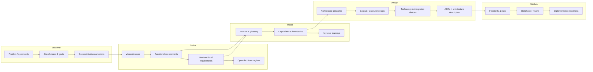

### Phase-by-phase

| Phase | Primary question | Main outputs | Who is involved |
|-------|------------------|--------------|-----------------|
| **1. Discovery** | What problem are we solving, for whom, and why now? | Problem statement, stakeholder map, success metrics | Product, business, architecture |
| **2. Scope & vision** | What is in / out for this initiative? | Vision, scope boundaries, release themes | Product, sponsors |
| **3. Requirements** | What must the system do and how well? | PRD or equivalent, user stories, NFRs, constraints | Product, BA, architecture (review) |
| **4. Clarification** | What is still ambiguous or undecided? | Assumptions log, open decisions, glossary | Product + architecture |
| **5. Domain understanding** | What concepts and rules exist in this problem space? | Domain model, business rules inventory, data concepts | Domain experts, architecture |
| **6. Capability & boundary design** | What major parts of the system exist and how do they interact? | Capability map, context diagram, integration list | Architecture |
| **7. Structural architecture** | How is the system decomposed and connected? | Container/component view, key sequences, data strategy | Architecture |
| **8. Deployment & release architecture** | How do we ship changes without user-visible outage? | Zero-downtime deploy model, migration strategy, rollback | Architecture, platform/SRE |
| **9. Decision capture** | Why did we choose X over Y? | ADRs, trade-off notes | Architecture |
| **10. Validation** | Can we build this, afford it, and operate it? | Risk register, cost/effort view, review sign-off | Architecture, engineering, security, ops |

### Detailed sequence (what happens in order)

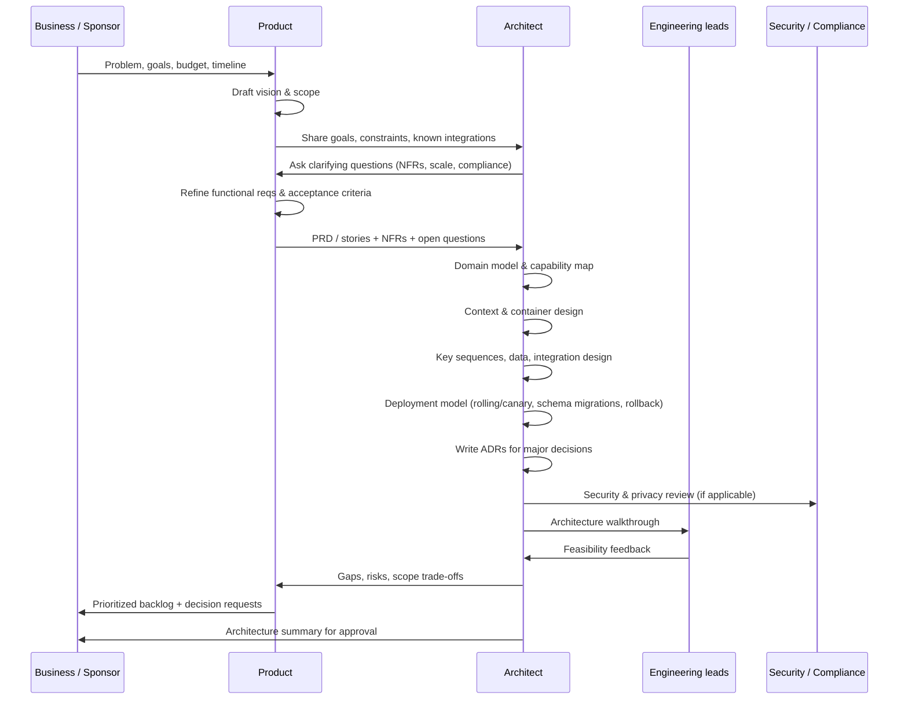

### Gate criteria (when to move to the next step)

**Discovery → Requirements**

- Problem statement is one paragraph and testable (you can tell when it is solved).
- At least one measurable success metric exists.
- In-scope and out-of-scope are written explicitly.
- Vague client input has been refined using discovery techniques (see [§2](#2-from-vague-idea-to-implementable-requirements)); `[GAP]` items are in open-decisions register, not invented.

**Requirements → Implementable (before architecture)**

- Must-priority stories meet [Definition of Ready](#definition-of-ready--implementable).
- `[ASSUMED]` items are not committed as Must without client validation.

**Requirements → Modeling**

- Every must-have capability has a named owner or user type.
- NFRs exist for performance, availability, security, and data (even if “TBD with target date”).
- Open decisions are listed, not hidden inside stories.

**Modeling → Architecture design**

- Core domain terms are defined in a glossary (no synonym chaos).
- Top 3–5 user journeys are described end-to-end.
- External systems and human actors are listed.

**Architecture design → Build**

- Context and container views exist and match the PRD.
- Critical paths have sequence diagrams.
- Major decisions have ADRs; blocked decisions are marked draft, not “accepted.”
- NFRs map to architectural mechanisms (caching, queues, auth model, etc.).
- Deployment strategy documented: rollout pattern, backward compatibility rules, DB migration approach, rollback — aligned with zero-downtime target (see [§5](#5-zero-downtime-deployment-strategy)).
- Requirements meet [Definition of Ready — implementable](#definition-of-ready--implementable) (or gaps explicitly in open-decisions register).

---

## 2. From vague idea to implementable requirements

Clients often start with **high-level intent** (“we need a modern portal,” “make ordering easier,” “like Amazon but simpler”). That is normal. **Implementable** means a team can estimate, design, build, and test without guessing business rules.

This section describes **techniques to refine** fuzzy input into concrete requirements — before architecture and coding.

### The refinement funnel

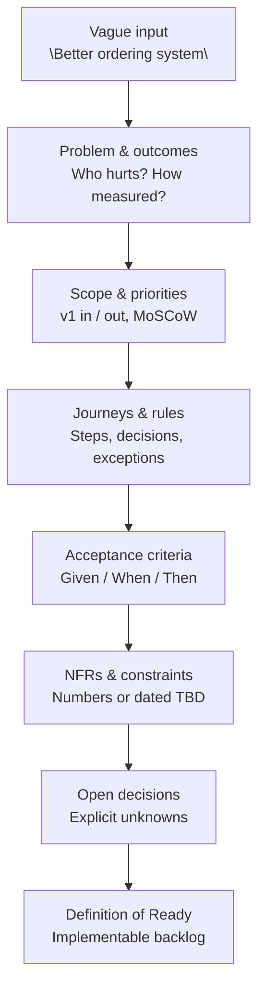

| Stage | Client often says | You produce |
|-------|-------------------|-------------|
| Vague | “We need an app” | Interview notes, problem statement draft |
| Problem | “Sales are losing deals” | Metrics, primary actors, success definition |
| Scope | “Everything” | In/out list, phased releases |
| Journeys | “Users order stuff” | Story map, business rules, exceptions |
| Acceptance | “It should work well” | Testable Given/When/Then per story |
| NFRs | “Fast and secure” | SMART targets or `TBD + owner + date` |
| Open | Silence | `open-decisions.md` — not hidden guesses |
| Ready | — | Stories estimable; no silent `[ASSUMED]` in Must |

### Principle: discover, don’t invent

| Tag | Meaning | Rule |
|-----|---------|------|
| **`[SOURCED]`** | Client/stakeholder said it | Cite source (workshop, email, PRD §) |
| **`[GAP]`** | Unknown — do not guess | Add to open-decisions register; ask client |
| **`[ASSUMED]`** | Temporary default for planning | **Cannot** be Must-priority until validated |

> A BRD with 10 open gaps is safer than 10 invented answers that look final.

Architecture and code must not treat `[GAP]` or unvalidated `[ASSUMED]` as settled (use **DRAFT** ADRs until resolved).

---

### Technique 1: Problem framing (start here)

**When:** First conversation; client describes a solution (“we need AI”) not a problem.

**Questions (pick 5–8):**

1. Who is the **primary user**? Who pays?
2. What **pain** happens today? Show me the current workflow.
3. What **changes** if we succeed? (time saved, revenue, errors reduced)
4. How will we **measure** success in 6 months?
5. What have you **tried** already?
6. What is **non-negotiable** (legal, deadline, integration)?
7. What is explicitly **not** needed in v1?

**5 Whys (example)**

```text
Client: "We need a customer portal."
Why? → Distributors email orders and we re-key them.
Why? → Errors and 48h delay.
Why? → No real-time stock visibility.
Why? → Inventory is only in ERP batch overnight.
Why? → Integrations were deferred.

→ v1 might be: browse catalog + submit order + ERP sync — not "full portal."
```

**Output artifact:** one-paragraph **problem statement** + 1–3 **success metrics**.

```markdown
## Problem statement [SOURCED: CEO workshop 2026-05-10]
Distributors email Excel orders; ops re-keys into ERP with 8% errors and 48h avg turnaround.

## Success metrics
- 80% of orders via portal within 6 months [SOURCED]
- Order errors &lt; 2% [ASSUMED — pending validation; OD-003]
```

---

### Technique 2: Jobs to be done (JTBD)

**When:** Client lists features; you need underlying motivation.

**Template:** “When **[situation]**, I want to **[motivation]**, so I can **[outcome]**.”

| Feature request | JTBD insight | Implementable focus |
|-----------------|--------------|---------------------|
| “PDF export” | Prove order to finance | Confirmation PDF after submit |
| “Dashboard” | See if orders stuck | Ops view: orders by status + SLA |
| “Mobile app” | Order from warehouse | `[GAP: mobile v1 or responsive web? OD-004]` |

---

### Technique 3: User story mapping

**When:** Scope is broad; need shared picture of v1.

**How:** Horizontal **steps** of one journey; vertical **priority** (Must / Should / Could).

```text
Backbone:  Browse catalog → Build cart → Checkout → Pay → Confirm → Notify ERP

Must v1:     [x]      [x]         [x]      [x]   [x]      [x]
Could v1:    [filters] [save cart]  [promo]  —     [PDF]    —
Won't v1:    —        —           —        —     —        [returns]
```

**Output:** epics aligned to backbone; **release slice** = one continuous path left-to-right.

---

### Technique 4: Example mapping (concrete scenarios)

**When:** Rules are hand-wavy (“handle exceptions properly”).

**Four-card method** per story:

| Card | Question | Example |
|------|----------|---------|
| **Story** | Who, what, why? | Distributor places order for 50 units |
| **Rules** | Business logic? | Credit limit check; min order $100 |
| **Questions** | Unknowns? | `[GAP: partial shipment allowed? OD-005]` |
| **Examples** | Concrete cases? | See table below |

**Examples table (drives acceptance criteria)**

| Case | Input | Expected |
|------|-------|----------|
| Happy path | In-stock, under credit | Order `confirmed` |
| Insufficient stock | Qty 50, stock 10 | `[GAP: backorder or reject?]` |
| Over credit | Total &gt; limit | `rejected` + message code `CREDIT_EXCEEDED` |

Convert each row to **Given / When / Then** when resolved.

---

### Technique 5: Event storming (lightweight)

**When:** Workflows cross people/systems; client unsure of steps.

**How (90 min):**

1. Orange stickies = **domain events** (`OrderPlaced`, `PaymentCaptured`, `OrderShipped`).
2. Blue = **commands** that cause them (`PlaceOrder`).
3. Yellow = **actors** (Distributor, Ops, ERP).
4. Pink = **questions / policies** → become `[GAP]` or rules.

**Output:** event flow diagram + list of integrations (ERP, payment, email).

---

### Technique 6: Prioritization (MoSCoW + thin slice)

**When:** Client wants everything; timeline is fixed.

| Priority | Meaning | Client script |
|----------|---------|---------------|
| **Must** | Launch fails without it | “If we cut this, do we still launch?” → No |
| **Should** | Important, not launch-blocking | Can slip to v1.1 |
| **Could** | Nice to have | |
| **Won’t** | Explicitly out | Prevents scope creep |

**Thin vertical slice:** smallest end-to-end path that proves value (e.g. one product, one payment method, one tenant).

```text
Won't: multi-currency, returns, admin analytics
Must slice: login → 1 SKU → checkout → email confirmation → ERP webhook
```

---

### Technique 7: Prototypes and walking skeletons

**When:** Client “doesn’t know until they see it.”

| Fidelity | Purpose | Time |
|----------|---------|------|
| **Paper / Figma** | Validate layout and vocabulary | 1–3 days |
| **Clickable mock** | Validate journey order | 3–5 days |
| **Walking skeleton** | Real deploy, fake data, one happy path | 1–2 weeks |

**Rule:** Prototype to **learn**, then **rewrite** requirements — don’t treat mock as spec unless signed off.

Label feedback: `[SOURCED: prototype review 2026-05-15]` or new `[GAP]`.

---

### Technique 8: Time-boxed spikes (technical unknowns)

**When:** Client asks “can we integrate with ERP X?” and nobody knows.

**Spike story:**

```text
As a team, we need to prove SAP BAPI read for SKU and stock,
So that we can estimate integration for checkout.

Time-box: 3 days. Deliverable: spike report + sample payload, not production code.
```

Spike **resolves** `[GAP]` → update BRD and open-decisions register.

---

### Technique 9: Structured interviews (when client is stuck)

Use **forced choices** instead of open “what do you want?”

```text
"For v1 login, which is acceptable?"
  A) Email + password only
  B) SSO with existing Microsoft AD  [SOURCED: IT policy?]
  C) Both
  D) Not sure — we need a workshop with IT (→ OD-006)
```

**Roles to interview separately:** sponsor (outcomes), end user (workflow), ops (exceptions), IT (constraints), legal (compliance).

---

### Technique 10: Open decisions register (never bury unknowns)

**Path (example):** `.sdlc-automation-agent/.orchestrator/open-decisions.md`

```markdown
| ID | Question | Options | Impact | Owner | Due | Status |
|----|----------|---------|--------|-------|-----|--------|
| OD-005 | Partial shipment? | A) Reject B) Backorder C) Split line | Checkout rules | Client ops | 2026-06-01 | OPEN |
| OD-006 | SSO provider? | AD vs Auth0 | Auth ADR | IT | 2026-06-05 | OPEN |
```

**Rules:**

- PM does **not** close client decisions without client input.
- Stories blocked by OD-* stay **not ready** or marked blocked.
- SA marks dependent ADRs **DRAFT** until resolved.

---

### Worked example: vague → implementable

**Initial client input**

> “We need a modern B2B ordering system like big competitors. It should be fast, easy, and integrate with our systems.”

**After techniques 1–4 and 6 (excerpt)**

```markdown
# BRD: B2B Order Portal v1

## Problem [SOURCED: workshop]
Distributors email Excel; 8% re-key errors; 48h fulfillment delay.

## Success metrics
- 80% orders via portal in 6 months [SOURCED]
- p95 order submit &lt; 3s [ASSUMED — validate OD-007]

## Scope
In v1: catalog browse, cart, checkout, Stripe pay, order history, email confirm, ERP order export
Out v1: returns, native mobile, marketplace sellers, promotions engine

## Actors
- Distributor buyer (places order)
- Distributor admin (manage users) [SHOULD v1.1]
- Internal ops (monitor failed ERP sync) [Must]

## Journey (Must slice)
Login → search SKU → add to cart → checkout → pay → confirmation → async ERP export

## Business rules [SOURCED unless noted]
- Min order value $100 [SOURCED]
- Credit limit per tenant before submit [SOURCED]
- [GAP: OD-005 partial shipment]

## Story example (implementable)
**US-012 Place order**
As a distributor buyer, I want to submit my cart as an order, so that I receive confirmation without emailing Excel.

Acceptance criteria:
- Given cart total ≥ $100 and within credit limit, When I submit with valid Idempotency-Key,
  Then order status is `confirmed` and confirmation email is queued within 30s.
- Given ERP export fails, When order is confirmed, Then order status is `export_pending`
  and ops alert is raised [SOURCED: ops requirement].

## NFRs
- Availability 99.9% checkout API [SOURCED]
- GDPR: EU tenant data in EU region [SOURCED]
- [GAP: OD-007 confirm p95 target with client]

## Open decisions
See open-decisions.md OD-005, OD-006, OD-007
```

This BRD is **implementable enough** for SA to start discovery and for engineering to estimate **Must** stories — with explicit gaps, not silent guesses.

---

### Definition of Ready — implementable

A **user story** (or feature) is implementable when:

| # | Criterion |
|---|-----------|
| 1 | **Actor** and **goal** are named |
| 2 | **Acceptance criteria** are testable (Given/When/Then or clear pass/fail) |
| 3 | **Business rules** are stated or linked to `[GAP]` with owner |
| 4 | **Out of scope** for this story is obvious |
| 5 | **NFRs** affecting the story are known or tagged `TBD + date` |
| 6 | **Dependencies** (ERP, payment, auth) identified |
| 7 | No unresolved `[GAP]` on **Must**-priority items for this story |
| 8 | **UI/contract** stable enough: wireframe or API sketch for complex flows |

**Epic / BRD level** is ready for architecture when:

- [ ] Problem + metrics exist  
- [ ] v1 scope in/out written  
- [ ] Top 3–5 journeys mapped  
- [ ] Glossary started  
- [ ] Open decisions registered (not hidden in prose)  
- [ ] At least one **thin vertical slice** defined for v1  

---

### Facilitation agenda (2 workshops)

**Workshop A — Problem & scope (2 h)**

1. Problem framing + success metrics (30 min)  
2. Story map backbone + MoSCoW (60 min)  
3. In/out + open decisions capture (30 min)  

**Workshop B — Rules & examples (2 h)**

1. Walk Must slice step-by-step (30 min)  
2. Example mapping for checkout + exceptions (60 min)  
3. NFR numbers or assign OD-* owners (30 min)  

Between workshops: optional Figma mock of Must slice only.

---

### What not to do

| Anti-pattern | Why it fails |
|--------------|--------------|
| Write a 50-page BRD before any user contact | Wrong detail; client won’t read it |
| Invent answers to `[GAP]` to “finish” the doc | Wrong build; silent rework |
| Start architecture on “like Amazon” | No testable requirements |
| Let client approve mock without AC | “Looks right” ≠ implementable |
| Put `[ASSUMED]` items in Must column | Unvalidated scope commitment |

---

### Handoff: implementable requirements → architecture

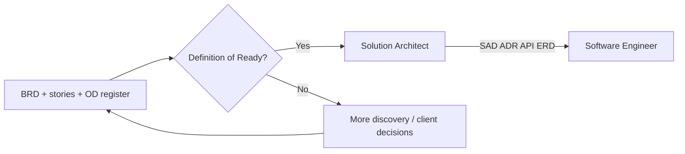

See [§3 Making requirements clear enough to architect](#3-making-requirements-clear-enough-to-architect) for architecture-specific clarity and [Solution Architect end-to-end](./solution-architect-end-to-end.md) for SA phases.

---

## 3. Making requirements clear enough to architect

“Clear requirements” for architecture means: **enough specificity to choose structure, boundaries, and quality mechanisms** — not every UI pixel or line of code.

### The clarity stack

Build requirements in layers. Architecture consumes all layers; implementation consumes the bottom layers most.

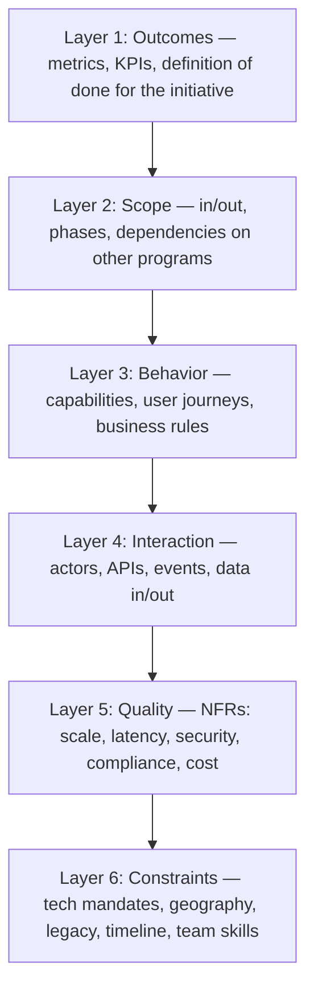

### What “clear” looks like per artifact

#### Problem statement (1 paragraph)

| Good | Weak |
|------|------|
| “Reduce order fulfillment time from 48h to 24h for EU B2B customers by Q3.” | “Make the platform faster and better.” |

#### Functional requirements

Use **capabilities** or **user stories** with **acceptance criteria** that are observable.

**User story template**

```text
As a [role],
I want [capability],
So that [outcome].

Acceptance criteria:
- Given … When … Then …
- Given … When … Then …
```

**Architect-relevant fields** (add to each epic or story group)

| Field | Example |
|-------|---------|
| Primary actor | Warehouse operator |
| Data created/read | Shipment, inventory reservation |
| Sync vs async | User waits for confirmation vs background job |
| Idempotency | Retry-safe order submit |
| Multi-tenancy | Per-merchant isolation |
| Regulatory | GDPR, PCI, HIPAA (if any) |

#### Non-functional requirements (NFRs)

NFRs drive architecture more than feature lists. Express them as **measurable targets** where possible.

| Category | Example (clear) | Example (vague) |
|----------|-----------------|-----------------|
| Scale | 10k concurrent users; 1M orders/month | “Must scale” |
| Performance | p95 API &lt; 200ms for read catalog | “Fast” |
| Availability | 99.9% monthly for checkout API | “Highly available” |
| Deployability | Zero-downtime releases; deploy during business hours; rollback &lt; 5 min | “No downtime allowed” (untested) |
| Security | OAuth2 + MFA for admin; encrypt PII at rest | “Secure” |
| Data | RPO 1h, RTO 4h; 7-year audit retention | “Backup needed” |
| Compliance | Data residency EU; SOC2 Type II in scope | “Compliant” |

Use **SMART** for NFRs: Specific, Measurable, Achievable, Relevant, Time-bound.

#### Constraints and assumptions

| Type | Document as |
|------|-------------|
| Hard constraint | “Must use existing SSO (SAML)” |
| Soft preference | “Prefer managed Postgres” |
| Assumption | “Mobile web only in v1” — validate by date |
| Open decision | “Event bus vs direct REST between services” — owner + deadline |

Keep an **open decisions register**: ID, question, options, impact, owner, due date. Architecture proceeds around unknowns (interfaces, feature flags, draft ADRs) instead of pretending they are decided.

#### Scope boundaries

Explicit **out of scope** prevents architecture gold-plating.

```text
In scope v1:  B2B order placement, inventory check, email notifications
Out of scope: Returns, marketplace seller onboarding, native mobile apps
```

#### Glossary and ubiquitous language

Before drawing boxes, align on terms: *Order*, *Shipment*, *Tenant*, *Account*. One term = one meaning in requirements and diagrams.

### Requirements quality checklist (architecture readiness)

Use this before starting serious architecture work:

- [ ] **Outcomes**: Success metrics defined
- [ ] **Scope**: In/out documented; phasing clear
- [ ] **Actors**: All human and system actors listed
- [ ] **Journeys**: Top flows described start-to-finish
- [ ] **Rules**: Business rules that affect design (pricing, eligibility, state machines)
- [ ] **Data**: Main entities and who owns them; retention and privacy noted
- [ ] **Integrations**: External systems with direction (in/out) and protocol hints
- [ ] **NFRs**: Performance, availability, security, compliance, cost — with numbers or explicit TBD + date
- [ ] **Deployability**: Zero-downtime expectation stated (or explicit exception); maintenance window policy; rollback SLA
- [ ] **Constraints**: Technical, organizational, regulatory
- [ ] **Decisions**: Open items logged; no silent assumptions in “accepted” architecture
- [ ] **Priorities**: MoSCoW or equivalent (Must / Should / Could / Won’t)

### Workshop pattern: “Architecture pre-flight” (90 minutes)

1. **Walk the north-star journey** (20 min) — one critical path only  
2. **NFR reality check** (20 min) — numbers or forced TBD with owner  
3. **Integration inventory** (15 min) — what exists, what we build  
4. **Risk & unknowns** (20 min) — populate open decisions  
5. **Exit criteria** (15 min) — agree what must be clarified before design sign-off  

---

## 4. Diagrams and sequences you need

Use diagrams to **reduce ambiguity** and **align stakeholders**. You do not need every UML diagram — you need the minimum set that connects requirements to buildable structure.

### Recommended diagram set (by order of creation)

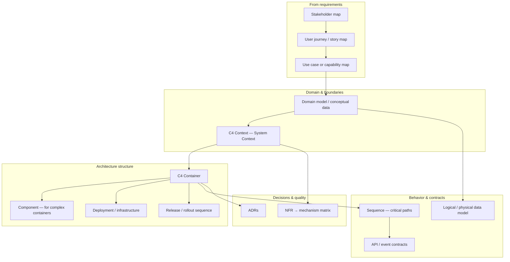

### Diagram reference

| # | Diagram | Purpose | Typical notation |
|---|---------|---------|------------------|
| 1 | **Stakeholder map** | Who cares, who decides, who uses | Simple boxes / onion |
| 2 | **User journey / story map** | Steps, pain points, system touchpoints | Journey line or story map |
| 3 | **Capability map** | What the organization/system must do | Capability tree |
| 4 | **Domain model** | Entities, relationships, key rules | UML class or ER (conceptual) |
| 5 | **C4 Context (L1)** | System boundary, users, external systems | C4 |
| 6 | **C4 Container (L2)** | Apps, services, DBs, queues, responsibilities | C4 |
| 7 | **C4 Component (L3)** | Internal structure of one complex container | C4 (optional) |
| 8 | **Deployment / infrastructure** | Where software runs, network zones, HA topology | Deployment / cloud icon diagram |
| 8b | **Release / rollout sequence** | How traffic shifts during deploy; rollback path | Sequence or swimlane diagram |
| 9 | **Sequence diagrams** | Request/order of interactions for critical flows | UML sequence / Mermaid |
| 10 | **API / event catalog** | Contracts between containers | OpenAPI, AsyncAPI, tables |
| 11 | **Data model (logical/physical)** | Schema, ownership, consistency | ER diagram |
| 12 | **ADRs** | Decision log with context and trade-offs | Markdown ADR template |
| 13 | **NFR → mechanism matrix** | Traceability from quality goals to design | Table |

### C4 Context (example structure)

Shows the system as one box and everything outside it.

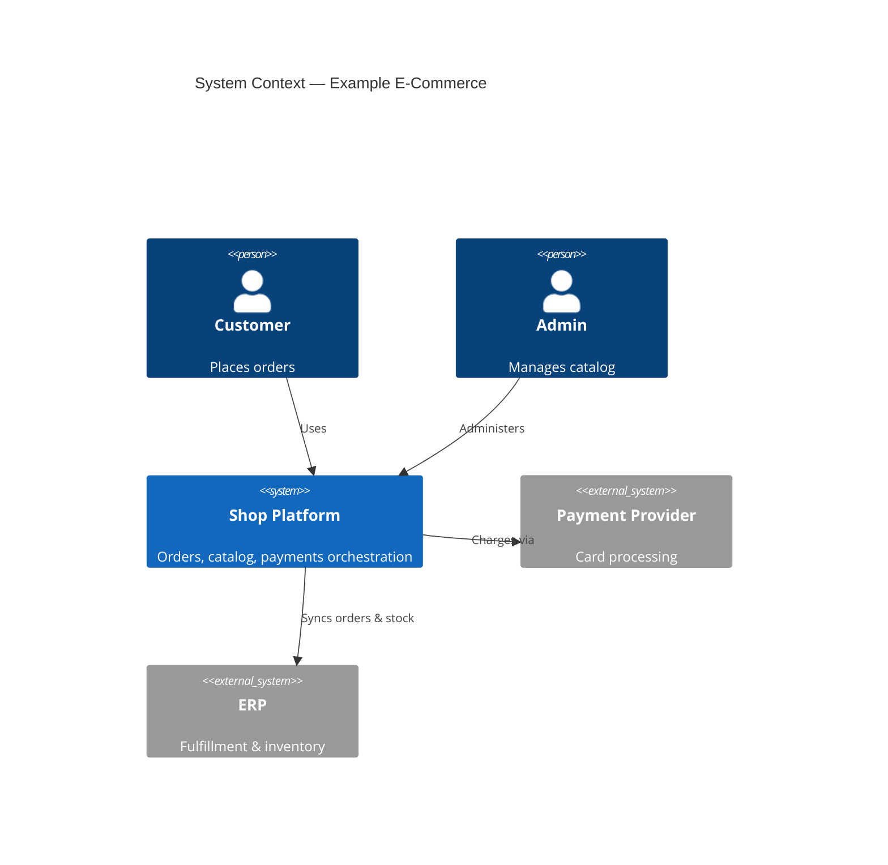

### C4 Container (example structure)

Splits the system into deployable/runnable parts.

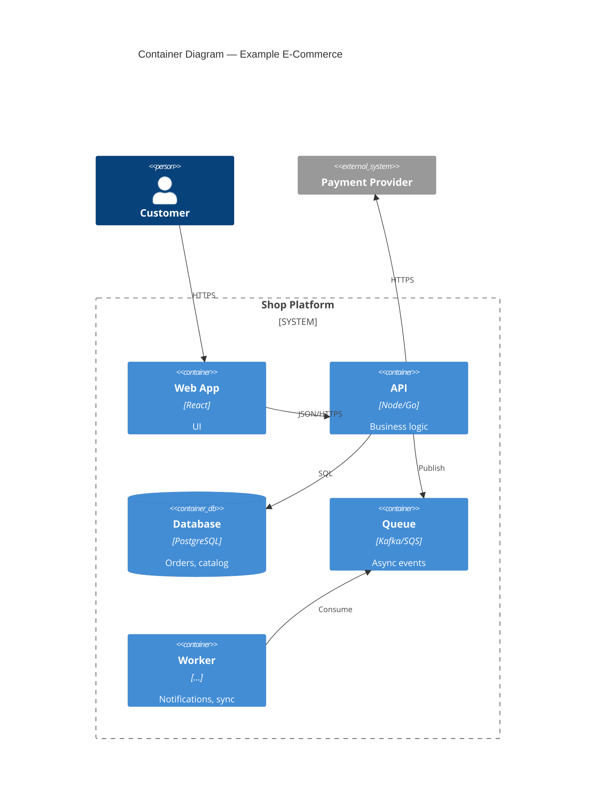

### Sequence diagram — when to create one

Create a sequence diagram for each flow that is:

- **Revenue- or safety-critical** (checkout, payment, auth, consent)
- **Crosses three or more containers**
- **Async or saga-like** (compensation, retries, idempotency)
- **Disputed or unclear** in workshops

**Example: synchronous order placement**

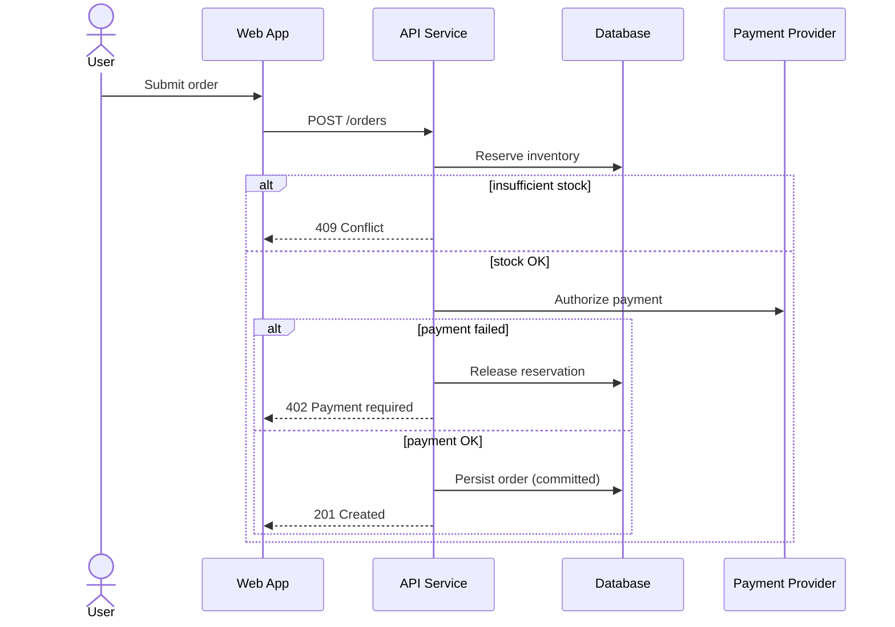

### NFR → architectural mechanism matrix (example)

| NFR | Target | Architectural mechanism |
|-----|--------|---------------------------|
| Peak load 5k RPS reads | p95 &lt; 100ms | CDN + read replicas + cache |
| Write consistency for orders | No duplicate charges | DB transaction + idempotency keys |
| 99.9% availability | &lt; 43 min downtime/month | Multi-AZ, health checks, circuit breakers |
| Zero-downtime deploys | No user-visible errors during release | Rolling/canary + readiness probes + backward-compatible API/DB + expand-contract migrations |
| Audit trail | 7 years, tamper-evident | Append-only event log + immutable storage |

### How diagrams connect to documents

| Document | Holds |
|----------|--------|
| **PRD / product brief** | Outcomes, scope, stories, NFRs, open decisions |
| **Architecture description (SAD or equivalent)** | Context, containers, principles, cross-cutting concerns |
| **`adrs/`** | One file per major decision |
| **API / event specs** | Machine-readable contracts |
| **Data dictionary / ERD** | Entities, ownership, lifecycle |
| **Deployment / release runbook** | Rollout steps, health gates, rollback, schema migration order |

---

## 5. Zero-downtime deployment strategy

Zero-downtime deployment means **users and integrating systems continue to succeed during a production release** — no planned outage window required for a normal deploy. It is a **design constraint**, not only an ops procedure: the architecture, API contracts, data model, and CI/CD pipeline must support safe coexistence of old and new versions.

### Definitions

| Term | Meaning |
|------|---------|
| **Zero-downtime deploy** | No intentional service interruption; in-flight requests complete; new traffic served by healthy instances |
| **High availability (HA)** | System tolerates failures (AZ, node, dependency); related but not identical to deploy strategy |
| **Backward compatibility** | New code works with old clients/data; old code can coexist briefly with new schema/events |
| **Rollback** | Revert to last known-good release within agreed SLA without data loss |

Clarify in requirements: **zero-downtime for application deploy** does not guarantee zero impact from **destructive schema changes**, **breaking API changes**, or **infrastructure failures** unless those are explicitly designed for.

### Architectural prerequisites

Design these in during structural architecture (phase 7), not after go-live.

| Prerequisite | Why it matters |
|--------------|----------------|
| **Stateless app tier** (or externalized session) | Instances can be replaced without sticky-session loss |
| **Health endpoints** (`/health`, `/ready`) | Load balancer drains bad instances; readiness ≠ liveness |
| **Graceful shutdown** | SIGTERM → stop accepting → finish in-flight → exit |
| **At least N+1 capacity** during rollout | One AZ/node/version can fail or drain without exhausting capacity |
| **Idempotent APIs & consumers** | Retries during cutover do not duplicate side effects |
| **Backward-compatible API changes** | Additive fields first; deprecate later; version or negotiate contracts |
| **Expand–contract DB migrations** | Schema changes in phases: expand → dual-write/read → contract |
| **Feature flags** | Behavior toggles decouple deploy from release |
| **Versioned events / tolerant readers** | Async pipelines survive mixed producer versions |
| **Automated rollback** | Failed health gates revert traffic or deployment automatically |

### Rollout patterns (choose per component)

Different parts of the system have different failure modes during deploy. **Do not pick one pattern for everything** — document a pattern per deployable unit (API service, web app, worker, gateway, etc.) in your architecture description or ADR.

#### Quick comparison

| Pattern | Traffic during deploy | Infra cost | Rollback speed | Best for |
|---------|----------------------|------------|----------------|----------|
| **Rolling** | Old and new share 100% capacity (if sized N+1) | Baseline | Minutes (re-deploy old image) | Stateless APIs, workers with compatible messages |
| **Blue–green** | 100% on blue OR green | ~2× during cutover | Seconds (flip LB/DNS) | Monoliths, demos, strict “all-or-nothing” validation |
| **Canary** | Gradual % to new | Baseline + small extra cohort | Seconds–minutes (shift weight to 0) | High-risk changes, large user base |
| **Rolling + canary** | New version rolls in only after canary metrics pass | Baseline | Automated abort on SLO breach | Kubernetes, ECS, managed mesh |

Document each choice in an **ADR** (e.g. “ADR-012: Checkout API — canary via Argo Rollouts; Catalog API — rolling”).

---

#### How to choose (decision flow)

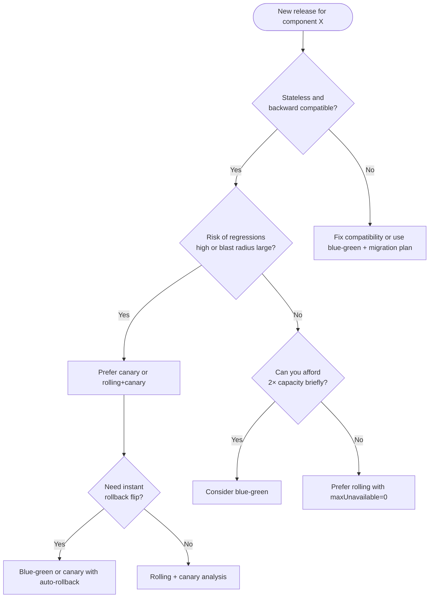

---

#### Pattern 1: Rolling update

**Idea:** Replace instances in **batches**. The load balancer only sends traffic to instances that pass **readiness**. Old and new versions run **at the same time** for a short window.

**Example — Kubernetes Deployment (6 replicas, zero downtime)**

```yaml
# Simplified — illustrative
spec:
  replicas: 6
  strategy:
    type: RollingUpdate
    rollingUpdate:
      maxSurge: 1        # allow 1 extra pod during rollout → 7 max
      maxUnavailable: 0  # never drop below 6 ready pods
```

**Timeline (ASCII)**

```text
T0: [v1][v1][v1][v1][v1][v1]     ← 6 serving
T1: [v1][v1][v1][v1][v1][v1][v2] ← v2 starting, not ready
T2: [v1][v1][v1][v1][v1][v2]     ← one v1 terminated after v2 ready
… continue until all v2
T_end: [v2][v2][v2][v2][v2][v2]
```

**Concrete example — REST API on ECS**

| Setting | Value | Why |
|---------|-------|-----|
| Desired count | 4 | Minimum steady capacity |
| Minimum healthy percent | 100 | No task drained until replacement is healthy |
| Maximum percent | 125 | Allow 5 tasks briefly (4 + 1 surge) during deploy |
| Health check | `GET /ready` returns 200 | New task joins target group only when ready |

Deploy flow: register new task definition → ECS starts new tasks → ALB health OK → drain old tasks one by one.

**When rolling works well**

- Stateless HTTP/gRPC services
- Queue consumers where **old and new can process the same message format**
- Config-only changes (no schema break)

**When rolling fails (examples)**

| Change | Problem | Fix |
|--------|---------|-----|
| Remove JSON field old app still sends | 400 errors during mix | Deprecate in release N; remove in N+2 |
| Rename DB column in same deploy | New pods crash on start | Expand–contract migration first |
| In-memory session on pod | Users logged out when pod killed | Externalize session (Redis) |

##### FE consistency during rolling deploy

Rolling gives **zero downtime on the network** (no intentional outage). It does **not** automatically give **consistent behavior for the client**. While old and new backends coexist, the load balancer sends different requests to different versions. The frontend usually assumes **one stable API contract** per page or session — mixed responses cause **wrong, broken, or flickering UI** even when every pod passes `/ready`.

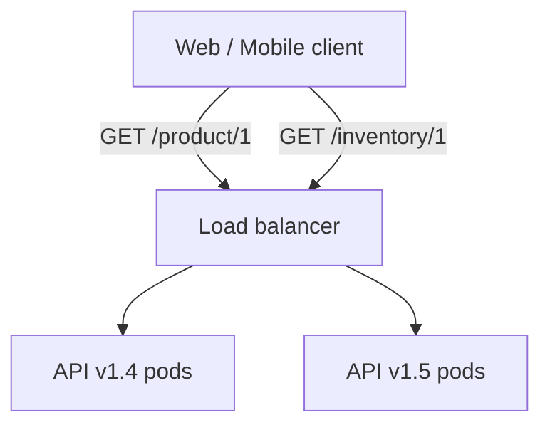

**What coexistence looks like**

```text
User browser
      │
      ▼
   Load balancer
    ╱    ╲
  v1.4    v1.5   ← both serve the same URL
  pod     pod
```

For several minutes, request A may hit v1.4 and request B may hit v1.5. That is expected. Problems appear when v1.4 and v1.5 are **not backward compatible** for every field and rule the FE uses.

**How the frontend shows wrong data**

| Scenario | What happens | What the user sees |
|----------|--------------|-------------------|
| **JSON shape change** | v1.4: `"price": 99`; v1.5: `"price": { "amount": 99 }` | Refresh → `$NaN`, blank price, React error boundary |
| **Same field, different meaning** | `status: "pending"` means different things per version | Wrong banner text; no HTTP error |
| **Multi-call page** | Product from v1.5 (`inStock: true`), inventory from v1.4 (`qty: 0`) | Add to cart appears, then disappears |
| **Write on new, read on old** | POST on v1.5 creates order; GET on v1.4 does not understand new shape | “Order not found” after successful checkout |
| **Client cache / polling** | React Query merges v1.4 and v1.5 cart responses | Looks like a frontend race bug; root cause is mixed APIs |
| **WebSocket + REST** | WS on old pod (old event shape), REST on new | Live UI out of sync with loaded page |
| **FE/BE deploy mismatch** | New BE rolled; old FE still live (or reverse) | Systematic errors until both sides align |

**Example — incompatible price field**

v1.4 response:

```json
{ "id": "p-1", "price": 99.0, "currency": "USD" }
```

v1.5 response:

```json
{ "id": "p-1", "price": { "amount": 99.0, "currency": "USD" } }
```

FE code: `product.price.amount` → works on v1.5, **undefined** on v1.4 → broken display on ~⅚ of refreshes mid-rollout.

**Safe overlap response (additive contract)**

```json
{
  "id": "p-1",
  "price": 99.0,
  "priceDetail": { "amount": 99.0, "currency": "USD" }
}
```

Old FE uses `price`; new FE uses `priceDetail`; remove `price` only after FE is at 100%.

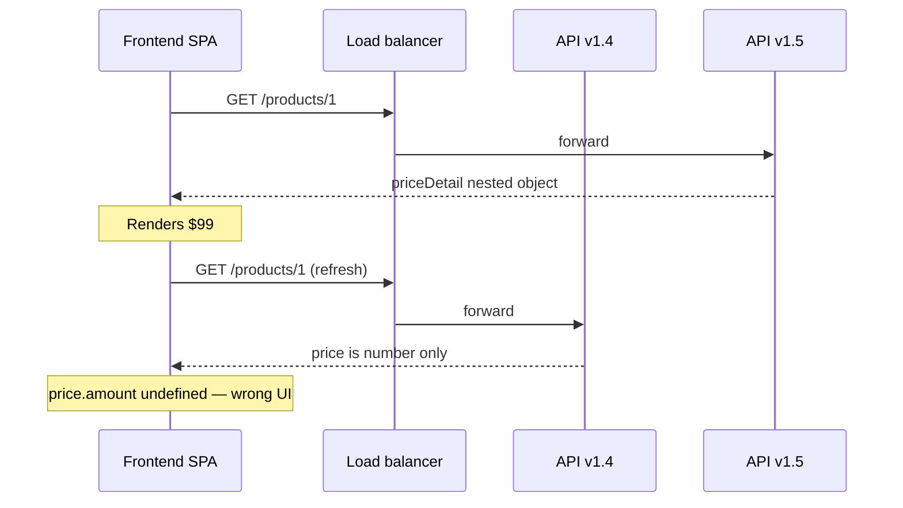

**Multi-service screen (mixed versions)**

```text
GET /products/123   → catalog (50% v1.5 pods)
GET /inventory/123  → inventory (still 100% v1.4)
GET /promotions?pid → promos (rolling)
```

One screen, three services — each may be at a different rollout stage. FE business rules that combine fields (`inStock && quantity > 0`) can show **contradictory** states without any 5xx.

**Why rolling exposes this more than blue–green**

| Rolling | Blue–green (if cutover is clean) |
|---------|----------------------------------|
| Gradual mix of v1 and v2 on **same URL** for every user | Traffic is mostly **100%** old or **100%** new at flip |
| One session can hit both versions in minutes | Session often sees one version until switch |
| Glitches often peak **mid-rollout** | Fewer per-request version flips (DB/API must still be compatible) |

Blue–green does not remove the need for compatible contracts; it reduces **per-request version roulette** during the transition.

**Mitigations**

| Mitigation | Detail |
|------------|--------|
| **Backward-compatible API** | Additive fields only during overlap; deprecate then remove in a later release |
| **Phased FE + BE releases** | Release A: BE adds optional fields; Release B: FE consumes them; Release C: BE removes old fields |
| **Feature flags** | Deploy v1.5 everywhere with new behavior **off**; enable globally when 100% on new binary |
| **BFF / GraphQL buffer** | Map mixed backend versions to one stable shape for the UI |
| **API versioning** | `/v1` vs `/v2` with FE pinned to one URL during transition |
| **CI contract checks** | OpenAPI/GraphQL diff fails build on breaking changes |
| **Staging mix tests** | Route 50% traffic to mock v1 and 50% to mock v2; run E2E on critical screens |
| **Canary metrics** | Alert on business KPIs and client error rates, not only HTTP 5xx |

**Release timeline (typical failure window)**

```text
10:00  Rollout starts — 1/6 pods on v1.5
10:02  User session — ~17% requests hit v1.5 → intermittent UI glitches
10:05  3/6 pods v1.5 — ~50% mixed responses for old FE
10:10  6/6 pods v1.5 — old FE still broken until FE deploy completes
```

**Pre-roll checklist (FE + API)**

- [ ] Old FE + new BE tested in staging  
- [ ] New FE + old BE tested in staging  
- [ ] Mixed-version simulation for multi-call screens  
- [ ] Mutation + immediate read (read-your-writes) exercised  
- [ ] WebSocket/SSE payload unchanged or explicitly versioned  
- [ ] Rollback restores the contract the live FE expects  

**Summary:** Rolling is safe for clients only when **v1 and v2 are compatible** for shape, semantics, and combined multi-service reads. Plan overlap as a **contract phase**, not only an ops phase.

---

#### Pattern 2: Blue–green

**Idea:** Run **two complete environments** (blue = live, green = idle). Deploy to green, test, then **switch all traffic** in one step. Rollback = switch back to blue.

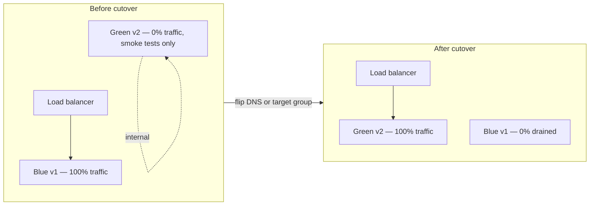

**Concrete example — single monolith on VMs**

| Step | Action |
|------|--------|
| 1 | Blue pool: `app-1..app-4` serving `v1.4.0` behind ALB target group **blue** |
| 2 | Green pool: provision `app-5..app-8`, deploy `v1.5.0`, run synthetic checkout test |
| 3 | Flip ALB listener rule: 100% weight to **green** target group |
| 4 | Monitor 15 min; if OK, decommission blue; if not, flip back to blue (rollback &lt; 1 min) |
| 5 | Next release: green becomes staging; build new blue |

**Concrete example — AWS Elastic Beanstalk**

- Environment clone → deploy to clone → swap CNAME (`myapp.com`) → old environment becomes standby.

**Database coupling (critical)**

Blue and green often **share one database**. Zero-downtime requires **both app versions to work with the same schema** during the switch:

```text
Release 1 (expand):  ADD column `discount_code` nullable — deploy v1.5 (ignores column)
Release 2 (switch):  Blue-green flip to v1.6 (writes `discount_code`)
Release 3 (contract): DROP old column — only when no v1.5 left
```

**When blue–green fits**

- Small number of deployable units (one monolith, one API fleet)
- Need **fast, confident rollback** (flip traffic)
- Staging environment that is **production-identical** (green)

**Costs and limits**

- ~2× compute for the duration of overlap
- Not ideal for 50 microservices each with blue–green (cost + ops complexity) — use rolling/canary per service instead
- Serverless “blue–green” is often **alias/Lambda versions** or **CodeDeploy traffic shifting** (see canary)

---

#### Pattern 3: Canary

**Idea:** Send a **small slice of real traffic** to the new version. Promote only if metrics stay within SLO. Abort = route 0% to canary.

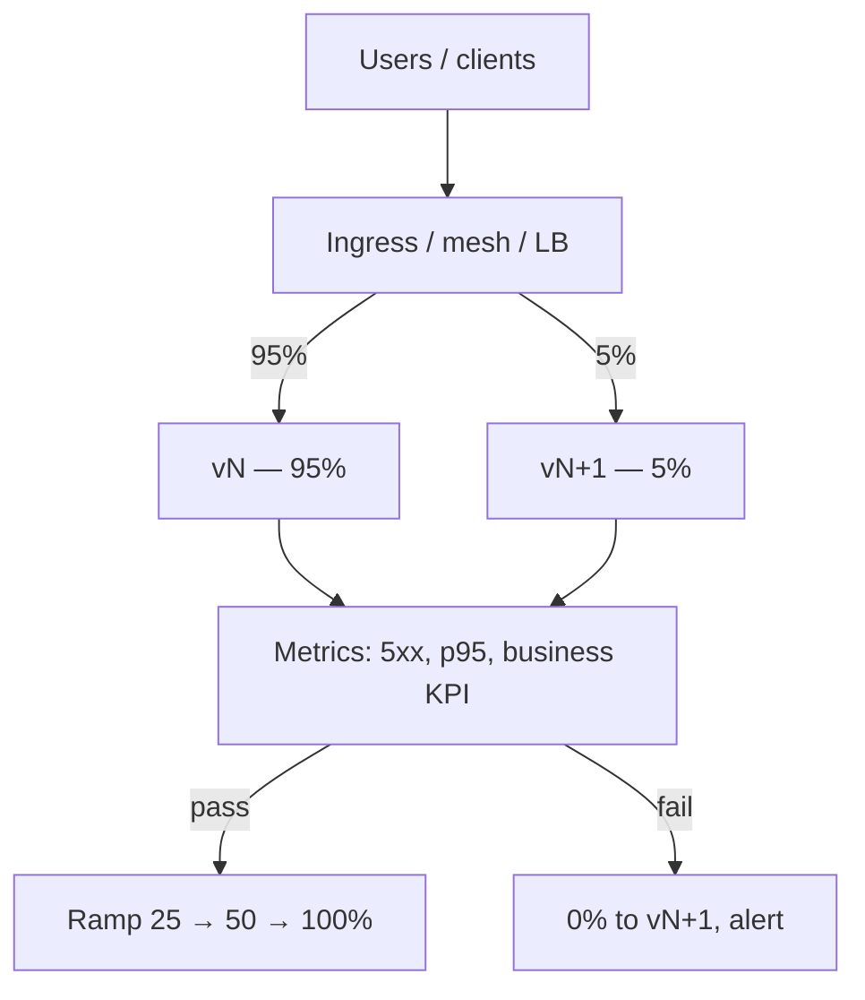

**Concrete example — Kubernetes + Argo Rollouts**

```yaml
# Illustrative canary steps
strategy:
  canary:
    steps:
      - setWeight: 5
      - pause: { duration: 10m }
      - analysis:
          templates: [error-rate, latency-p95]
      - setWeight: 25
      - pause: { duration: 10m }
      - setWeight: 50
      - pause: { duration: 10m }
      - setWeight: 100
```

Promotion gates (define in architecture):

| Metric | Abort if |
|--------|----------|
| HTTP 5xx rate | &gt; 0.5% for 5 min (canary vs stable) |
| p95 latency | &gt; +20% vs stable |
| Checkout conversion | Drops &gt; 2% vs 1h baseline |

**Traffic splitting mechanisms**

| Platform | Mechanism |
|----------|-----------|
| Kubernetes | Ingress weight, service mesh (Istio/Linkerd), Argo Rollouts |
| AWS ALB | Weighted target groups |
| Cloudflare / CDN | Percentage split to origin versions |
| API gateway | Route % to upstream v2 |

**Concrete example — payment service (high risk)**

| Phase | Traffic to v2 | Duration | Decision |
|-------|---------------|----------|----------|
| Bake | 0% (synthetic only) | 30 min | Automated contract tests against green |
| Canary 1 | 1% | 30 min | Compare charge failure rate |
| Canary 2 | 10% | 2 h | Same + manual approval in runbook |
| Full | 100% | — | Retire v1 replicas |

**When canary is worth the complexity**

- Revenue paths (checkout, billing, auth)
- Changes to serialization, auth, or pricing rules
- Large fleets where a bad rolling deploy affects everyone at once

---

#### Pattern 4: Rolling + canary (analysis-driven rolling)

**Idea:** Combine **rolling replacement** with **metric gates** — each batch or each new ReplicaSet must pass analysis before continuing. Common default on modern K8s platforms.

**Example flow**

```text
1. Deploy ReplicaSet v2 with 1 pod (canary)
2. Analysis: 10 min, error rate OK → scale v2 to 25%, scale down v1 proportionally
3. Analysis OK → 50% → 100%
4. On failure at step 2: scale v2 to 0, leave v1 at 100% (auto rollback)
```

Same compatibility rules as plain rolling — canary only **delays** blast radius; it does not fix breaking schema changes.

---

#### Choose per component (reference matrix)

Use this in architecture docs: one row per deployable, with rationale.

| Component | Typical pattern | Example setup | Notes |
|-----------|-----------------|---------------|-------|
| **Public REST API** | Rolling or canary | K8s `maxUnavailable: 0`; 5→25→100% canary on checkout | Require backward-compatible API |
| **Internal gRPC service** | Rolling | 3 replicas, client retries + idempotency | Less need for canary unless critical path |
| **Web SPA (static)** | Blue–green or CDN cache bust | S3 sync to `green/` prefix; CloudFront invalidation; flip origin | Users may cache old JS — versioned asset URLs |
| **Serverless (Lambda)** | Canary via alias weights | `live` alias: 90% v12, 10% v13 → shift | Cold start affects canary metrics |
| **Background worker** | Rolling **or** parallel consumers | Run v1 and v2 consumers on same queue; idempotent handlers | **Poison:** new code must not break old messages |
| **Kafka consumer** | Rolling with cooperative rebalance | Deploy new consumer group version only after schema compatible | Prefer new topic/version for breaking changes |
| **GraphQL / BFF** | Canary on high-traffic routes | Mesh route rules | Resolver changes need field-level compatibility |
| **Feature-flagged logic** | Rolling deploy + flag off | Deploy code dark; enable 1% users via LaunchDarkly | Decouples binary deploy from behavior exposure |
| **Database schema** | **Not** rolling — expand–contract | Migration job in CI, separate from app rollout | Never “roll” Postgres like a pod |
| **Redis / cache** | Rolling instances or dual-write | Cache is disposable; warm on miss | Version cache key prefix on breaking shape |
| **Mobile app backend** | Rolling + long API compatibility | Server supports app versions −3 months | Canary less useful for native app traffic mix |

**Worked example — e-commerce platform**

| Service | Pattern | Rollout detail |
|---------|---------|----------------|
| `catalog-api` | Rolling | Low risk reads; 6 pods; 5xx &lt; 0.1% |
| `checkout-api` | Canary 1→10→50→100 | Business metric: payment success rate |
| `notification-worker` | Rolling | Same queue; idempotent `notification_id` |
| `web-store` | Blue–green on CDN | `assets/v1.5.0/`; HTML points to hashed bundles |
| `postgres` | Expand–contract only | Release 47: add column; Release 48: app uses it; Release 49: drop old |
| `search-indexer` | Parallel index + alias swap | Build `index_v2`; atomic alias flip (Elasticsearch) |

---

#### Per-pattern runbook snippets (copy into ops docs)

**Rolling — abort**

```text
IF new pods CrashLoopBackOff OR readiness < 50% for 5 min:
  THEN kubectl rollout undo deployment/checkout-api
  VERIFY all pods on previous ReplicaSet; 5xx normal
```

**Blue–green — cutover checklist**

```text
PRE:  Green passes smoke + load test (synthetic)
FLIP: Update target group / DNS to green
POST: Watch dashboards 15 min; keep blue warm
ROLLBACK: Revert target group to blue (no redeploy)
```

**Canary — promotion**

```text
IF canary 5xx > stable + 0.3% for 10 min: setWeight 0, page on-call
IF pass 5% for 30 min: promote to 25% (no manual step for catalog)
IF pass 25% for 30 min: promote to 100%; tag release in metrics
```

---

#### Anti-patterns (real incidents avoided)

| Anti-pattern | What goes wrong | Better approach |
|--------------|-----------------|-----------------|
| Rolling deploy + breaking DB migration same day | New pods crash; old pods may corrupt data | Expand–contract; deploy app only after schema safe for both |
| `maxUnavailable: 50%` on 2 replicas | Briefly only 1 pod → overload | Min 3 replicas or `maxUnavailable: 0` + `maxSurge: 1` |
| Canary without baseline metrics | False positives/negatives | Compare canary to stable; same load profile |
| Blue–green with shared DB, destructive DDL on green | Instant outage at flip | DDL only in expand phase; both colors run same code+schema |
| Kill workers mid-message | Duplicate or lost jobs | Graceful shutdown + visibility timeout + idempotency |

---

#### What to record in the ADR (template)

```markdown
# ADR-0XX: Rollout strategy — [Component name]

**Context:** [Traffic, risk, replicas, platform]
**Decision:** [Rolling | Blue-green | Canary | Rolling+canary]
**Parameters:** [maxSurge, weights, pause duration, analysis thresholds]
**Rollback:** [undo rollout | flip LB | alias weight 0]
**Compatibility:** [API version, schema phase, feature flags]
**Consequences:** [Cost, time to deploy, tooling required]
```

### Zero-downtime release flow (reference sequence)

```mermaid
sequenceDiagram
  participant CI as CI/CD
  participant Reg as Container Registry
  participant Orch as Orchestrator / LB
  participant Old as vN instances
  participant New as vN+1 instances
  participant DB as Database

  CI->>Reg: Push image vN+1
  CI->>Orch: Deploy vN+1 (scaled to 0 or canary weight 0)
  Orch->>New: Start pods; readiness probe pending
  New->>DB: Compatible reads/writes only
  New-->>Orch: /ready = 200
  Orch->>New: Add to pool (canary 5%)
  Note over Orch,New: Monitor error rate, latency, saturation
  alt SLO breach
    Orch->>New: Drain & remove
    Orch->>Old: 100% traffic
  else healthy
    Orch->>Old: Drain connections
    Orch->>New: Ramp to 100%
    Orch->>Old: Terminate after grace period
  end
```

### Database and schema changes

Most production outages during “zero-downtime” deploys come from **incompatible migrations**. Use **expand–contract**:

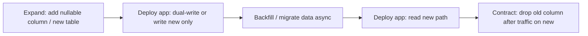

| Rule | Detail |
|------|--------|
| **Never** drop/rename/retype in same release as code depends on new shape | Split across releases |
| **Prefer additive** changes | New column, new endpoint, new event type |
| **Long-running migrations** | Online index creation; batch backfill; throttle |
| **Locks** | Avoid full-table locks in peak; use concurrent indexes where supported |

### API, events, and clients

| Change type | Safe approach |
|-------------|---------------|
| REST/GraphQL field | Add optional field; default behavior unchanged; remove only after deprecation period |
| Breaking behavior | New `/v2` path or header negotiation; run v1 and v2 in parallel |
| Events | New event version or `schema_version` field; consumers ignore unknown fields |
| Mobile / external clients | Assume old app versions for weeks; server remains backward compatible |

### Deployment NFRs (capture in requirements)

Add to the PRD or NFR doc when zero-downtime is required:

```text
Deployability:
- Planned releases: zero user-visible downtime (HTTP 5xx spike < X% for Y minutes)
- Rollback: automated or one-click within Z minutes
- Deploy frequency target: [e.g. daily / on-demand]
- Allowed maintenance window: none for app tier | [exception for DB if documented]
- Concurrent versions: old and new app MUST coexist for at least [duration, e.g. 30 min]
```

### ADR and diagram deliverables

| Artifact | Content |
|----------|---------|
| **ADR: deployment strategy** | Rollout pattern, environments, rollback, feature-flag policy |
| **ADR: schema migration** | Expand–contract rules, tooling (Flyway/Liquibase/etc.), ownership |
| **Deployment diagram** | AZs, LB, min replicas, pod disruption budgets |
| **Release sequence diagram** | Traffic shift, health gates, rollback branch (see above) |

### Zero-downtime checklist (architecture sign-off)

- [ ] NFR states zero-downtime (or documented exception and maintenance window)
- [ ] Rollout pattern chosen and drawn (rolling / blue–green / canary)
- [ ] Readiness and liveness probes defined; graceful shutdown documented
- [ ] Capacity: N+1 (or blue stack) during deploy verified
- [ ] API/event backward-compatibility rules agreed
- [ ] DB migrations follow expand–contract; no destructive change in single release
- [ ] Feature flags for risky behavior; deploy ≠ instant user exposure
- [ ] Rollback tested in staging (including schema rollback or forward-only plan)
- [ ] Observability: deploy markers, canary comparison dashboards, alert thresholds
- [ ] Runbook: promote, abort, rollback, and communication steps

### When true zero-downtime is not realistic

Document explicitly and get stakeholder sign-off:

| Scenario | Mitigation |
|----------|------------|
| Single-node legacy monolith | Blue–green at VM level; maintenance window for DB |
| Stateful leader election | Rolling with quorum; brief unavailability if unavoidable |
| Destructive one-shot migration | Read-only mode, dual-write window, or accepted micro-outage with comms |
| Embedded clients that cannot update | Extended API v1 support + sunset policy |

---

## 6. Deliverable checklist

### Minimum viable architecture package (greenfield)

- [ ] Problem statement + success metrics  
- [ ] Scoped PRD or capability list with prioritized stories  
- [ ] NFR document (or NFR section with targets)  
- [ ] Glossary (10–30 terms)  
- [ ] C4 Context + Container diagrams  
- [ ] 2–5 sequence diagrams for critical flows  
- [ ] Integration list with protocols and ownership  
- [ ] Conceptual + logical data view for core entities  
- [ ] ADRs for: decomposition style, communication, data, auth, multi-tenancy (if relevant)  
- [ ] ADR for deployment strategy (rollout pattern, rollback, zero-downtime constraints)  
- [ ] Release / rollout sequence diagram if zero-downtime is required  
- [ ] Schema migration approach (expand–contract) documented  
- [ ] Open decisions register (empty or resolved)  
- [ ] Review sign-off from product, engineering, security/ops as needed  

### Brownfield additions

- [ ] Current-state context and container diagrams  
- [ ] Gap analysis: as-is vs to-be  
- [ ] Strangler / migration sequence diagram  
- [ ] Deprecation and coexistence rules  

---

## 7. Common failure modes

| Failure | Symptom | Mitigation |
|---------|---------|------------|
| **Solution-first** | Diagrams show Kubernetes before requirements | Freeze tech until NFRs and boundaries exist |
| **Feature soup** | Long backlog, no journeys | Story-map top 3 journeys |
| **Hidden NFRs** | “We’ll fix performance later” | NFR workshop with numbers or dated TBD |
| **Mythical integration** | “The CRM will provide X” unverified | Integration inventory with owner confirmation |
| **Diagram debt** | Docs diverge from code | Assign diagram owner; update on boundary changes |
| **Accepted ADRs on guesses** | Decisions locked before product clarity | DRAFT ADRs + open decision IDs until resolved |
| **Deploy = downtime** | Schema and API break during rolling deploy | Expand–contract migrations; backward-compatible APIs; ADR for rollout |
| **Rollback untested** | Forward deploy works; revert causes outage | Automate rollback in staging; forward-only migration plan when revert impossible |

---

## Quick reference: one-page timeline

| Week (indicative) | Focus | Outputs |
|-------------------|-------|---------|
| 1 | Discovery & scope | Problem, stakeholders, scope, metrics |
| 2 | Requirements & NFRs | PRD, stories, NFRs, glossary draft |
| 3 | Domain & context | Domain model, C4 Context, journeys |
| 4 | Structure & decisions | C4 Container, sequences, ADRs, data model, deployment strategy |
| 5 | Validation | Reviews, risks, phased delivery plan, deploy/rollback drill |

Adjust duration to project size; the **order** matters more than the calendar.

---

## Further reading (external)

- [C4 model](https://c4model.com/) — context, container, component, code  
- [Architecture Decision Records (Michael Nygard)](https://cognitect.com/blog/2011/11/15/documenting-architecture-decisions) — ADR concept  
- [ISO/IEC/IEEE 42010](https://www.iso.org/standard/74393.html) — architecture description standards  
- [Team Topologies](https://teamtopologies.com/) — aligning architecture with team boundaries  
- [Blue-green deployment](https://martinfowler.com/bliki/BlueGreenDeployment.html) — Martin Fowler  
- [Parallel change (expand–contract)](https://martinfowler.com/bliki/ParallelChange.html) — safe incremental migration  

---

*This guide is intentionally generic. Adapt naming, folders, and ceremony to your organization’s delivery model (Agile, SAFe, internal platform standards, etc.).*
