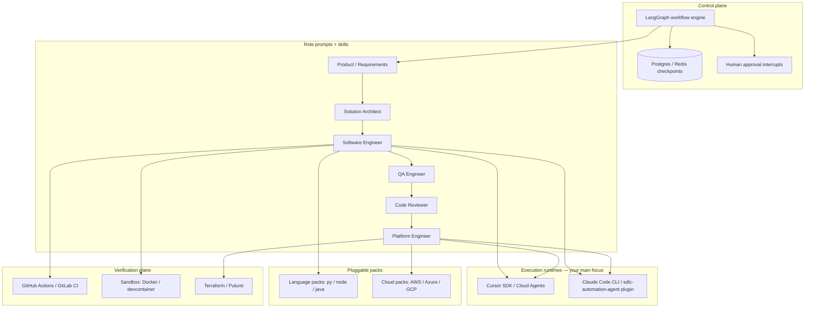
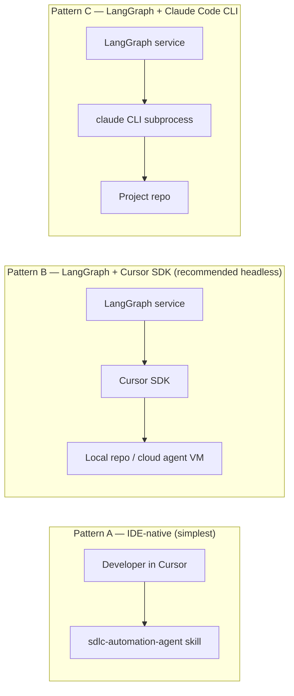
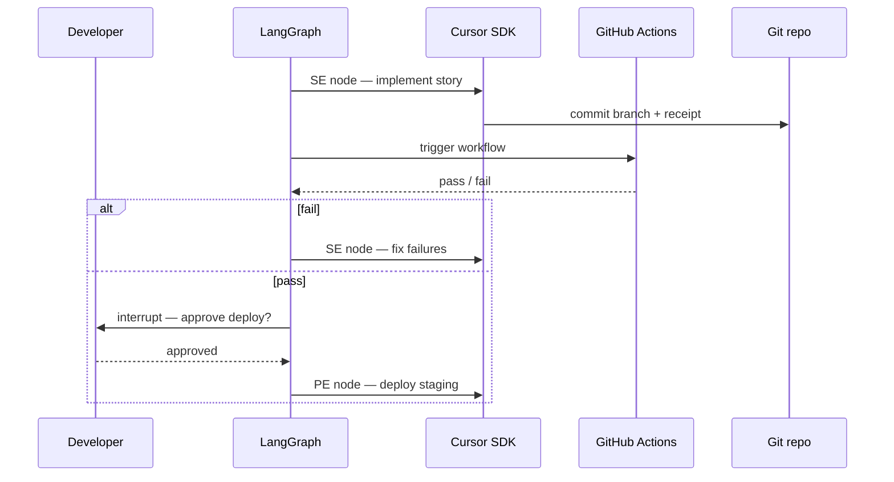
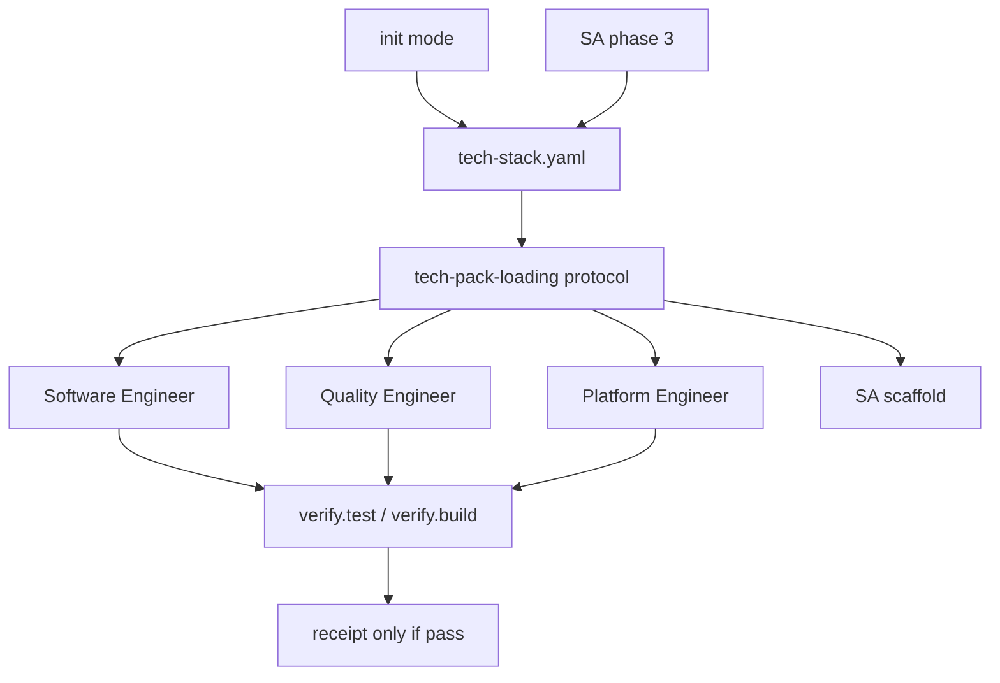
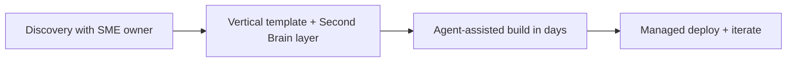
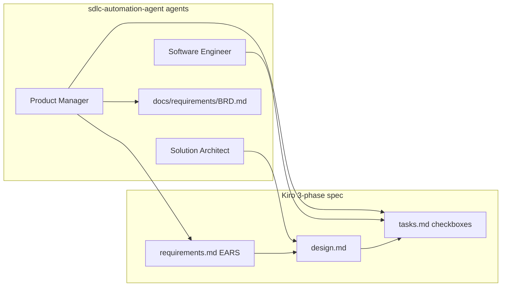
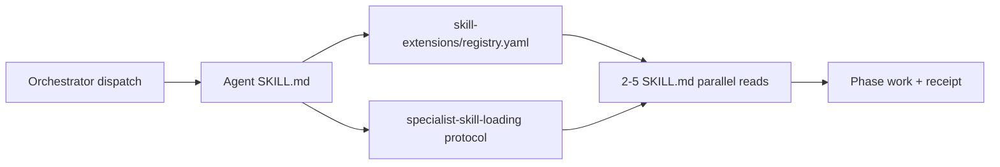

# SDLC Agent Automation — Architecture & Integration Guide

A practical guide for automating the software delivery lifecycle (requirements → deployment) using AI agents, with **Cursor** and **Claude Code** as the primary execution runtimes.

**Related docs**

- [Solution Architect end-to-end](./solution-architect-end-to-end.md) — phased SA workflow
- [From Requirements to Architecture](./requirements-to-architecture.md) — requirements clarity, zero-downtime deploy
- [Delivery Phases (sdlc-automation-agent)](../skills/sdlc-automation-agent/reference/delivery-phases.md) — orchestrator mapping
- [Backend Dispatch Protocol](../skills/_shared/backends/backend-dispatch.md) — pluggable agent backends
- [Spec-Driven Requirements Protocol](../skills/_shared/protocols/spec-driven-requirements.md) — Kiro-aligned EARS specs
- [Specialist Skill Loading](../skills/_shared/protocols/specialist-skill-loading.md) — curated deep skills (Option B)
- [Tech Pack Loading](../skills/_shared/protocols/tech-pack-loading.md) — stack-native verify + CI

---

## Table of contents

1. [Goals and scope](#1-goals-and-scope)
2. [What SDLC automation requires](#2-what-sdlc-automation-requires)
3. [Recommended architecture](#3-recommended-architecture)
4. [Framework comparison](#4-framework-comparison)
5. [SDLC workflow as a state machine](#5-sdlc-workflow-as-a-state-machine)
6. [Multi-language and multi-cloud packs](#6-multi-language-and-multi-cloud-packs)
7. [Agent roles](#7-agent-roles)
8. [Integration with Cursor and Claude Code](#8-integration-with-cursor-and-claude-code)
9. [Reference integration patterns](#9-reference-integration-patterns)
10. [Implementation roadmap](#10-implementation-roadmap)
11. [Anti-patterns](#11-anti-patterns)
12. [Technology stack summary](#12-technology-stack-summary)
13. [Improving sdlc-automation-agent for multi-stack delivery](#13-improving-sdlc-automation-agent-for-multi-stack-delivery)
14. [Market landscape — how companies automate SDLC](#14-market-landscape--how-companies-automate-sdlc)
15. [Recommended strategy for your stack](#15-recommended-strategy-for-your-stack)
16. [Kiro spec-driven requirements integration](#16-kiro-spec-driven-requirements-integration)
17. [Specialist skills integration (Option B)](#17-specialist-skills-integration-option-b)

---

## 1. Goals and scope

### Primary goal

Automate delivery from **requirements** through **architecture**, **implementation**, **testing**, **review**, and **deployment** — using **Cursor** and **Claude Code** as the agents that write code, run tools, and interact with the repo.

### Secondary goals

- Support **multiple languages** (Python, Node.js, Java, …) without forking the workflow
- Support **multiple clouds** (AWS, Azure, GCP, …) via pluggable packs
- Enforce **human gates** (architecture approval, production deploy)
- Produce **auditable artifacts** (ADRs, OpenAPI, tests, CI/CD, receipts)
- Allow **resume/retry** when tests fail or CI flakes

### What this doc is not

- A replacement for CI/CD — agents propose; **pipelines verify**
- A single mega-prompt — specialization and gates beat one general agent
- LangGraph running *inside* the Cursor IDE — LangGraph is an **external control plane** that **dispatches** to Cursor/Claude Code

---

## 2. What SDLC automation requires

| Requirement | Why it matters |
|-------------|----------------|
| **Long-running state** | Delivery spans hours or days; must survive restarts |
| **Human-in-the-loop (HITL)** | Architecture sign-off, security review, prod deploy approval |
| **Retry / resume loops** | `implement → test → fix` without restarting from requirements |
| **Deterministic handoffs** | PM → SA → SE → PE produce **files and contracts**, not only chat |
| **Pluggable conventions** | Language/cloud rules live in **packs**, not in orchestrator code |
| **Audit trail** | Who approved what, which ADR version, which deploy target |

Pure multi-agent conversation (e.g. AutoGen-only chat) is insufficient for production SDLC. You need:

```
Workflow engine  +  Role agents  +  Convention packs  +  CI verification
```

---

## 3. Recommended architecture



### Layer responsibilities

| Layer | Technology | Role |
|-------|------------|------|
| **Workflow orchestration** | **LangGraph** | DAG + cycles, checkpoints, `interrupt()` for HITL, explicit state |
| **IDE execution (primary)** | **Cursor SDK** + **Claude Code** | Code, tests, git, terminal, MCP tools in the repo |
| **Process / skills (optional IDE path)** | **sdlc-automation-agent** plugin | Same phases as LangGraph, runs natively in Cursor/Claude Code |
| **Durable jobs (enterprise)** | Temporal or Inngest | Optional under LangGraph for multi-day sprint loops |
| **Convention packs** | YAML + Markdown + templates + MCP | Language/cloud best practices |
| **Verification** | CI + linters + test runners | Source of truth for quality |
| **IaC** | Terraform (multi-cloud) or Pulumi | One abstraction; cloud packs supply modules |
| **Observability** | LangSmith / OpenTelemetry + git artifacts | Trace runs; store receipts |

---

## 4. Framework comparison

| Framework | Strengths | Weaknesses for full SDLC | Verdict |
|-----------|-----------|--------------------------|---------|
| **LangGraph** | Stateful graphs, HITL, retries, persistence | You design the graph | **Primary control plane** |
| **Cursor + sdlc-automation-agent** | Native repo access, skills, subagents, hooks | Not headless multi-tenant by default | **Primary execution runtime** |
| **Claude Code CLI** | Scriptable from LangGraph; same skills as IDE | Subprocess/CLI integration needed | **Execution runtime (headless)** |
| **AutoGen** | Rich multi-agent dialogue | Hard to enforce gates and artifacts | Prototyping only |
| **CrewAI** | Fast role-based crews | Less checkpoint/HITL control | MVP demos |
| **Temporal alone** | Best durability | Not LLM-native | Add under LangGraph at scale |

**Pragmatic choice:** **LangGraph** orchestrates; **Cursor SDK** and **Claude Code** execute; **sdlc-automation-agent** supplies the SDLC playbook (skills, protocols, gates).

---

## 5. SDLC workflow as a state machine

Aligned with [delivery-phases.md](../skills/sdlc-automation-agent/reference/delivery-phases.md) and [solution-architect-end-to-end.md](./solution-architect-end-to-end.md):

```
START
  → intake_requirements        (PM agent)
  → feature_specs_ears         (PM: .sdlc-automation-agent/specs/{id}/requirements.md)  [Kiro-aligned]
  → socratic_gate              [HITL: user confirms scope]
  → architecture_hld           (SA agent)  [HITL: approve ADRs]
  → spec_design                (SA: design.md + traceability to REQ-IDs)
  → tech_stack_selection       (SA) → selects language_pack + cloud_pack
  → parallel:
      ├── api_contracts        (SA)
      ├── data_model           (SA)
      └── scaffold             (SA)
  → cross_validation_gate      [automated: OpenAPI ↔ ERD ↔ BRD ↔ REQ-IDs]
  → task_plan                  (PM: tasks.md checkboxes)
  → implementation_loop        (SE: one task at a time from tasks.md) ←→ test_loop (QE) ←→ review (CR)
  → security_audit
  → ci_cd_setup                (PE + cloud_pack)
  → deploy_staging             [HITL: approve]
  → deploy_prod                [HITL: approve]
END
```

### Design rules

1. **Gates are code** — coverage thresholds, OpenAPI validation, `terraform plan` clean, lint pass.
2. **Agents produce artifacts** — `BRD.md`, `api/openapi.yaml`, `schemas/migrations/`, `.github/workflows/`.
3. **Loops are explicit** — max retries on `implement → test → fix`; no infinite chat.
4. **Receipts** — each phase writes `.sdlc-automation-agent/.orchestrator/receipts/{story}-{role}.json` per [receipt protocol](../skills/_shared/protocols/receipt-protocol.md).

---

## 6. Multi-language and multi-cloud packs

Do **not** branch the whole graph per stack. Use a **three-level plugin model**.

### Current sdlc-automation-agent gap (as of this repo)

sdlc-automation-agent **describes** tech packs in `software-engineer/SKILL.md` but delivery is incomplete:

| What exists | What's missing |
|-------------|----------------|
| 9 SE tech packs (FastAPI, Go, React, Next.js, …) | Java/Spring, NestJS, Express, .NET |
| Auto-detection from `package.json`, `go.mod`, `pyproject.toml` | `pom.xml`, `build.gradle`, NestJS signals |
| Packs load **only** in Software Engineer | Platform Engineer, QE, SA scaffold ignore packs |
| SA writes `docs/architecture/tech-stack.md` (prose) | No machine-readable `tech-stack.yaml` |
| Strong process (13 agents, receipts, gates) | Weak stack-specific **verify** (lint/test/build before receipt) |

This is why multi-stack projects feel broken: **process without stack-native guardrails**. Section [13](#13-improving-sdlc-automation-agent-for-multi-stack-delivery) fixes this inside sdlc-automation-agent before adding LangGraph.

### Level 1 — Decision record (from SA phase)

```yaml
# docs/architecture/tech-stack.yaml — generated once, consumed by ALL agents
language: java
runtime: "21"
framework: spring-boot
build_tool: gradle
test_runner: junit5
cloud: aws
region: ap-southeast-1
deploy: ecs-fargate
iac: terraform
packs:
  language: java-spring
  cloud: aws
  frontend: null
verify:
  lint: "./gradlew checkstyleMain"
  test: "./gradlew test"
  build: "./gradlew bootJar"
  typecheck: null
```

### Level 2 — Convention packs

Target layout (migrate existing `agents/software-engineer/tech-packs/` here):

```
packs/
  languages/
    python-fastapi/          # move from tech-packs/
      conventions.md
      testing.md
      ci-snippet.yml
      scaffold/
    java-spring/
      conventions.md         # layers, DTOs, validation, MapStruct
      testing.md             # JUnit5, Mockito, Testcontainers
      ci-snippet.yml
    nodejs-nestjs/
      conventions.md
      testing.md             # Jest, supertest
      ci-snippet.yml
    nodejs-express/
  clouds/
    aws/
      conventions.md         # ECS vs EKS vs Lambda
      terraform-patterns.md
      ci-deploy-snippet.yml
    azure/
      conventions.md
      bicep-patterns.md
  shared/
    postgresql.md
```

**Minimum pack contents:** project layout, naming, approved libraries, test framework, CI commands, common mistakes, OpenAPI alignment rules.

### Level 3 — Tool adapters (MCP or LangGraph tools)

- `run_tests(language_pack)`
- `lint(language_pack)`
- `terraform_plan(cloud_pack)`
- `deploy(cloud_pack, env)`

The orchestrator reads `tech-stack.yaml` and loads packs. **Same graph for every stack.**

---

## 7. Agent roles

Maps to sdlc-automation-agent agents under `agents/`:

| Agent | Model tier | Primary runtime | Output artifacts |
|-------|------------|-----------------|------------------|
| **PM** | Fast | Cursor / Claude Code | `BRD.md`, epics, acceptance criteria |
| **SA** | Strong reasoning | Cursor / Claude Code | ADRs, SAD, `api/`, `schemas/` |
| **SE** | Strong + tools | Cursor / Claude Code | Implementation, unit tests |
| **QE** | Medium | Cursor / Claude Code | E2E tests, coverage reports |
| **Code Reviewer** | Strong | Cursor / Claude Code | Review report, block/approve |
| **Platform Engineer** | Medium + IaC | Cursor / Claude Code | Pipelines, Terraform, runbooks |
| **Compliance** | Medium | Cursor / Claude Code | Audit report |
| **Technical Writer** | Fast | Cursor / Claude Code | API docs, runbooks |

Each LangGraph **node** = one phase. The node builds a **self-contained prompt** (see [backend-dispatch.md](../skills/_shared/backends/backend-dispatch.md)) and dispatches to Cursor SDK or Claude Code.

---

## 8. Integration with Cursor and Claude Code

### Short answer

| Question | Answer |
|----------|--------|
| Can LangGraph run **inside** Cursor or Claude Code? | **No** — LangGraph is a Python (or JS) library; it runs as a **separate process/service**. |
| Can LangGraph **orchestrate** Cursor and Claude Code? | **Yes** — this is the recommended pattern. |
| Can you automate SDLC **without** LangGraph? | **Yes** — use **sdlc-automation-agent** natively in Cursor/Claude Code for IDE-first delivery. |
| Best combined approach? | **LangGraph = control plane**; **Cursor SDK + Claude Code = workers**; **sdlc-automation-agent = SDLC playbook**. |

### Three ways to automate (pick based on where work happens)



---

### Pattern A — IDE-native (sdlc-automation-agent only)

**When:** Team works primarily in Cursor; human drives the session; automation = structured agent pipeline inside the IDE.

**How it works today:**

1. User invokes **sdlc-automation-agent** skill in Cursor or Claude Code.
2. Orchestrator classifies request → routes to modes (Build, Sprint, Kanban, Debug, …).
3. Orchestrator dispatches **subagents** via `Agent()` (Claude Code) per [claude.md](../skills/_shared/backends/claude.md).
4. Hooks inject protocols; receipts validate completion.

**LangGraph role:** None required. sdlc-automation-agent *is* the workflow (declarative skills + routing rules).

**Pros:** Zero extra infrastructure; full IDE tooling; skills already defined in this repo.

**Cons:** Harder to run unattended multi-project pipelines; state lives in `.sdlc-automation-agent/` + chat session.

---

### Pattern B — LangGraph + Cursor SDK (recommended for automation)

**When:** You want headless SDLC — CI triggers, Slack bot, multi-repo factory, scheduled sprints — while still using Cursor agents.

**Cursor SDK** (`@cursor/sdk` TypeScript / `cursor-sdk` Python):

- `Agent.prompt(...)` — one-shot phase (e.g. "Implement story HT-123 per acceptance criteria")
- `Agent.create(...)` + `agent.send(...)` — multi-turn within a phase (implement → fix → retest)
- `Agent.resume(...)` — continue after HITL approval
- **Local runtime** — agent runs on your machine against `cwd` (same repo as IDE)
- **Cloud runtime** — agent runs on Cursor-hosted VM against cloned repo

**LangGraph node example (conceptual):**

```python
from langgraph.graph import StateGraph
from cursor_sdk import Agent, AgentOptions, LocalAgentOptions

def software_engineer_node(state: SdlcState) -> SdlcState:
    prompt = build_se_prompt(
        story=state["current_story"],
        skill_root="agents/software-engineer/SKILL.md",
        tech_stack=state["tech_stack_yaml"],
        receipts_dir=".sdlc-automation-agent/.orchestrator/receipts",
    )
    result = Agent.prompt(
        prompt,
        AgentOptions(
            api_key=os.environ["CURSOR_API_KEY"],
            model="composer-2.5",  # or your chosen model
            local=LocalAgentOptions(cwd=state["repo_path"]),
        ),
    )
    if result.status == "error":
        raise PhaseFailedError("SE phase failed", result)
    state["receipts"].append(parse_receipt(state["repo_path"]))
    return state
```

**Wire sdlc-automation-agent into Cursor SDK prompts:**

- Include paths to `agents/{role}/SKILL.md` and relevant `skills/_shared/protocols/*.md`
- Require output receipt JSON per [receipt protocol](../skills/_shared/protocols/receipt-protocol.md)
- Pass `tech-stack.yaml` and language/cloud pack paths in every dispatch

**HITL with LangGraph:**

```python
from langgraph.types import interrupt

def architecture_gate(state: SdlcState) -> SdlcState:
    # Pause until human approves ADRs in UI / Slack / GitHub PR
    approval = interrupt({"phase": "architecture", "adrs": state["adr_paths"]})
    if not approval["approved"]:
        return route_back_to_sa(state)
    return state
```

After approval, resume the graph and call `Agent.resume(agent_id, ...)` for the next Cursor agent if needed.

**Docs:** [Cursor SDK TypeScript](https://cursor.com/docs/sdk/typescript) · [Cursor SDK Python](https://cursor.com/docs/sdk/python)

---

### Pattern C — LangGraph + Claude Code CLI

**When:** Team standardizes on Claude Code (Anthropic) rather than Cursor SDK; want scriptable headless runs.

**How:**

1. LangGraph node spawns Claude Code CLI against the repo.
2. Prompt references the same sdlc-automation-agent skills (plugin installed in project or global).
3. Parse exit code + receipt files for gate logic.

**Conceptual node:**

```python
import subprocess

def claude_code_node(state: SdlcState, role: str) -> SdlcState:
    prompt = build_prompt_from_sdlc_automation_agent(role, state)
    proc = subprocess.run(
        [
            "claude",
            "-p", prompt,
            "--allowedTools", "Read,Edit,Bash,Glob,Grep,Agent",
        ],
        cwd=state["repo_path"],
        capture_output=True,
        text=True,
    )
    if proc.returncode != 0:
        raise PhaseFailedError(role, proc.stderr)
    return state
```

**Pros:** Same skills/subagents as Claude Code plugin; fits Anthropic-centric stacks.

**Cons:** CLI flag surface evolves; subprocess management; less first-class than Cursor SDK for cloud agents.

---

### Pattern D — Hybrid (production target)

| Concern | Tool |
|---------|------|
| Sprint planning, HITL, multi-day state | LangGraph + Postgres checkpointer |
| Implementation, tests, infra code | Cursor SDK (local or cloud) |
| Interactive refinement | Developer in Cursor with sdlc-automation-agent |
| Verification | GitHub Actions (required gate) |
| Artifacts | Git + `.sdlc-automation-agent/` layout |



---

## 9. Reference integration patterns

### Mapping LangGraph nodes → sdlc-automation-agent

| LangGraph node | sdlc-automation-agent equivalent | Cursor/Claude dispatch |
|----------------|----------------------|-------------------------|
| `intake_requirements` | PM agent / Inception | SDK prompt + `agents/product-manager/` skills |
| `architecture_hld` | SA phases 1–2 | SDK prompt + `agents/solution-architect/` |
| `api_contracts` | SA phase 4 | SDK prompt + OpenAPI templates |
| `implementation_loop` | SE mode / sprint execution | SDK multi-turn or Claude Code Agent() |
| `test_loop` | QE agent | SDK + `npm test` / `pytest` / `mvn test` in prompt |
| `ci_cd_setup` | Platform Engineer phase 3 | SDK + `agents/platform-engineer/` |
| `deploy_staging` | PE + local-deploy-verification | SDK + cloud pack runbook |

### Shared state schema (LangGraph `SdlcState`)

```python
class SdlcState(TypedDict):
    project_id: str
    repo_path: str
    tech_stack: dict              # parsed tech-stack.yaml
    language_pack: str
    cloud_pack: str
    current_story: dict | None
    adr_paths: list[str]
    openapi_path: str | None
    receipts: list[dict]
    cursor_agent_ids: dict[str, str]  # role → agent id for resume
    phase: str
    retry_count: int
    hitl_pending: bool
```

Store the same artifacts sdlc-automation-agent already uses under `.sdlc-automation-agent/.orchestrator/`.

### Backend resolution (existing)

sdlc-automation-agent already supports per-role backends via `.sdlc-automation-agent.yaml` ([backend-dispatch.md](../skills/_shared/backends/backend-dispatch.md)):

```yaml
agents:
  default_backend: claude
  roles:
    software_engineer: claude   # or codex, gemini
    platform_engineer: claude
```

LangGraph can call the same `backend_config.py` helper before dispatching to Cursor SDK vs Claude Code CLI vs other CLIs.

---

## 10. Implementation roadmap

### Phase 1 — IDE-native (no LangGraph)

- Use sdlc-automation-agent in Cursor for full Build / Sprint / Kanban flows
- Define `tech-stack.yaml` template in SA phase
- Add language packs under `packs/languages/`
- Add AWS pack under `packs/clouds/aws/`

**Outcome:** Team delivers production-ready systems from the IDE with existing skills.

### Phase 2 — LangGraph + Cursor SDK

- Python service: LangGraph graph with 6 nodes (requirements → architecture → implement → test → review → deploy-staging)
- Each node: Cursor SDK `Agent.prompt` with sdlc-automation-agent skill paths
- Postgres checkpointer; Slack or web UI for `interrupt()`
- GitHub Action triggers graph on "story ready" label

**Outcome:** Headless pipeline triggered from issue tracker or CI.

### Phase 3 — Enterprise

- Temporal for long-running sprint loops
- Cloud Cursor agents for isolated per-tenant repos
- Azure + Java packs
- OPA policy on prod deploy
- LangSmith tracing

---

## 11. Anti-patterns

| Anti-pattern | Why it fails |
|--------------|--------------|
| LangGraph inside the IDE | Not supported; use SDK/CLI dispatch instead |
| One agent does full SDLC | No gates, weak quality at deploy |
| Hardcode Python/AWS in graph | Unmaintainable at N languages × M clouds |
| Trust agent without CI | Hallucinations; CI is source of truth |
| AutoGen-only for prod deploy | Conversation ≠ durable workflow |
| Skip HITL on architecture & prod | Expensive mistakes |
| Duplicate playbooks | Keep sdlc-automation-agent skills as single source; LangGraph only orchestrates |

---

## 12. Technology stack summary

```text
Primary execution:     Cursor IDE + Cursor SDK + Claude Code (+ sdlc-automation-agent plugin)
Control plane:       LangGraph (when headless / multi-project automation needed)
Language (orchestrator): Python 3.12
LLM routing:           LiteLLM or direct APIs (per-role model tiers)
State:                 PostgreSQL (LangGraph checkpoints) + .sdlc-automation-agent/ artifacts
Verification:          GitHub Actions / GitLab CI (mandatory gates)
IaC:                   Terraform + cloud packs
Human UI:              Cursor (interactive) + Slack/web (HITL interrupts)
Observability:         LangSmith + receipt JSON + git history
```

### Decision matrix

| Your priority | Start with |
|---------------|------------|
| Automate in Cursor while coding | **sdlc-automation-agent only** (Pattern A) |
| CI/CD-triggered delivery factory | **LangGraph + Cursor SDK** (Pattern B) |
| Anthropic/Claude Code shop | **LangGraph + Claude CLI** (Pattern C) |
| Both interactive and headless | **Hybrid** (Pattern D) |

---

## Appendix — Minimal LangGraph + Cursor SDK project layout

```text
sdlc-orchestrator/
  graph/
    nodes/
      pm.py
      sa.py
      se.py
      qe.py
      pe.py
    gates.py
    state.py
    workflow.py          # StateGraph definition
  dispatch/
    cursor_sdk.py        # Agent.prompt / create / resume wrappers
    claude_code.py       # CLI subprocess wrapper
    prompt_builder.py    # Loads sdlc-automation-agent SKILL.md + protocols
  packs/                 # Symlink or submodule to agents/packs/
  pyproject.toml         # langgraph, cursor-sdk, langchain-core
```

Run locally:

```bash
export CURSOR_API_KEY=...
python -m graph.workflow --repo /path/to/project --story HT-123
```

The graph reads/writes `.sdlc-automation-agent/` in the target repo so IDE and headless runs share the same artifact model.

---

## 13. Improving sdlc-automation-agent for multi-stack delivery

This section documents **why sdlc-automation-agent underperforms today** on Java, Node.js, AWS, Azure, etc., and the **concrete fixes** to make Cursor + Claude Code delivery reliable — without waiting for LangGraph.

### 13.1 Root causes

#### Tech packs are incomplete and SE-only

Existing packs live under `agents/software-engineer/tech-packs/`:

- Python/FastAPI, Go, React, Next.js, Tailwind, PostgreSQL, MCP, performance, SEO

**Missing:** Java/Spring, Node/NestJS/Express, .NET, Kotlin backend packs.

**Worse:** only Software Engineer loads packs. Platform Engineer (CI/CD, Terraform), Quality Engineer (tests), and Solution Architect (scaffold) use **generic** instructions — so a Java project gets Python-style GitHub Actions and test patterns.

#### Detection is too narrow

Current SE auto-detection (`software-engineer/SKILL.md`):

| Signal | Pack |
|--------|------|
| `next.config.*` | nextjs |
| `"react"` in package.json | react |
| `fastapi` in pyproject | python-fastapi |
| `go.mod` | go |

No rules for `pom.xml`, `build.gradle`, `nest-cli.json`, `@nestjs/core`, Spring `application.yml`. **Java/Node backends get zero pack guidance.**

#### Tech stack is prose, not executable config

SA phase 3 (`solution-architect/phases/03-tech-stack.md`) produces a markdown table in `docs/architecture/tech-stack.md`. Agents must **guess** stack from the repo — inconsistently.

SE phase 1 expects `docs/architecture/tech-stack.md` but QE sometimes reads `.sdlc-automation-agent/solution-architect/`. Path drift breaks brownfield projects.

#### Process is heavy; verification is light

sdlc-automation-agent has strong ceremonies (inception, sprint review, receipts) but weak **stack-native verification**:

- PE generates generic CI without `verify.test` from config
- QE has no JUnit vs Jest vs pytest pack loading
- SE can write receipts without proving `mvn test` / `npm test` passed

See [common-mistakes.md](../skills/sdlc-automation-agent/reference/common-mistakes.md): agents skip running code, trust memory over receipts, parallel agents without worktree isolation.

### 13.2 Target model — three layers inside sdlc-automation-agent



| Layer | Artifact | Owner |
|-------|----------|-------|
| **1 — Config** | `docs/architecture/tech-stack.yaml` | Solution Architect (phase 3) |
| **2 — Packs** | `packs/languages/*`, `packs/clouds/*` | Maintained in agents repo |
| **3 — Verify** | Commands in `tech-stack.yaml` → run before receipt | Every implementing agent |

### 13.3 Priority 1 — Quick wins (1–2 days)

#### A. Require `tech-stack.yaml` in SA phase 3

Extend `solution-architect/phases/03-tech-stack.md` to output **both**:

- `docs/architecture/tech-stack.md` (human-readable rationale)
- `docs/architecture/tech-stack.yaml` (machine-readable; template: `skills/_shared/templates/tech-stack.yaml.tmpl`)

**Status:** Done — SA phase 3 updated.

Orchestrator injects `tech-stack.yaml` path in **every** agent dispatch prompt.

#### B. Add central pack loader protocol

Create `skills/_shared/protocols/tech-pack-loading.md`:

1. Read `docs/architecture/tech-stack.yaml` → `packs.*`
2. If missing, run expanded detection (init mode rules)
3. Load packs in parallel for **all roles** (SE, QE, PE, SA scaffold)
4. Print `✓ Loaded packs: java-spring, aws` in progress output

**Status:** Done — protocol + SE/QE/PE/SA wiring. Packs: `java-spring`, `nodejs-nestjs`, `aws`.

#### C. Expand init detection

Update `skills/sdlc-automation-agent/modes/init.md` to detect and write `packs` into `.sdlc-automation-agent.yaml`:

| Files | Stack | Pack |
|-------|-------|------|
| `pom.xml` / `build.gradle` | java | `java-spring` |
| `nest-cli.json` / `@nestjs/core` | node | `nodejs-nestjs` |
| `express` in package.json (no nest) | node | `nodejs-express` |
| `pyproject.toml` + fastapi | python | `python-fastapi` |
| `go.mod` | go | `go` |

#### D. Mandatory verify before receipt

Extend `skills/_shared/protocols/verification-discipline.md`:

| Agent | Must run before receipt |
|-------|-------------------------|
| SE | `verify.test` + `verify.build` from `tech-stack.yaml` |
| QE | Full test suite + coverage tool for stack |
| PE | `terraform validate`, `docker build`, or cloud-pack equivalent |

**Status:** Done — Rule 6 added to verification-discipline.md; SE/QE/PE SKILL.md reference it.

Receipt JSON must include command exit codes and summary counts — not agent memory.

### 13.4 Priority 2 — Pack library (1–2 weeks)

**Agent → pack mapping:**

| Agent | Loads |
|-------|-------|
| SA phase 6 (scaffold) | `packs/languages/{pack}/scaffold/` + layout rules |
| SE | `conventions.md` |
| QE | `testing.md` |
| PE | `ci-snippet.yml` + `packs/clouds/{cloud}/` |
| Code Reviewer | common-mistakes section from conventions |

**First packs to build** (typical enterprise stacks):

| Pack | Contents |
|------|----------|
| `java-spring` | Gradle/Maven layout, Spring Boot 3, JUnit5, Testcontainers, Checkstyle |
| `nodejs-nestjs` | Module layout, Jest, class-validator, Swagger |
| `nodejs-express` | Router/service layout, Jest + supertest |
| `aws` | ECS Fargate + ECR + GitHub Actions deploy snippet |
| `azure` | App Service / AKS patterns + Bicep/Terraform snippets |

Migrate existing `agents/software-engineer/tech-packs/*.md` → `packs/languages/` with backward-compatible paths in SE SKILL.

### 13.5 Priority 3 — Orchestrator efficiency

#### Minimal pipelines by intent

| User intent | Agents (minimal) |
|-------------|------------------|
| Fix bug HT-123 | Debug → SE → QE (diff-aware) |
| Add API endpoint | SA trigger (if new entity) → SE → QE |
| Set up AWS deploy | PE only (+ cloud pack) |
| Full greenfield SaaS | Inception → sprint loop (full crew) |

#### Pre-flight before SE dispatch

Orchestrator blocks SE unless:

- `tech-stack.yaml` exists (or init ran)
- OpenAPI/ERD exist for story scope (greenfield)
- SA receipt exists if `sa-triggers.md` fired

#### Worktree isolation

Enforce `isolation="worktree"` for parallel SE on monorepos (Java multi-module, npm workspaces) — already documented in common-mistakes; make it default in orchestrator dispatch.

#### Engagement mode default

New greenfield projects: **Controlled** until first successful `verify.test` pass, then **Autonomous**.

### 13.6 Priority 4 — Stack-native SA scaffold

SA phase 6 must emit **working** hello-world + one test per stack:

- **Java:** Gradle multi-module or single Spring Boot app
- **Node:** NestJS or Express with Jest smoke test
- **Python:** existing FastAPI layout from pack

Scaffold includes `verify.*` commands that pass on day one.

### 13.7 Two-week implementation plan (sdlc-automation-agent only)

| Week | Deliverable |
|------|-------------|
| **1** | `tech-stack.yaml` schema, `tech-pack-loading.md`, Java + NestJS packs, expanded init detection |
| **1** | SE/QE/PE SKILL updates + mandatory verify in verification-discipline |
| **2** | AWS cloud pack, SA scaffold templates for Java + NestJS |
| **2** | Orchestrator pre-flight checks + brownfield minimal routing |

**You do not need LangGraph to fix multi-stack pain.** Fix packs + config + verify first; add LangGraph for headless factory mode later (section 10).

### 13.8 Honest assessment

| sdlc-automation-agent strength | Gap for multi-stack |
|--------------------|---------------------|
| SDLC phases, gates, receipts | No Java/Node/AWS packs |
| Strong Python/React/Next path | PE/QE ignore tech context |
| Architecture-first discipline | Heavy process, weak verify |
| Native Cursor/Claude execution | Detection + yaml not wired end-to-end |

---

## 14. Market landscape — how companies automate SDLC

The market splits into **five models**. None replaces CI verification or owned architecture — but each optimizes for a different buyer.

### 14.1 Model comparison

| Model | What you get | Best for | Risk |
|-------|--------------|----------|------|
| **A — IDE agent + skills** | Cursor, Claude Code, Copilot Workspace, Windsurf | Teams that own repos and want assistive → agentic coding | Process ad-hoc unless you add skills (sdlc-automation-agent) |
| **B — Agent factory / delivery shop** | Vendor builds custom SaaS fast using AI + templates | SMEs without eng capacity | Vendor lock-in, thin ops knowledge transfer |
| **C — Workflow orchestration + coding agents** | LangGraph/Temporal + Cursor SDK + CI | Product companies automating delivery at scale | Build cost; needs strong eng platform team |
| **D — Vertical AI platform** | Domain-specific OS (commerce, fintech, ops) | Repeatable product category | Less flexible outside vertical |
| **E — Enterprise ALM + AI copilots** | Jira/Azure DevOps/GitLab Duo + code assistants | Regulated enterprises with existing ALM | Slow; AI bolted onto legacy workflow |

### 14.2 Example — [Hasky Technologies](https://www.linkedin.com/company/haskytech/)

[Hasky Technologies](https://www.haskytech.com) (Singapore, founded 2025) represents **Model B + D**: **AI-native custom SaaS delivery for SMEs**, marketed as enterprise-grade software in weeks with no upfront payment.

Public positioning (from [LinkedIn](https://www.linkedin.com/company/haskytech/)):

| Theme | Implication for SDLC automation |
|-------|--------------------------------|
| **"10x speed" custom SaaS for SMEs** | Heavy reuse of templates, agents, and vertical playbooks — not greenfield architecture every time |
| **"SME Second Brain"** (Memory, Sense, Judgment, Mirror) | Product = **operational intelligence layer**, not just code generation — workflows + agents + data |
| **"Build don't rent" / own your intelligence** | Differentiates from thin ChatGPT wrappers — implies **owned models, workflows, and domain memory** |
| **HaskyOS / fintech demos (SFF 2025)** | Vertical platform + embeddable widgets (e.g. AI commerce assistant) |
| **SuperAI 2026 presence** | Competing on **speed of deployment** vs enterprise AI pilots |

**How Hasky-style delivery likely works internally** (inferred pattern — typical for this category):



| Layer | Hasky-style approach | Your sdlc-automation-agent equivalent |
|-------|----------------------|---------------------------|
| Sales/discovery | Fixed-scope SME workflows | PM agent + Socratic gate |
| Product shell | Pre-built "Second Brain" modules | Reusable packs + scaffold templates |
| Implementation | Fast custom layer on template | SE + language/cloud packs |
| Ops | Vendor-run or guided | PE + runbooks + monitoring |
| Ownership narrative | Client owns intelligence asset | Git repo + ADRs + tech-stack.yaml in client repo |

**Lesson:** Hasky optimizes **time-to-value for non-technical buyers** via **vertical templates + agent speed**, not open-ended multi-agent SDLC in the IDE. If your goal is **internal engineering excellence** across Java/Node/AWS, you need **Model C** (orchestration + packs + CI), not a copy of Model B.

### 14.3 Other market references (by model)

| Company / product | Model | Notes |
|-------------------|-------|-------|
| **Cursor** (+ Cloud Agents, SDK) | A → C | IDE + programmatic agents; best execution runtime |
| **Anthropic Claude Code** | A | CLI + plugins; strong for skill-based crews (sdlc-automation-agent) |
| **GitHub Copilot Workspace / Coding Agent** | A + E | Issue → PR inside GitHub ecosystem |
| **Devin (Cognition)** | B/C hybrid | Autonomous engineer agent; full-task ownership |
| **Factory.ai, Sweep, Jules (Google)** | B/C | Issue → PR agents; narrower than full SDLC |
| **Vercel v0, Bolt.new, Lovable** | D (UI) | Frontend/app generator; weak backend/enterprise SDLC |
| **Replit Agent** | D | Full-stack from prompt; fast prototype, less enterprise |
| **LangGraph Platform, Temporal** | C | Control plane for durable agent workflows |
| **Consultancies + AI (Hasky, many boutiques)** | B | Human PM + AI build; SLA on delivery not on your repo |

### 14.4 What "best in market" actually means

There is **no single winner** — best depends on buyer:

| Buyer | Best market approach |
|-------|---------------------|
| **SME owner, no eng team** | Hasky-style **managed vertical delivery** (Model B/D) — speed and hand-holding |
| **Startup with 5–20 engineers** | **Cursor/Claude Code + skills + CI** (Model A + sdlc-automation-agent) — own the repo |
| **Scale-up / enterprise platform team** | **LangGraph + Cursor SDK + Temporal + packs** (Model C) — factory with gates |
| **Highly regulated (bank, health)** | Model E + compliance agents + human gates — slow by design |

Industry data cited in Hasky's messaging aligns with broader 2025–2026 trends: **agentic AI** moving from pilot to production, **ROI sensitive to deployment speed**, and SMEs advantaged on **decision latency** vs enterprise committee drag.

### 14.5 What winning teams combine (2026 pattern)

The highest-leverage pattern emerging across Model A and C:

```
Vertical or domain templates     (optional — Hasky-style speed)
        +
Role-based agent skills          (sdlc-automation-agent — PM/SA/SE/QE/PE)
        +
Machine-readable tech stack      (tech-stack.yaml + packs)
        +
IDE/cloud coding agents          (Cursor SDK, Claude Code)
        +
CI as source of truth            (tests, security, deploy gates)
        +
Human gates on architecture/prod
```

**Agents propose; CI proves; humans approve irreversible steps.**

---

## 15. Recommended strategy for your stack

Given your goals — **automate with Cursor and Claude Code**, **multi-language**, **multi-cloud**, **sdlc-automation-agent as playbook** — this is the recommended path vs copying a delivery-shop model like Hasky.

### 15.1 Do not copy wholesale

| Hasky-style (Model B) | Your path (Model A → C) |
|-----------------------|-------------------------|
| Vendor-owned template + delivery | Client-owned git + ADRs + packs |
| Black-box "Second Brain" | Explicit `.sdlc-automation-agent/` artifacts + receipts |
| Optimized for SME speed | Optimized for **repeatable eng quality** across stacks |
| Sales-led scoping | SA-led architecture + tech-stack.yaml |

Use Hasky as **go-to-market inspiration** (speed, vertical focus, owned intelligence narrative) — not as your **internal architecture**.

### 15.2 Phased recommendation

| Phase | Focus | Tools |
|-------|-------|-------|
| **Now** | Fix sdlc-automation-agent multi-stack (section 13) | tech-stack.yaml, packs, verify, init detection |
| **Next** | IDE-native production delivery | Cursor + Claude Code + sdlc-automation-agent ceremonies |
| **Then** | Headless factory for repeat builds | LangGraph + Cursor SDK + GitHub Actions triggers |
| **Optional** | Vertical templates for speed | Productized scaffolds (Hasky-like) **on top of** packs |

### 15.3 Build vs buy vs partner

| Option | When |
|--------|------|
| **Build (sdlc-automation-agent + packs + LangGraph)** | You have eng capacity; need Java/Node/AWS consistency; own IP |
| **Buy (Cursor Teams, Copilot Enterprise)** | Need IDE agents only; process stays manual |
| **Partner (Hasky-style shop)** | One-off SME product; no platform team; accept vendor shape |
| **Hybrid** | Partner for first vertical MVP; migrate to owned repo + sdlc-automation-agent for v2 |

### 15.4 Success metrics

Track these to know automation works (not vanity "lines generated"):

| Metric | Target |
|--------|--------|
| `verify.test` pass rate before merge | > 95% |
| Time from story ready → staging deploy | Trend down sprint-over-sprint |
| Receipt-verified DoD completion | 100% at sprint review |
| Rework cycles after review | < 2 per story |
| Stack pack coverage | 100% of active repos have `tech-stack.yaml` |

### 15.5 Decision summary

```text
For Cursor + Claude Code automation with Java, Node, AWS, Azure:

  1. Fix sdlc-automation-agent packs + tech-stack.yaml + verify     (section 13)
  2. Run IDE-native with minimal pipelines per task type  (section 13.5)
  3. Add LangGraph + Cursor SDK when you need unattended  (section 8, 10)
  4. Use Hasky-like vertical templates only as accelerators — not as architecture

  Best market fit for YOU: Model A now → Model C at scale
  Best market fit for non-technical SME buyer: Model B (Hasky-style)
```

---

## 16. Kiro spec-driven requirements integration

Integrate [Kiro](https://kiro.dev/)'s **spec-driven development** (Requirements → Design → Tasks) into sdlc-automation-agent's requirements phase without replacing the PM/SA/SE agent model. Open-source reference: [jasonkneen/kiro](https://github.com/jasonkneen/kiro) (EARS requirements, Claude Code plugin, MCP server).

### 16.1 Why add Kiro to sdlc-automation-agent

| sdlc-automation-agent today | Gap Kiro fills |
|-----------------|----------------|
| Strong BRD (5 lenses, NFR grid) | Business doc is **heavy**; agents re-read too much per story |
| Stories with G/W/T handoff | No **formal REQ-ID → task → code** traceability |
| SA produces architecture files | Requirements and design not **bundled per feature** |
| Protocols in plugin | No project **steering** files (Kiro steering pattern) |

[Kiro's positioning](https://kiro.dev/): *"Natural prompt → structured requirements (EARS) → architectural design → discrete tasks → agent implementation."* That matches sdlc-automation-agent phases but adds **executable specs** agents can follow task-by-task.

### 16.2 Conceptual mapping



| Kiro phase | Artifact | sdlc-automation-agent owner | Location |
|------------|----------|-----------------|----------|
| **Requirements** | EARS + AC | PM (after BRD Step 3) | `.sdlc-automation-agent/specs/{spec-id}/requirements.md` |
| **Design** | Technical design | SA | `.sdlc-automation-agent/specs/{spec-id}/design.md` + canonical `docs/architecture/`, `api/` |
| **Tasks** | Implementation plan | PM breakdown; SE executes | `.sdlc-automation-agent/specs/{spec-id}/tasks.md` |
| **Steering** | Project rules | Init + PM/SA | `.sdlc-automation-agent/steering/*.md` |
| **Hooks** | Event automation | Optional | Cursor hooks / Claude hooks (tests on save) |

**BRD stays** as program-level document (vision, NFR grid, roadmap). **Feature specs** are sprint/agent-level executable units.

### 16.3 Spec folder structure (adopted in this repo)

```
.sdlc-automation-agent/specs/{spec-id}/
  metadata.yaml
  requirements.md      # EARS — template: skills/_shared/templates/specs/requirements.tmpl.md
  design.md            # SA — template: design.tmpl.md
  tasks.md             # PM/SE — template: tasks.tmpl.md
```

Full protocol: [spec-driven-requirements.md](../skills/_shared/protocols/spec-driven-requirements.md)

### 16.4 EARS notation (requirements phase)

From [Kiro / EARS](https://github.com/jasonkneen/kiro/tree/main/spec-process-guide), every functional requirement gets an ID and one pattern:

| Pattern | Form |
|---------|------|
| Ubiquitous | The `<system>` shall `<response>` |
| Event-driven | When `<trigger>`, the `<system>` shall `<response>` |
| State-driven | While `<precondition>`, the `<system>` shall `<response>` |
| Optional | Where `<feature>`, the `<system>` shall `<response>` |
| Unwanted | If `<trigger>`, then the `<system>` shall `<response>` |

Each REQ-ID links to ≥1 Given/When/Then acceptance criterion. PM Step 6 stories **reference REQ-IDs** instead of duplicating prose.

### 16.5 Updated requirements workflow (PM)

Insert after **PM Step 3 (Generate BRD)**:

```
Step 3b — Feature specs (Kiro-aligned)
  For each Must feature in Sprint 1 (or current feature mode):
    1. Create .sdlc-automation-agent/specs/{spec-id}/metadata.yaml
    2. Write requirements.md from EARS template
    3. Gate: requirements_approved (Controlled: user; Autonomous: self-check)
```

Existing PM Step 6 (stories) **syncs** with `tasks.md`:

- Story `raw_text` includes `Refs: REQ-xx, T-n`
- Tracker story ID ↔ spec-id in `metadata.yaml`

### 16.6 SA and SE changes

**Solution Architect** (after requirements approved):

1. Read `.sdlc-automation-agent/specs/{spec-id}/requirements.md`
2. Write `design.md` with **requirements traceability table** (every REQ-ID mapped)
3. Produce canonical artifacts (`api/openapi/`, ERD) — link from design.md, do not duplicate

**Software Engineer** (sprint execution):

1. Read `tasks.md`; implement **first unchecked task only**
2. Run `verify.*` from `tech-stack.yaml` (section 13)
3. Check off task; write receipt with task ID and verify output

### 16.7 Steering documents (Kiro pattern)

Scaffold on init:

```
.sdlc-automation-agent/steering/
  product.md      # domain language, personas (PM owns)
  tech.md         # pointer to tech-stack.yaml + packs (SA owns)
  structure.md    # repo layout (SA/SE)
  workflow.md     # git/PR rules (PE)
```

sdlc-automation-agent **global protocols** stay in plugin; **steering** is per-project intent (like Kiro steering files).

### 16.8 Optional: Kiro Claude plugin + MCP

Use [jasonkneen/kiro](https://github.com/jasonkneen/kiro) as a **helper**, not a second orchestrator:

```text
/plugin marketplace add https://github.com/jasonkneen/kiro
/plugin install kiro-spec-driven@kiro-marketplace
```

| Kiro plugin skill | Use in sdlc-automation-agent flow |
|-------------------|----------------------|
| `requirements-engineering` | Draft EARS when writing `requirements.md` |
| `design-documentation` | Review SA `design.md` structure |
| `task-breakdown` | Generate initial `tasks.md` from design |
| `quality-assurance` | QE test planning per spec |

**MCP:** `kiro-mcp-server` can expose Kiro prompts to Cursor MCP — optional for teams using Cursor + sdlc-automation-agent.

**Rule:** Final artifacts always land in `.sdlc-automation-agent/specs/`; do not leave requirements only in chat.

### 16.9 Orchestrator gates (inception + kanban)

| Gate | Condition |
|------|-----------|
| Start SA design for feature | `requirements.md` exists; `requirements_approved: true` |
| Start SE implementation | `design.md` + `tasks.md` exist; tasks approved |
| Sprint 1 inception complete | Every Sprint 1 feature has spec folder with 3 files |
| Story done | Linked tasks in `tasks.md` checked; verify passed |

### 16.10 Integration with section 13 (tech packs)

Specs reference stack verification explicitly:

```yaml
# metadata.yaml
packs:
  language: java-spring
  cloud: aws
verify_from: docs/architecture/tech-stack.yaml
```

Each task in `tasks.md` lists a **Verify** command from `tech-stack.yaml` — combines Kiro task checkboxes with sdlc-automation-agent stack discipline.

### 16.11 Implementation checklist (this repo)

| # | Item | Status |
|---|------|--------|
| 1 | Protocol `spec-driven-requirements.md` | Done |
| 2 | Templates `skills/_shared/templates/specs/*.tmpl.md` | Done |
| 3 | PM Step 3b + Step 6b (`tasks.md`) | Done |
| 4 | SA pre-flight: read spec `requirements.md` + Phase 7 `design.md` | Done |
| 5 | SE: execute from `tasks.md` | Done |
| 6 | Init: scaffold `.sdlc-automation-agent/specs/` + steering | Done |
| 7 | Inception ceremony: spec gate | Done |

### 16.12 Anti-patterns

| Anti-pattern | Fix |
|--------------|-----|
| Use Kiro IDE instead of sdlc-automation-agent for full SDLC | Kiro for **spec quality**; sdlc-automation-agent for **delivery pipeline** |
| Duplicate full BRD inside each spec | Spec = feature slice; BRD = program summary |
| Skip EARS; keep prose only | Agents cannot trace REQ → test |
| tasks.md without verify commands | Always bind to `tech-stack.yaml` |
| Two orchestrators, one spec folder | sdlc-automation-agent orchestrator owns `.sdlc-automation-agent/specs/` |

---

## 17. Specialist skills integration (Option B)

**Option B** copies mapped skills from `new-skills/claude-software-skills` into this repo as a **single merged project** — no submodule, no runtime dependency on `new-skills/`.

### 17.1 Layout

```
skills/_shared/specialist-skills/     # 44 copied SKILL.md trees
skills/_shared/protocols/specialist-skill-loading.md
agents/{role}/skill-extensions/registry.yaml
agents/code-reviewer/references/      # pr-review-toolkit patterns
```

Full manifest: [MANIFEST.md](../skills/_shared/specialist-skills/MANIFEST.md)

### 17.2 How agents load skills



1. Agent reads its `registry.yaml`
2. Resolves `language_map`, `phase_map`, `conditional` from `tech-stack.yaml` or `.sdlc-automation-agent.yaml`
3. Parallel `Read` of `skills/_shared/specialist-skills/{category}/{name}/SKILL.md`
4. Phase instructions and `_shared/protocols` **override** specialist content on conflict

### 17.3 Agent → skill mapping

| Agent | Always load | Conditional |
|-------|-------------|-------------|
| Solution Architect | architecture-patterns, system-design | api-design, data-design, ux-principles, cloud, domain |
| Software Engineer | code-quality | language + stack from registry, i18n, performance, domain |
| Platform Engineer | devops-cicd, git-workflows | cloud-platforms, monitoring, reliability |
| Quality Engineer | testing-strategies | api-tools, language-specific patterns |
| Code Reviewer | code-quality | wave_map + references/*.md from pr-review-toolkit |
| Compliance Engineer | security-practices | cloud security, reliability |
| Product Manager | project-management | ux-principles, domain overlays |
| Technical Writer | documentation | api-tools, api-design |
| Research Advisor | — | analyze-repo (reverse), application-patterns (ideate) |

### 17.4 Code reviewer references

From `claude-code/plugins/pr-review-toolkit`, copied to `agents/code-reviewer/references/`:

- `silent-failure-hunter.md` — swallowed errors, empty catches
- `pr-test-analyzer.md` — test gap analysis
- `type-design-analyzer.md` — type/API surface review
- `code-simplifier.md` — complexity reduction suggestions
- `comment-analyzer.md` — stale/misleading comments

### 17.5 Config template

Init mode generates `.sdlc-automation-agent.yaml` from:

`skills/_shared/templates/sdlc-automation-agent.yaml.tmpl`

Includes `language_map`, `packs`, `quality`, and `verify` blocks that specialist registries and future tech-pack loading consume.

### 17.6 Updating skills

To refresh from upstream:

1. Copy changed trees from `new-skills/claude-software-skills/{category}/{skill}/` → `skills/_shared/specialist-skills/`
2. Update `MANIFEST.md` if skills added/removed
3. Update agent `registry.yaml` if mapping changes
4. Do **not** reference `new-skills/` at runtime

### 17.7 Relationship to tech packs (section 13)

| Layer | Purpose | Location |
|-------|---------|----------|
| Specialist skills | Deep domain guidance (patterns, OWASP, CI theory) | `skills/_shared/specialist-skills/` |
| Tech packs | Stack-native verify commands, layout, CI snippets | `packs/languages/*` (planned) |
| Config | Machine-readable stack | `tech-stack.yaml` + `.sdlc-automation-agent.yaml` |

Specialist skills ship **now**; tech packs add executable `verify.test` / CI wiring in section 13 roadmap.
