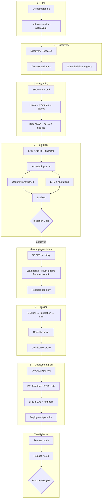
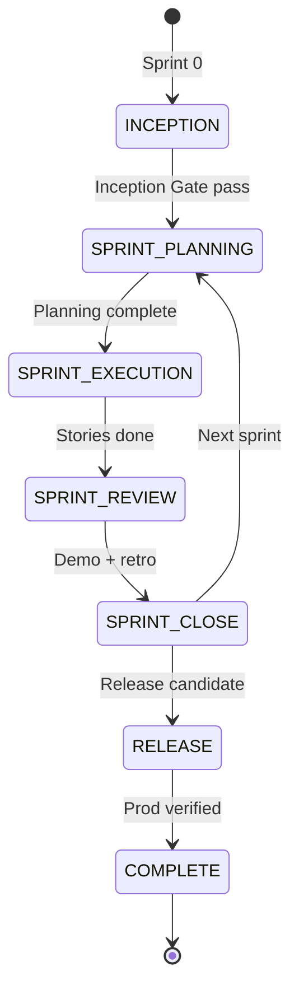
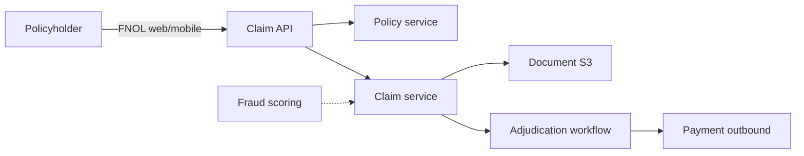

# Proposed SDLC Workflow — Discovery to Release

End-to-end delivery workflow for **sdlc-automation-agent** projects (Claude Code + Cursor).  
Maps to existing agents, artifacts, and gates in this repo.

**Related:** [delivery-phases.md](../skills/sdlc-automation-agent/reference/delivery-phases.md), [solution-architect-end-to-end.md](./solution-architect-end-to-end.md), [spec-driven-sdlc-flow.md](./spec-driven-sdlc-flow.md)

**Walkthrough:** [Insurance claim system (ClaimFlow)](#walkthrough--insurance-claim-management-system) — step-by-step prompts for all phases.

---

## Executive summary

| Phase | Name | Primary agents | Key deliverable |
|-------|------|----------------|-----------------|
| 0 | **Init** | Orchestrator | `.sdlc-automation-agent.yaml`, workspace scaffold |
| 1 | **Discovery** | Research Advisor, PM, SA | Context packages, constraints, open decisions |
| 2 | **Planning** | Product Manager | BRD, epics, stories, roadmap |
| 3 | **Solution** | Solution Architect | SAD, ADRs, **tech-stack.yaml**, OpenAPI, ERD |
| 4 | **Implementation** | Software Engineer, Frontend Engineer | Code per contracts + **declared stack** |
| 5 | **Testing** | Quality Engineer | Test plans, automated tests, coverage |
| 6 | **Deployment plan** | DevOps, Platform Engineer, SRE | CI/CD, IaC plan, runbooks, release checklist |
| 7 | **Release** | Platform Engineer, Technical Writer | Deploy to target env, release notes, post-deploy verify |

**Critical rule:** The **tech stack is specified in Solution (Phase 3)** — not invented during Implementation. SE reads `docs/architecture/tech-stack.yaml` before writing code.

---

## End-to-end flow



---

## Phase 0 — Init

**Trigger:** First time in product repo, or `Run sdlc-automation-agent init`.

| Activity | Output |
|----------|--------|
| Detect language/framework from files | Draft `packs.*` in config |
| Scaffold workspace | `.sdlc-automation-agent/specs/`, `steering/`, `receipts/` |
| Create project config | `.sdlc-automation-agent.yaml` |
| Optional CLAUDE.md section | Commands, safety, skill index |

**Gate:** Config exists; `verify.*` commands are runnable or marked TBD.

---

## Phase 1 — Discovery

**Question:** What exists? What are constraints? What is unknown?

| Path | When | Agent / mode | Outputs |
|------|------|--------------|---------|
| **Greenfield ideation** | New product | Research Advisor | Options analysis, domain notes |
| **Brownfield map** | Existing codebase | Discover / `reverse.md` | Context packages, `codebase-context.md` |
| **Business discovery** | Inception | PM steps 1–2 | `research-notes.md`, `constraints.md` |
| **Technical discovery** | Parallel with PM | SA phase 1 | Scale, compliance, team constraints |

**Artifacts**

```
.sdlc-automation-agent/.orchestrator/
  context-packages/          # brownfield
  open-decisions.md          # required — no silent assumptions
  codebase-context.md
docs/requirements/
  research-notes.md
  constraints.md
```

**Exit criteria**

- [ ] Core workflow expressible as testable acceptance criteria
- [ ] Open decisions registered (not closed by agents)
- [ ] Brownfield: dependency map exists or gap documented

---

## Phase 2 — Planning (Requirements)

**Question:** What must we build, for whom, and how do we verify it?

**Owner:** Product Manager (T1 receipt)

| Step | Output |
|------|--------|
| BRD (5 lenses + NFR grid) | `docs/requirements/brd.md` |
| Epics (L2) | Tracker `EPIC-*` |
| Features (L3) | Nested in epics |
| Stories (L4) | `US-*` with Given/When/Then AC |
| Roadmap + Sprint 1 | `ROADMAP.md`, sprint record |

**Human gate:** **Socratic gate** (optional) — confirm scope before heavy architecture.

**Inception modes**

| Mode | Planning depth at Sprint 0 |
|------|--------------------------|
| `foundation` | Mini-BRD, 3–5 epics, Sprint 1 stories |
| `blueprint` | Full BRD, all epics to feature level |

---

## Phase 3 — Solution (Architecture + Tech Stack + Contracts)

**Question:** How is the system shaped, **with what stack**, and what are exact interfaces?

**Owner:** Solution Architect (T2 receipt)

### 3.1 Solution sub-phases

| Sub-phase | Focus | Artifacts |
|-----------|-------|-----------|
| **3a — HLD** | Components, patterns, ADRs | `SAD.md`, `adrs/*.md`, C4 diagrams |
| **3b — Tech stack ★** | Languages, frameworks, cloud, verify | `tech-stack.md` + **`tech-stack.yaml`** |
| **3c — LLD contracts** | APIs, data, scaffold | OpenAPI, ERD, migrations, service skeleton |

**Parallelism:** 3c (API, ERD, scaffold) runs **after** 3b completes.

### 3.2 Tech stack specification (mandatory before implementation)

SA **Phase 3** produces two linked files:

| File | Audience | Content |
|------|----------|---------|
| `docs/architecture/tech-stack.md` | Humans | Rationale, trade-offs, ADR references |
| `docs/architecture/tech-stack.yaml` | **All agents** | Machine-readable packs, paths, verify commands, plugins |

**Template:** `skills/_shared/templates/tech-stack.yaml.tmpl`  
**Examples:** `docs/examples/tech-stack-nextjs-java-aws.yaml`

#### Example — NestJS + React + AWS (seat-reservation style)

```yaml
profile: monorepo
language: typescript
framework: nestjs
packs:
  language: nodejs-nestjs
  frontend: react
  cloud: aws
paths:
  backend: apps/gateway
  frontend: apps/web
  infra: seat-reservation-infra
verify:
  lint: "pnpm lint"
  test: "pnpm test"
  build: "pnpm build"
plugins:
  required:
    - plugins/stack-frontend
    - plugins/stack-aws
    - plugins/sdlc-workflows
stack_skills:
  backend: [nestjs-expert]
  frontend: [react-best-practices, next-best-practices]
```

#### Example — Java Spring Boot + Next.js + AWS (polyglot)

```yaml
profile: polyglot
packs:
  language: java-spring
  frontend: nextjs
  cloud: aws
paths:
  backend: apps/backend-java
  frontend: apps/web-next
  infra: infra/terraform/aws
verify:
  backend:
    test: "./apps/backend-java/gradlew test"
  frontend:
    test: "npm test --prefix apps/web-next"
plugins:
  required:
    - plugins/stack-spring
    - plugins/stack-frontend
    - plugins/stack-aws
stack_skills:
  backend: [stack-spring, spring-data-jpa, problem-details-rfc9457]
```

#### Tech stack ADR topics (minimum)

- Architecture pattern (monolith / microservices / event-driven)
- Sync vs async communication
- Data store per service
- Auth model (JWT custom vs OAuth2 resource server)
- Multi-tenancy (if SaaS)
- **Error format** (`problem-details` vs envelope) — see `stack-spring/STACK-RULES.md`

### 3.3 Platform bootstrap (Sprint 0)

| Agent | Sprint 0 deliverable |
|-------|---------------------|
| **DevOps** | Pipeline skeleton, Dockerfiles |
| **Platform Engineer** | IaC module layout, environment matrix |
| **Quality Engineer** | Test framework wired to `verify.test` |
| **Technical Writer** | Doc scaffold |

**Human gate:** **Inception Gate** — approve vision, Sprint 1 stories, foundation architecture, **tech-stack.yaml**, CI skeleton.

**Blocker:** No story implementation starts until Inception Gate passes and `tech-stack.yaml` exists.

---

## Phase 4 — Implementation

**Question:** Build features per contracts using the **declared stack only**.

**Owners:** Software Engineer (backend), Frontend Engineer (UI), Data Scientist (ML — if in scope)

### 4.1 Pre-flight (every story)

SE **must read in order:**

1. `docs/architecture/tech-stack.yaml` → `packs.*`, `paths.*`, `verify.*`, `stack_skills`
2. `api/openapi/` (or story spec `design.md`)
3. `schemas/migrations/` + ERD
4. Relevant ADRs
5. Story acceptance criteria from tracker

### 4.2 Stack loading during implementation

| `tech-stack.yaml` signal | Load |
|------------------------|------|
| `packs.language: java-spring` | `packs/languages/java-spring/*` + `stack-spring/*` skills |
| `packs.language: nodejs-nestjs` | `packs/languages/nodejs-nestjs/*` + `nestjs-expert` |
| `packs.frontend: react` | `stack-frontend/react-best-practices` |
| `packs.cloud: aws` | `packs/clouds/aws/*` + `stack-aws` skills |
| `paths.backend` | Route edits to backend skills only |
| `paths.frontend` | Route edits to frontend skills only |

Protocol: `skills/_shared/protocols/stack-skill-loading.md`

### 4.3 Implementation sub-phases (per story or epic)

| Step | SE phase | Output |
|------|----------|--------|
| 1 | Context & contracts | Implementation plan aligned to OpenAPI |
| 2 | Shared foundations | DTOs, errors, auth middleware |
| 3 | Feature code | Services, handlers, UI components |
| 4 | Cross-cutting | Health, logging, resilience |
| 5 | Local verify | Run `verify.test` / `verify.build` from tech-stack |

**Story pipeline:** `SE → QE → CR → DoD` (see `story-pipeline.md`)

**Receipt:** `.sdlc-automation-agent/.orchestrator/receipts/{story-id}-se.json`

**Rule:** SE does **not** change `tech-stack.yaml` or ADRs — escalates to SA via orchestrator.

---

## Phase 5 — Testing

**Question:** Does implementation meet acceptance criteria and quality bar?

**Owner:** Quality Engineer (+ Code Reviewer)

| Layer | Tooling (from tech-stack) | Owner |
|-------|---------------------------|-------|
| Unit | JUnit5 / Jest / pytest | QE + SE |
| Slice | `@WebMvcTest` / `@WebMvcTest` NestJS | QE |
| Integration | Testcontainers / supertest | QE |
| E2E | Playwright / Cypress | QE |
| Contract | OpenAPI diff / Pact | QE |
| Security smoke | OWASP checklist (Security Engineer on demand) | Security Engineer |

| Activity | Gate |
|----------|------|
| Test plan per story | QE receipt |
| `verify.test` green | Required before CR |
| Code review | CR findings — no direct edits |
| DoD evaluation | `story_pipeline.py` → `done` |

**Adaptive:** Security Engineer + Compliance review on auth/payment/PII stories.

---

## Phase 6 — Deployment plan

**Question:** How do we promote artifacts safely through environments?

**Owners:** DevOps (pipelines), Platform Engineer (infra), SRE (reliability)

### 6.1 Deliverables

| Artifact | Path | Owner |
|----------|------|-------|
| CI/CD pipeline | `.github/workflows/` or GitLab CI | DevOps |
| IaC modules | `infra/terraform/` or `seat-reservation-infra/` | Platform Engineer |
| Environment matrix | `docs/deployment/environments.md` | Platform Engineer |
| Deployment plan | `docs/deployment/deployment-plan.md` | Platform Engineer |
| Runbooks | `docs/runbooks/` | SRE |
| SLO definitions | `docs/sre/slos.md` | SRE |

### 6.2 Deployment plan template (contents)

1. **Environments** — dev → staging → UAT → prod (who approves each)
2. **Artifact promotion** — container image tag, migration order, feature flags
3. **Pre-deploy checklist** — tests, security scan, backup, rollback command
4. **Deploy steps** — terraform plan/apply, ECS rollout, DB migration, smoke tests
5. **Post-deploy verify** — health endpoints, SLO dashboards, synthetic checks
6. **Rollback** — previous image tag, migration downgrade policy

**Gate:** **Deploy approval** — human sign-off before prod (PE/DevOps hook blocks prod apply).

**Verify commands** (from tech-stack):

```yaml
verify:
  infra:
    validate: "terraform validate"
    plan: "terraform plan"
```

---

## Phase 7 — Release

**Trigger:** `Run sdlc-automation-agent release mode` or "prepare release".

| Step | Agent | Activity |
|------|-------|----------|
| 1 | QE | Full regression suite |
| 2 | Security Engineer | Release security checklist |
| 3 | Platform Engineer | Execute deployment plan (non-prod first) |
| 4 | Technical Writer | CHANGELOG, release notes, API doc delta |
| 5 | SRE | Post-deploy monitoring window |
| 6 | Human | Prod deploy approval |

**Receipt:** `release-{version}-pe.json`, `release-{version}-tw.json`

**Lifecycle state:** `scrum_state_machine.py transition RELEASE → COMPLETE`

---

## Scrum lifecycle mapping



| Scrum ceremony | SDLC phases covered |
|----------------|---------------------|
| **Sprint 0 (Inception)** | Discovery (finish) + Planning + Solution + Deployment bootstrap |
| **Sprint Planning** | Planning (refinement) + story selection |
| **Sprint Execution** | Implementation + Testing (per story) |
| **Sprint Review** | Demo against AC |
| **Sprint Close / Retro** | Process improvement |
| **Release** | Deployment plan execution + Release |

---

## Human gates summary

| Gate | Phase | Approver | Blocks |
|------|-------|----------|--------|
| Socratic gate | Planning | Product owner | Full architecture spend |
| Inception gate | Solution | Tech lead / PO | Implementation |
| Open decisions | Planning → Solution | Client / PO | Stories depending on OD-* |
| Design approval | Solution | Architect / lead | SE feature work |
| PR / merge | Testing | Reviewer | Main branch |
| Deploy approval | Deployment | Ops lead | Production |
| Release | Release | PO + Ops | Customer-facing deploy |

---

## Agent handoff chain (full greenfield)

```
Research Advisor (optional)
  → Product Manager (Planning)
  → Solution Architect (Solution + tech-stack.yaml)
  → DevOps + Platform Engineer (Deployment bootstrap)
  → Software Engineer / Frontend Engineer (Implementation)
  → Quality Engineer (Testing)
  → Code Reviewer (Testing)
  → Security Engineer (on-demand)
  → Platform Engineer + DevOps (Deployment plan + Release)
  → Technical Writer (Release docs)
```

---

## Prompts to run each phase

| Phase | Example prompt |
|-------|----------------|
| Init | "Initialize SDLC for this repo. Detect stack and create `.sdlc-automation-agent.yaml`." |
| Discovery | "Run discover mode. Map this brownfield codebase and produce context packages." |
| Planning | "As PM: produce BRD with 5 lenses and Sprint 1 stories with acceptance criteria." |
| Solution | "As SA: complete phases 1–6. Write `tech-stack.yaml` for NestJS + React + AWS." |
| Implementation | "Implement US-042 per OpenAPI. Load `nestjs-expert` and run `pnpm test` before receipt." |
| Testing | "As QE: test US-042 — unit, integration, and contract tests per tech-stack verify." |
| Deployment plan | "As PE: write deployment plan for ECS Fargate + RDS. Terraform validate only." |
| Release | "Prepare release 1.2.0 — regression, changelog, deployment checklist." |

---

## Recommended bundles by stack

| Profile | Plugins |
|---------|---------|
| NestJS + React + AWS | root + `system-design` + `stack-frontend` + `stack-aws` + `sdlc-workflows` |
| Java Spring + AWS | root + `system-design` + `stack-spring` + `stack-aws` + `sdlc-workflows` |
| Polyglot Next + Java + AWS | root + `system-design` + `stack-spring` + `stack-frontend` + `stack-aws` + `sdlc-workflows` |

---

## What to do next

1. Copy the example `tech-stack.yaml` matching your product into `docs/architecture/`.
2. Run **Inception** (Sprint 0) through Planning + Solution before feature sprints.
3. Enforce **Inception Gate** — no SE stories without approved `tech-stack.yaml`.
4. Per story: SE → QE → CR with receipts and `verify.*` from tech-stack.

---

## Walkthrough — Insurance claim management system

End-to-end example for a **greenfield B2B SaaS** product: insurers and TPAs use the platform to intake, adjudicate, and settle **property & casualty (P&C) claims**.

### Use case summary

| Item | Value |
|------|--------|
| **Product** | ClaimFlow — multi-tenant claim management platform |
| **Users** | Policyholders (portal), adjusters, supervisors, fraud analysts |
| **Core flows** | FNOL → document upload → coverage check → reserve → adjudication → payment |
| **Compliance** | PII encryption, audit trail, SOC 2–oriented controls, data residency (APAC) |
| **Stack (chosen in Phase 3)** | Java 21 + Spring Boot 3, React 18 admin portal, PostgreSQL, Redis, AWS (ECS, RDS, S3, Cognito) |
| **Delivery mode** | Scrum — Sprint 0 Inception + Sprint 1 first vertical slice |



### Sprint 0 scope vs Sprint 1 slice

| Sprint | Delivers |
|--------|----------|
| **Sprint 0** | BRD, architecture, **tech-stack.yaml**, OpenAPI skeleton, ERD, CI/CD skeleton |
| **Sprint 1** | **US-001** — Policyholder submits FNOL with policy validation (vertical slice) |

---

### Phase 0 — Init

**Goal:** Scaffold SDLC workspace in the new product repo `claimflow/`.

**Prompt:**

```
Use sdlc-automation-agent init mode on this empty repo.

Product: ClaimFlow — multi-tenant insurance claim management (P&C).
Expected stack: Java Spring Boot backend, React admin portal, AWS.
Domain: insurance (saas, multi-tenant).

Create:
- .sdlc-automation-agent.yaml (build_mode: scrum, domain: saas)
- .sdlc-automation-agent/specs/ and steering/ folders
- docs/templates/ for tracker

Engagement mode: Controlled — ask before irreversible decisions.
Do not implement business code yet.
```

**Expected artifacts**

- `.sdlc-automation-agent.yaml`
- `.sdlc-automation-agent/specs/`, `.sdlc-automation-agent/steering/`
- `.sdlc-automation-agent/.orchestrator/settings.md` (engagement mode)

**Gate:** Config file exists; you can open the repo in Claude Code / Cursor with the SDLC plugin installed.

---

### Phase 1 — Discovery

**Goal:** Capture insurance domain constraints, compliance, and unknowns before requirements.

**Prompt:**

```
Run sdlc-automation-agent discovery for ClaimFlow (greenfield).

Act as Research Advisor first, then PM discovery steps 1–2, then SA phase 1 in parallel outline.

Research topics:
- Standard P&C claim lifecycle (FNOL → investigation → reserve → settlement → closure)
- Regulatory expectations for audit trails and PII in APAC insurance SaaS
- Typical integrations: policy admin system (PAS), payment rails, document OCR (future)

PM discovery:
- Interview me (product owner) with AskUserQuestion — max 12 questions on:
  tenants (insurers vs TPAs), claim types (auto/property), SLA targets, payment rules
- Register open decisions in .sdlc-automation-agent/.orchestrator/open-decisions.md
  (do NOT close client-owned decisions)

SA discovery:
- Document scale assumptions (claims/month, concurrent adjusters, document volume)
- Note compliance constraints for architecture (encryption, tenant isolation, retention)

Outputs:
- docs/requirements/research-notes.md
- docs/requirements/constraints.md
- .sdlc-automation-agent/.orchestrator/open-decisions.md
- .sdlc-automation-agent/solution-architect/working-notes.md (scale + compliance)

No BRD yet. No code.
```

**Expected artifacts**

| File | Contents |
|------|----------|
| `research-notes.md` | FNOL workflow, industry terms (reserve, deductible, subrogation) |
| `constraints.md` | PII, 7-year retention, tenant data isolation |
| `open-decisions.md` | e.g. OD-001: OAuth IdP (Cognito vs corporate SAML) |

**Gate:** Core FNOL workflow can be written as testable acceptance criteria.

---

### Phase 2 — Planning

**Goal:** Binding requirements — BRD, epics, Sprint 1 stories.

**Prompt:**

```
Act as Product Manager — full planning pipeline for ClaimFlow Sprint 0 (foundation inception).

Read discovery outputs and open-decisions.md. Engagement mode: Controlled.

Deliver:
1. docs/requirements/brd.md — 5 lenses + NFR grid (security, audit, availability, latency)
2. Epics (tracker): at minimum
   - EPIC-01 Policyholder FNOL intake
   - EPIC-02 Adjuster workbench
   - EPIC-03 Coverage & policy verification
   - EPIC-04 Fraud signals (phase 2 — defer implementation)
   - EPIC-05 Payments & settlement (phase 2)
3. Decompose EPIC-01 to Sprint 1 stories with Given/When/Then acceptance criteria
4. docs/requirements/ROADMAP.md — MVP vs phase 2
5. PM T1 receipt with metrics (epic count, story count, open decision count)

Sprint 1 MVP story to detail:
- US-001: Policyholder submits FNOL with policy number + loss date + description;
  system validates active policy and returns claim number.

Flag stories blocked by OPEN decisions — do not invent settled answers.
```

**Example story (agent should produce similar)**

**US-001 — Submit first notice of loss**

```gherkin
Given an active policy POL-2024-88921 for tenant insurer-acme
When the policyholder submits FNOL with loss date within policy period and required fields
Then the system returns HTTP 201 with claimId CLM-* and status SUBMITTED
And an audit event CLAIM_CREATED is recorded with actor and timestamp
And PII fields are persisted encrypted at rest
```

**Gate:** **Socratic gate** — product owner confirms BRD scope and Sprint 1 stories before Solution phase.

**Prompt (gate):**

```
Present a Socratic gate summary for ClaimFlow: BRD scope, Sprint 1 stories, and open
decisions OD-*. Ask me to approve proceeding to Solution Architect phase (Controlled mode).
```

---

### Phase 3 — Solution (includes tech stack ★)

**Goal:** Architecture, **tech-stack.yaml**, API contracts, ERD — nothing implemented yet.

**Prompt:**

```
Act as Solution Architect — ClaimFlow Inception (foundation mode).

Prerequisites: BRD, open-decisions.md, PM working notes.

Complete SA phases 1–6:

Phase 1–2 (HLD):
- docs/architecture/SAD.md — modular monolith first, extractable services later
- adrs/ — pattern, auth (OAuth2 resource server + Cognito), multi-tenancy (row-level tenant_id),
  event audit, document storage (S3), async notifications (SQS later)
- system-diagrams/ — C4 context + container

Phase 3 (TECH STACK — mandatory):
- docs/architecture/tech-stack.md — human rationale
- docs/architecture/tech-stack.yaml — machine-readable for ALL agents

Use this stack unless I object in Controlled mode:
- Java 21, Spring Boot 3.3, Gradle Kotlin DSL
- React 18 + Vite (adjuster portal MVP shell)
- PostgreSQL 16, Redis, Flyway
- AWS: ECS Fargate, RDS, S3, Cognito, ALB, Terraform
- packs: java-spring, cloud: aws, frontend: react
- stack_skills: stack-spring (rest-api-conventions, spring-data-jpa,
  problem-details-rfc9457, oauth2-resource-server, flyway-migrations)
- Error format: RFC 9457 ProblemDetail (per STACK-RULES.md)

Phase 4–6 (LLD):
- api/openapi/claim-v1.yaml — FNOL endpoint for US-001 + error schemas
- docs/architecture/ERD.md + schemas/migrations/ — Claim, Policy, AuditEvent
- Scaffold layout under services/claim-api/ (no full implementation)

Cross-validation before T2 receipt.
Mark ADRs DRAFT where blocked by open-decisions.md.

Then ask for Inception Gate approval (architecture + tech-stack.yaml + Sprint 1 readiness).
```

**Example `tech-stack.yaml` (SA should produce)**

```yaml
profile: saas-insurance
domain: insurance
language: java
runtime: "21"
framework: spring-boot
build_tool: gradle
test_runner: junit5
database: postgresql
cache: redis
cloud: aws
region: ap-southeast-1
deploy: ecs-fargate
iac: terraform

packs:
  language: java-spring
  frontend: react
  cloud: aws

paths:
  backend: services/claim-api
  frontend: apps/adjuster-portal
  infra: infra/terraform/aws

api:
  error_format: problem-details
  success_envelope: false

verify:
  backend:
    lint: "./services/claim-api/gradlew -p services/claim-api check"
    test: "./services/claim-api/gradlew -p services/claim-api test"
    build: "./services/claim-api/gradlew -p services/claim-api bootJar"
  frontend:
    lint: "npm run lint --prefix apps/adjuster-portal"
    test: "npm run test --prefix apps/adjuster-portal"
    build: "npm run build --prefix apps/adjuster-portal"
  infra:
    validate: "terraform -chdir=infra/terraform/aws validate"

plugins:
  required:
    - plugins/system-design
    - plugins/stack-spring
    - plugins/stack-frontend
    - plugins/stack-aws
    - plugins/sdlc-workflows

stack_skills:
  backend:
    - stack-spring/rest-api-conventions
    - stack-spring/spring-data-jpa
    - stack-spring/problem-details-rfc9457
    - stack-spring/oauth2-resource-server
    - stack-spring/flyway-migrations
  frontend:
    - react-best-practices

compliance:
  pii_encryption: true
  audit_log: immutable_events
  tenant_isolation: row_level_tenant_id
```

**Parallel Sprint 0 platform prompt:**

```
In parallel with SA wrap-up:

DevOps: GitHub Actions skeleton — build claim-api on PR, run verify.backend.test.
Platform Engineer: Terraform module layout (VPC, ECS, RDS) — validate only, no prod apply.
Quality Engineer: Wire JUnit 5 + Testcontainers PostgreSQL template in claim-api.
```

**Gate:** **Inception Gate** — human approves SAD, ADRs, **tech-stack.yaml**, OpenAPI skeleton, CI green on scaffold.

**Prompt (gate):**

```
I approve the Inception Gate for ClaimFlow: architecture, tech-stack.yaml, US-001 API
contract, and CI skeleton. Proceed to Sprint Planning and implementation.
```

---

### Phase 4 — Implementation

**Goal:** Build **US-001** using **only** the declared stack and OpenAPI contract.

**Pre-flight:** Agent reads `docs/architecture/tech-stack.yaml` before coding.

**Prompt:**

```
Implement tracker story US-001 for ClaimFlow.

Act as Software Engineer (backend mode).

Pre-flight (read in parallel):
- docs/architecture/tech-stack.yaml
- api/openapi/claim-v1.yaml (FNOL operation)
- docs/architecture/ERD.md + latest Flyway migration
- ADRs on multi-tenancy and audit
- US-001 acceptance criteria

Load stack skills from tech-stack.yaml:
- stack-spring/rest-api-conventions
- stack-spring/spring-data-jpa
- stack-spring/problem-details-rfc9457
- stack-spring/flyway-migrations

Implement in services/claim-api/:
- POST /api/v1/claims (FNOL) with policy validation
- Tenant scoping on every query
- AuditEvent on claim creation
- RFC 9457 errors for validation / policy not found / inactive policy

Run verify.backend.test and verify.backend.build from tech-stack.yaml.
Write receipt: .sdlc-automation-agent/.orchestrator/receipts/US-001-se.json

Do not change tech-stack.yaml or OpenAPI without escalating to SA.
```

**Optional frontend slice (same sprint):**

```
Act as Frontend Engineer.

Read tech-stack.yaml paths.frontend and US-001 AC.
Build adjuster-portal read-only claim status view for submitted FNOL (React + Vite).
Use react-best-practices. Run verify.frontend.test before receipt.
```

**Gate:** SE receipt valid; `verify.backend.test` exit code 0.

---

### Phase 5 — Testing

**Goal:** Prove US-001 meets acceptance criteria and quality bar.

**Prompt:**

```
Act as Quality Engineer for ClaimFlow US-001.

Read:
- US-001 acceptance criteria
- SE receipt and changed files
- tech-stack.yaml verify commands
- api/openapi/claim-v1.yaml

Deliver tests:
- Unit: policy validation rules, tenant isolation on repository
- Integration: @SpringBootTest + Testcontainers PostgreSQL — happy path FNOL + inactive policy
- Contract: response matches OpenAPI schema for 201 and ProblemDetail errors
- Security note: ensure no policy PII in logs (flag for Security Engineer if needed)

Run verify.backend.test. Write receipt US-001-qe.json.

Then act as Code Reviewer — review diff only, no edits.
Check: OpenAPI compliance, tenant_id enforcement, audit event, no field injection.
Write receipt US-001-cr.json with findings severity.
```

**Gate:** QE + CR receipts; DoD met (`tests pass`, `no critical findings`, `AC covered`).

**Prompt (orchestrator):**

```
Evaluate Definition of Done for US-001 using story pipeline protocol.
Transition story to done if all receipts validate.
```

---

### Phase 6 — Deployment plan

**Goal:** Document how ClaimFlow promotes to staging and production.

**Prompt:**

```
Act as Platform Engineer + DevOps for ClaimFlow.

Read tech-stack.yaml (deploy: ecs-fargate, iac: terraform) and SAD.

Produce:
1. docs/deployment/environments.md — dev, staging, UAT, prod (APAC), approval owners
2. docs/deployment/deployment-plan.md —
   - Build & push claim-api image to ECR on merge to main
   - Flyway migrate before ECS rollout
   - Blue/green or rolling deploy on ECS
   - Smoke test: POST /api/v1/claims health-check fixture
   - Rollback: previous task definition + migration downgrade policy
3. .github/workflows/deploy-staging.yml (plan only — no prod)
4. docs/runbooks/claim-api-incident.md — RDS CPU, ECS task failures
5. docs/sre/slos.md — 99.9% API availability, p95 latency < 500ms for FNOL

Run verify.infra.validate. Do not terraform apply to prod.
Write PE receipt for deployment-plan phase.
```

**Gate:** **Deploy approval** policy documented; prod apply requires human sign-off.

---

### Phase 7 — Release

**Goal:** Ship MVP 0.1.0 (US-001 + platform baseline) to staging, then prod after approval.

**Prompt:**

```
Run sdlc-automation-agent release mode for ClaimFlow MVP 0.1.0.

Sequence:
1. Quality Engineer — full regression verify.backend.test + verify.frontend.test
2. Security Engineer — OWASP pass on claim-api FNOL endpoint; tenant isolation check
3. Platform Engineer — execute deployment-plan.md for staging; smoke FNOL
4. Technical Writer — CHANGELOG.md + docs/release/0.1.0.md (user-facing: policyholder FNOL)
5. Present prod deploy gate checklist — wait for my explicit approval before prod

Write release receipts. Transition lifecycle to RELEASE → COMPLETE after staging verified.
```

**Prompt (prod gate — human):**

```
I approve production deploy for ClaimFlow 0.1.0. Proceed with deployment plan prod section only.
```

---

### Walkthrough checklist (copy for your project)

| Step | Phase | Done when |
|------|-------|-----------|
| 1 | Init | `.sdlc-automation-agent.yaml` exists |
| 2 | Discovery | `open-decisions.md` + constraints documented |
| 3 | Planning | BRD + US-001 AC approved |
| 4 | Solution | **`tech-stack.yaml` approved** + OpenAPI + ERD |
| 5 | Inception Gate | Human sign-off |
| 6 | Implementation | US-001 code + SE receipt + verify green |
| 7 | Testing | QE + CR receipts, DoD done |
| 8 | Deployment plan | `deployment-plan.md` + CI/CD staging |
| 9 | Release | Staging verified; prod behind approval gate |

### Insurance-specific reminders for agents

| Topic | Instruction in prompts |
|-------|------------------------|
| **PII** | Policyholder name, address, loss details — encrypt at rest; mask in logs |
| **Audit** | Every claim state change → immutable `AuditEvent` |
| **Tenant isolation** | `tenant_id` on all tables; integration tests must prove cross-tenant deny |
| **Policy validation** | FNOL rejected if policy inactive, wrong tenant, or loss date outside coverage |
| **Open decisions** | Payment provider, fraud vendor — stay in `open-decisions.md` until client decides |

---

### Quick reference — ClaimFlow prompt chain

Copy and run **in order** (adjust paths after Sprint 0):

1. Init → 2. Discovery → 3. Planning → 4. Socratic gate → 5. Solution (+ tech-stack) → 6. Inception gate → 7. Implement US-001 → 8. Test US-001 → 9. Deployment plan → 10. Release 0.1.0

Engagement mode **Controlled** throughout keeps architecture, stack, and prod deploy under human approval — appropriate for regulated insurance software.
