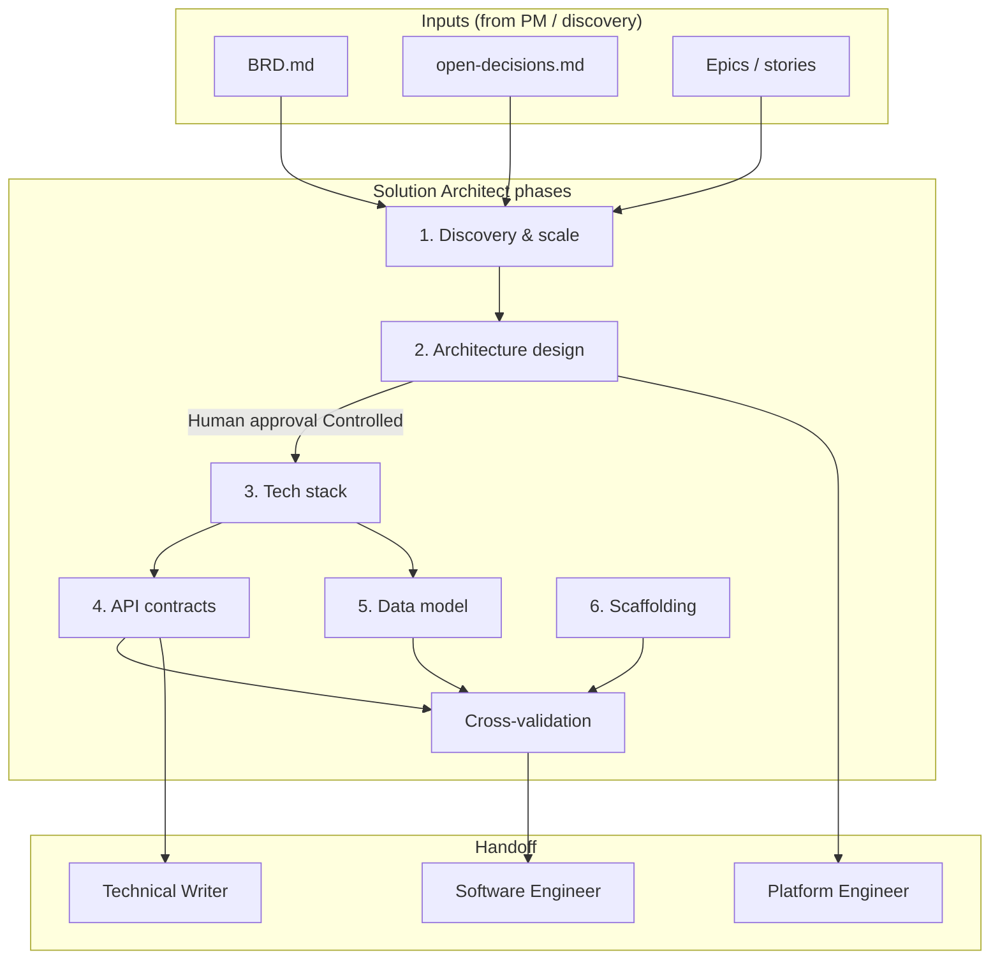
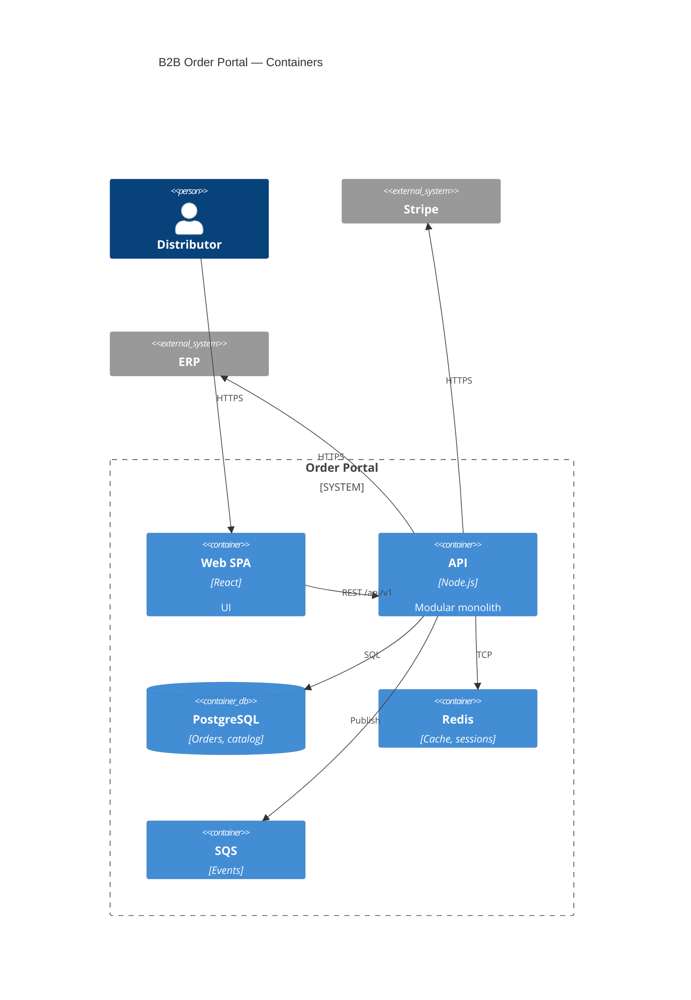
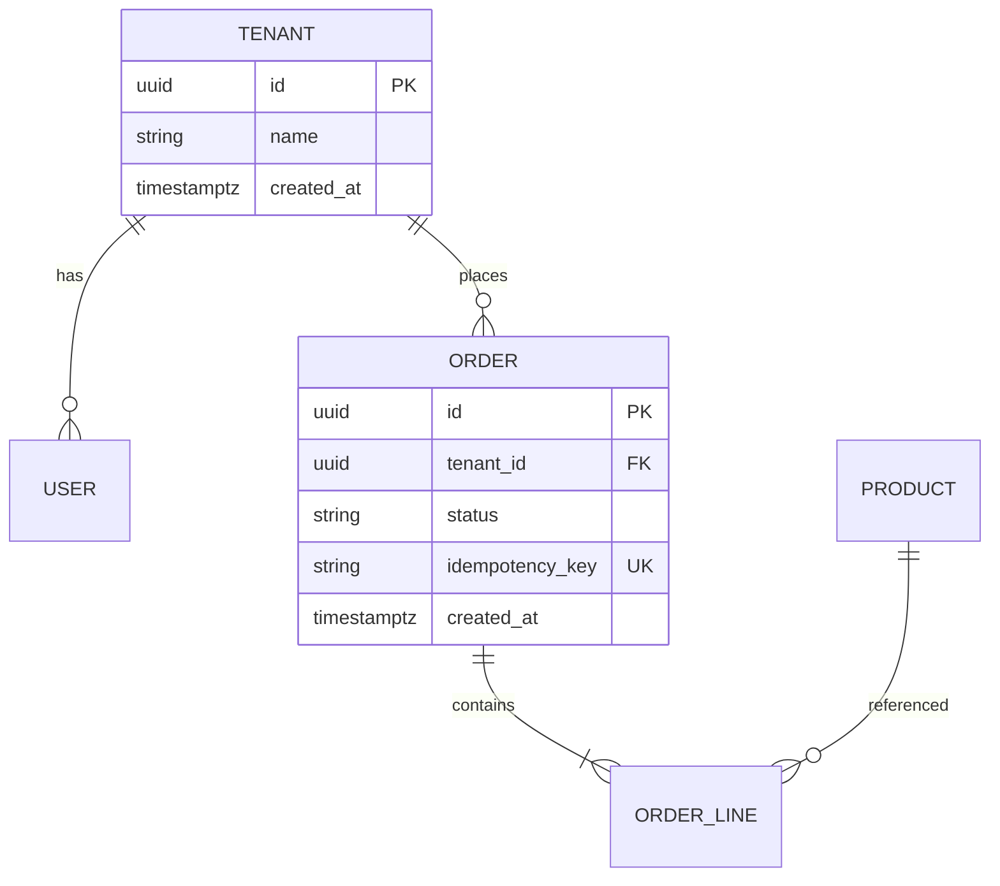

# Solution Architect: End-to-End Guide (Requirements → Handoff)

A detailed playbook for the **Solution Architect (SA)** role: what to do at each phase, what to produce, gate criteria, and a **worked example** (B2B order platform) from initial requirements through scaffold handoff to engineering.

**Related docs**

- [From Requirements to Architecture](./requirements-to-architecture.md) — vague → implementable requirements, architecture clarity, diagrams, zero-downtime deploy
- [Delivery Phases (sdlc-automation-agent)](../skills/sdlc-automation-agent/reference/delivery-phases.md) — orchestrator mapping
- Agent phases: `agents/solution-architect/phases/01-discovery.md` … `06-scaffolding.md`

---

## Table of contents

1. [Role and boundaries](#1-role-and-boundaries)
2. [End-to-end flow](#2-end-to-end-flow)
3. [Prerequisites from Product / PM](#3-prerequisites-from-product--pm)
4. [Phase 1: Discovery and scale](#4-phase-1-discovery-and-scale)
5. [Phase 2: Architecture design (HLD)](#5-phase-2-architecture-design-hld)
6. [Phase 3: Tech stack](#6-phase-3-tech-stack)
7. [Phase 4: API contracts (LLD)](#7-phase-4-api-contracts-lld)
8. [Phase 5: Data model (LLD)](#8-phase-5-data-model-lld)
9. [Phase 6: Scaffolding and handoff](#9-phase-6-scaffolding-and-handoff)
10. [Cross-validation and T2 gate](#10-cross-validation-and-t2-gate)
11. [After handoff: sprint-time SA triggers](#11-after-handoff-sprint-time-sa-triggers)
12. [Worked example summary](#12-worked-example-summary)
13. [Master artifact checklist](#13-master-artifact-checklist)

---

## 1. Role and boundaries

| Owner | Owns | Does not own |
|-------|------|----------------|
| **Product Manager** | WHAT — BRD, epics, stories, acceptance criteria, open business decisions | HOW — technology, ADRs, API field lists |
| **Solution Architect** | HOW — structure, ADRs, SAD, diagrams, OpenAPI, ERD, migrations, scaffold | Changing requirements; implementation code |
| **Software Engineer** | Code that fulfills contracts | Redefining architecture |
| **Platform Engineer** | CI/CD, infra runtime, SLO implementation | Business requirements |

**SA produces:** ADRs, system architecture document (SAD), C4/sequence diagrams, `tech-stack.md`, OpenAPI/AsyncAPI/gRPC specs, ERD, SQL migrations, project scaffold — **not** production feature code.

---

## 2. End-to-end flow



| Phase | Tier | Question answered |
|-------|------|-------------------|
| 1 — Discovery | Pre-HLD / T2 | What constraints and scale drive pattern choice? |
| 2 — Architecture | HLD (T2) | How is the system shaped? Why these decisions? |
| 3 — Tech stack | HLD (T2) | Which languages, stores, and platforms? |
| 4 — API contracts | LLD (T2) | Exact interfaces for builders and QA? |
| 5 — Data model | LLD (T2) | Entities, relationships, migrations? |
| 6 — Scaffold | LLD (T2) | Repo layout and local dev skeleton? |

**Parallelism:** Phases 4–6 may run in parallel **after** Phase 3 completes.

**Inception modes (Sprint 0 depth)**

| Mode | SA deliverables at inception |
|------|----------------------------|
| **foundation** | 3–5 ADRs, lightweight SAD (1–2 pages), API skeleton, core ERD |
| **blueprint** | Full SAD, all ADRs, complete OpenAPI, ERD, sequence diagrams |

Architecture is **not frozen** at inception — SA is re-invoked on triggers during sprints (new entity, service, integration, security, performance).

---

## 3. Prerequisites from Product / PM

Do **not** start Phase 2 (design) until these exist or are explicitly marked `[GAP]` / `DRAFT`.

### From vague client input to implementable requirements (PM / discovery)

Clients often arrive with **high-level intent** only (“modern portal,” “easier ordering”). The SA cannot design reliably until PM refines that into **implementable** requirements: testable stories, explicit scope, NFRs or dated TBDs, and an **open-decisions register** (no silent guesses).

**Full techniques (workshops, JTBD, story mapping, example mapping, MoSCoW, spikes, Definition of Ready):**  
→ [From vague idea to implementable requirements](./requirements-to-architecture.md#2-from-vague-idea-to-implementable-requirements)

**SA rule of thumb:** If the BRD is mostly solution buzzwords without metrics, journeys, or acceptance criteria, **send it back to PM** for discovery — do not fill gaps with architecture preferences.

| Signal BRD is not ready | SA action |
|-------------------------|-----------|
| No in/out scope | Request scope workshop output |
| Must stories lack Given/When/Then | Flag to PM; do not infer AC in OpenAPI |
| Many `[ASSUMED]` in Must column | Treat as Should until client validates |
| Open decisions affect tenancy/auth/data | ADR = `DRAFT` + `<!-- BLOCKED: OD-NNN -->` |

### Minimum inputs

| Artifact | Path (typical) | SA uses it for |
|----------|----------------|----------------|
| **BRD** | `docs/requirements/BRD.md` | Scope, NFRs, actors, data model hints |
| **Open decisions** | `.sdlc-automation-agent/.orchestrator/open-decisions.md` | Block ADRs with `DRAFT` + `<!-- BLOCKED: OD-NNN -->` |
| **Epics** | `docs/requirements/epics/EPIC-*.md` | Technical context per domain |
| **Brownfield context** | `.sdlc-automation-agent/.orchestrator/codebase-context.md` | Existing patterns, constraints |

### Example — BRD excerpt (input)

```markdown
# BRD: B2B Order Portal

## Problem
Distributors place orders online; today uses email + Excel.

## Success metrics
- 80% of orders via portal within 6 months
- Order submission p95 < 3s

## Scope (v1)
In: catalog browse, cart, checkout, order history, email notifications
Out: returns, marketplace sellers, native mobile

## NFRs
- Availability: 99.9% for checkout API
- Tenancy: each distributor is isolated (data)
- Compliance: GDPR (EU distributors)
- Deploy: weekly releases, zero planned downtime

## Open decisions
- OD-012: Dedicated DB per enterprise tenant? (pending sales)
```

### Example — open decision blocking an ADR

```markdown
# ADR-005: Multi-tenancy model

**Status:** DRAFT
<!-- BLOCKED: OD-012 — enterprise dedicated DB vs shared -->

## Decision (interim)
Row-level `tenant_id` + PostgreSQL RLS for v1 until OD-012 resolved.
```

---

## 4. Phase 1: Discovery and scale

**Goal:** Gather **fitness function inputs** — scale, team, compliance, data patterns, budget — so pattern choice is derived, not templated.

**Read first (parallel):** BRD, epics (first 30 lines each), research handoff, `codebase-context.md` (brownfield). **Do not re-ask** what PM already documented.

### Engagement modes

| Mode | Behavior |
|------|----------|
| **Autonomous** | Derive from BRD; at most **one** clarifying question if critical gap |
| **Controlled** | Structured rounds (scale, data pattern, team, compliance, performance, budget, cloud); present 2–3 architecture alternatives |

### Fitness function → pattern (simplified)

| Scale | Team | Typical pattern |
|-------|------|-----------------|
| &lt; 1K users | Solo–small | Monolith or serverless |
| 1K–100K | 3–15 | **Modular monolith** + extraction plan |
| 100K+ | 15+ / multi-squad | Microservices or event-driven where justified |

### Example — discovery notes (output)

```markdown
# SA Discovery Summary — B2B Order Portal

**Date:** 2026-05-20
**Mode:** Controlled

## Derived constraints
| Dimension | Choice | Source |
|-----------|--------|--------|
| Scale | Medium — 2K distributors, ~200 CCU peak | BRD + interview |
| Data pattern | Balanced CRUD SaaS | BRD |
| Team | 8 engineers, 2 squads | Interview |
| Compliance | GDPR | BRD |
| Availability | 99.9% checkout | BRD NFR |
| Budget | Moderate $2K/mo infra | Interview |
| Cloud | AWS (customer existing VPC) | Constraint |

## Recommended pattern (for Phase 2)
Modular monolith — orders, catalog, billing modules; single deploy v1.

## Risks
- OD-012 blocks final tenancy ADR
- Peak season 3x traffic (November) — note in capacity section
```

### Phase 1 gate

- [ ] BRD read; gaps logged or questioned
- [ ] Scale / team / compliance documented
- [ ] Pattern recommendation recorded for Phase 2
- [ ] Open decisions linked to any blocked ADR topics

---

## 5. Phase 2: Architecture design (HLD)

**Goal:** Single structural truth — **SAD**, **ADRs**, **diagrams**. User approval in Controlled mode before Phase 3.

### Deliverables

| Artifact | Path | Content |
|----------|------|---------|
| **SAD** | `docs/architecture/SAD.md` | Layers, boundaries, auth, tenancy, critical flows |
| **ADRs** | `docs/architecture/adrs/ADR-*.md` | One major decision per file |
| **Diagrams** | `docs/architecture/system-diagrams/` | C4 context, container, sequences, infra |

### Required ADR topics

1. Architecture pattern (monolith / modular monolith / microservices / event-driven)
2. Communication (sync REST/gRPC, async messaging, CQRS)
3. Data strategy (shared DB, DB-per-service, event sourcing)
4. Auth architecture (JWT, OAuth2, session, etc.)
5. Multi-tenancy (row / schema / DB level)
6. Deployment / zero-downtime (if NFR requires) — see [requirements-to-architecture.md §4](./requirements-to-architecture.md#4-zero-downtime-deployment-strategy)

Each ADR must include a **Testability** section (dependency injection, contracts, local run, etc.).

### Example — SAD outline

```markdown
# System Architecture Document — B2B Order Portal

## 1. Context
Distributors order via web SPA; integrates with Stripe (payments) and ERP (fulfillment).

## 2. Architecture style
Modular monolith (v1): modules `catalog`, `orders`, `billing`, `notifications`.

## 3. Container view
- web-spa (React)
- api (Node.js) — modular monolith
- postgres — system of record
- redis — cache + session
- sqs — async notifications

## 4. Critical flows
- Checkout: see system-diagrams/sequence-checkout.mmd
- Auth: OAuth2/OIDC via Auth0

## 5. Cross-cutting
- Tenant: `tenant_id` on all rows + RLS (ADR-005 DRAFT until OD-012)
- Idempotency: `Idempotency-Key` on POST (ADR-009)
- Deploy: rolling + canary on checkout paths (ADR-004)

## 6. NFR mapping
| NFR | Mechanism |
|-----|-----------|
| 99.9% availability | Multi-AZ, health checks, circuit breakers |
| Zero downtime | Rolling, expand-contract migrations |
| GDPR | EU region, deletion workflow ADR-014 |
```

### Example — ADR-001 (abbreviated)

```markdown
# ADR-001: Modular monolith for v1

**Status:** Accepted

## Context
8 engineers, 2K tenants, 99.9% NFR, weekly deploys. Microservices ops cost not justified.

## Decision
Single deployable `api` with module boundaries; extract services only when scale/team triggers met.

## Consequences
+ Simple transactions for checkout
- Whole app scales together
- Module boundary discipline required (arch tests)

## Alternatives considered
Microservices day 1 — rejected (ops burden)
Classic layered monolith — rejected (unclear extraction path)

## Testability
ArchUnit forbids cross-module imports except published interfaces; docker-compose E2E for checkout.
```

### Example — C4 container (Mermaid)



### Phase 2 gate

- [ ] SAD matches BRD scope (no gold-plating unscoped features)
- [ ] C4 context + container diagrams exist
- [ ] Required ADRs written; blocked ones `DRAFT`
- [ ] Sequence diagrams for checkout, auth, payment
- [ ] Controlled: user approved architecture before Phase 3

---

## 6. Phase 3: Tech stack

**Goal:** `docs/architecture/tech-stack.md` — every choice justified by discovery + ADRs, not preference.

### Example — tech-stack.md

```markdown
# Tech Stack — B2B Order Portal

| Layer | Selection | Rationale |
|-------|-----------|-----------|
| Language | TypeScript (Node 20) | Team skill; shared types with React |
| API framework | Fastify | Performance, schema validation |
| Frontend | React 18 + Vite | Team standard |
| Database | PostgreSQL 16 | ACID checkout; BRD relationships |
| Cache | Redis 7 | Catalog cache; session store |
| Queue | AWS SQS | Managed; team on AWS |
| Auth | Auth0 (OIDC) | SSO for enterprise distributors |
| Payments | Stripe | PCI scope reduction |
| IaC | Terraform | Customer VPC requirement |
| Observability | OpenTelemetry + CloudWatch | AWS alignment |

## Not in v1
- Elasticsearch (catalog SQL search sufficient)
- Kubernetes (ECS Fargate per ADR-004)
```

### Phase 3 gate

- [ ] Every row ties to BRD/NFR or ADR
- [ ] `design-principles.md` updated (timeouts, payload limits, logging)

---

## 7. Phase 4: API contracts (LLD)

**Goal:** Implementable contracts at `api/` — OpenAPI 3.1, optional gRPC/AsyncAPI.

### Standards (enforced)

- Error format: `{ code, message, details, trace_id }`
- Pagination: cursor-based (production lists)
- `X-Request-ID`, rate limit headers
- Response ≤ 1MB default; unbounded lists forbidden
- Versioning documented (`/api/v1`)

### Example — OpenAPI fragment

```yaml
openapi: 3.1.0
info:
  title: B2B Order Portal API
  version: 1.0.0

paths:
  /api/v1/orders:
  post:
    operationId: createOrder
    summary: Place order (idempotent)
    parameters:
      - name: Idempotency-Key
        in: header
        required: true
        schema: { type: string, format: uuid }
    requestBody:
      required: true
      content:
        application/json:
          schema:
            $ref: '#/components/schemas/CreateOrderRequest'
    responses:
      '201':
        description: Created
        content:
          application/json:
            schema:
              $ref: '#/components/schemas/Order'
      '409':
        description: Duplicate idempotency key
        content:
          application/json:
            schema:
              $ref: '#/components/schemas/Error'

components:
  schemas:
    Error:
      type: object
      required: [code, message, trace_id]
      properties:
        code: { type: string }
        message: { type: string }
        details: { type: object }
        trace_id: { type: string, format: uuid }
    CreateOrderRequest:
      type: object
      required: [cartId]
      properties:
        cartId: { type: string, format: uuid }
```

### Example — AsyncAPI (notification event)

```yaml
asyncapi: 3.0.0
info:
  title: Order Events
  version: 1.0.0
channels:
  order.placed:
    messages:
      OrderPlaced:
        payload:
          type: object
          required: [orderId, tenantId, occurredAt]
          properties:
            orderId: { type: string, format: uuid }
            tenantId: { type: string, format: uuid }
            occurredAt: { type: string, format: date-time }
```

### Phase 4 gate

- [ ] All v1 stories mappable to endpoints/events
- [ ] Auth schemes match ADR-003
- [ ] Error and pagination standards applied
- [ ] No endpoint without rate limit documentation

---

## 8. Phase 5: Data model (LLD)

**Goal:** ERD, migrations, data flow — aligned with PM BRD data model and API contracts.

### Standards

- UUID primary keys; `created_at` / `updated_at`; soft delete `deleted_at`
- `tenant_id` on tenant-scoped tables
- Migrations: numbered, UP + DOWN (or `-- IRREVERSIBLE` comment)
- Expand–contract for zero-downtime deploys

### Example — ERD fragment (Mermaid)



### Example — migration (expand)

```sql
-- migrations/001_create_orders.up.sql
CREATE TABLE orders (
  id UUID PRIMARY KEY DEFAULT gen_random_uuid(),
  tenant_id UUID NOT NULL REFERENCES tenants(id),
  status TEXT NOT NULL DEFAULT 'pending',
  idempotency_key TEXT NOT NULL,
  created_at TIMESTAMPTZ NOT NULL DEFAULT now(),
  updated_at TIMESTAMPTZ NOT NULL DEFAULT now(),
  deleted_at TIMESTAMPTZ,
  UNIQUE (tenant_id, idempotency_key)
);

CREATE INDEX idx_orders_tenant_created ON orders (tenant_id, created_at DESC);
```

**PM reconciliation:** If BRD lists entity `Shipment` and SA omits it, document reason in ERD findings.

### Phase 5 gate

- [ ] ERD covers all BRD entities or documented omissions
- [ ] Migrations run UP/DOWN in CI (Testcontainers)
- [ ] PII fields identified; encryption strategy noted
- [ ] API schemas align with ERD types

---

## 9. Phase 6: Scaffolding and handoff

**Goal:** Repo skeleton — services, docker-compose, health checks, Makefiles. **No business logic implementation.**

### Example — directory tree

```text
b2b-order-portal/
├── api/
│   └── openapi/v1.yaml
├── docs/architecture/
│   ├── SAD.md
│   ├── tech-stack.md
│   ├── ERD.md
│   └── adrs/
├── schemas/migrations/
├── services/
│   └── api/
│       ├── src/
│       │   ├── modules/catalog/
│       │   ├── modules/orders/
│       │   ├── health.ts
│       │   └── main.ts
│       ├── tests/
│       ├── Dockerfile
│       └── README.md
├── apps/
│   └── web-spa/
├── docker-compose.yml
├── Makefile
└── README.md
```

### Example — health + readiness (stub)

```typescript
// services/api/src/health.ts
export function registerHealth(app: FastifyInstance) {
  app.get('/healthz', async () => ({ status: 'ok' }));
  app.get('/readyz', async () => {
    await db.ping();
    return { status: 'ready' };
  });
}
```

### Handoff package for Software Engineer

| Read order | Artifact |
|------------|----------|
| 1 | `tech-stack.md`, ADRs |
| 2 | OpenAPI / proto / AsyncAPI |
| 3 | ERD + migrations |
| 4 | SAD + sequence diagrams |
| 5 | Story ACs from tracker |

SE implements handlers and domain logic **inside** scaffold; does not change ADRs without SA/orchestrator.

### Phase 6 gate

- [ ] `docker-compose up` starts API + Postgres + Redis
- [ ] `/healthz` and `/readyz` respond
- [ ] Makefile targets: `make test`, `make migrate`, `make dev`
- [ ] README: getting started for new developer

---

## 10. Cross-validation and T2 gate

Before closing SA work for a tier/receipt, complete cross-validation (see `.sdlc-automation-agent/solution-architect/cross-validation.md` when using sdlc-automation-agent):

| Check | Question |
|-------|----------|
| Auth | Do OpenAPI security schemes match ADR-003? |
| Tenancy | Is `tenant_id` in API + DB + ADR consistent? |
| Sync vs async | Does BRD promise instant confirmation where async is used? |
| Open decisions | Any `Accepted` ADR depending on unresolved OD-*? |
| Operations | Health, graceful shutdown, correlation IDs in scaffold? |
| Deploy | FE/API compatibility rules documented if zero-downtime? |

### T2 receipt metrics (example)

```text
✓ Solution Architect — modular monolith, 6 ADRs (1 DRAFT), 24 endpoints, scaffold generated
  SAD: docs/architecture/SAD.md
  ADRs: 6 (5 Accepted, 1 DRAFT blocked OD-012)
  APIs: api/openapi/v1.yaml
  ERD: docs/architecture/ERD.md
  Migrations: 12 files
```

---

## 11. After handoff: sprint-time SA triggers

SA returns when stories introduce:

| Signal | SA action |
|--------|-----------|
| New DB entity | Update ERD + migration + ADR if strategy changes |
| New service / bounded context | Container diagram + boundary ADR |
| New external integration | Contract + integration ADR |
| New security requirement | Security ADR + SAD threat notes |
| Performance-critical story | NFR check + caching/queue ADR |

**On-demand:** Orchestrator invokes SA when story text matches architecture signals (new entity, service, integration, security).

---

## 12. Worked example summary

**Product:** B2B distributors place orders online.

| Stage | Output |
|-------|--------|
| PM input | BRD with 99.9%, GDPR, zero-downtime; OD-012 tenancy open |
| Phase 1 | Medium scale → modular monolith recommendation |
| Phase 2 | SAD, 6 ADRs, C4 + checkout sequence; ADR-005 DRAFT |
| Phase 3 | Node, Postgres, Redis, SQS, Auth0, ECS |
| Phase 4 | OpenAPI orders/cart/catalog; AsyncAPI `order.placed` |
| Phase 5 | ERD tenants/orders/lines; migrations with tenant_id + idempotency |
| Phase 6 | `services/api` scaffold, docker-compose, health endpoints |
| Handoff | SE implements `POST /orders` per OpenAPI + ADR rules |

---

## 13. Master artifact checklist

### Greenfield (blueprint)

- [ ] Phase 1 discovery summary
- [ ] `docs/architecture/SAD.md`
- [ ] `docs/architecture/adrs/` — pattern, communication, data, auth, tenancy (+ deploy if needed)
- [ ] `docs/architecture/system-diagrams/` — context, container, 2+ sequences
- [ ] `docs/architecture/tech-stack.md`
- [ ] `docs/architecture/design-principles.md`
- [ ] `api/openapi/` (+ grpc/asyncapi if applicable)
- [ ] `docs/architecture/ERD.md`
- [ ] `schemas/migrations/`
- [ ] `services/*` scaffold + `docker-compose.yml`
- [ ] Cross-validation complete; open decisions reflected in DRAFT ADRs

### Brownfield additions

- [ ] `codebase-context.md` and context packages read
- [ ] As-is vs to-be diagrams
- [ ] Strangler / migration ADR if applicable
- [ ] Backward-compatible API extensions documented

---

## Quick reference: SA phase files

| Phase | Agent file |
|-------|------------|
| 1 | `agents/solution-architect/phases/01-discovery.md` |
| 2 | `agents/solution-architect/phases/02-architecture-design.md` |
| 3 | `agents/solution-architect/phases/03-tech-stack.md` |
| 4 | `agents/solution-architect/phases/04-api-contracts.md` |
| 5 | `agents/solution-architect/phases/05-data-model.md` |
| 6 | `agents/solution-architect/phases/06-scaffolding.md` |

---

*This guide describes the Solution Architect path in the sdlc-automation-agent agents repo. Adapt paths via `.sdlc-automation-agent.yaml` (`paths.sad`, `paths.api_contracts`, etc.) when configured.*
