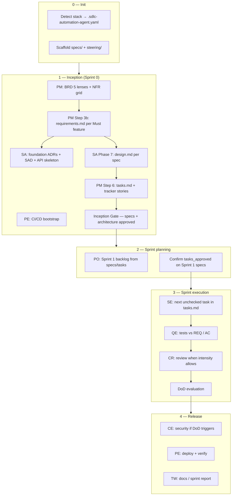
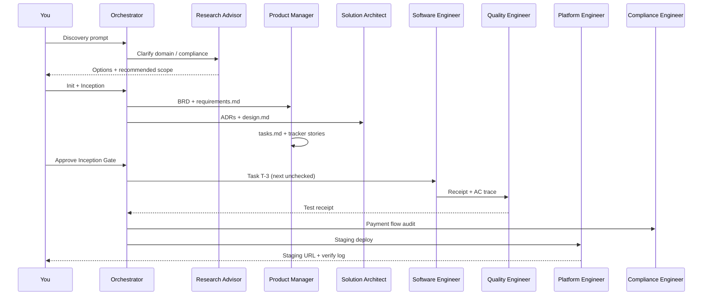

# How spec-driven requirements run the full SDLC

This guide explains how [`spec-driven-requirements.md`](../skills/_shared/protocols/spec-driven-requirements.md) connects **business intent → architecture → implementation → verification → release** inside the **sdlc-automation-agent** orchestrator.

It is the readable “map”; the protocol file is the authoritative ruleset.

---

## Enable it

In `.sdlc-automation-agent.yaml`:

```yaml
features:
  spec_driven_requirements: true
```

When enabled, every **Must** feature in Sprint 1 (or the current feature in Kanban) gets a **three-file spec** under `.sdlc-automation-agent/specs/{spec-id}/`. Agents read those files instead of re-parsing the full BRD on every story.

---

## Two layers of truth

| Layer | Owner | Artifact | Scope |
|-------|-------|----------|-------|
| **Program** | Product Manager | `docs/requirements/BRD.md` | Vision, NFR grid, roadmap, epics |
| **Feature (executable)** | PM → SA → SE | `.sdlc-automation-agent/specs/{spec-id}/` | One feature: EARS reqs, design summary, checkbox tasks |

The BRD answers *what the product is*. Feature specs answer *what to build next, how to verify it, and who owns each step*.

Steering docs (`.sdlc-automation-agent/steering/*.md`) hold project rules that apply across all specs — domain language, stack conventions, branch policy.

---

## Spec folder (per feature)

```
.sdlc-automation-agent/specs/{spec-id}/
  metadata.yaml       # status, gates, traceability to BRD/epic
  requirements.md     # EARS REQ-IDs + acceptance criteria (PM)
  design.md           # technical design + REQ trace table (SA)
  tasks.md            # checkbox plan; SE executes one task at a time (PM + SE)
```

**spec-id** — kebab-case slug (`email-opt-in`, `order-checkout`).

Templates:

- `skills/_shared/templates/specs/requirements.tmpl.md`
- `skills/_shared/templates/specs/design.tmpl.md`
- `skills/_shared/templates/specs/tasks.tmpl.md`

---

## Full SDLC flow (Scrum)



### Lifecycle states (`metadata.yaml`)

```yaml
status: requirements | design | tasks | implementing | done
gates:
  requirements_approved: false
  design_approved: false
  tasks_approved: false
```

Each gate must flip to `true` before the next phase starts (Controlled mode: human approval; Autonomous: self-check against quality rules in the protocol).

---

## Phase 1 — Requirements (PM)

**When:** After BRD Step 3 (Generate BRD), PM Step 3b.

**Inputs:** SoW/PRD/stakeholder notes, BRD lenses (summary only in spec).

**Output:** `requirements.md` with [EARS](https://github.com/jasonkneen/kiro/tree/main/spec-process-guide) patterns:

| Pattern | Example |
|---------|---------|
| Ubiquitous | REQ-01: The API shall reject duplicate emails with HTTP 409. |
| Event-driven | When user submits opt-in form, the system shall persist consent with timestamp. |
| State-driven | While user is unauthenticated, the system shall not expose marketing preferences. |
| Optional | Where double opt-in is enabled, the system shall send confirmation email first. |
| Unwanted | If email service unavailable, the system shall queue and show retry message. |

**Rules:**

1. Every REQ-ID maps to ≥1 Given/When/Then acceptance criterion.
2. NFRs reference NFR-IDs from the BRD grid — do not duplicate the full grid.
3. Open questions go to `.sdlc-automation-agent/.orchestrator/open-decisions.md`.
4. **Gate:** `requirements_approved: true` before SA writes `design.md`.

**Agent:** Product Manager — `agents/product-manager/phases/03-generate-brd.md` (Step 3b).

---

## Phase 2 — Design (SA)

**When:** `requirements_approved: true` and orchestrator provides `spec-id` (or SA Phase 7 triggered).

**Inputs:** `requirements.md`, brownfield context packages, `docs/architecture/tech-stack.yaml`.

**Output:** `design.md` with a **REQ traceability table** — every REQ-ID mapped to component, API path, or data model. Canonical artifacts live in `docs/architecture/` and `api/`; design.md **links**, not duplicates.

**Gate:** `design_approved: true` before PM finalizes `tasks.md` for execution.

**Agent:** Solution Architect — `agents/solution-architect/phases/07-spec-design.md`.

At **Inception**, SA also produces program-level foundation (ADRs, lightweight SAD, API skeleton, ERD). Per-feature `design.md` is the sprint-level bridge from REQ-IDs to those canonical files.

---

## Phase 3 — Tasks (PM + SE)

**When:** `requirements_approved` and `design_approved` are both true.

**Output:** `tasks.md` — checkbox tasks, each with:

- **Refs** — REQ-IDs covered
- **Verify** — command from `tech-stack.yaml` / `.sdlc-automation-agent.yaml` → `verify.*`
- **Owner** — SE, QE, or PE

**Rules:**

1. One task ≈ one committable unit (one endpoint, one screen, one job).
2. PM writes the plan; SE marks checkboxes only after verify passes.
3. Tracker stories sync with tasks — story handoff includes `Refs: REQ-xx, T-n` and `spec-id`.

**Gate:** `tasks_approved: true` before orchestrator dispatches SE for that spec.

**Agent:** PM Step 6 — `agents/product-manager/phases/06-decompose-stories.md`.

---

## Phase 4 — Implement (SE → QE → CR)

Spec-driven execution plugs into the standard **story pipeline** ([`story-pipeline.md`](../skills/_shared/protocols/story-pipeline.md)):

```
queued → in_progress (SE) → testing (QE) → reviewing (CR) → done → DoD
```

### Software Engineer

Orchestrator prompt (required):

```text
Read .sdlc-automation-agent/specs/{spec-id}/tasks.md
Implement the next unchecked task only
Update the checkbox on completion
Run verify commands from tech-stack.yaml before receipt
```

**Hard gate:** SE must not start if `tasks_approved: false` in `metadata.yaml`.

**Receipt:** `.sdlc-automation-agent/.orchestrator/receipts/{story-id}-se.json` — must include `verification_commands` output.

### Quality Engineer

QE prompt includes acceptance criteria derived from REQ-IDs in the spec. Tests must trace back to AC lines in `requirements.md`.

### Code reviewer

Adaptive intensity (Sprint 1 may skip CR). When CR runs, it checks architecture conformance against `design.md` and canonical ADRs — not a second security pass (that is Compliance Engineer).

### DoD

`scrum_state_machine.py evaluate_dod` checks story against `.sdlc-automation-agent.yaml` → `dod` rules and `verify.*` commands.

---

## Phase 5 — Release (PE, CE, TW)

Spec-driven flow does not replace release ceremony:

| Agent | Role relative to specs |
|-------|------------------------|
| **Compliance Engineer** | DoD-triggered STRIDE/OWASP; NFR security rows from BRD + spec |
| **Platform Engineer** | CI/CD, deploy, local-deploy verification |
| **Technical Writer** | API docs linked from `design.md`; sprint report cites completed REQ-IDs |

When a spec’s tasks are all checked and stories are `done`, update `metadata.yaml` → `status: done`.

---

## Kanban / single-feature path

No full Inception — shorter loop:

```text
User request
  → PM feature mode
  → spec folder (requirements → design → tasks)
  → SA if architecture touch needed
  → SE executes tasks.md task-by-task
  → QE → CR → done
```

Brownfield stories with a complete handoff contract may skip the spec folder; SA can append to `design.md` and PM to `tasks.md` mid-sprint when triggered.

---

## Inception gate checklist

Before Sprint 1, the orchestrator verifies ([`inception.md`](../skills/sdlc-automation-agent/ceremonies/inception.md)):

| Check | Source |
|-------|--------|
| BRD / Mini-BRD exists | `docs/requirements/BRD.md` |
| Sprint 1 Must features have `requirements.md` | `.sdlc-automation-agent/specs/*/requirements.md` |
| `requirements_approved` + `design_approved` | each `metadata.yaml` |
| `tasks_approved` | required before execution (may complete in Sprint Planning) |
| REQ coverage | every REQ-ID has ≥1 AC |
| Design trace | every REQ-ID in design traceability table |
| Task trace | every REQ-ID in ≥1 task Refs line |

Gate UI includes a **Specs** row: `{N} Sprint 1 specs · requirements ✓ · design ✓ · tasks ✓`.

---

## Agent read order (quick reference)

| Agent | Read at startup |
|-------|-----------------|
| **Orchestrator** | `.sdlc-automation-agent.yaml`, pipeline state, spec `metadata.yaml` gates |
| **Product Manager** | BRD, protocol, `requirements.tmpl.md` |
| **Solution Architect** | `requirements.md`, `metadata.yaml`, `docs/architecture/*`, Phase 7 template |
| **Software Engineer** | `tasks.md` (next unchecked), `design.md`, story AC, `verify.*` |
| **Quality Engineer** | REQ-IDs / AC from `requirements.md`, SE receipt |
| **Code reviewer** | `design.md`, ADRs, diff — read-only |

---

## Walkthrough: insurance — digital policy renewal (discovery → deployment)

This section follows **one business use case** through every SDLC stage so you can see **what to ask**, **which agent runs**, and **which files appear on disk**.

**Claude Code:** See [Claude Code — one-time setup](#claude-code--one-time-setup-policyhub-example) and each stage’s **Run in Claude Code** subsection for terminal commands, `/sdlc-automation-agent` prompts, gate approvals, and verify steps.

### Business scenario

**Product:** PolicyHub — B2C insurance customer portal (greenfield)  
**Use case:** A policyholder whose auto policy expires in 30 days can **review renewal terms**, **accept updated premium**, **pay online**, and **receive a digital confirmation** — without calling a broker.

**Sprint 1 Must feature:** `policy-renewal-checkout` (spec-id)

**Stack (detected at init):** NestJS API + React web + PostgreSQL + Stripe payments + AWS

---

## Claude Code — one-time setup (PolicyHub example)

Do this **once** before Stage 0. All later stages assume you are inside a Claude Code session with plugins loaded.

### 1. Create / open the product repo

```bash
mkdir -p ~/projects/policyhub && cd ~/projects/policyhub
git init
# optional: scaffold NestJS + React monorepo first, or let Inception create structure
```

### 2. Start Claude Code in that directory

```bash
cd ~/projects/policyhub
claude
```

### 3. Install the SDLC plugin (+ stack plugins)

**Inside the Claude Code session** (recommended — persists for the session):

```text
/plugin install /absolute/path/to/agents
/plugin install /absolute/path/to/agents/plugins/system-design
/plugin install /absolute/path/to/agents/plugins/stack-frontend
/plugin install /absolute/path/to/agents/plugins/sdlc-workflows
```

For AWS infra later (Stage 7):

```text
/plugin install /absolute/path/to/agents/plugins/stack-aws
```

**Or** from your shell (all plugins at startup):

```bash
claude --plugin-dir /path/to/agents \
  --plugin-dir /path/to/agents/plugins/system-design \
  --plugin-dir /path/to/agents/plugins/stack-frontend \
  --plugin-dir /path/to/agents/plugins/sdlc-workflows
```

Verify plugins loaded:

```text
List installed plugins and confirm sdlc-automation-agent skill is available.
```

### 4. Invoke the orchestrator

Two equivalent ways:

| Method | Example |
|--------|---------|
| **Slash skill** | Type `/sdlc-automation-agent` then your prompt |
| **Natural language** | Paste the stage prompt below — Claude auto-routes to the orchestrator |

You do **not** need separate slash commands per agent. The orchestrator dispatches **subagents** (PM, SA, SE, …) via `Agent()` internally.

### 5. Set engagement mode (recommended for learning)

Add to your first prompt, or set in `.sdlc-automation-agent/.orchestrator/settings.md` after init:

```text
Engagement mode: Controlled — ask me before irreversible decisions and at each spec gate.
```

In **Controlled** mode Claude uses **AskUserQuestion** with clickable options at gates (requirements approved, inception gate, deploy, etc.).

### 6. Optional — Jira tracker

If using Jira (POL-101 stories in this example), configure credentials in `.envrc` or MCP, then before sprint work:

```bash
# if your repo has delivery-crew Makefile targets
make jira-sync
```

Or prompt:

```text
Sync Jira backlog for project POL before sprint planning.
```

### What you see during a run

| Claude Code behavior | Meaning |
|---------------------|---------|
| Skill loads `sdlc-automation-agent/SKILL.md` | Orchestrator active |
| Subagent tasks appear in transcript | SE/QE/CR dispatched |
| **AskUserQuestion** card | Human gate — pick an option (often option 1 is Recommended) |
| Files written under `.sdlc-automation-agent/` | Spec-driven artifacts on disk |
| Receipt JSON under `.orchestrator/receipts/` | Agent handoff complete |
| Bash runs `pnpm test`, etc. | Verify discipline before next stage |

### Quick verify after any stage

```bash
# in a second terminal, from product repo root
ls -la .sdlc-automation-agent/specs/policy-renewal-checkout/ 2>/dev/null
cat .sdlc-automation-agent/specs/policy-renewal-checkout/metadata.yaml 2>/dev/null
ls .sdlc-automation-agent/.orchestrator/receipts/ 2>/dev/null
```

---

### Stage map (who does what)

| Stage | Claude Code — you run | Orchestrator mode | Primary agents | Key outputs |
|-------|----------------------|-------------------|----------------|-------------|
| 0 Discovery | `/sdlc-automation-agent` + discovery prompt | Explore / Discover | **Research Advisor** → **PM** | Problem framing, scope notes |
| 1 Init | Same session, init prompt | Init | Orchestrator | `.sdlc-automation-agent.yaml`, `steering/`, `specs/` |
| 2 Inception | One long inception prompt (or step-by-step) | Build → Inception | **PM**, **SA**, **PE** | BRD, specs, ADRs, CI skeleton |
| 3 Gate | Click **Approve** on AskUserQuestion card | Inception Gate | Orchestrator | Pipeline → Sprint Planning |
| 4 Planning | Sprint planning prompt | Sprint | **PM** | Jira/GitHub stories from `tasks.md` |
| 5 Execution | Per-story or per-task prompt | Sprint | **SE** → **QE** → **CR** | Code, tests, receipts |
| 6 Hardening | Security audit prompt | Review / DoD trigger | **CE** | STRIDE report |
| 7 Deploy | Release / deploy prompt | Release | **PE** | Pipeline green, staging URL |
| 8 Close | Sprint review prompt | Sprint Review | **TW** | API docs, sprint report |



---

### Stage 0 — Discovery

**Your prompt:**

```text
We're an insurance carrier. 40% of renewals still happen by phone.
I want a self-service portal where customers review renewal premium and pay online.
Help me scope Sprint 1 — what's the smallest production-ready slice?
```

**Agent:** Research Advisor (thinking partner) → hands off to PM when scope is clear.

**Outcome (chat, not yet on disk):**

- Personas: policyholder, support agent (read-only view later)
- Compliance: PCI scope for payments (Stripe hosted fields), policy doc retention 7 years
- Sprint 1 slice: renewal quote view + accept + pay + confirmation email (no mid-term endorsements)

#### Run in Claude Code

1. **Terminal:** `cd ~/projects/policyhub && claude` (plugins already installed from setup above).
2. **Invoke:** `/sdlc-automation-agent` or paste prompt directly in chat.
3. **Paste:**

```text
/sdlc-automation-agent

We're an insurance carrier. 40% of renewals still happen by phone.
I want a self-service portal where customers review renewal premium and pay online.
Help me scope Sprint 1 — what's the smallest production-ready slice?
Engagement mode: Controlled.
```

4. **In UI:** Claude may use **AskUserQuestion** to narrow scope (e.g. payment provider, mobile vs web). Pick options or "Chat about this".
5. **When done:** Confirm scope in chat; no files required yet. Optional: ask Claude to save notes to `.sdlc-automation-agent/steering/product.md`.

---

### Stage 1 — Init

**Your prompt:**

```text
Initialize SDLC automation for PolicyHub. Detect stack from repo (or assume NestJS + React + Postgres + AWS).
Enable spec-driven requirements.
```

**Agent:** Orchestrator → Init mode.

**Files created:**

```
PolicyHub/
  .sdlc-automation-agent.yaml          # verify: pnpm test, build, lint
  .sdlc-automation-agent/
    steering/
      product.md                       # "policyholder", "premium", "renewal window"
      tech.md                          # pointer to tech-stack.yaml
      structure.md
      workflow.md
    specs/                             # empty until PM Step 3b
    .orchestrator/receipts/
  docs/templates/story.md
```

**Snippet — `.sdlc-automation-agent.yaml`:**

```yaml
project:
  name: policyhub
  type: greenfield
  language: typescript
  framework: nestjs
  domain: insurance
features:
  spec_driven_requirements: true
verify:
  test: "pnpm test"
  build: "pnpm build"
  lint: "pnpm lint"
tracker:
  type: jira
  jira:
    project_key: POL
```

#### Run in Claude Code

1. **Same session** (or new session — re-run `/plugin install` if needed).
2. **Paste:**

```text
/sdlc-automation-agent

Initialize SDLC automation for PolicyHub.
Detect language, framework, and cloud from the repo (or assume NestJS + React + Postgres + AWS).
Enable spec-driven requirements (features.spec_driven_requirements: true).
Scaffold .sdlc-automation-agent/specs/ and steering/.
Engagement mode: Controlled.
```

3. **What Claude does:** Loads `skills/sdlc-automation-agent/modes/init.md`, writes `.sdlc-automation-agent.yaml`, creates folders, may add starter `CLAUDE.md` snippets.
4. **You approve:** If Asked — confirm detected stack (NestJS / React / AWS).
5. **Verify in terminal:**

```bash
test -f .sdlc-automation-agent.yaml && echo "init OK"
grep spec_driven_requirements .sdlc-automation-agent.yaml
ls .sdlc-automation-agent/steering/
```

---

### Stage 2 — Inception (PM → SA → PM)

**Your prompt:**

```text
Run inception (foundation mode). Sprint 1 Must feature: policy renewal checkout with online payment.
```

#### Step 2a — Product Manager: program BRD

**Agent:** Product Manager (full mode / inception).

**Output:** `docs/requirements/BRD.md` (5 lenses + NFR grid). Excerpt:

| Lens | Summary |
|------|---------|
| Problem | Phone renewals are costly; customers abandon when premium increases |
| Users | Policyholders with policies expiring within 45 days |
| Boundaries | In: quote, accept, pay, confirm. Out: claims, new business quoting |
| Constraints | PCI via Stripe; audit log for premium acceptance |
| Success | 30% of eligible renewals completed online within 90 days of launch |

NFR grid includes `NFR-SEC-01` (no card data on our servers), `NFR-PERF-01` (quote API p95 < 500ms).

#### Step 2b — PM Step 3b: feature spec (requirements)

**Agent:** Product Manager.

**Output:** `.sdlc-automation-agent/specs/policy-renewal-checkout/`

**`metadata.yaml`:**

```yaml
spec_id: policy-renewal-checkout
title: Digital policy renewal with premium payment
status: requirements
brd_section: "§3.1 Renewal self-service"
epic_id: EPIC-001
feature_id: FEAT-003
owner_agent: product-manager
created: 2026-06-03
gates:
  requirements_approved: false
  design_approved: false
  tasks_approved: false
```

**`requirements.md` (EARS excerpt):**

| ID | Pattern | Requirement |
|----|---------|-------------|
| REQ-01 | Ubiquitous | The portal shall show renewal premium only for policies in `RENEWAL_ELIGIBLE` status. |
| REQ-02 | Event-driven | When a policyholder accepts the renewal quote, the system shall record acceptance with user id, timestamp, and quoted premium. |
| REQ-03 | Event-driven | When payment succeeds, the system shall activate the renewed policy term and emit `PolicyRenewed`. |
| REQ-04 | State-driven | While payment is pending, the system shall not change policy status to active. |
| REQ-05 | Unwanted | If payment fails, then the system shall keep the policy in `RENEWAL_PENDING` and show a retry path. |
| REQ-06 | Optional | Where Stripe 3DS is required, the system shall complete authentication before capturing funds. |

**Acceptance criteria (sample):**

| AC-ID | Refs | Given | When | Then |
|-------|------|-------|------|------|
| AC-01 | REQ-01 | Policy expires in 20 days | User opens renewal page | Premium and coverage summary display |
| AC-02 | REQ-02 | Valid quote on screen | User clicks Accept & Pay | Acceptance row persisted; payment session created |
| AC-03 | REQ-03 | Payment succeeds | Webhook received | Policy `active` with new term dates |

**Gate:** You approve in Controlled mode → PM sets `requirements_approved: true`, `status: design`.

#### Step 2c — Solution Architect: foundation + spec design

**Agent:** Solution Architect.

**Program outputs (foundation mode):**

- `docs/architecture/adr/001-modular-monolith.md`
- `docs/architecture/adr/002-stripe-hosted-payment.md`
- `docs/architecture/overview.md` (lightweight SAD)
- `api/openapi/policy-renewal.yaml` (skeleton)
- ERD: `Policy`, `RenewalQuote`, `RenewalAcceptance`, `PaymentSession`

**Per-spec output — `design.md` traceability:**

| REQ-ID | Component | API / data |
|--------|-----------|------------|
| REQ-01 | `RenewalService` | `GET /api/v1/policies/{id}/renewal-quote` |
| REQ-02 | `RenewalService` | `POST /api/v1/policies/{id}/renewal-acceptance` |
| REQ-03 | `PaymentWebhookHandler` | Stripe webhook → `PolicyService.activateRenewal()` |
| REQ-05 | `PaymentService` | Idempotent retry; status `RENEWAL_PENDING` |
| REQ-06 | Web checkout | Stripe PaymentIntent + 3DS branch |

**Gate:** `design_approved: true`.

#### Step 2d — PM Step 6: tasks + tracker stories

**Agent:** Product Manager.

**`tasks.md`:**

```markdown
## Phase 1 — Data & API
- [ ] **T-1** — Migration: RenewalQuote, RenewalAcceptance, PaymentSession
  - Refs: REQ-01, REQ-02 | Owner: SE | Verify: `pnpm test -- migration`
- [ ] **T-2** — GET renewal-quote endpoint
  - Refs: REQ-01 | Owner: SE | Verify: `pnpm test -- renewal-quote`
- [ ] **T-3** — POST renewal-acceptance + Stripe session
  - Refs: REQ-02, REQ-06 | Owner: SE | Verify: `pnpm test -- renewal-acceptance`

## Phase 2 — Web UI
- [ ] **T-4** — Renewal summary page + Accept & Pay flow
  - Refs: REQ-01, REQ-02, AC-01, AC-02 | Owner: SE | Verify: `pnpm test -- RenewalPage`

## Phase 3 — Payment completion
- [ ] **T-5** — Stripe webhook handler + policy activation
  - Refs: REQ-03, REQ-04, REQ-05 | Owner: SE | Verify: `pnpm test -- payment-webhook`

## Phase 4 — Quality & ops
- [ ] **T-6** — Integration tests for AC-01…AC-03
  - Refs: AC-01, AC-02, AC-03 | Owner: QE | Verify: `pnpm test -- renewal.e2e`
- [ ] **T-7** — Staging deploy + smoke test
  - Owner: PE | Verify: pipeline green + curl staging health
```

**Jira stories (synced from tasks):**

| Story | Title | Handoff |
|-------|-------|---------|
| POL-101 | Renewal quote API | spec-id: `policy-renewal-checkout`, Refs: REQ-01, T-2 |
| POL-102 | Accept & Pay API + UI | Refs: REQ-02, T-3, T-4 |
| POL-103 | Payment webhook + activation | Refs: REQ-03, T-5 |
| POL-104 | E2E renewal tests | Refs: AC-01…AC-03, T-6 |

**Gate:** `tasks_approved: true`, `status: implementing`.

#### Step 2e — Platform Engineer (parallel at inception)

**Agent:** Platform Engineer.

**Outputs:** `.github/workflows/ci.yml`, Dockerfile skeleton, staging environment stub.

#### Run in Claude Code — full inception (single prompt)

**Paste once** (orchestrator runs PM → SA → PM → PE over multiple turns; may take several minutes):

```text
/sdlc-automation-agent

Run inception for PolicyHub — foundation mode (lightweight SAD, not full blueprint).
Sprint 1 Must feature: policy-renewal-checkout (digital renewal + Stripe payment).

Follow spec-driven-requirements protocol:
1. PM: BRD in docs/requirements/BRD.md
2. PM Step 3b: .sdlc-automation-agent/specs/policy-renewal-checkout/requirements.md (EARS)
3. SA: foundation ADRs + api/openapi/policy-renewal.yaml + spec design.md with REQ trace table
4. PM Step 6: tasks.md + sync Jira stories POL-101…104
5. PE: CI skeleton (.github/workflows/ci.yml)

Engagement mode: Controlled — stop at each gate (requirements_approved, design_approved, tasks_approved).
```

#### Run in Claude Code — step-by-step (if you prefer smaller chunks)

| Step | Paste in Claude Code |
|------|----------------------|
| 2a BRD | `Run PM inception Step 3 only — write docs/requirements/BRD.md for PolicyHub renewal portal.` |
| 2b Requirements | `PM Step 3b: create spec policy-renewal-checkout with EARS requirements.md and metadata.yaml. Wait for my approval before design.` |
| 2c Design | `SA Phase 7: write design.md for spec policy-renewal-checkout. requirements_approved is true. Link to OpenAPI, do not duplicate.` |
| 2d Tasks | `PM Step 6: write tasks.md for policy-renewal-checkout and create Jira story descriptions POL-101…104.` |
| 2e CI | `Platform Engineer: add GitHub Actions CI for pnpm lint, test, build.` |

**At each gate (Controlled mode):** Claude shows **AskUserQuestion** — e.g. "Approve requirements.md?" → choose **1. Approve (Recommended)**. PM/SA then sets `gates.*_approved: true` in `metadata.yaml`.

**Verify after Step 2b:**

```bash
ls .sdlc-automation-agent/specs/policy-renewal-checkout/
grep requirements_approved .sdlc-automation-agent/specs/policy-renewal-checkout/metadata.yaml
```

**Verify after full Stage 2:**

```bash
test -f docs/requirements/BRD.md
test -f .sdlc-automation-agent/specs/policy-renewal-checkout/requirements.md
test -f .sdlc-automation-agent/specs/policy-renewal-checkout/design.md
test -f .sdlc-automation-agent/specs/policy-renewal-checkout/tasks.md
```

---

### Stage 3 — Inception gate

**Orchestrator presents:**

```text
Specs: 1 Sprint 1 spec · requirements ✓ · design ✓ · tasks ✓
Architecture: 2 ADRs · SAD ✓ · OpenAPI skeleton ✓
CI/CD: ✓
```

**You:** Approve → state machine → `SPRINT_PLANNING`.

#### Run in Claude Code

1. After inception steps complete, Claude presents the **Inception Gate** block in chat (vision, epics, specs row, CI/CD).
2. **AskUserQuestion** appears with options like:
   - **1. Approve — start Sprint 1 (Recommended)**
   - 2. Show details
   - 3. I have concerns
3. Click **Approve**.
4. **Optional status check prompt:**

```text
/sdlc-automation-agent

Show inception gate status. Confirm all policy-renewal-checkout gates are true before Sprint 1.
```

5. **Verify:**

```bash
grep -E 'requirements_approved|design_approved|tasks_approved' \
  .sdlc-automation-agent/specs/policy-renewal-checkout/metadata.yaml
# all should be true
```

---

### Stage 4 — Sprint planning

**Your prompt:**

```text
Plan Sprint 1. Backlog: POL-101 through POL-104. 2-week sprint.
```

**Agent:** Product Manager (sprint planning ceremony).

**Outcome:** Sprint 1 backlog ordered POL-101 → POL-102 → POL-103 → POL-104; team capacity noted; `tasks_approved` confirmed on spec metadata.

#### Run in Claude Code

```text
/sdlc-automation-agent

Run Sprint 1 planning ceremony for PolicyHub.
Backlog: POL-101, POL-102, POL-103, POL-104 from spec policy-renewal-checkout/tasks.md.
Sprint length: 2 weeks.
Confirm tasks_approved on metadata.yaml.
Engagement mode: Controlled.
```

**If using Jira MCP or delivery crew:** run sync first in terminal (`make jira-sync`) or prompt `Sync Jira project POL before planning.`

**Verify:** Stories exist in tracker with `spec-id: policy-renewal-checkout` in description/handoff.

---

### Stage 5 — Sprint execution (story pipeline)

**Your prompt:**

```text
Execute Sprint 1 — start with POL-101 / spec policy-renewal-checkout task T-2.
```

For **each story**, the orchestrator runs the pipeline from [`story-pipeline.md`](../skills/_shared/protocols/story-pipeline.md):

#### POL-101 / T-2 — Software Engineer

**Orchestrator dispatches SE with:**

```text
Story: POL-101
Spec: .sdlc-automation-agent/specs/policy-renewal-checkout/
Read tasks.md — implement T-2 only (GET renewal-quote).
Read design.md for API contract. Run verify.test before receipt.
```

**SE delivers:**

- `apps/api/src/modules/renewal/renewal.controller.ts`
- `apps/api/src/modules/renewal/renewal.service.ts`
- Unit tests

**Receipt** — `.sdlc-automation-agent/.orchestrator/receipts/POL-101-se.json`:

```json
{
  "story_id": "POL-101",
  "agent": "software-engineer",
  "artifacts": ["apps/api/src/modules/renewal/renewal.controller.ts"],
  "metrics": { "tests_added": 4, "coverage_delta": "+2.1%" },
  "verification_commands": ["pnpm test -- renewal-quote"],
  "verification_summary": "4/4 passed"
}
```

**SE checks off T-2 in `tasks.md`.**

#### POL-101 — Quality Engineer

**QE validates** AC-01 against REQ-01; adds integration test if missing; receipt `POL-101-qe.json`.

#### POL-102 / T-3 + T-4 — repeat SE → QE

- Stripe PaymentIntent creation (hosted fields — satisfies NFR-SEC-01)
- React renewal page wired to API

#### POL-103 / T-5 — webhook + activation

- Idempotent webhook handling (REQ-04, REQ-05)
- QE runs AC-03 scenario with Stripe test fixtures

#### Code review (Sprint 2+ intensity)

Sprint 1 may **skip CR** per adaptive rules. From Sprint 2 onward, **Code Reviewer** reads `design.md` + diff (read-only findings).

#### Run in Claude Code — whole sprint

```text
/sdlc-automation-agent

Execute Sprint 1 for PolicyHub.
Use spec policy-renewal-checkout — follow tasks.md in order.
For each story POL-101 through POL-104: run SE then QE (CR if required).
One unchecked task per SE dispatch. Run verify.test before each receipt.
Engagement mode: Controlled.
```

#### Run in Claude Code — one story (recommended while learning)

```text
/sdlc-automation-agent

Implement Jira story POL-101 for spec policy-renewal-checkout.
SE: complete task T-2 only (GET renewal-quote) in tasks.md.
Read design.md for API contract. Run pnpm test -- renewal-quote before receipt.
Then dispatch QE for AC-01 / REQ-01.
```

**What happens:**

1. Orchestrator transitions story to `in_progress`, spawns **Software Engineer** subagent.
2. SE writes code + `.sdlc-automation-agent/.orchestrator/receipts/POL-101-se.json`.
3. SE checks off **T-2** in `tasks.md`.
4. **Quality Engineer** subagent runs; writes `POL-101-qe.json`.
5. You may need to approve bash commands (tests) when Claude asks.

**Repeat** for POL-102, POL-103, POL-104 with prompts referencing T-3…T-6.

**Verify after each story:**

```bash
pnpm test
ls .sdlc-automation-agent/.orchestrator/receipts/POL-101-*.json
grep '\[x\]' .sdlc-automation-agent/specs/policy-renewal-checkout/tasks.md
```

**Status prompt:**

```text
/sdlc-automation-agent

Sprint status — which POL stories are done? Show tasks.md checkboxes for policy-renewal-checkout.
```

---

### Stage 6 — Compliance (payment flow)

**Your prompt:**

```text
Run security audit on policy renewal payment flow before production.
```

**Agent:** Compliance Engineer (DoD or explicit request).

**Checks:** STRIDE on webhook endpoint, OWASP on API auth, confirm no PAN storage (ADR-002).

**Output:** `docs/security/renewal-payment-audit.md` — findings linked to REQ-IDs and NFR-SEC-01.

#### Run in Claude Code

```text
/sdlc-automation-agent

Run Compliance Engineer security audit on spec policy-renewal-checkout payment flow.
Scope: Stripe webhook, renewal-acceptance API, ADR-002 (no PAN on our servers).
STRIDE + OWASP. Link findings to REQ-IDs and NFR-SEC-01.
Do not fix code — report only unless I approve remediation.
Engagement mode: Controlled.
```

**Optional stack plugin** (if not already loaded): `/plugin install /path/to/agents/plugins/delivery-toolkit/security-guidance`

**Verify:** `test -f docs/security/renewal-payment-audit.md`

---

### Stage 7 — Deploy to staging

**Your prompt:**

```text
Deploy Sprint 1 renewal feature to staging.
```

**Agent:** Platform Engineer.

**Actions:**

1. Merge to `main` after DoD pass on POL-101…104
2. CI: lint → test → build → deploy staging
3. Smoke: `GET /api/v1/health`, synthetic renewal quote in staging

**Verify (PE receipt):**

```bash
pnpm lint && pnpm test && pnpm build
# pipeline POL-CI #42 green
curl -sf https://staging.policyhub.example.com/api/v1/health
```

**You receive:** staging URL + release notes referencing completed REQ-IDs.

#### Run in Claude Code

```text
/sdlc-automation-agent

Release mode: deploy PolicyHub Sprint 1 renewal feature to staging.
Ensure POL-101…104 pass DoD. Run pnpm lint && pnpm test && pnpm build.
Update CI/CD if needed. Smoke test GET /api/v1/health on staging.
Engagement mode: Controlled — ask before merge to main or any prod deploy.
```

**You will approve:** merge to `main`, pipeline trigger, or cloud deploy — each via **AskUserQuestion**.

**Optional:** load AWS plugin first: `/plugin install /path/to/agents/plugins/stack-aws`

**Verify in terminal:**

```bash
pnpm lint && pnpm test && pnpm build
# after PE completes deploy:
curl -sf https://staging.policyhub.example.com/api/v1/health
```

**PE receipt:** `.sdlc-automation-agent/.orchestrator/receipts/` (release or PE-named receipt if story-scoped).

---

### Stage 8 — Sprint review & documentation

**Your prompt:**

```text
Sprint 1 review — summarize what shipped for policy renewal.
```

**Agent:** Technical Writer (+ orchestrator status).

**Outputs:**

- Sprint report: 4 stories done, 6 REQ-IDs satisfied, coverage 84%
- API doc pages linked from `design.md` → `docs/api/renewal.md`
- `metadata.yaml` → `status: done`

#### Run in Claude Code

```text
/sdlc-automation-agent

Run Sprint 1 review for PolicyHub.
Summarize shipped work for spec policy-renewal-checkout (REQ-IDs satisfied, stories done).
Technical Writer: add docs/api/renewal.md linked from design.md.
Update metadata.yaml status to done.
```

**Verify:**

```bash
grep '^status:' .sdlc-automation-agent/specs/policy-renewal-checkout/metadata.yaml
# status: done
```

---

### Final file tree (after deployment)

```
PolicyHub/
  docs/
    requirements/BRD.md
    architecture/adr/001-modular-monolith.md
    architecture/adr/002-stripe-hosted-payment.md
    architecture/overview.md
    api/renewal.md
    security/renewal-payment-audit.md
  api/openapi/policy-renewal.yaml
  .sdlc-automation-agent/
    specs/policy-renewal-checkout/
      metadata.yaml              # status: done, all gates true
      requirements.md            # REQ-01…06, AC-01…03
      design.md                  # traceability table
      tasks.md                   # T-1…T-7 all [x]
    .orchestrator/receipts/
      POL-101-se.json
      POL-101-qe.json
      …
  apps/api/src/modules/renewal/
  apps/web/src/pages/renewal/
  .github/workflows/ci.yml
```

---

### Prompt cheat sheet (copy-paste in Claude Code)

Prefix any row with `/sdlc-automation-agent` on the first line, or run `/sdlc-automation-agent` once then paste the rest.

| Goal | Prompt |
|------|--------|
| Install check | `List installed plugins and confirm sdlc-automation-agent is loaded.` |
| Start greenfield | `Initialize SDLC for PolicyHub (NestJS + React). Enable spec-driven requirements.` |
| Full inception | `Run inception foundation mode. Sprint 1 Must: policy renewal checkout with Stripe payment.` |
| Single feature (Kanban) | `PM feature mode: add policy renewal checkout spec only — no full BRD.` |
| Implement one task | `Execute spec policy-renewal-checkout — next unchecked task in tasks.md only.` |
| Run one story | `Run story POL-102 through SE then QE.` |
| Security | `Compliance audit on policy-renewal-checkout payment path.` |
| Ship | `Release renewal feature to staging and run smoke tests.` |
| Resume later | `Read .sdlc-automation-agent/specs/policy-renewal-checkout/tasks.md and continue where we left off.` |
| Pipeline status | `Show SDLC status — sprint, stories, spec gates, last session.` |

### Existing product repo (e.g. Hano `lastest/`)

If your code already lives in a monorepo next to the agents plugin:

```bash
cd /path/to/agents/lastest
claude
```

```text
/plugin install ..
/plugin install ../plugins/system-design
/plugin install ../plugins/stack-frontend
/plugin install ../plugins/sdlc-workflows
```

Then use the same stage prompts — `.sdlc-automation-agent.yaml` and `spec_driven_requirements: true` may already exist. See [lastest/docs/architecture/SDLC-SETUP.md](../lastest/docs/architecture/SDLC-SETUP.md).

---

### How this maps to the 13 agents

| Agent | Role in this use case |
|-------|----------------------|
| **Research Advisor** | Discovery — scope, compliance questions |
| **Product Manager** | BRD, EARS `requirements.md`, `tasks.md`, Jira stories |
| **Solution Architect** | ADRs, SAD, OpenAPI, `design.md` trace table |
| **Software Engineer** | T-1…T-5 — API, UI, webhook (one task per dispatch) |
| **Quality Engineer** | T-6, AC validation per story |
| **Code Reviewer** | Architecture conformance (Sprint 2+) |
| **Compliance Engineer** | PCI / STRIDE on payment flow |
| **Platform Engineer** | CI/CD, T-7 staging deploy |
| **Technical Writer** | API docs, sprint report |

The **orchestrator** (`/sdlc-automation-agent`) routes your natural-language prompts to these agents — you do not invoke them manually unless you want to.

---

## Kiro plugin (optional)

You may install [kiro-spec-driven](https://github.com/jasonkneen/kiro) for EARS drafting help. **Division of labor:**

| Tool | Role |
|------|------|
| Kiro plugin | EARS patterns, examples, prompting |
| sdlc-automation-agent | Full multi-agent SDLC, gates, deploy, stack packs |

Always sync Kiro output into `.sdlc-automation-agent/specs/` — do not run two orchestrators on the same feature without syncing.

---

## Anti-patterns

| Problem | Fix |
|---------|-----|
| BRD only, no feature specs | Add spec folder per Sprint 1 Must feature |
| EARS only in chat | Write `requirements.md` to disk |
| `design.md` duplicates full OpenAPI | Link to `api/openapi/` |
| `tasks.md` without verify commands | Pull from `tech-stack.yaml` |
| SE ignores `tasks.md` | Orchestrator must pass spec path; respect `tasks_approved` gate |

---

## Related docs

| Doc | Purpose |
|-----|---------|
| [spec-driven-requirements.md](../skills/_shared/protocols/spec-driven-requirements.md) | Protocol (gates, EARS, quality checks) |
| [story-pipeline.md](../skills/_shared/protocols/story-pipeline.md) | SE → QE → CR per story |
| [sdlc-agent-automation.md](./sdlc-agent-automation.md) §16 | Integration notes + history |
| [claude-plugin-guide.md](./claude-plugin-guide.md) | Plugin install and hooks |
| [crawler.md](./crawler.md) | Doc index |
