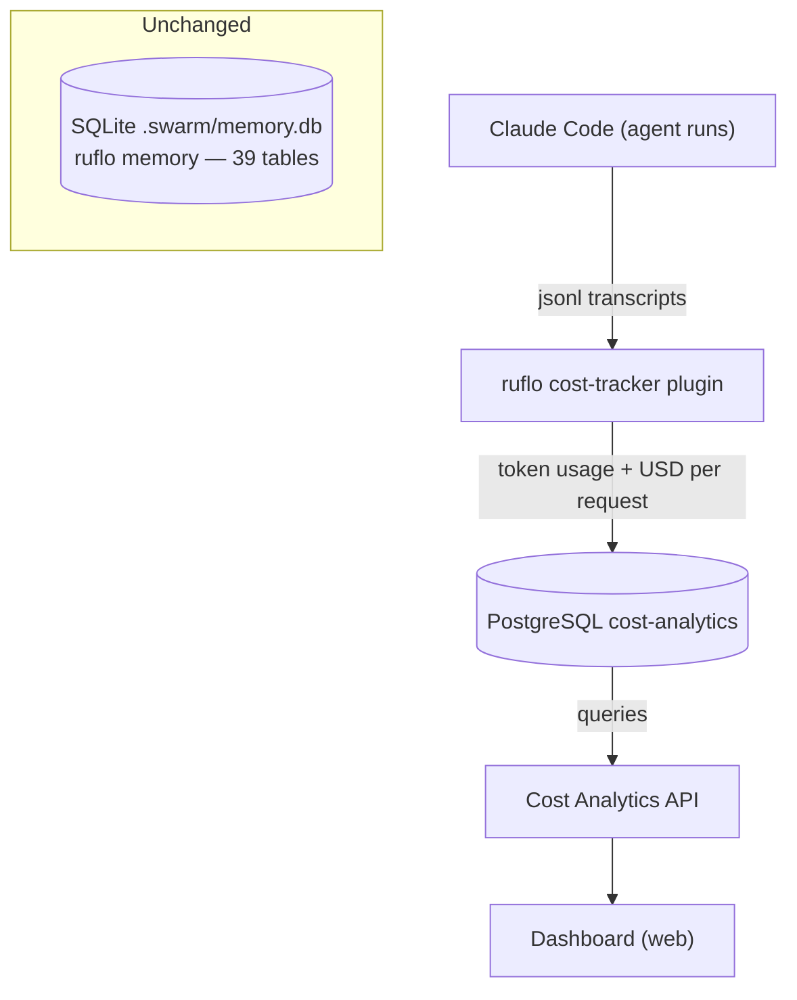

# Architecture Design: PostgreSQL Cost Analytics

**Status:** Draft
**Version:** 1.0
**Date:** 2026-07-31
**Author:** bmad-architect (Winston)

---

## 1. Overview

Introduce a **PostgreSQL cost-analytics database** that captures token usage and USD cost per run (agent execution), feeding a future dashboard. The existing SQLite memory DB is **unchanged** — this is an additive analytical store.

## 2. Architecture Diagram

> See `docs/architecture/postgresql-cost-analytics.drawio`



## 3. Data Model

### Core tables

```sql
-- One agent run = one pipeline execution (discover→build→review)
CREATE TABLE runs (
    id              UUID PRIMARY KEY DEFAULT gen_random_uuid(),
    project_path    TEXT NOT NULL,
    persona         TEXT NOT NULL,          -- bmad-engineer, bmad-architect...
    command         TEXT NOT NULL,          -- /discover, /build, /review
    task_id         TEXT,                   -- from tasks/todo.md
    status          TEXT NOT NULL,          -- running | completed | failed
    started_at      TIMESTAMPTZ NOT NULL,
    ended_at        TIMESTAMPTZ,
    -- cost aggregates (denormalized for fast dashboard)
    total_input_tokens   BIGINT DEFAULT 0,
    total_output_tokens  BIGINT DEFAULT 0,
    total_cost_usd       NUMERIC(12,6) DEFAULT 0
);

-- Per-request token usage (the detail rows)
CREATE TABLE token_usage (
    id              BIGSERIAL PRIMARY KEY,
    run_id          UUID NOT NULL REFERENCES runs(id),
    request_time    TIMESTAMPTZ NOT NULL,
    model           TEXT NOT NULL,          -- claude-sonnet-5, haiku-4.5...
    input_tokens    INTEGER NOT NULL,
    output_tokens   INTEGER NOT NULL,
    cache_read_tokens  INTEGER DEFAULT 0,
    cache_write_tokens INTEGER DEFAULT 0,
    cost_usd        NUMERIC(10,6) NOT NULL
) PARTITION BY RANGE (request_time);

-- Model pricing (for attribution if not captured per-request)
CREATE TABLE model_pricing (
    model       TEXT PRIMARY KEY,
    input_per_mtok   NUMERIC(8,4) NOT NULL,
    output_per_mtok  NUMERIC(8,4) NOT NULL,
    cache_read_per_mtok  NUMERIC(8,4),
    cache_write_per_mtok NUMERIC(8,4),
    effective_date DATE NOT NULL
);

-- Indexes for dashboard queries
CREATE INDEX idx_runs_persona_time ON runs(persona, started_at);
CREATE INDEX idx_usage_run ON token_usage(run_id);
CREATE INDEX idx_usage_time ON token_usage(request_time);
```

### Dashboard queries (the future views)

```sql
-- Cost per run (the user's core need)
SELECT r.id, r.persona, r.command, r.started_at,
       r.total_input_tokens, r.total_output_tokens, r.total_cost_usd
FROM runs r
ORDER BY r.started_at DESC;

-- Cost by model over time
SELECT date_trunc('day', request_time) AS day, model,
       SUM(input_tokens) AS input, SUM(output_tokens) AS output,
       SUM(cost_usd) AS cost
FROM token_usage
GROUP BY 1, 2
ORDER BY day DESC;

-- Cost by persona (which agent burns the most)
SELECT persona, COUNT(*) AS runs, SUM(total_cost_usd) AS total_cost
FROM runs
WHERE started_at > now() - interval '7 days'
GROUP BY persona
ORDER BY total_cost DESC;
```

## 4. Data Flow

```
1. Agent runs → Claude Code writes jsonl transcripts (usage per request)
2. ruflo cost-tracker (Stop hook) parses transcripts → tokens + USD
3. NEW: cost-tracker PostgreSQL sink inserts into token_usage + upserts runs
4. Dashboard queries PostgreSQL via API
5. (Optional) Backfill: script parses historical jsonl → inserts old runs
```

## 5. Sink Design (the new code)

The cost-tracker plugin already computes tokens + USD. Add a **PostgreSQL sink**:

```
cost-tracker (existing) ──▶ new sink ──▶ PostgreSQL
   cost-track command         sink.js
   (parses jsonl)             (INSERT token_usage,
                              UPSERT runs,
                              batch: 100 rows/commit)
```

- **Batch writes** (100 rows/commit) — agents shouldn't pay latency
- **Async** — fire-and-forget; failures logged, retried
- **Connection pool** — max 10 connections
- **Schema migration** — a `schema.sql` applied via `psql -f`

## 6. Deployment Options

| Option | Pros | Cons |
|--------|------|------|
| **A: Docker Compose** (recommended) | One command; local dev; dashboard-ready | Requires Docker |
| **B: Managed (Neon/Supabase)** | Zero ops; scalable | External dependency; cost |
| **C: Local PostgreSQL install** | Native speed | Manual setup |

Recommended: `docker-compose.yml` with `postgres:16` + volume + healthcheck.

## 7. API Contract (dashboard backend)

```
GET /api/runs                     → list runs (paginated)
GET /api/runs/{id}                → run detail + token breakdown
GET /api/cost/summary?period=7d   → aggregated by day/model/persona
GET /api/cost/by-model?period=7d  → cost per model
GET /api/cost/by-persona?period=7d → cost per agent
```

## 8. Migration Plan

1. **Phase 1 (foundation):** Docker Compose PostgreSQL + `schema.sql`
2. **Phase 2 (capture):** cost-tracker PostgreSQL sink (batch writes)
3. **Phase 3 (backfill):** script to parse historical jsonl → runs + token_usage
4. **Phase 4 (dashboard):** API + web dashboard (per-run, per-model, per-persona charts)
5. **Phase 5 (retention):** monthly partitions + prune > 12 months

## 9. Boundary Safety Checks

| Pattern | Status |
|---------|--------|
| #1 Platform primitives at boundaries | ✅ SQL for analytics; ruflo's own storage for memory |
| #2 Delegate to framework control flow | ✅ cost-tracker's Stop hook drives capture |
| #3 Self-referencing config | ✅ No overrides |
| #4 Global interceptors conditional | ✅ Sink only fires on session-end |
| #5 Full user journeys | ✅ Phase 4 dashboard verifies end-to-end |
| #6 Identity consistency | ✅ run_id UUID across all tables |

## 10. Risks

| Risk | Mitigation |
|------|-----------|
| Agent latency from writes | Batch 100 rows/commit, async, pool |
| PostgreSQL down | Sink falls back to file; retry queue |
| Schema drift | migration versioning in schema.sql |
| Dashboard not needed later | Data model is minimal; can drop |

---

## Related Documents

- ADR-0005: PostgreSQL for Cost Analytics
- `docs/architecture/postgresql-cost-analytics.drawio`

*Template: agent-v01/references/templates/design-doc-template.md*
