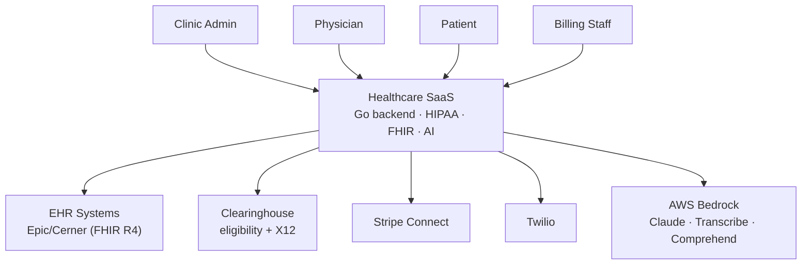
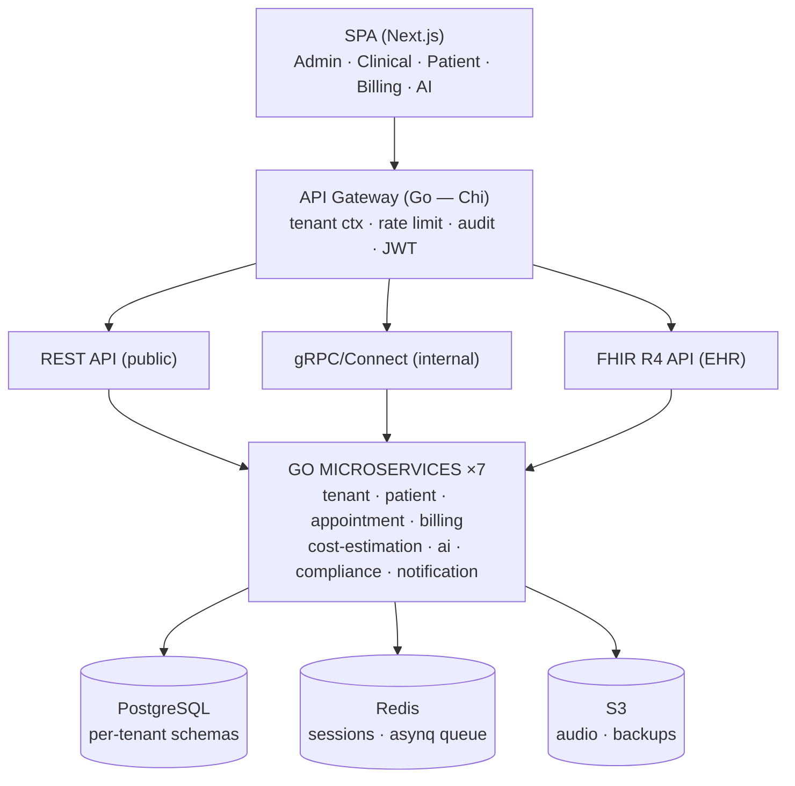
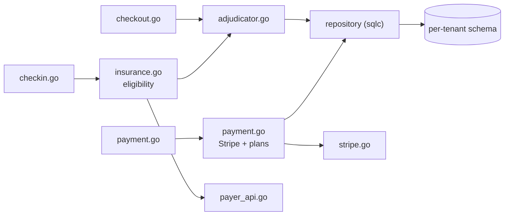
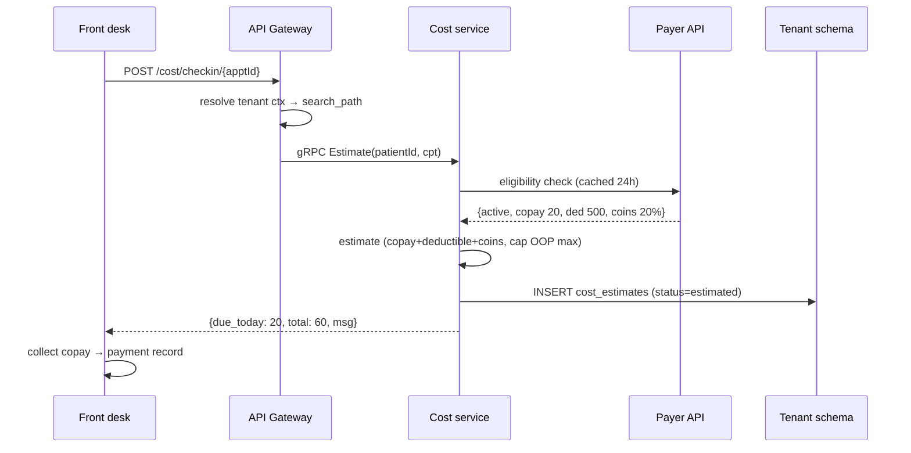
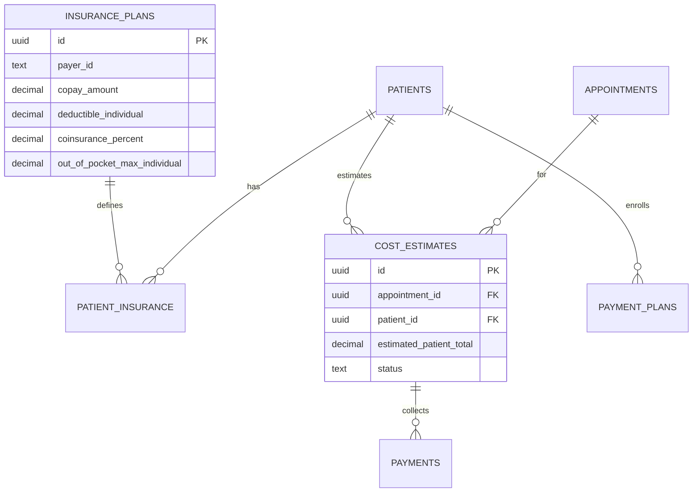
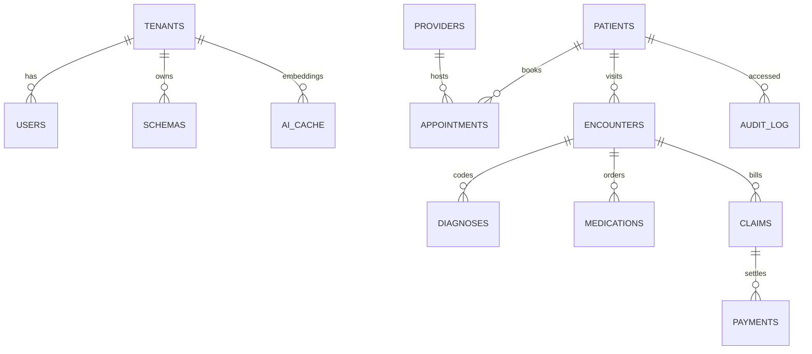

# Architecture Design: Multi-Tenant Healthcare SaaS

**Status:** Reviewed
**Version:** 1.0
**Date:** 2026-07-31
**Author:** bmad-architect (Winston)
**Source:** `documents/saas.md` §4–5, §9–10

---

## 1. Overview

HIPAA-compliant multi-tenant SaaS (Go microservices, Next.js SPA, PostgreSQL, AWS) covering patient records, scheduling, billing, cost estimation at check-in/checkout, and AI clinical intelligence. Isolation is enforced at the database level (per-tenant schema + RLS); AI processes PHI only inside an AWS-native de-identified pipeline; the revenue-cycle differentiator is real-time cost estimation with payment collection at time of service.

## 2. Architecture Diagrams

### 2.1 C4-Model

> Editable Draw.io files: `{component}-c4-context.drawio` etc. — mermaid versions below for inline rendering.

**C4 Context (Mermaid):**



**C4 Container (Mermaid):**



### 2.2 Component Diagram (Cost-Estimation Service)



### 2.3 Sequence Diagram (Check-In Cost Estimate)



### 2.4 ER Diagram (Cost Estimation Core)



## 3. Component Breakdown

### {API Gateway (Go — Chi)}
- **Responsibility:** Authn/authz (JWT + RBAC), tenant context resolution, rate limiting, audit logging, FHIR compliance
- **Tech:** Go, chi/v5, golang-jwt/v5
- **Interfaces:** REST (public), gRPC/Connect (internal), FHIR R4 (EHR)
- **Dependencies:** Auth0, tenant context middleware

### {Tenant Service}
- **Responsibility:** Registration, schema provisioning, RBAC, SSO/SAML, MFA
- **Tech:** Go, pgx/v5, sqlc, Auth0 Management API
- **Interfaces:** gRPC Tenant/User/Role/Schema services
- **Dependencies:** PostgreSQL (DDL per schema), asynq (onboarding email)

### {Cost-Estimation Service}
- **Responsibility:** Insurance eligibility, cost estimation, adjudication, payments, payment plans
- **Tech:** Go, sqlc, Stripe Connect, payer API client
- **Interfaces:** `POST /api/cost/checkin/{apptId}`, `POST /api/cost/checkout/{apptId}`, `POST /api/cost/payment`, `GET /api/cost/balance/{patientId}`
- **Dependencies:** per-tenant schema (`insurance_plans`, `cost_estimates`, `payments`), payer API, Stripe

### {AI Service}
- **Responsibility:** SOAP generation (transcribe → de-id → Claude → re-id), ICD-10/CPT coding, no-show prediction
- **Tech:** Go, AWS SDK (Bedrock, Transcribe, Comprehend Medical), pgvector
- **Interfaces:** gRPC AI service; async jobs (asynq)
- **Dependencies:** Bedrock AgentCore, S3 (audio), per-tenant `ai_cache`

### {Billing Service}
- **Responsibility:** X12 837 generation/submission, ERA (835) posting, denial management, appeals
- **Tech:** Go, X12 EDI library, SFTP, asynq
- **Interfaces:** gRPC Billing; clearinghouse SFTP
- **Dependencies:** claims/ERA tables, AI coding service

### {Notification Service}
- **Responsibility:** Email/SMS (welcome, reminders, receipts), asynq workers
- **Tech:** Go, SendGrid, Twilio
- **Interfaces:** internal queue consumers
- **Dependencies:** asynq, SendGrid, Twilio

### {Compliance Service}
- **Responsibility:** Immutable granular audit log, HIPAA compliance dashboard
- **Tech:** Go, append-only tables
- **Interfaces:** gRPC Audit; dashboard API
- **Dependencies:** all services emit audit events

## 4. Data Model



### Key Entities
| Entity | Description | Key Fields |
|--------|-------------|------------|
| tenants | Tenant registry (all schemas) | id, npi, tax_id, status, tier |
| patients | Per-tenant PHI | id, name, dob, phone, ssn (encrypted, per-tenant key) |
| insurance_plans | Benefit design | copay, deductible, coinsurance, oop_max, payer_id |
| cost_estimates | Check-in/checkout estimates | estimated_charges, patient_total, status |
| payments | Collections | amount, method (card/hsa/cash/plan), stripe_intent |
| audit_log | Immutable PHI access trail | user_id, tenant_id, entity, field, action, ts |

## 5. API Contracts

### POST /api/cost/checkin/{appointmentId}
- **Request:** `{}` (auth context carries user+tenant)
- **Response:** `{ "eligibility": "active", "due_today": 20.00, "estimated_total": 60.00, "message": "Your estimated visit cost is $60. $20 copay is due today.", "breakdown": { "copay": 20.00, "deductible": 40.00, "coinsurance": 0.00 } }`
- **Errors:** `404 appointment not found`, `409 already checked in`, `503 payer API timeout (degrade to best-effort)`

### POST /api/cost/checkout/{appointmentId}
- **Request:** `{ "cpt_codes": ["99213","96372"] }`
- **Response:** `{ "charges": 225.00, "contractual_adjustment": -67.50, "allowed_amount": 157.50, "copay": -20.00, "deductible": -137.50, "balance_due": 0.00, "line_items": [...] }`
- **Errors:** `404`, `422 invalid CPT`, `409 already finalized`

### POST /api/cost/payment
- **Request:** `{ "appointment_id": "...", "amount": 70.00, "method": "card|hsa|fsa|cash|payment_plan", "plan_installments": 6 }`
- **Response:** `{ "payment_id": "...", "status": "completed|failed", "receipt_sent": true }`
- **Errors:** `402 payment declined (checkout not blocked)`

### GET /fhir/Patient/{id}
- **Response:** FHIR R4 Patient resource (name, birthDate, telecom, identifier)
- **Errors:** `403 cross-tenant`, `404`

## 6. Data Flow

```
Check-in:
  Patient arrives
  → identity confirm (name, DOB)
  → insurance verified (payer API, cached 24h)
  → estimate: copay + deductible + coinsurance, capped at OOP max
  → display + collect copay
  → INSERT cost_estimates (status=estimated)

Checkout:
  Visit finalized with CPT codes
  → service lines built (CPT → charge)
  → adjudication (contractual adjustment, copay, deductible, coinsurance)
  → itemized summary displayed
  → payment collected (Stripe: card/HSA/plan)
  → cost_estimates status=finalized
  → claim generated async (X12 837 → clearinghouse)
```

## 7. Security Considerations

- **Auth:** Auth0 SSO/SAML + MFA (all roles except read-only); JWT carries tenant_id, role, permissions
- **Isolation:** per-tenant schema + RLS (two layers); search_path + `current_setting('app.tenant_id')` per request; cross-tenant = 403/empty
- **PHI at rest:** column-level AEAD with per-tenant keys (SSN); TLS in transit; encryption for S3 audio/backups
- **AI:** de-identify before LLM (Comprehend Medical), re-identify after; provider approve gate; guardrails + confidence thresholds
- **Input validation:** all endpoints validate + rate-limit at gateway; FHIR resources validated against R4 schemas
- **Audit:** granular read+write logging, append-only, immutable

## 8. Deployment & Operations

- **Infrastructure:** ECS Fargate (7 services, tiered clusters), Aurora PostgreSQL, ElastiCache Redis, WAF v2, CloudFront, S3
- **Monitoring:** Datadog — traces (OpenTelemetry), structured logs (zerolog), no PHI in logs
- **Disaster Recovery:** Aurora backups (PITR), S3 lifecycle; single region (us-east-1); RTO/RPO defined at launch
- **Cost:** $2,650–3,650/mo at 10 tenants (see `ideas/saas.md` Cost & Effort)

## 9. Trade-offs & Decisions

The system's posture is: **defense-in-depth isolation at commodity cost, AI inside a compliant walled garden, minimal ops on a small team** — at the price of AWS lock-in and schema-ops complexity.

| ID | Decision | Trade-off (gained → accepted) | Status | ADR |
|----|----------|-------------------------------|--------|-----|
| TO-1 | Hybrid multi-tenancy | audit-defensible isolation at commodity cost → schema-ops complexity | Accepted | ADR-001 |
| TO-2 | Bedrock AI pipeline | HIPAA-eligible managed pipeline, PHI in AWS → lock-in + per-token cost | Accepted | ADR-002 |
| TO-3 | Chi + Connect + FHIR | type-safe contracts + EHR interop → 3-paradigm skill tax | Accepted | ADR-003 |
| TO-4 | Schema + RLS isolation | defense in depth → migration tooling overhead | Accepted | ADR-004 |
| TO-5 | Opt-in AI training data | defensible moat → aggregation risk + pricing complexity | Accepted | ADR-005 |
| TO-6 | Fargate + Aurora | minimal ops, predictable cost → AWS lock-in + cost floor | Accepted | ADR-006 |

> Full analysis (weighted options, accepted costs, revisit triggers, cross-decision effects) lives in the **Trade-off Document**: `trade-offs/saas-trade-offs.md`.

**Deferred:** multi-region (revisit: RTO < 1 h); EKS (revisit: > 20 services); shared-schema tier (revisit: > 2,000 schemas); telehealth video (v1.1); own LLM training (revisit: opt-in pool > 1M notes).

## 10. Open Questions

- AWS Bedrock + AgentCore HIPAA eligibility confirmation in enterprise agreement (gate: before Sprint 3)
- Clearinghouse partner selection (eligibility + X12) (gate: end of Sprint 1)
- Design-partner clinics for HIPAA-pilot validation (gate: end of Sprint 1)

---

## Related Documents

- ADR-001..006 (`adr/`)
- `trade-offs/saas-trade-offs.md` (decision ledger)
- `ideas/saas.md` (discovery — cost, roadmap, risk)
- `SPEC.md` (stories + acceptance criteria)

*Template: agent-v01/references/templates/design-doc-template.md*
