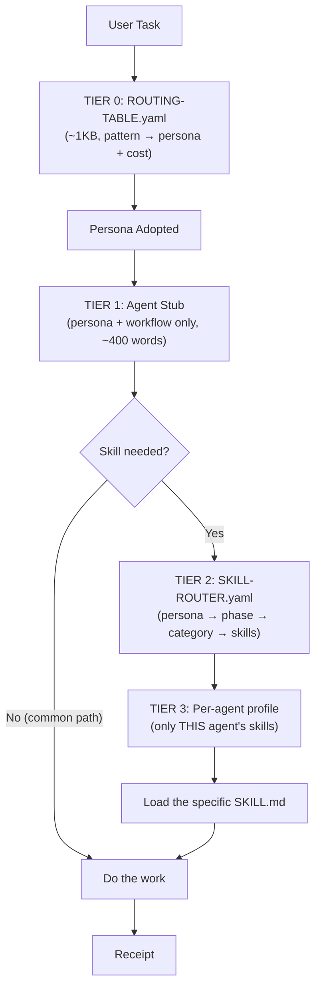

# Architecture Design: Progressive Skill Routing

**Status:** Draft
**Version:** 1.0
**Date:** 2026-07-31
**Author:** bmad-architect (Winston)

---

## 1. Overview

The kernel holds ~1,800 skills. The problem: agent definition files embed up to 157 skill references, loaded fully on every task regardless of need. This design introduces **progressive disclosure** — load the minimum metadata to start, resolve skills on demand.

## 2. Architecture Diagram

> See `docs/architecture/skill-routing-architecture.drawio`



## 3. Component Breakdown

### Tier 0: ROUTING-TABLE.yaml (existing, unchanged)
- **Responsibility:** task keywords → persona + cost tier
- **Size:** ~217 lines / ~1KB
- **Load:** once at task start

### Tier 1: Agent Stubs (slimmed)
- **Responsibility:** persona identity, style, workflow, verification
- **Size:** target 40-70 lines (from current 46-179)
- **What's removed:** all "Skills by Context" tables → replaced by one line: `Skill profile: agent-v01/skills/profiles/{persona}.yaml`

### Tier 2: SKILL-ROUTER.yaml (new — single source of truth)
- **Responsibility:** the complete persona → phase → category → skill mapping
- **Size:** ~200-300 lines (all 8 personas)
- **Format:**

```yaml
routing:
  bmad-engineer:
    implementation:
      stack_map: stacks/{mode}/{tech} → claude-skills/{tech}-expert
      categories:
        backend: [nestjs-expert, spring-boot-engineer, ...]
        frontend: [react-expert, vue-expert, ...]
        testing: [playwright-expert, test-master]
    conditional:
      graphql: supplements/graphql
      terraform: stacks/cloud/terraform
```

### Tier 3: Per-agent profiles (generated)
- **Responsibility:** each agent's OWN compact skill list (generated from Tier 2)
- **File:** `agent-v01/skills/profiles/{persona}.yaml`
- **Load:** only when the agent needs a skill lookup

### Generator
- **Script:** `agent-v01/scripts/generate-skill-router.py`
- **Input:** SKILL-ROUTER.yaml + existing agent tables
- **Output:** per-agent profile files + validation

## 4. Data Flow

```
User: "Build a Flutter payment screen with Stripe"

Tier 0: ROUTING-TABLE → "flutter|stripe" → bmad-engineer, cost high
Tier 1: engineer stub loaded (70 lines, no skill tables)
  → reads skill profile pointer
Tier 2 (lazy): engineer needs skills → loads SKILL-ROUTER.yaml
  → resolves: flutter → flutter-expert + stacks/mobile/flutter
Tier 3 (lazy): loads ONLY flutter-expert + flutter stack
  → 157 refs → 3 actual skills loaded
```

## 5. Expected Savings

| Metric | Current | After | Savings |
|--------|---------|-------|---------|
| Engineer file size | 179 lines | ~70 lines | **61%** |
| Architect file size | 122 lines | ~60 lines | **51%** |
| Skill refs loaded per task | 157 (all) | ~3 (needed) | **98%** |
| Context words for skill metadata | 1,005 | ~40 (profile pointer) | **96%** |

## 6. Migration Plan

1. Build `SKILL-ROUTER.yaml` from current agent tables (single source)
2. Write `generate-skill-router.py` to produce per-agent profiles
3. Slim agent stubs (remove tables, add profile pointer)
4. Update `validate-structure.sh` to verify profiles match router
5. Update ROUTING-TABLE Tier-0 to reference profiles
6. Test: engineer loads 3 skills for a flutter task, not 157

## 7. Risks

| Risk | Mitigation |
|------|-----------|
| Profile generation drift | Validator cross-checks profiles vs router |
| Lazy load adds one read | Tier-2 file is small (~300 lines); cached in session |
| Migration breaks agents | Run after validation; keep old tables until profiles pass |
| New skill not in router | Generator warns on unmapped skills |

---

## Related Documents

- ADR-0004: Progressive Skill Routing Architecture
- `docs/architecture/skill-routing-architecture.drawio`

*Template: agent-v01/references/templates/design-doc-template.md*
